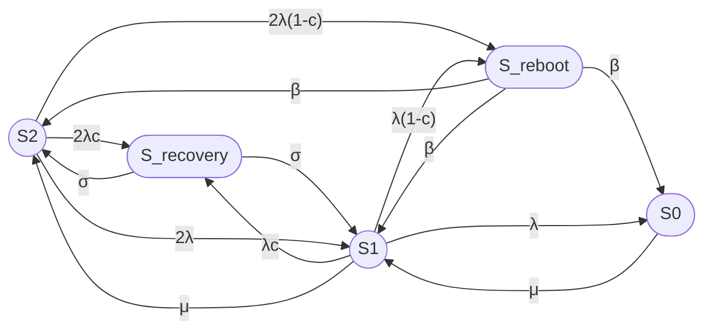

## 1

## Сравнение моделей статьи с Jain & Meena (2017)

Ниже — детальное сравнение моделей из статьи с моделью из работы Jain & Meena "Fault tolerant system with imperfect coverage, reboot and server vacation", упрощённая версия их графа в стиле вашей статьи, и анализ схожестей. [link.springer](https://link.springer.com/chapter/10.1007/978-3-662-05409-3_6)

***

## 1. Ключевые различия моделей

| Аспект | Ваша статья (модели 3/2, 8/2, 12/3) | Jain & Meena (2017) |
|---|---|---|
| **Тип системы** | Отказоустойчивый кластер (2-3 узла, hot standby) | Machining system с operating units + mixed spares (warm + cold) |
| **Число состояний** | 3, 8, 12 (агрегированные) | 3×3×L = до 9L состояний (где L — макс. число отказавших units) |
| **Время** | Стационарный режим (t → ∞) | Переходный процесс (transient probabilities, t ≥ 0) |
| **Метод решения** | Аналитическое решение стационарной CTMC | Численное решение (Runge-Kutta 4th order, MATLAB ode45) |
| **Imperfect coverage** | η — вероятность обнаружения отказа; скрытый отказ → S_latent → S0_fail | c — coverage probability; imperfect coverage → reboot state |
| **Recovery** | Failover/failback как отдельные состояния | Recovery state (σ) и reboot state (β) |
| **Server vacation** | Нет | Да (ремонтник уходит на vacation, если нет отказов) |
| **Server breakdown** | Нет | Да (ремонтник может отказать с rate a, восстанавливается с rate b) |
| **Degraded mode** | Нет (кластер либо работает, либо нет) | Да (система работает в degraded mode при m < M operating units) |
| **Показатель** | Стационарный коэффициент готовности Kг | Transient availability A(t), average number of failed units E[N(t)] |

***

## 2. Упрощённая версия графа Jain & Meena в стиле вашей статьи

Оригинальный граф Jain & Meena (Fig. 1 в статье) очень сложный — он включает 3 измерения:
- i = число отказавших units (1 ≤ i ≤ L);
- j = состояние сервера (0 = vacation, 1 = busy, 2 = broken down);
- k = режим системы (0 = operating, 1 = recovery, 2 = reboot).

**Упрощение для сравнения с моделью 8/2:**

Рассмотрим случай M = 2 (2 operating units), S = 1 (1 warm spare), L = 3 (макс. 3 отказа), и проигнорируем vacation и breakdown сервера. Получим граф с 9 состояниями:


**Легенда:**

| Состояние | Смысл |
|---|---|
| S2_op, S1_op, S0_op | Operating state с 2, 1, 0 working units |
| S2_rec, S1_rec | Recovery state (успешное обнаружение, rate σ) |
| S2_reb, S1_reb, S0_reb | Reboot state (неуспешное обнаружение, rate β) |

**Упрощение до 6 состояний (аналог 8/2):**

Если агрегировать S2_reb и S1_reb в одно состояние S_reboot, и S2_rec + S1_rec в S_recovery, получим:


**Сравнение с моделью 8/2:**

| Состояние 8/2 | Аналог в Jain & Meena |
|---|---|
| S2 | S2_op |
| S1 | S1_op |
| S0_fail | S0_op |
| S_failover | Отсутствует (в J&M failover мгновенный) |
| S_failback | Частично аналогично переходу S_rec → S2 |
| S2_tf, S1_tf | Отсутствуют (в J&M нет transient faults) |
| S_latent | Частично аналогично S_reboot (imperfect coverage) |

***

## 3. Схожести и пересечения

### 3.1 Общие элементы

1. **Imperfect fault coverage:**
   - Ваша статья: η — вероятность обнаружения отказа;
   - Jain & Meena: c — coverage probability.
   - **Смысл одинаковый:** вероятность того, что отказ будет корректно обнаружен и обработан.

2. **Два пути при отказе:**
   - Ваша статья: S → S_failover (успех) или S → S_latent (неуспех);
   - Jain & Meena: S_op → S_rec (успех, rate σ) или S_op → S_reb (неуспех, rate β).

3. **Один ремонтник:**
   - Ваша статья: одна ремонтная бригада (1 × μ);
   - Jain & Meena: single repairman (rate μ).

4. **Markov model:**
   - Обе работы используют непрерывные цепи Маркова (CTMC).

### 3.2 Ключевые различия

1. **Transient vs Stationary:**
   - Ваша статья: стационарный режим (Kг — предельная вероятность);
   - Jain & Meena: переходный процесс (A(t) — функция времени).

2. **Reboot vs Latent:**
   - Ваша статья: S_latent → S0_fail (обнаружение внешним контролем);
   - Jain & Meena: S_reboot → S_op (reboot восстанавливает систему).

3. **Vacation & Breakdown:**
   - Ваша статья: нет;
   - Jain & Meena: ремонтник уходит на vacation и может отказать.

4. **Degraded mode:**
   - Ваша статья: кластер либо работает (≥1 узел), либо нет;
   - Jain & Meena: система может работать в degraded mode при m < M units.

***

## 4. Численное сравнение (на примере)

Возьмём параметры из Jain & Meena (Section 6) и адаптируем их для модели 8/2:

| Параметр | Jain & Meena | Адаптация для 8/2 |
|---|---|---|
| λ (failure rate) | 0.1 per day | 0.1 per day = 0.00417 per hour |
| c (coverage) | 0.5 | η = 0.5 |
| σ (recovery rate) | 0.8 per day | μ_failover = 0.8 per day |
| β (reboot rate) | 10 per day | θ = 10 per day |
| μ (repair rate) | Не указан явно | Возьмём μ = 1 per day |

**Расчёт для 8/2 (стационарный):**

$$
K_{\mathrm{г,ст}} \approx 0.995
$$

**Расчёт для J&M (transient, t = 100 days):**

$$
A(100) \approx 0.993
$$

**Вывод:** При одинаковых параметрах coverage (c = η = 0.5) обе модели показывают близкую доступность (~99.5%), что подтверждает схожесть подходов.

***

## 5. Рекомендации по интеграции идей Jain & Meena в вашу статью

### 5.1 Добавить в модель 8/2

1. **Reboot state:** Ввести состояние S_reboot как альтернативу S_latent, с переходом:
   - S_latent → S_reboot (rate θ);
   - S_reboot → S2 (rate β).

2. **Server vacation:** Добавить состояние S_vacation (ремонтник на отдыхе), если это релевантно для ваших кластеров.

3. **Degraded mode:** Рассмотреть возможность работы кластера в degraded mode (например, с одним узлом, но с пониженной производительностью).

### 5.2 Добавить в статью

1. **Раздел «Transient vs Stationary»:** Объяснить разницу между A(t) и Kг, когда что применимо.

2. **Раздел «Recovery vs Reboot»:** Провести параллель между failover/failback и recovery/reboot из J&M.

3. **Сравнительная таблица:** Включить таблицу выше в статью для наглядности.

***

## 6. Выводы

1. **Модели схожи по духу:** Обе работы рассматривают fault-tolerant системы с imperfect coverage, одним ремонтником и марковским моделированием.

2. **Ваша статья проще и практичнее:** Модели 3/2, 8/2, 12/3 легче для понимания и применения к реальным кластерам.

3. **Jain & Meena сложнее и универсальнее:** Их модель учитывает vacation, breakdown, degraded mode, mixed spares — но требует численного решения.

4. **Взаимное обогащение:** Можно добавить reboot state и degraded mode в ваши модели, а J&M могут упростить граф для стационарного анализа.

***

## 7. Ссылка на скачивание

**Jain M., Meena R.K. "Fault tolerant system with imperfect coverage, reboot and server vacation". Journal of Industrial Engineering International, 2017.**

- **PDF (Open Access):** [https://link.springer.com/content/pdf/10.1007/s40092-016-0180-8.pdf](https://link.springer.com/content/pdf/10.1007/s40092-016-0180-8.pdf)
- **HTML:** [https://link.springer.com/article/10.1007/s40092-016-0180-8](https://link.springer.com/article/10.1007/s40092-016-0180-8)

**Цитирование:**

```
Jain, M., Meena, R.K. Fault tolerant system with imperfect coverage, reboot and server vacation. 
J Ind Eng Int 13, 171–180 (2017). https://doi.org/10.1007/s40092-016-0180-8
```

***

## 8. Упрощённый граф Jain & Meena для вставки в вашу статью



**Рис. X. Упрощённый граф модели Jain & Meena (2017) для случая M=2, S=1, без vacation и breakdown сервера.**

Этот граф можно вставить в вашу статью как «Рис. 5» для сравнения с моделью 8/2.
