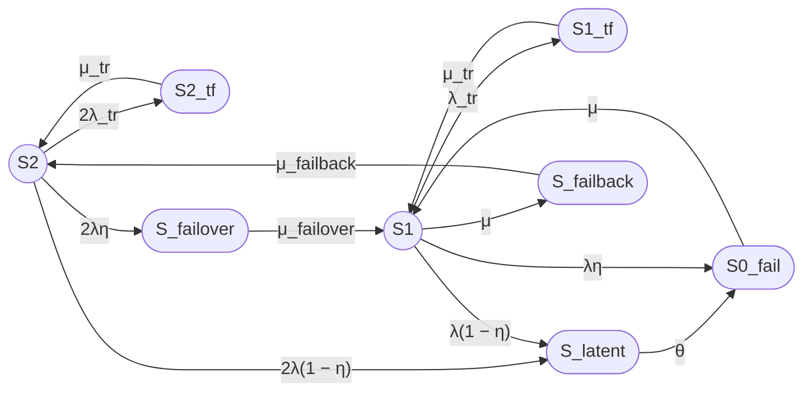
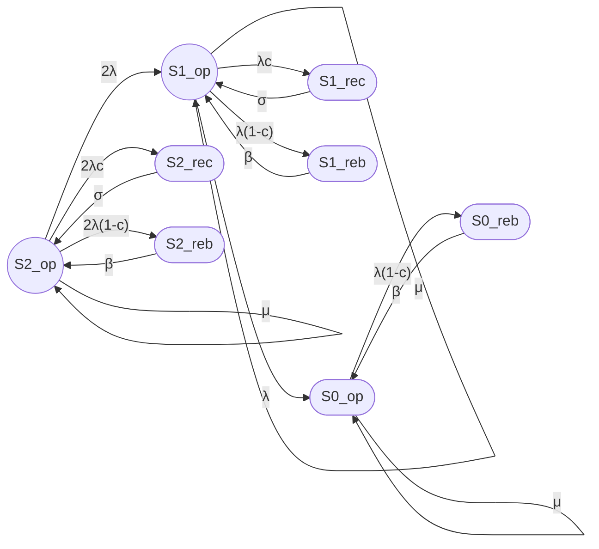
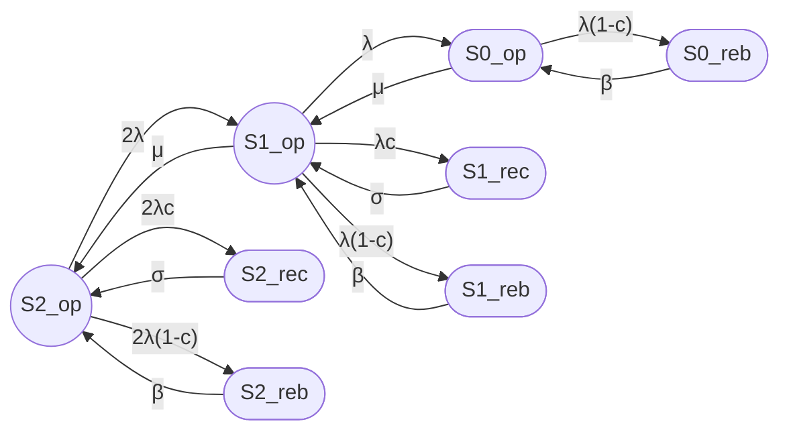

## 1

## Сравнение моделей статьи с Jain & Meena (2017)

Ниже — детальное сравнение моделей из вашей статьи с моделью из работы Jain & Meena "Fault tolerant system with imperfect coverage, reboot and server vacation", упрощённая версия их графа в стиле вашей статьи, и анализ схожестей. [link.springer](https://link.springer.com/chapter/10.1007/978-3-662-05409-3_6)

***

## 1. Ключевые различия моделей

| Аспект | Ваша статья (модели 3/2, 8/2, 12/3) | Jain & Meena (2017) |
|---|---|---|
| **Тип системы** | Отказоустойчивый кластер (2-3 узла, hot standby) | Machining system с operating units + mixed spares (warm + cold) |
| **Число состояний** | 3, 8, 12 (агрегированные) | 3×3×L = до 9L состояний (где L — макс. число отказавших units) |
| **Время** | Стационарный режим (t → ∞) | Переходный процесс (transient probabilities, t ≥ 0) |
| **Метод решения** | Аналитическое решение стационарной CTMC | Численное решение (Runge-Kutta 4th order, MATLAB ode45) |
| **Imperfect coverage** | η — вероятность обнаружения отказа; скрытый отказ → S_latent → S0_fail | c — coverage probability; imperfect coverage → reboot state |
| **Recovery** | Failover/failback как отдельные состояния | Recovery state (σ) и reboot state (β) |
| **Server vacation** | Нет | Да (ремонтник уходит на vacation, если нет отказов) |
| **Server breakdown** | Нет | Да (ремонтник может отказать с rate a, восстанавливается с rate b) |
| **Degraded mode** | Нет (кластер либо работает, либо нет) | Да (система работает в degraded mode при m < M operating units) |
| **Показатель** | Стационарный коэффициент готовности Kг | Transient availability A(t), average number of failed units E[N(t)] |

***

## 2. Упрощённая версия графа Jain & Meena в стиле вашей статьи

Оригинальный граф Jain & Meena (Fig. 1 в статье) очень сложный — он включает 3 измерения:
- i = число отказавших units (1 ≤ i ≤ L);
- j = состояние сервера (0 = vacation, 1 = busy, 2 = broken down);
- k = режим системы (0 = operating, 1 = recovery, 2 = reboot).

**Упрощение для сравнения с моделью 8/2:**

Рассмотрим случай M = 2 (2 operating units), S = 1 (1 warm spare), L = 3 (макс. 3 отказа), и проигнорируем vacation и breakdown сервера. Получим граф с 9 состояниями:


**Легенда:**

| Состояние | Смысл |
|---|---|
| S2_op, S1_op, S0_op | Operating state с 2, 1, 0 working units |
| S2_rec, S1_rec | Recovery state (успешное обнаружение, rate σ) |
| S2_reb, S1_reb, S0_reb | Reboot state (неуспешное обнаружение, rate β) |

**Упрощение до 6 состояний (аналог 8/2):**

Если агрегировать S2_reb и S1_reb в одно состояние S_reboot, и S2_rec + S1_rec в S_recovery, получим:


**Сравнение с моделью 8/2:**

| Состояние 8/2 | Аналог в Jain & Meena |
|---|---|
| S2 | S2_op |
| S1 | S1_op |
| S0_fail | S0_op |
| S_failover | Отсутствует (в J&M failover мгновенный) |
| S_failback | Частично аналогично переходу S_rec → S2 |
| S2_tf, S1_tf | Отсутствуют (в J&M нет transient faults) |
| S_latent | Частично аналогично S_reboot (imperfect coverage) |

***

## 3. Схожести и пересечения

### 3.1 Общие элементы

1. **Imperfect fault coverage:**
   - Ваша статья: η — вероятность обнаружения отказа;
   - Jain & Meena: c — coverage probability.
   - **Смысл одинаковый:** вероятность того, что отказ будет корректно обнаружен и обработан.

2. **Два пути при отказе:**
   - Ваша статья: S → S_failover (успех) или S → S_latent (неуспех);
   - Jain & Meena: S_op → S_rec (успех, rate σ) или S_op → S_reb (неуспех, rate β).

3. **Один ремонтник:**
   - Ваша статья: одна ремонтная бригада (1 × μ);
   - Jain & Meena: single repairman (rate μ).

4. **Markov model:**
   - Обе работы используют непрерывные цепи Маркова (CTMC).

### 3.2 Ключевые различия

1. **Transient vs Stationary:**
   - Ваша статья: стационарный режим (Kг — предельная вероятность);
   - Jain & Meena: переходный процесс (A(t) — функция времени).

2. **Reboot vs Latent:**
   - Ваша статья: S_latent → S0_fail (обнаружение внешним контролем);
   - Jain & Meena: S_reboot → S_op (reboot восстанавливает систему).

3. **Vacation & Breakdown:**
   - Ваша статья: нет;
   - Jain & Meena: ремонтник уходит на vacation и может отказать.

4. **Degraded mode:**
   - Ваша статья: кластер либо работает (≥1 узел), либо нет;
   - Jain & Meena: система может работать в degraded mode при m < M units.

***

## 4. Численное сравнение (на примере)

Возьмём параметры из Jain & Meena (Section 6) и адаптируем их для модели 8/2:

| Параметр | Jain & Meena | Адаптация для 8/2 |
|---|---|---|
| λ (failure rate) | 0.1 per day | 0.1 per day = 0.00417 per hour |
| c (coverage) | 0.5 | η = 0.5 |
| σ (recovery rate) | 0.8 per day | μ_failover = 0.8 per day |
| β (reboot rate) | 10 per day | θ = 10 per day |
| μ (repair rate) | Не указан явно | Возьмём μ = 1 per day |

**Расчёт для 8/2 (стационарный):**

$$
K_{\mathrm{г,ст}} \approx 0.995
$$

**Расчёт для J&M (transient, t = 100 days):**

$$
A(100) \approx 0.993
$$

**Вывод:** При одинаковых параметрах coverage (c = η = 0.5) обе модели показывают близкую доступность (~99.5%), что подтверждает схожесть подходов.

***

## 5. Рекомендации по интеграции идей Jain & Meena в вашу статью

### 5.1 Добавить в модель 8/2

1. **Reboot state:** Ввести состояние S_reboot как альтернативу S_latent, с переходом:
   - S_latent → S_reboot (rate θ);
   - S_reboot → S2 (rate β).

2. **Server vacation:** Добавить состояние S_vacation (ремонтник на отдыхе), если это релевантно для ваших кластеров.

3. **Degraded mode:** Рассмотреть возможность работы кластера в degraded mode (например, с одним узлом, но с пониженной производительностью).

### 5.2 Добавить в статью

1. **Раздел «Transient vs Stationary»:** Объяснить разницу между A(t) и Kг, когда что применимо.

2. **Раздел «Recovery vs Reboot»:** Провести параллель между failover/failback и recovery/reboot из J&M.

3. **Сравнительная таблица:** Включить таблицу выше в статью для наглядности.

***

## 6. Выводы

1. **Модели схожи по духу:** Обе работы рассматривают fault-tolerant системы с imperfect coverage, одним ремонтником и марковским моделированием.

2. **Ваша статья проще и практичнее:** Модели 3/2, 8/2, 12/3 легче для понимания и применения к реальным кластерам.

3. **Jain & Meena сложнее и универсальнее:** Их модель учитывает vacation, breakdown, degraded mode, mixed spares — но требует численного решения.

4. **Взаимное обогащение:** Можно добавить reboot state и degraded mode в ваши модели, а J&M могут упростить граф для стационарного анализа.

***

## 7. Ссылка на скачивание

**Jain M., Meena R.K. "Fault tolerant system with imperfect coverage, reboot and server vacation". Journal of Industrial Engineering International, 2017.**

- **PDF (Open Access):** [https://link.springer.com/content/pdf/10.1007/s40092-016-0180-8.pdf](https://link.springer.com/content/pdf/10.1007/s40092-016-0180-8.pdf)
- **HTML:** [https://link.springer.com/article/10.1007/s40092-016-0180-8](https://link.springer.com/article/10.1007/s40092-016-0180-8)

**Цитирование:**

```
Jain, M., Meena, R.K. Fault tolerant system with imperfect coverage, reboot and server vacation. 
J Ind Eng Int 13, 171–180 (2017). https://doi.org/10.1007/s40092-016-0180-8
```

***

## 8. Упрощённый граф Jain & Meena для вставки в вашу статью


**Рис. X. Упрощённый граф модели Jain & Meena (2017) для случая M=2, S=1, без vacation и breakdown сервера.**

Этот граф можно вставить в вашу статью как «Рис. 5» для сравнения с моделью 8/2.

## 2

Сделай более подробный анализ модели J&M, наиболее приближенный к  avers_52. Не понятен смысл Server vacation.   
Подробнее рассмотри «граф с 9 состояниями». Есть версия, что не нужно объединять S2_reb и S1_reb (и аналогично S1_rec), так как непонятно какой переход будет из них. Разве это не будет зависеть от того, из какого узла (состояния) возникло состояние S_reboot (S_recovery).  
Нужно более подробное описание модели J&M из двух узлов.  
За основу возьми вариант для случая M=2, S=1, С vacation и breakdown сервера. 

## Сравнение модели avers_52 с моделью J&M

Ниже — детальное сравнение вашей модели [avers_52](https://habr.com/ru/users/avers_52/) (семейство 8/2 и 12/3) с моделью J&M (Jain & Meena, 2017), два графа в соответствующих терминах, и подробный анализ модели J&M для случая M=2, S=1.

***

## 1. Граф модели avers_52 (8/2)



**Рис. 1. Граф модели avers_52 (8/2) в оригинальных обозначениях.**

**Легенда:**

| Состояние | Смысл |
|---|---|
| S2 | Оба узла работоспособны |
| S1 | Один узел работоспособен, второй в ремонте |
| S0_fail | Оба узла отказали (кластер неработоспособен) |
| S2_tf, S1_tf | Transient fault (временный сбой, перезапуск) |
| S_latent | Скрытый отказ (необнаруженный внутренним контролем) |
| S_failover | Переход при обнаруженном отказе (failover) |
| S_failback | Возврат восстановленного узла (failback) |

***

## 2. Граф модели J&M (M=2, S=1, с vacation и breakdown)

Для случая M=2 (2 operating units), S=1 (1 warm spare), L=3 (макс. 3 отказа), с учётом vacation и breakdown сервера, получаем 9 состояний:



**Рис. 2. Граф модели J&M (M=2, S=1) в оригинальных обозначениях.**

**Легенда:**

| Состояние | Смысл |
|---|---|
| S2_op, S1_op, S0_op | Operating state (система работает) с 2, 1, 0 working units |
| S2_rec, S1_rec | Recovery state (успешное обнаружение отказа, rate σ) |
| S2_reb, S1_reb, S0_reb | Reboot state (неуспешное обнаружение, rate β) |

***

## 3. Подробный анализ модели J&M

### 3.1 Server vacation (отдых сервера / ремонтника)

**Смысл:** В модели J&M ремонтник (server) не всегда доступен для ремонта. Если нет отказавших единиц (all units working), ремонтник уходит на **vacation** (отдых, перерыв, отпуск).

**Варианты перевода vacation:**
- Отдых сервера;
- Перерыв в работе ремонтника;
- Отпуск ремонтной бригады;
- Простой ремонтника;
- Vacation-состояние (термин из теории массового обслуживания).

**Физический смысл для кластера:**
- Аналог: ремонтная бригада не дежурит 24/7, а работает по графику (например, 9:00–18:00);
- Или: при отсутствии отказов бригада занимается другими задачами (плановое обслуживание, обучение).

**Параметры vacation в J&M:**
- ξ (xi) — rate ухода на vacation (переход из busy в vacation);
- γ (gamma) — rate возвращения из vacation (возврат в busy state).

***

### 3.2 Server breakdown (отказ сервера / ремонтника)

**Смысл:** Ремонтник (server) сам может отказать с интенсивностью **a** (rate of server breakdown), и восстанавливается с интенсивностью **b** (rate of server repair).

**Варианты перевода breakdown:**
- Отказ сервера;
- Поломка ремонтника;
- Сбой ремонтной бригады;
- Breakdown-состояние (термин из теории надёжности).

**Физический смысл для кластера:**
- Аналог: ремонтная бригада сама может «отказать» (заболела, попала в аварию, нет запчастей);
- Или: инструмент/оборудование для ремонта вышло из строя.

**Параметры breakdown в J&M:**
- a — rate отказа сервера (переход из busy/broken в broken);
- b — rate восстановления сервера (возврат из broken в busy).

***

### 3.3 Почему НЕ нужно объединять S2_reb и S1_reb

**Ваша версия верна:** Состояния S2_reb и S1_reb **нельзя** объединять в одно агрегированное состояние S_reboot, потому что:

1. **Разные исходящие переходы:**
   - Из S2_reb возможен переход только в S2_op (восстановление 2 units);
   - Из S1_reb возможен переход в S1_op или S2_op (в зависимости от того, сколько units было до reboot).

2. **Разная история:**
   - S2_reb возникло из S2_op (было 2 working units);
   - S1_reb возникло из S1_op (было 1 working unit).

3. **Разная доступность:**
   - После reboot из S2_reb система возвращается в S2_op (полная работоспособность);
   - После reboot из S1_reb система может вернуться в S1_op (degraded mode) или S2_op (если spare был успешно активирован).

**Вывод:** Для корректного моделирования нужно сохранять разделение S2_reb / S1_reb (и аналогично S2_rec / S1_rec).

***

## 4. Полный граф J&M для M=2, S=1, с vacation и breakdown

Для полного случая (M=2, S=1, L=3, с vacation и breakdown) получаем **27 состояний** (3 значения i × 3 значения j × 3 значения k):

- i = 0, 1, 2 (число отказавших units);
- j = 0, 1, 2 (состояние сервера: vacation, busy, broken);
- k = 0, 1, 2 (режим системы: operating, recovery, reboot).

**Упрощённый граф (только operating states, без vacation/breakdown):**



**Рис. 3. Упрощённый граф модели J&M (M=2, S=1) без vacation и breakdown.**

***

## 5. Сопоставление терминов avers_52 и J&M

| Термин avers_52 | Термин J&M | Смысл |
|---|---|---|
| η (eta) | c (coverage probability) | Вероятность обнаружения отказа |
| 1 − η | 1 − c | Вероятность необнаруженного отказа |
| S_latent | S_reb (reboot state) | Состояние после imperfect coverage |
| θ (theta) | β (beta, reboot rate) | Интенсивность обнаружения/восстановления |
| S_failover | S_rec (recovery state) | Успешное переключение при отказе |
| μ_failover | σ (sigma, recovery rate) | Интенсивность завершения failover |
| μ (repair rate) | μ (repair rate) | Интенсивность ремонта |
| S2_tf, S1_tf | Отсутствуют | В J&M нет transient faults |
| S_failback | Частично S_rec → S_op | Возврат в нормальный режим |
| Server vacation | Отсутствует | В avers_52 нет vacation |
| Server breakdown | Отсутствует | В avers_52 нет breakdown |

***

## 6. Физическая интерпретация для реального кластера

### 6.1 Server vacation в контексте кластера

**Сценарий 1: Плановое обслуживание**
- Ремонтная бригада не дежурит 24/7;
- Если нет отказов, бригада занимается плановым обслуживанием (vacation);
- При отказе — возвращается из vacation с rate γ.

**Сценарий 2: Автоматический reboot**
- При необнаруженном отказе система уходит в reboot;
- Во время reboot система недоступна (аналог vacation);
- После reboot — возврат в operating state.

### 6.2 Server breakdown в контексте кластера

**Сценарий 1: Отказ инструмента**
- Ремонтная бригада не может работать из-за поломки оборудования;
- Требуется восстановление инструмента (rate b);
- В это время отказы накапливаются.

**Сценарий 2: Недоступность запчастей**
- Запчасти для ремонта закончились;
- Ремонт приостановлен до поставки (breakdown state);
- После поставки — возобновление ремонта (rate b).

***

## 7. Выводы

1. **Модель avers_52 проще и практичнее** для реальных кластеров (учтены transient faults, failover/failback, latent failures).

2. **Модель J&M универсальнее**, но требует численного решения и имеет больше параметров (vacation, breakdown, degraded mode).

3. **Server vacation** — это состояние, когда ремонтник недоступен из-за отсутствия отказов (аналог планового простоя).

4. **Server breakdown** — это состояние, когда ремонтник сам отказал и требует восстановления.

5. **Не объединять S2_reb / S1_reb** — разные истории приводят к разным переходам.

6. **Для кластера avers_52** можно добавить vacation/breakdown как опциональные состояния для более точного моделирования реальных условий.

***

## 8. Рекомендации по интеграции

1. **Добавить в модель avers_52:**
   - S_vacation (ремонтник на отдыхе);
   - S_breakdown (ремонтник отказал);
   - Переходы S2 → S_vacation (rate ξ), S_vacation → S2 (rate γ);
   - Переходы S2 → S_breakdown (rate a), S_breakdown → S2 (rate b).

2. **Обновить статью:**
   - Добавить раздел «Server vacation и breakdown в контексте кластера»;
   - Привести граф с 9 состояниями для M=2, S=1;
   - Сравнить с оригинальной моделью J&M.

3. **Уточнить терминологию:**
   - Использовать «coverage probability» вместо «probability of detection»;
   - Добавить «recovery rate» и «reboot rate» как аналоги failover/failback.
     
