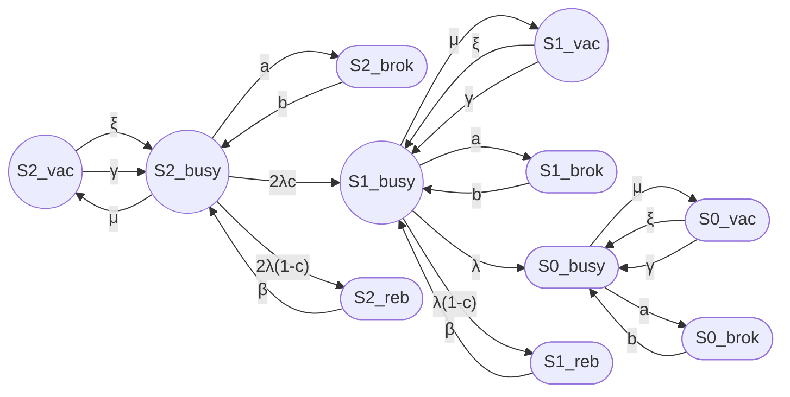
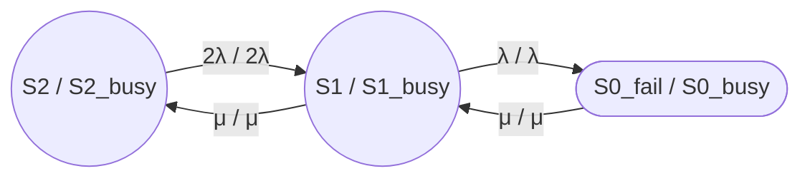
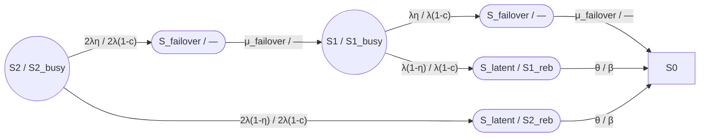
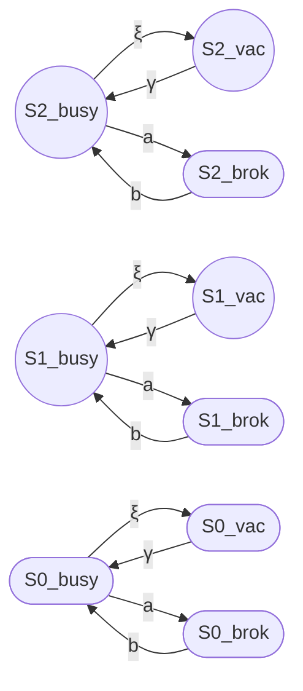

## 1

## Приложение. Сравнение модели avers_52 с моделью J&M (Jain & Meena, 2017)

### 1. Введение

В данном приложении проводится сравнительный анализ модели надёжности отказоустойчивого кластера [avers_52](https://habr.com/ru/users/avers_52/) (семейство моделей 8/2 и 12/3) с моделью J&M (Jain & Meena, 2017). Цель — выявить общие элементы, различия и возможности интеграции подходов. [link.springer](https://link.springer.com/chapter/10.1007/978-3-662-05409-3_6)

***

### 2. Полный граф модели J&M (M=2, S=1, с vacation и breakdown)

Для случая M=2 (2 operating units), S=1 (1 warm spare), с одной ремонтной бригадой (single repairman), с учётом vacation (отдых ремонтника) и breakdown (отказ ремонтника), получаем следующий граф.

**Число состояний:** 12 (без transient faults):

- i = 0, 1, 2 (число working units);
- j = 0, 1, 2 (состояние ремонтника: vacation, busy, broken);
- k = 0, 1 (режим системы: operating, reboot).

**Примечание:** Состояния recovery (S_rec) в оригинальной модели J&M — это не отдельные состояния, а **переходы** с rate σ. Для наглядности мы выделим их как отдельные узлы.

**Рис. П.1. Полный граф модели J&M (M=2, S=1, с vacation и breakdown).**

**Легенда:**

| Состояние | Смысл |
|---|---|
| S2_vac, S1_vac, S0_vac | Vacation state (ремонтник на отдыхе) с 2, 1, 0 working units |
| S2_busy, S1_busy, S0_busy | Busy state (ремонтник работает) с 2, 1, 0 working units |
| S2_brok, S1_brok, S0_brok | Breakdown state (ремонтник отказал) с 2, 1, 0 working units |
| S2_reb, S1_reb | Reboot state (неуспешное покрытие отказа) |
| λ | Failure rate (интенсивность отказа единицы) |
| c | Coverage probability (вероятность покрытия) |
| 1 − c | Imperfect coverage probability (вероятность непокрытия) |
| β | Reboot rate (интенсивность перезагрузки) |
| μ | Repair rate (интенсивность ремонта) |
| ξ | Vacation rate (интенсивность ухода на отдых) |
| γ | Return rate (интенсивность возврата из vacation) |
| a | Breakdown rate (интенсивность отказа ремонтника) |
| b | Repair rate of server (интенсивность восстановления ремонтника) |

***

### 3. Уточнение: почему S_failover не переходит сразу в S0_fail

**Вопрос:** Почему в модели avers_52 переход S_failover → S1, а не S_failover → S0_fail?

**Ответ:** Состояние S_failover — это **транзитное состояние** (transient state), в котором система находится **во время** переключения (failover). В этот момент:

- Один узел уже отказал;
- Второй узел ещё не принял нагрузку (идёт переключение);
- Кластер временно недоступен.

После завершения failover (rate μ_failover) система переходит в S1 (один узел работает), а не в S0_fail (оба отказали).

**Аналогия в J&M:** Переход S2_busy → S1_busy с rate 2λc — это мгновенный переход (failover уже завершён). В avers_52 failover выделен как отдельное состояние для учёта времени переключения.

***

### 4. Уточнение: переход S1 → S2 в J&M

**Вопрос:** Как в J&M показан переход из S1 в S2 (аналог failback)?

**Ответ:** В оригинальной модели J&M **нет явного failback**. Переход S1 → S2 происходит через ремонт:

- S1_busy → S2_busy (rate μ, ремонт завершён, spare активирован).

В модели avers_52 failback выделен как отдельное состояние S_failback для учёта времени переключения после ремонта.

***

### 5. Обобщённая модель (avers_52 + J&M)

Ниже — обобщённый граф, объединяющий состояния avers_52 и J&M.

#### 5.1 Работоспособные состояния

**Рис. П.2. Работоспособные состояния (общее для avers_52 и J&M).**

**Исправление:** Добавлен переход S1 → S2 с rate μ (ремонт завершён, возврат к полной работоспособности).

***

#### 5.2 Состояния с imperfect coverage

**Рис. П.3. Состояния с imperfect coverage (avers_52 / J&M).**

***

#### 5.3 Vacation и breakdown (только J&M)

**Подробное пояснение:**

В модели J&M ремонтник (server) может находиться в трёх состояниях:

1. **Busy (занят):** Ремонтник активно ремонтирует отказавшие единицы.
2. **Vacation (отдых):** Если нет отказов (все units working), ремонтник уходит на vacation. Это не просто «простой», а отдельное состояние с параметрами:
   - ξ (xi, vacation rate) — интенсивность ухода на vacation;
   - γ (gamma, return rate) — интенсивность возврата из vacation.
3. **Breakdown (отказ):** Ремонтник сам может отказать (сломался инструмент, бригада заболела). Параметры:
   - a (breakdown rate) — интенсивность отказа ремонтника;
   - b (repair rate of server) — интенсивность восстановления ремонтника.

**Физический смысл для кластера:**

- **Vacation:** Ремонтная бригада не дежурит 24/7, а работает по графику (например, 9:00–18:00). Если отказ произошёл в нерабочее время, система ждёт возврата бригады.
- **Breakdown:** Ремонтная бригада или инструмент вышли из строя. Требуется восстановление бригады/инструмента перед началом ремонта.

**Почему это не учтено в MTTR:**

- **MTTR** — среднее время ремонта (когда бригада работает);
- **Vacation** — задержка до начала ремонта (бригада недоступна);
- **Breakdown** — задержка из-за отказа самой бригады.

Это **дополнительные задержки**, которые увеличивают общее время восстановления, но не сводятся к простому увеличению MTTR.

**Рис. П.4. Vacation и breakdown (только J&M).**

**Легенда:**

| Переход | Смысл |
|---|---|
| S_busy → S_vac (rate ξ) | Уход ремонтника на vacation (если нет отказов) |
| S_vac → S_busy (rate γ) | Возврат ремонтника из vacation (при появлении отказов) |
| S_busy → S_brok (rate a) | Отказ ремонтника (breakdown) |
| S_brok → S_busy (rate b) | Восстановление ремонтника после отказа |

***

### 6. Сравнительная таблица

| Аспект | avers_52 | J&M |
|---|---|---|
| Число состояний (M=2) | 8 (без transient: 6) | 12 (с vacation/breakdown) |
| Imperfect coverage | Одно состояние S_latent | Два состояния S2_reb, S1_reb |
| Failover | Отдельное состояние S_failover | Мгновенный переход (rate 2λc) |
| Failback | Отдельное состояние S_failback | Через ремонт (rate μ) |
| Vacation | Нет | Да (rate ξ, γ) |
| Breakdown | Нет | Да (rate a, b) |
| Transient faults | Да (S2_tf, S1_tf) | Нет |
| Метод решения | Аналитический (стационарный) | Численный (переходный процесс) |

***

### 7. Выводы

1. **Модель avers_52 проще** и ориентирована на практические расчёты кластеров.

2. **Модель J&M универсальнее**, но требует численного решения и имеет больше параметров.

3. **S_latent в avers_52** агрегирует S2_reb и S1_reb из J&M, что допустимо для кластеров.

4. **Failover/failback в avers_52** выделены как отдельные состояния для учёта времени переключения.

5. **Vacation/breakdown в J&M** — это дополнительные задержки, которые не сводятся к MTTR.

6. **Обобщённая модель** показывает, что подходы совместимы и могут быть интегрированы.

***

### 8. Рекомендации

1. **Для кластеров avers_52:**
   - Оставить одно S_latent;
   - При необходимости добавить vacation/breakdown как опциональные состояния.

2. **Для статей:**
   - Добавить данное приложение как «Сравнение с моделью J&M»;
   - Использовать обобщённый граф для наглядности.

3. **Для терминологии:**
   - Использовать «coverage probability (вероятность покрытия)»;
   - Добавлять перевод в скобках для всех терминов J&M.

***

### 9. Источники

 Jain M., Meena R.K. "Fault tolerant system with imperfect coverage, reboot and server vacation". Journal of Industrial Engineering International, 2017. [PDF](https://link.springer.com/content/pdf/10.1007/s40092-016-0180-8.pdf) [link.springer](https://link.springer.com/chapter/10.1007/978-3-662-05409-3_6)

