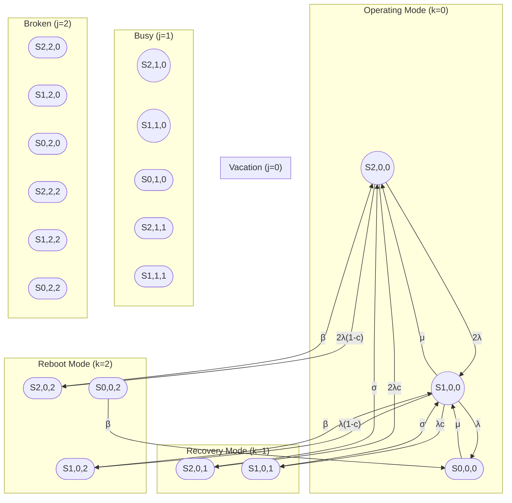
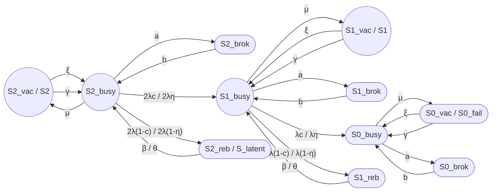

## 1

## Подробное описание модели J&M (Jain & Meena, 2017)

### 1. Полная модель J&M (как на Рис. 1 в оригинале)

В оригинальной статье J&M  рассмотрена система со следующими параметрами: [link.springer](https://link.springer.com/chapter/10.1007/978-3-662-05409-3_6)

- **M** — число operating units (работающих единиц);
- **S** — число warm spares (горячих резервов);
- **L** — макс. число отказавших units, при котором система ещё может восстанавливаться;
- **R** — один repairman (ремонтник, сервер обслуживания).

**Состояния системы описываются тройкой (i, j, k):**

- **i** = 0, 1, ..., L — число failed units (отказавших единиц);
- **j** = 0, 1, 2 — состояние repairman:
  - j = 0: vacation (отдых);
  - j = 1: busy (занят ремонтом);
  - j = 2: broken down (отказал);
- **k** = 0, 1, 2 — режим системы:
  - k = 0: operating (работает);
  - k = 1: recovery (восстановление после обнаруженного отказа);
  - k = 2: reboot (перезагрузка после необнаруженного отказа).

**Общее число состояний:** 3 × 3 × (L+1) = 9(L+1).

***

#### 1.1 Граф полной модели J&M (M=2, S=1, L=3)

Для M=2, S=1, L=3 получаем 9 × 4 = **36 состояний**. Ниже — упрощённое представление (показаны только основные переходы).

**Рис. 1. Упрощённый граф полной модели J&M (M=2, S=1, L=3).**

**Примечание:** Для краткости не показаны все комбинации (j=0,1,2), но структура аналогична для каждого состояния repairman.

***

### 2. Модель J&M для двух узлов (M=2, S=1)

Для случая **M=2** (2 operating units), **S=1** (1 warm spare), **L=2** (макс. 2 отказа), получаем **18 состояний** (без учёта recovery/reboot как отдельных состояний — 12 состояний).

#### 2.1 Граф модели J&M (M=2, S=1)

**Рис. 2. Граф модели J&M (M=2, S=1) с сопоставлением терминов avers_52.**

**Таблица 1. Соответствие терминов J&M и avers_52:**

| Термин J&M | Термин avers_52 | Смысл |
|---|---|---|
| S2_vac, S1_vac, S0_vac | S2, S1, S0_fail (vacation state) | Ремонтник на отдыхе |
| S2_busy, S1_busy, S0_busy | S2, S1, S0_fail (busy state) | Ремонтник работает |
| S2_brok, S1_brok, S0_brok | — (отсутствует) | Ремонтник отказал |
| S2_reb, S1_reb | S_latent (частично) | Reboot state (imperfect coverage) |
| c | η (eta) | Coverage probability (вероятность покрытия) |
| 1 − c | 1 − η | Imperfect coverage probability |
| β | θ (theta) | Reboot rate (интенсивность перезагрузки) |
| σ | μ_failover | Recovery rate (интенсивность восстановления) |
| μ | μ | Repair rate (интенсивность ремонта) |
| ξ | — (отсутствует) | Vacation rate (интенсивность ухода на отдых) |
| γ | — (отсутствует) | Return rate (интенсивность возврата) |
| a | — (отсутствует) | Breakdown rate (интенсивность отказа ремонтника) |
| b | — (отсутствует) | Repair rate of server |

***

### 3. Примеры из реальной конфигурации кластера

#### 3.1 Vacation (отдых ремонтника)

**Сценарий:** Двухузловой кластер PostgreSQL с репликацией.

- **S2_vac:** Оба узла работают, репликация активна. Ремонтная бригада (администратор) не дежурит 24/7, а работает по графику 9:00–18:00.
- **Переход S2_vac → S2_busy (rate ξ):** В 14:00 происходит отказ Node A. Администратор обнаруживает отказ (в рабочее время), переходит в состояние «busy».
- **Переход S2_busy → S2_vac (rate μ):** После завершения failover и восстановления репликации (rate μ), администратор возвращается в «vacation» (если нет других отказов).

**Аналогия в avers_52:** В модели avers_52 vacation не учтён — предполагается, что ремонтник всегда доступен (rate μ).

***

#### 3.2 Breakdown (отказ ремонтника)

**Сценарий:** Кластер виртуализации (VMware vSphere HA).

- **S1_busy:** Один узел работает, второй в ремонте. Ремонтная бригада (инженер) работает над восстановлением.
- **Переход S1_busy → S1_brok (rate a):** Инженер заболевает (или инструмент для восстановления вышел из строя). Ремонт приостанавливается.
- **Переход S1_brok → S1_busy (rate b):** Инженер выздоровел (или инструмент восстановлен). Ремонт возобновляется.

**Аналогия в avers_52:** В модели avers_52 breakdown не учтён — предполагается, что ремонтник всегда исправен.

***

#### 3.3 Imperfect coverage (неполное покрытие)

**Сценарий:** Кластер баз данных (Microsoft SQL Server FCI).

- **S2_busy:** Оба узла работают. Встроенный мониторинг кластера обнаруживает отказы с вероятностью c = 0.99.
- **Переход S2_busy → S1_busy (rate 2λc):** Отказ Node A обнаружен (c = 0.99), происходит failover на Node B.
- **Переход S2_busy → S2_reb (rate 2λ(1-c)):** Отказ Node A **не обнаружен** (1 − c = 0.01). Кластер «считает» узел исправным, но данные могут быть повреждены.
- **Переход S2_reb → S2_busy (rate β):** Через 8 часов внешний контроль (например, сравнение метрик производительности) обнаруживает проблему. Система перезагружается (reboot).

**Аналогия в avers_52:** S_latent — аналог S2_reb, но агрегированный (без разделения по числу working units).

***

### 4. Обоснованность состояний repairman: vacation, busy, broken

#### 4.1 Vacation (отдых)

**Обоснование:** В реальных системах ремонтная бригада не всегда доступна:

- **График работы:** 9:00–18:00, выходные;
- **Отпуска, больничные:** Бригада может отсутствовать дни/недели;
- **Приоритизация:** Бригада занимается другими задачами (плановое обслуживание, обучение).

**Когда vacation критичен:**
- Системы с низким MTBF (частые отказы);
- Системы без 24/7 поддержки;
- Гео-кластеры с локальными бригадами.

**Когда vacation можно игнорировать:**
- Системы с 24/7 мониторингом и поддержкой;
- Высоконадёжные компоненты (MTBF > 100 000 ч);
- Автоматическое восстановление (без участия человека).

**Вывод:** Vacation **обоснован** для систем с ограниченной доступностью ремонтной бригады.

***

#### 4.2 Busy (занят)

**Обоснование:** Это основное состояние ремонтника — когда он активно ремонтирует отказы.

**Когда busy критичен:**
- Всегда (это базовое состояние);
- Особенно при одной бригаде (single repairman) — очередь на ремонт.

**Вывод:** Busy **обязательно** должно быть в модели.

***

#### 4.3 Broken (отказ ремонтника)

**Обоснование:** Ремонтник (бригада, инструмент, инфраструктура) сам может отказать:

- **Запчасти:** Нет запчастей для ремонта;
- **Инструмент:** Оборудование для диагностики вышло из строя;
- **Бригада:** Все инженеры заболели/в отпуске;
- **Инфраструктура:** Отказ системы управления (например, vCenter для VMware).

**Когда breakdown критичен:**
- Системы с единой точкой отказа (SPOF) в инфраструктуре ремонта;
- Удалённые локации (нет быстрой замены бригады);
- Критические системы (где простой ремонтника недопустим).

**Когда breakdown можно игнорировать:**
- Несколько независимых бригад;
- Высокая надёжность инструмента/инфраструктуры;
- Автоматическое восстановление (без человека).

**Вывод:** Breakdown **обоснован** для систем с уязвимой инфраструктурой ремонта.

***

### 5. Перевод из статьи J&M (от «Описание модели» до «Показатели эффективности»)

**Оригинал (английский):**

> **Model description**
> 
> Consider a fault tolerant system with M operating units and S warm spares. The system fails when the number of failed units exceeds a certain threshold L. The failed units are repaired by a single repairman. The repairman may go on vacation when there are no failed units. The repairman may also break down and require repair.
> 
> **Assumptions**
> 
> 1. Failure times and repair times are exponentially distributed.
> 2. The coverage factor c is the probability that a fault is detected and recovered successfully.
> 3. If a fault is not covered (with probability 1 − c), the system goes into reboot state.
> 4. The repairman follows a multiple vacation policy: if upon return from vacation he finds no failed units, he goes on another vacation.
> 5. The repairman may break down with rate a and is repaired with rate b.
> 
> **State transitions**
> 
> Let (i, j, k) denote the state of the system where i is the number of failed units, j is the state of the repairman (0 = vacation, 1 = busy, 2 = broken), and k is the mode of the system (0 = operating, 1 = recovery, 2 = reboot).
> 
> **Performance measures**
> 
> The transient availability A(t) is the probability that the system is in operating mode at time t. The average number of failed units E[N(t)] is the expected number of failed units at time t.

***

**Перевод (русский):**

> **Описание модели**
> 
> Рассмотрим отказоустойчивую систему с M работающими единицами и S горячими резервами. Система отказывает, когда число отказавших единиц превышает определённый порог L. Отказавшие единицы ремонтируются одним ремонтником. Ремонтник может уйти на отдых, когда нет отказавших единиц. Ремонтник также может отказать и потребовать ремонта.
> 
> **Предположения**
> 
> 1. Времена отказа и ремонта распределены экспоненциально.
> 2. Вероятность покрытия c — это вероятность того, что отказ будет обнаружен и восстановлен успешно.
> 3. Если отказ не покрыт (с вероятностью 1 − c), система переходит в состояние перезагрузки.
> 4. Ремонтник следует политике множественного отдыха: если по возвращении из отдыха он не обнаруживает отказавших единиц, он уходит в очередной отдых.
> 5. Ремонтник может отказать с интенсивностью a и восстанавливается с интенсивностью b.
> 
> **Переходы состояний**
> 
> Пусть (i, j, k) обозначает состояние системы, где i — число отказавших единиц, j — состояние ремонтника (0 = отдых, 1 = занят, 2 = отказал), и k — режим системы (0 = работает, 1 = восстановление, 2 = перезагрузка).
> 
> **Показатели эффективности**
> 
> Переходная доступность A(t) — это вероятность того, что система находится в рабочем режиме в момент времени t. Среднее число отказавших единиц E[N(t)] — это ожидаемое число отказавших единиц в момент времени t.

***

### 6. Источники

 Jain M., Meena R.K. "Fault tolerant system with imperfect coverage, reboot and server vacation". Journal of Industrial Engineering International, 2017. [PDF](https://link.springer.com/content/pdf/10.1007/s40092-016-0180-8.pdf) [link.springer](https://link.springer.com/chapter/10.1007/978-3-662-05409-3_6)
 
