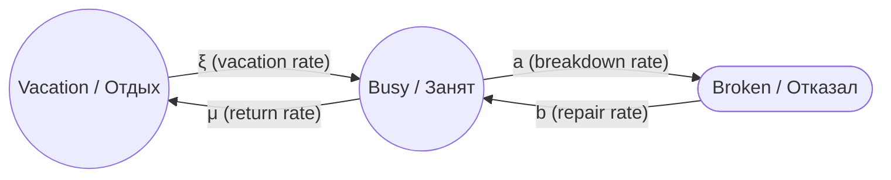
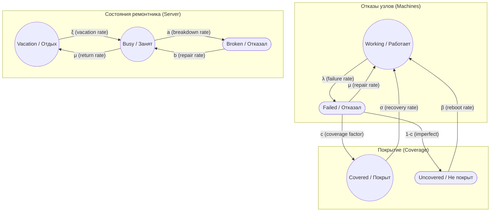

Vacation

## 1

## Подробное пояснение: Server Vacation в модели J&M (Jain & Meena, 2017)

### 1. Краткий ответ

**Server vacation** — это состояние **ремонтника (repairman/server)**, а не вычислительного сервера (compute server).

**Да, это про ремонтную бригаду** (или одного ремонтника), которая:
- Уходит на **vacation** (отдых/перерыв), когда нет отказов;
- Возвращается из vacation, когда появляются отказы;
- Может сама **отказать** (breakdown) и потребовать восстановления.

***

### 2. Почему возникает путаница?

#### 2.1 Двойное значение слова "Server"

В контексте моделей надёжности термин **"server"** может означать:

| Значение | Контекст | Пример |
|---|---|---|
| **Вычислительный сервер** (compute server) | Кластеры, ЦОДы | Node A, Node B в кластере PostgreSQL |
| **Сервер обслуживания** (service server) | Теория массового обслуживания (Queueing Theory) | Ремонтник, кассир, оператор call-центра |

**В модели J&M:**
- **"Server" = ремонтник** (repairman);
- **"Machine/Unit" = вычислительный узел** (compute node).

***

### 3. Подробное пояснение: Vacation, Busy, Broken

#### 3.1 Server = Repairman (Ремонтник)

В модели J&M система описывается как **queueing system** (система массового обслуживания):

- **Customers (заявки):** Отказавшие машины (failed units);
- **Server (сервер):** Ремонтник (repairman);
- **Service (обслуживание):** Ремонт (repair).

**Состояния сервера (ремонтника):**

| Состояние | Оригинал | Перевод | Смысл |
|---|---|---|---|
| j = 0 | Vacation | Отдых / Перерыв | Ремонтник недоступен (нет отказов) |
| j = 1 | Busy | Занят | Ремонтник ремонтирует отказавшую машину |
| j = 2 | Broken down | Отказал | Ремонтник сам отказал и требует восстановления |

***

#### 3.2 Server Vacation (Отдых ремонтника)

**Смысл:** Когда все машины работают (нет отказов), ремонтник не дежурит 24/7, а уходит на **vacation** (отдых, перерыв, отпуск).

**Варианты перевода vacation:**
- Отдых сервера (ремонтника);
- Перерыв в работе ремонтной бригады;
- Отпуск ремонтника;
- Vacation-состояние (термин из теории массового обслуживания);
- Простой ремонтника (когда нет работы).

**Физический смысл для кластера:**

| Сценарий | Описание |
|---|---|
| **График работы:** | Ремонтная бригада работает по графику 9:00–18:00. Если отказ произошёл в 20:00, бригада вернётся только в 9:00. |
| **Приоритизация:** | Если нет отказов, бригада занимается другими задачами (плановое обслуживание, обучение). |
| **Multiple vacation policy:** | Если после возвращения из vacation нет отказов, ремонтник уходит в **очередной vacation** (это описано в статье J&M). |

***

#### 3.3 Server Busy (Занят)

**Смысл:** Ремонтник активно ремонтирует отказавшую машину.

**Физический смысл для кластера:**
- Администратор восстанавливает отказавший узел (замена диска, переустановка ОС);
- Интенсивность ремонта: μ (repair rate).

***

#### 3.4 Server Breakdown (Отказ ремонтника)

**Смысл:** Ремонтник **сам может отказать** с интенсивностью **a** (breakdown rate) и восстанавливается с интенсивностью **b** (repair rate of server).

**Варианты перевода breakdown:**
- Отказ сервера (ремонтника);
- Поломка ремонтной бригады;
- Сбой ремонтника;
- Breakdown-состояние.

**Физический смысл для кластера:**

| Сценарий | Описание |
|---|---|
| **Отказ инструмента:** | Оборудование для диагностики вышло из строя. Требуется восстановление инструмента перед началом ремонта. |
| **Недоступность запчастей:** | Запчасти для ремонта закончились. Ремонт приостановлен до поставки. |
| **Бригада заболела:** | Все инженеры в отпуске/на больничном. Требуется замена бригады. |

***

### 4. Граф состояний сервера (ремонтника)

**Рис. 1. Граф состояний сервера (ремонтника) в модели J&M.**

**Легенда:**

| Переход | Смысл |
|---|---|
| Vacation → Busy (rate ξ) | Возврат из vacation при появлении отказов |
| Busy → Vacation (rate μ) | Уход на vacation после завершения ремонта (если нет других отказов) |
| Busy → Broken (rate a) | Отказ ремонтника (breakdown) |
| Broken → Busy (rate b) | Восстановление ремонтника после отказа |

***

### 5. Почему это не про вычислительный сервер?

#### 5.1 В модели J&M есть разделение

| Термин | Что означает |
|---|---|
| **Machine / Unit** | Вычислительный узел (compute node) |
| **Server / Repairman** | Ремонтник (repairman) |

**Цитата из статьи J&M:**

> "Consider a fault tolerant system with M operating units and S warm spares. The failed units are repaired by a **single repairman**. The **repairman** may go on vacation when there are no failed units. The **repairman** may also break down and require repair."

**Перевод:**

> «Рассмотрим отказоустойчивую систему с M работающими единицами и S тёплыми резервами. Отказавшие единицы ремонтируются **одним ремонтником**. **Ремонтник** может уйти на отдых, когда нет отказавших единиц. **Ремонтник** также может отказать и потребовать ремонта.»

***

#### 5.2 Аналогия с теорией массового обслуживания

Модель J&M — это **queueing model** (модель массового обслуживания):

| Элемент | Queueing Theory | Модель J&M | Кластер |
|---|---|---|---|
| Customers | Заявки | Отказавшие машины | Отказавшие узлы |
| Server | Сервер обслуживания | Ремонтник | Ремонтная бригада |
| Service | Обслуживание | Ремонт | Восстановление узла |
| Vacation | Отдых сервера | Vacation ремонтника | Бригада не дежурит 24/7 |
| Breakdown | Отказ сервера | Breakdown ремонтника | Бригада/инструмент отказали |

***

### 6. Пример для реального кластера

#### 6.1 Конфигурация

- **Кластер:** Двухузловой кластер PostgreSQL (Node A, Node B);
- **Ремонтник:** Один администратор (on-call инженер);
- **График:** Администратор работает по графику 9:00–18:00.

#### 6.2 Сценарии

**Сценарий 1: Vacation (отдых)**

- **Время:** 20:00 (нерабочее время);
- **Состояние:** Node A и Node B работают;
- **Ремонтник:** Администратор ушёл домой (vacation);
- **Переход:** Если в 20:30 откажет Node A, администратор вернётся только в 9:00 (rate ξ).

**Сценарий 2: Busy (занят)**

- **Время:** 14:00 (рабочее время);
- **Состояние:** Node A отказал, Node B работает;
- **Ремонтник:** Администратор восстанавливает Node A (busy);
- **Переход:** После завершения ремонта (rate μ) администратор возвращается в vacation (если нет других отказов).

**Сценарий 3: Breakdown (отказ ремонтника)**

- **Время:** 15:00 (рабочее время);
- **Состояние:** Node A в ремонте, Node B работает;
- **Ремонтник:** Администратор заболел (breakdown);
- **Переход:** Требуется замена администратора (rate b) перед продолжением ремонта.

***

### 7. Сводная таблица терминов

| Термин | Оригинал | Перевод | Что означает |
|---|---|---|---|
| Server | Server | Сервер | Ремонтник (repairman) |
| Vacation | Vacation | Отдых / Перерыв | Ремонтник недоступен (нет отказов) |
| Busy | Busy | Занят | Ремонтник ремонтирует |
| Broken down | Broken down | Отказал | Ремонтник сам отказал |
| Machine / Unit | Machine / Unit | Машина / Единица | Вычислительный узел (compute node) |
| Repairman | Repairman | Ремонтник | Сервер обслуживания (service server) |
| Coverage factor | Coverage factor | Вероятность покрытия | Вероятность обнаружения отказа |
| Reboot rate | Reboot rate | Интенсивность перезагрузки | Восстановление после imperfect coverage |

***

### 8. Выводы

1. **Server vacation** — это состояние **ремонтника (repairman)**, а не вычислительного сервера.

2. **Vacation, Busy, Broken** — это состояния **ремонтной бригады** (сервера обслуживания), а не узлов кластера.

3. **Физический смысл:**
   - **Vacation:** Бригада не дежурит 24/7 (график, отпуск);
   - **Busy:** Бригада ремонтирует отказавший узел;
   - **Broken:** Бригада/инструмент отказали и требуют восстановления.

4. **В модели J&M:**
   - **Machine/Unit** = вычислительный узел;
   - **Server/Repairman** = ремонтник (ремонтная бригада).

5. **Для кластера avers_52:** Vacation и breakdown не учтены (предполагается, что ремонтник всегда доступен).

***

### 9. Источники

 Jain M., Meena R.K. "Fault tolerant system with imperfect coverage, reboot and server vacation". Journal of Industrial Engineering International, 2017. [PDF](https://link.springer.com/content/pdf/10.1007/s40092-016-0180-8.pdf) [link.springer](https://link.springer.com/chapter/10.1007/978-3-662-05409-3_6)
 
## 2

## Сводная таблица: Отказы узлов vs Отказы ремонтника

### 1. Ключевое различие

В модели J&M есть **два типа «серверов»**:

| Тип | Оригинал | Перевод | Что означает |
|---|---|---|---|
| **Вычислительный сервер** | Machine / Unit / Operating node | Машина / Единица / Рабочий узел | Узел кластера (Node A, Node B) |
| **Сервер обслуживания** | Server / Repairman | Сервер / Ремонтник | Ремонтная бригада (администратор) |

**Путаница возникает из-за слова «server»:**
- В контексте кластера: server = вычислительный узел;
- В контексте теории массового обслуживания: server = ремонтник.

***

### 2. Сводная таблица состояний

#### 2.1 Состояния отказов

| Событие | Оригинал | Перевод | Интенсивность | Что означает |
|---|---|---|---|---|
| **Отказ узла (машины)** | Machine failure / Unit failure | Отказ машины / единицы | λ (failure rate) | Отказ вычислительного узла (Node A, Node B) |
| **Отказ тёплого резерва** | Warm standby failure | Отказ тёплого резерва | α (0 < α < λ) | Отказ резервного узла в облегчённом режиме |
| **Отказ ремонтника** | Server breakdown / Repairman breakdown | Отказ сервера / ремонтника | a (breakdown rate) | Отказ ремонтной бригады (инструмент, заболевание) |

***

#### 2.2 Состояния восстановления

| Событие | Оригинал | Перевод | Интенсивность | Что означает |
|---|---|---|---|---|
| **Ремонт узла** | Machine repair / Unit repair | Ремонт машины / единицы | μ (repair rate) | Восстановление отказавшего узла |
| **Reboot системы** | System reboot | Перезагрузка системы | β (reboot rate) | Восстановление после imperfect coverage |
| **Recovery (failover)** | Recovery / Switchover | Восстановление / Переключение | σ (recovery rate) | Успешное переключение на резерв |
| **Ремонт ремонтника** | Server repair / Repairman repair | Ремонт сервера / ремонтника | b (repair rate of server) | Восстановление ремонтной бригады |

***

#### 2.3 Состояния системы (комбинированные)

| Состояние | Оригинал | Перевод | Смысл |
|---|---|---|---|
| **Operating state** | Operating state | Рабочее состояние | Система работает (есть working units) |
| **Vacation state** | Vacation state | Состояние отдыха | Ремонтник на отдыхе (нет отказов) |
| **Busy state** | Busy state | Занят | Ремонтник ремонтирует |
| **Broken state** | Broken down state | Состояние отказа | Ремонтник отказал |
| **Recovery state** | Recovery state | Состояние восстановления | Успешное обнаружение отказа |
| **Reboot state** | Reboot state | Состояние перезагрузки | Неуспешное обнаружение (imperfect coverage) |

***

### 3. Граф состояний (полная модель J&M)

**Рис. 1. Объединённый граф: отказы узлов + состояния ремонтника + покрытие.**

***

### 4. Что означает «ремонт ремонтника»?

#### 4.1 Физический смысл

**«Ремонт ремонтника»** (server repair, rate b) — это восстановление **ремонтной бригады** после её отказа (breakdown).

**Сценарии для кластера:**

| Сценарий | Описание | Аналог в модели |
|---|---|---|
| **Замена инструмента:** | Оборудование для диагностики вышло из строя. Требуется доставка нового инструмента. | Breakdown → Repair (rate b) |
| **Замена бригады:** | Администратор заболел. Требуется вызов другой бригады. | Breakdown → Repair (rate b) |
| **Поставка запчастей:** | Запчасти для ремонта закончились. Требуется ожидание поставки. | Breakdown → Repair (rate b) |

***

#### 4.2 Почему это обосновано?

**Аргумент 1: Реальность**

В реальных ЦОД ремонтная бригада **не идеальна**:
- Может заболеть;
- Может потерять инструмент;
- Может остаться без запчастей.

**Аргумент 2: Теория массового обслуживания**

В queueing theory сервер (repairman) может отказать — это стандартное расширение модели (server breakdown).

**Аргумент 3: Влияние на доступность**

Если ремонтник отказал, система **не может восстанавливаться**, даже если есть отказы узлов. Это снижает итоговую доступность.

***

### 5. Пример для реального кластера

#### 5.1 Конфигурация

- **Кластер:** Двухузловой кластер (Node A, Node B);
- **Ремонтник:** Один администратор (on-call инженер);
- **Инструмент:** Один комплект для диагностики.

#### 5.2 Сценарии

**Сценарий 1: Отказ узла (Machine failure)**

- **Время:** 14:00;
- **Событие:** Node A отказал (rate λ);
- **Состояние:** Система переходит из P0 в P1;
- **Ремонтник:** Busy (начинает ремонт с rate μ).

**Сценарий 2: Отказ ремонтника (Server breakdown)**

- **Время:** 14:30;
- **Событие:** Администратор заболел (rate a);
- **Состояние:** Система переходит из Busy в Broken;
- **Ремонт:** Требуется замена администратора (rate b).

**Сценарий 3: Ремонт ремонтника (Server repair)**

- **Время:** 16:00;
- **Событие:** Другой администратор прибыл (rate b);
- **Состояние:** Система переходит из Broken в Busy;
- **Ремонт узла:** Возобновляется (rate μ).

***

### 6. Сводная таблица: Все состояния и переходы

| Тип | Событие | Из состояния | В состояние | Интенсивность |
|---|---|---|---|---|
| **Отказ узла** | Machine failure | Working (P0) | Failed (P1) | λ |
| **Отказ тёплого резерва** | Warm standby failure | Working (P0) | Failed (P1) | α |
| **Отказ ремонтника** | Server breakdown | Busy (R1) | Broken (R2) | a |
| **Ремонт узла** | Machine repair | Failed (P1) | Working (P0) | μ |
| **Ремонт ремонтника** | Server repair | Broken (R2) | Busy (R1) | b |
| **Recovery (failover)** | Successful coverage | Failed (P1) | Working (P0) | σ |
| **Reboot** | Imperfect coverage | Uncovered (Puf) | Working (P0) | β |
| **Vacation** | Уход на отдых | Busy (R1) | Vacation (R0) | μ (return rate) |
| **Return from vacation** | Возврат из отдыха | Vacation (R0) | Busy (R1) | ξ |

***

### 7. Выводы

1. **Отказ узла (machine failure)** — это отказ вычислительного сервера (Node A, Node B).

2. **Отказ ремонтника (server breakdown)** — это отказ ремонтной бригады (администратора, инструмента).

3. **Ремонт ремонтника (server repair)** — это восстановление бригады (замена, поставка инструмента).

4. **В модели J&M:**
   - **Machine/Unit** = вычислительный узел;
   - **Server/Repairman** = ремонтник (ремонтная бригада).

5. **Для кластера avers_52:** Отказ ремонтника не учтён (предполагается, что бригада всегда доступна).

***

### 8. Источники

 Jain M., Meena R.K. "Fault tolerant system with imperfect coverage, reboot and server vacation". Journal of Industrial Engineering International, 2017. [PDF](https://link.springer.com/content/pdf/10.1007/s40092-016-0180-8.pdf) [link.springer](https://link.springer.com/chapter/10.1007/978-3-662-05409-3_6)
 
