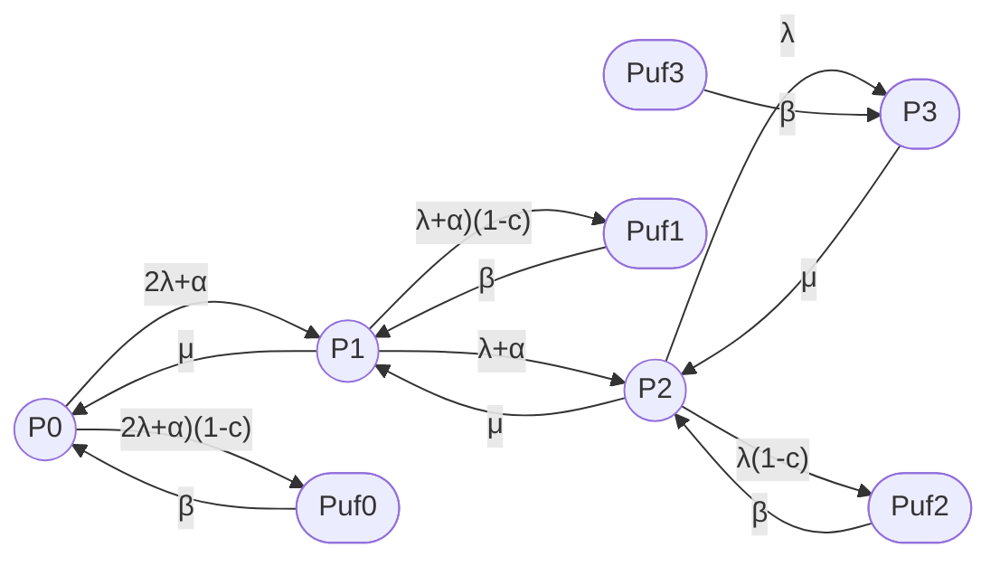

## 1

## Подробный анализ модели MRP (Wang et al., 2013)

### 1. Введение

Модель **MRP (Machine Repair Problem)** из статьи Wang et al. (2013)  — это задача о ремонте машин с **тёплым резервированием (warm standby)**, **неполным покрытием (imperfect coverage)** и **условием сервисного давления (service pressure condition)**.

**Ваш вопрос:** «Правильно я понимаю, что для двухузлового кластера там показана модель 3/2 с добавлением двух состояний S_latent (кроме одного как в avers_52)?»

**Ответ:** **Не совсем.** Модель MRP для случая M=2 (2 operating machines), S=1 (1 warm standby), R=1 (1 repairman) имеет **не 3 состояния (как 3/2), а 5+ состояний**, включая:
- Состояния с разным числом работающих машин (0, 1, 2);
- Состояния с reboot (imperfect coverage);
- Состояния с разным числом занятых ремонтников.

Ниже — детальный анализ.

***

### 2. Полная модель MRP (оригинал)

#### 2.1 Параметры модели

| Параметр | Обозначение | Смысл |
|---|---|---|
| M | — | Число operating machines (работающих машин) |
| S | — | Число warm standbys (тёплых резервов) |
| R | — | Число servers/repairmen (ремонтников) |
| λ | lambda | Failure rate of operating machine (интенсивность отказа рабочей машины) |
| α | alpha | Failure rate of warm standby (интенсивность отказа тёплого резерва, 0 < α < λ) |
| c | coverage factor | Вероятность успешного обнаружения, локализации и замены отказа |
| 1 − c | imperfect coverage | Вероятность неуспешного покрытия (отказ не обнаружен) |
| β | beta | Reboot rate (интенсивность перезагрузки после imperfect coverage) |
| μ | mu | Repair rate (интенсивность ремонта одним ремонтником) |
| θ | theta | Service pressure coefficient (коэффициент сервисного давления) |

#### 2.2 Состояния системы

Система описывается числом отказавших машин **n = 0, 1, ..., N** (где N = M + S) и числом занятых ремонтников.

Для случая **M=2, S=1, R=1** (2 рабочие машины, 1 тёплый резерв, 1 ремонтник):

- **n = 0:** Все 3 машины работают (2 operating + 1 warm standby).
- **n = 1:** 1 отказала, 2 работают.
- **n = 2:** 2 отказали, 1 работает.
- **n = 3:** Все 3 отказали.

**Дополнительно:** Для каждого n есть состояние **P_uf,n** (unsafe failure / reboot state) — если отказ не был покрыт (imperfect coverage).

**Общее число состояний:** 2 × (N+1) = 2 × 4 = **8 состояний** (для M=2, S=1, R=1).

***

### 3. Граф модели MRP (M=2, S=1, R=1)

**Рис. 1. Граф модели MRP (M=2, S=1, R=1).**

**Легенда:**

| Состояние | Смысл | Аналог в avers_52 |
|---|---|---|
| P0 | 0 отказов (все 3 машины работают) | S2 (оба узла + 1 тёплый резерв) |
| P1 | 1 отказ (2 работают) | S1 (один узел в ремонте) |
| P2 | 2 отказа (1 работает) | S0_fail (оба узла отказали, но тёплый резерв ещё работает) |
| P3 | 3 отказа (0 работают) | S0_fail (полный отказ) |
| Puf0, Puf1, Puf2, Puf3 | Unsafe failure (reboot state) | S_latent (частично) |

***

### 4. Сравнение с моделью avers_52 (8/2)

#### 4.1 Сходства

1. **Imperfect coverage:**
   - MRP: P → P_uf (rate λ(1-c));
   - avers_52: S → S_latent (rate λ(1-η)).

2. **Reboot / latent:**
   - MRP: P_uf → P (rate β);
   - avers_52: S_latent → S0_fail (rate θ).

3. **Один ремонтник:**
   - MRP: R = 1;
   - avers_52: одна ремонтная бригада.

#### 4.2 Различия

| Аспект | MRP | avers_52 (8/2) |
|---|---|---|
| Число состояний (M=2, S=1) | 8 (с reboot) | 8 (с transient, latent, failover/failback) |
| Тёплый резерв | Да (S=1, rate α) | Нет (только hot standby) |
| Reboot state | 4 состояния (Puf0, Puf1, Puf2, Puf3) | 1 состояние (S_latent) |
| Failover/failback | Нет | Да (S_failover, S_failback) |
| Transient faults | Нет | Да (S2_tf, S1_tf) |
| Service pressure | Да (θ) | Нет |

**Вывод:** Модель MRP **не является** моделью 3/2 с двумя S_latent. Это более сложная модель с тёплым резервом, reboot states и service pressure.

***

### 5. Что значит «тёплый резерв» (warm standby)?

#### 5.1 Типы резервирования

| Тип | Обозначение | Failure rate | Смысл |
|---|---|---|---|
| Холодный резерв | Cold standby | 0 | Резерв не работает, не отказывает |
| Тёплый резерв | Warm standby | α (0 < α < λ) | Резерв работает в облегчённом режиме |
| Горячий резерв | Hot standby | λ | Резерв работает в полном режиме |

#### 5.2 Физический смысл для кластера

**Пример:** Двухузловой кластер PostgreSQL с репликацией.

- **Hot standby (avers_52):**
  - Оба узла работают, репликация синхронная;
  - Оба узла имеют одинаковый failure rate λ;
  - При отказе одного — мгновенный failover.

- **Warm standby (MRP):**
  - Один узел активный (failure rate λ);
  - Второй узел — тёплый резерв (failure rate α < λ, например, только репликация без обработки запросов);
  - При отказе активного — переключение на резерв (с задержкой).

**Почему α < λ?** Тёплый резерв работает в облегчённом режиме (меньше нагрузки, меньше отказов).

***

### 6. Service pressure condition (условие сервисного давления)

#### 6.1 Смысл

**Service pressure coefficient θ** — это параметр, который показывает, насколько ремонтники **ускоряют ремонт** при увеличении числа отказов.

**Формула из статьи:**

Когда число отказов **n ≥ R** (число ремонтников), средняя интенсивность ремонта:

$$
\mu_n = \mu \cdot \left[1 + \frac{\theta}{R(n - R + 1)}\right]
$$

где:
- μ — базовая интенсивность ремонта;
- θ — service pressure coefficient (θ > 0).

#### 6.2 Физический смысл для кластера

**Пример:** Ремонтная бригада из R = 1 человека.

- **n = 1 (1 отказ):** Ремонтник работает в обычном режиме (rate μ).
- **n = 2 (2 отказа):** Ремонтник понимает, что система в критическом состоянии, и **ускоряет ремонт** (rate μ × (1 + θ/2)).
- **n = 3 (3 отказа):** Ремонтник работает на пределе (rate μ × (1 + θ/3)).

**Аналогия:** В автосервисе, если в очереди 5 машин, механик начинает работать быстрее (но всё равно не успевает).

#### 6.3 Зачем это нужно?

**Service pressure** моделирует **реальное поведение** ремонтников:
- При малом числе отказов — спокойный ремонт;
- При большом числе отказов — ускоренный ремонт (но с риском ошибок).

***

### 7. Перевод ключевых разделов статьи MRP

#### 7.1 Problem statement (Постановка задачи)

> Мы рассматриваем модель ремонта машин с N = M + S идентичными машинами и R серверами в ремонтной мастерской. Одновременно могут работать M машин, остальные S машин — тёплые резервы. Каждая работающая машина отказывает независимо с экспоненциальным временем до отказа с параметром λ. Каждый доступный тёплый резерв отказывает независимо с параметром α (0 < α < λ). Когда работающая машина (или тёплый резерв) отказывает, она может быть немедленно обнаружена, локализована и заменена резервом с вероятностью покрытия c. Мы определяем состояние небезопасного отказа системы как любой отказ, который не был покрыт. Отказ в состоянии небезопасного отказа устраняется перезагрузкой. Задержка перезагрузки происходит с интенсивностью β.

#### 7.2 Steady-state results (Стационарные результаты)

> Мы получаем стационарные решения P_n (вероятность n отказов) и P_uf,n (вероятность небезопасного отказа при n отказах). Стационарные решения всегда существуют, так как число состояний конечно.

#### 7.3 Performance measures (Показатели эффективности)

> Пусть E[O] — ожидаемое число работающих машин, E[S] — ожидаемое число резервных машин, E[I] — ожидаемое число простаивающих ремонтников, E[B] — ожидаемое число занятых ремонтников. Machine availability (M.A.) — вероятность того, что система работает. Operative utilization (O.U.) — доля времени, когда ремонтники заняты.

***

### 8. Выводы

1. **Модель MRP — это не 3/2 с двумя S_latent.** Это модель с тёплым резервом, reboot states и service pressure.

2. **Для M=2, S=1, R=1** модель MRP имеет **8 состояний** (4 normal + 4 unsafe/reboot).

3. **Тёплый резерв (warm standby)** — это резерв с reduced failure rate (α < λ), что отличается от hot standby в avers_52.

4. **Service pressure** — это ускорение ремонта при увеличении числа отказов (реалистичное поведение ремонтников).

5. **Imperfect coverage** в MRP аналогичен S_latent в avers_52, но разделён на 4 состояния (Puf0, Puf1, Puf2, Puf3).

***

### 9. Источники

 Wang K.H., Liou C.D., Lin Y.H. "Comparative analysis of the machine repair Problem with imperfect coverage and service pressure condition". Applied Mathematical Modelling, 2013. [PDF](https://iopscience.iop.org/article/10.1088/1742-6596/410/1/012112/pdf)
