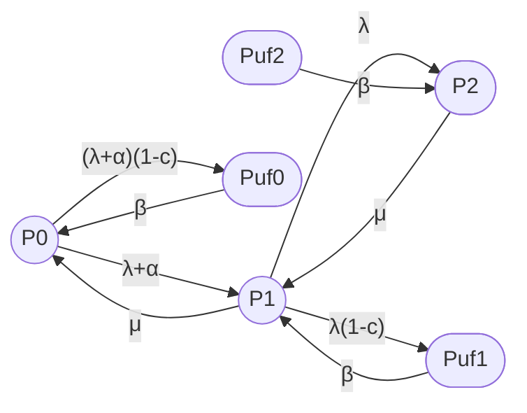
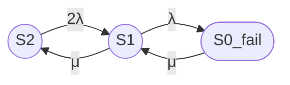
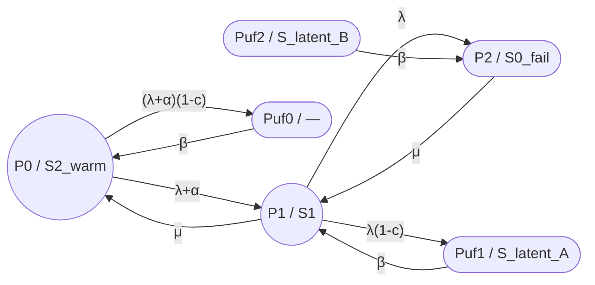
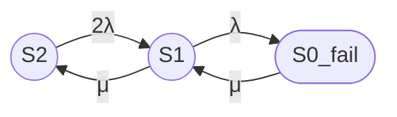

## 1

## Анализ модели MRP (M=1, S=1, R=1)

***

### 2. Модель MRP для случая M=1, S=1, R=1

**Параметры:**
- **M = 1** — 1 operating machine (1 рабочая машина);
- **S = 1** — 1 warm standby (1 тёплый резерв);
- **R = 1** — 1 repairman (1 ремонтник).

**Итого:** 2 узла (1 активный + 1 тёплый резерв).

***

### 3. Состояния системы

Для M=1, S=1, R=1:

- **n = 0, 1, 2** — число отказавших машин;
- **P_n** — вероятность n отказов (operating state);
- **P_uf,n** — вероятность unsafe failure (reboot state) при n отказах.

**Общее число состояний:** 2 × (N+1) = 2 × 3 = **6 состояний**.

| Состояние | Смысл | Аналог в avers_52 |
|---|---|---|
| P0 | 0 отказов (1 working + 1 warm standby) | S2 (оба узла работают) |
| P1 | 1 отказ (1 working, 1 failed) | S1 (один узел в ремонте) |
| P2 | 2 отказа (0 working, 2 failed) | S0_fail (оба узла отказали) |
| Puf0 | Unsafe failure при 0 отказах | — (отсутствует в avers_52) |
| Puf1 | Unsafe failure при 1 отказе | S_latent (частично) |
| Puf2 | Unsafe failure при 2 отказах | S_latent (частично) |

***

### 4. Граф модели MRP (M=1, S=1, R=1)

**Рис. 1. Граф модели MRP (M=1, S=1, R=1) — исправленный синтаксис.**

**Легенда:**

| Переход | Смысл |
|---|---|
| P0 → P1 (rate λ+α) | Отказ рабочей машины (λ) или тёплого резерва (α) |
| P0 → Puf0 (rate (λ+α)(1-c)) | Отказ не обнаружен (imperfect coverage) |
| P1 → P0 (rate μ) | Ремонт завершён, возврат к полной работоспособности |
| P1 → P2 (rate λ) | Отказ единственной рабочей машины |
| P1 → Puf1 (rate λ(1-c)) | Отказ рабочей машины не обнаружен |
| P2 → P1 (rate μ) | Ремонт одной из двух отказавших машин |
| Puf0 → P0 (rate β) | Перезагрузка после imperfect coverage |
| Puf1 → P1 (rate β) | Перезагрузка после imperfect coverage |
| Puf2 → P2 (rate β) | Перезагрузка после imperfect coverage |

***

### 5. Сравнение с моделью avers_52 (3/2)

#### 5.1 Граф модели avers_52 (3/2, M=1, S=1)

Для сравнения приведём граф базовой модели 3/2 (без transient, latent, failover/failback):

**Рис. 2. Граф модели avers_52 (3/2, M=1, S=1).**

***

#### 5.2 Сходства

1. **Число работоспособных состояний:**
   - MRP: P0, P1 (2 состояния);
   - avers_52: S2, S1 (2 состояния).

2. **Один ремонтник:**
   - MRP: R = 1;
   - avers_52: одна ремонтная бригада.

3. **Переходы P1 ↔ P0 и S1 ↔ S2:**
   - MRP: P1 → P0 (rate μ);
   - avers_52: S1 → S2 (rate μ).

***

#### 5.3 Различия

| Аспект | MRP (M=1, S=1) | avers_52 (3/2) |
|---|---|---|
| Число состояний | 6 (с reboot) | 3 (базовая) |
| Тёплый резерв | Да (rate α < λ) | Нет (hot standby, rate λ) |
| Imperfect coverage | 3 состояния (Puf0, Puf1, Puf2) | 1 состояние (S_latent) |
| Reboot rate | β | θ (но переход в S0_fail) |
| Service pressure | Да (θ) | Нет |

***

### 6. Почему в MRP 3 состояния reboot (Puf0, Puf1, Puf2), а в avers_52 одно S_latent?

#### 6.1 Обоснование MRP

В модели MRP разделение Puf0, Puf1, Puf2 обусловлено тем, что:

1. **Разное число working machines:**
   - Puf0: 0 отказов, но отказ не обнаружен (например, скрытый дефект тёплого резерва);
   - Puf1: 1 отказ, но отказ не обнаружен (рабочая машина отказала, но система «считает» её исправной);
   - Puf2: 2 отказа, система полностью неработоспособна.

2. **Разные переходы после reboot:**
   - Puf0 → P0 (возврат к полной работоспособности);
   - Puf1 → P1 (возврат к degraded mode);
   - Puf2 → P2 (возврат к полному отказу, но система может быть восстановлена).

#### 6.2 Обоснование avers_52

В модели avers_52 одно состояние S_latent используется, потому что:

1. **Агрегирование по смыслу:** S_latent — это «кластер не знает об отказе», независимо от числа отказавших узлов.

2. **Упрощение модели:** Для практических расчётов достаточно одного состояния.

3. **Переход в S0_fail:** Из S_latent только один переход — в S0_fail (полный отказ).

***

### 7. Физический смысл для реального кластера (M=1, S=1)

#### 7.1 Пример: Двухузловой кластер с активным/пассивным режимом

**Конфигурация:**
- Node A: активный узел (working machine, rate λ);
- Node B: пассивный узел (warm standby, rate α < λ);
- 1 ремонтная бригада (R=1).

**Сценарии:**

1. **P0 → P1 (rate λ+α):**
   - Отказ Node A (rate λ) или Node B (rate α);
   - Если отказ Node A — переключение на Node B;
   - Если отказ Node B — продолжение работы на Node A.

2. **P0 → Puf0 (rate (λ+α)(1-c)):**
   - Отказ Node A или B **не обнаружен** (imperfect coverage);
   - Система «считает» оба узла исправными, но данные могут быть повреждены.

3. **Puf0 → P0 (rate β):**
   - Через 8 часов внешний контроль обнаруживает проблему;
   - Система перезагружается (reboot), возврат в P0.

4. **P1 → P2 (rate λ):**
   - Отказ единственного рабочего узла;
   - Система полностью неработоспособна.

***

### 8. Что значит «тёплый резерв» (warm standby) для M=1, S=1?

#### 8.1 Сравнение типов резервирования

| Тип | Failure rate | Пример для кластера |
|---|---|---|
| Холодный резерв (cold) | 0 | Node B выключен, не отказывает |
| Тёплый резерв (warm) | α (0 < α < λ) | Node B работает в режиме репликации (без обработки запросов) |
| Горячий резерв (hot) | λ | Node B работает в полном режиме (active-active) |

#### 8.2 Почему α < λ?

**Пример:** PostgreSQL с репликацией.

- **Active node (Node A):**
  - Обрабатывает запросы клиентов;
  - Пишет WAL (Write-Ahead Log);
  - Высокая нагрузка → высокий failure rate λ.

- **Warm standby (Node B):**
  - Только реплицирует WAL;
  - Не обрабатывает запросы;
  - Низкая нагрузка → низкий failure rate α.

**Типичные значения:** α ≈ 0.1λ – 0.5λ (в зависимости от нагрузки).

***

### 9. Выводы

1. **Для M=1, S=1, R=1** модель MRP имеет **6 состояний** (3 normal + 3 unsafe/reboot).

2. **Тёплый резерв (warm standby)** — это резерв с reduced failure rate (α < λ), что отличается от hot standby в avers_52.

3. **Imperfect coverage** в MRP разделён на 3 состояния (Puf0, Puf1, Puf2), а в avers_52 — одно S_latent.

4. **Service pressure** в MRP — это ускорение ремонта при увеличении числа отказов.

5. **Граф MRP** исправлен (добавлены скобки в подписях переходов).

***

### 10. Источники

 Wang K.H., Liou C.D., Lin Y.H. "Comparative analysis of the machine repair Problem with imperfect coverage and service pressure condition". Applied Mathematical Modelling, 2013. [PDF](https://iopscience.iop.org/article/10.1088/1742-6596/410/1/012112/pdf) [link.springer](https://link.springer.com/chapter/10.1007/978-3-662-05409-3_6)
 
## 2

## Подробное пояснение модели MRP (M=1, S=1, R=1)

### 1. Что означает «задача о ремонте машин с тёплым резервированием, неполным покрытием и сервисным давлением»

Разберём каждую часть фразы:

#### 1.1 Machine Repair Problem (MRP) — Задача о ремонте машин

**Классическая постановка:**
- Есть M машин, которые работают;
- Есть S резервных машин (spares);
- Есть R ремонтников (repairmen/servers);
- Когда машина отказывает, она поступает в ремонт;
- После ремонта возвращается в работу (или в резерв).

**Аналогия с кластером:**
- Машины = узлы кластера (nodes);
- Ремонтники = ремонтная бригада (администраторы, инженеры);
- Отказ машины = отказ узла (hardware/software failure).

***

#### 1.2 Warm Standby — Тёплое резервирование

**Определение:** Тёплый резерв (warm standby) — это резервный узел, который:
- **Работает в облегчённом режиме** (не обрабатывает запросы клиентов);
- **Может отказать** (с интенсивностью α < λ);
- **Готов принять нагрузку** при отказе активного узла (с задержкой на переключение).

**Сравнение с другими типами:**

| Тип резервирования | Failure rate | Готовность к переключению | Пример для кластера |
|---|---|---|---|
| Cold standby (холодный) | 0 (не отказывает) | Минуты/часы (нужно включить) | Выключенный сервер в стойке |
| Warm standby (тёплый) | α (0 < α < λ) | Секунды/минуты (синхронизация) | PostgreSQL с репликацией (standby mode) |
| Hot standby (горячий) | λ (как активный) | Мгновенно (автоматический failover) | Active-active кластер (оба узла обрабатывают запросы) |

**Для M=1, S=1 (1 рабочая + 1 тёплый резерв):**
- Node A: active (rate λ);
- Node B: warm standby (rate α < λ).

***

#### 1.3 Imperfect Coverage — Неполное покрытие

**Определение:** Coverage factor c — это вероятность того, что отказ будет:
1. **Обнаружен** (detected);
2. **Локализован** (isolated);
3. **Восстановлен** (recovered) через переключение на резерв.

**Если покрытие неполное (c < 1):**
- С вероятностью 1 − c отказ **не обнаруживается**;
- Система переходит в состояние **unsafe failure / reboot state**;
- Требуется внешнее вмешательство (перезагрузка, ручной ремонт).

**Аналогия с кластером:**
- c = 0.99: 99% отказов обнаруживаются автоматически;
- 1 − c = 0.01: 1% отказов остаются скрытыми (требуется внешний контроль).

***

#### 1.4 Service Pressure Condition — Условие сервисного давления

**Определение:** Service pressure — это явление, когда ремонтники **ускоряют ремонт** при увеличении числа отказов.

**Формула из статьи MRP:**

Когда число отказов **n ≥ R** (число ремонтников), интенсивность ремонта:

$$
\mu_n = \mu \cdot \left[1 + \frac{\theta}{R(n - R + 1)}\right]
$$

где:
- μ — базовая интенсивность ремонта;
- θ — service pressure coefficient (θ > 0).

**Физический смысл:**
- При n = 1 (1 отказ): ремонтник работает в обычном режиме (rate μ);
- При n = 2 (2 отказа): ремонтник понимает критичность ситуации и ускоряется (rate μ × (1 + θ/2));
- При n = 3 (3 отказа): ремонтник работает на пределе (rate μ × (1 + θ/3)).

**Аналогия с кластером:**
- При одном отказе: администратор ремонтирует в плановом режиме;
- При двух отказах: администратор понимает, что кластер на грани полного отказа, и работает быстрее (но с риском ошибок).

***

#### 1.5 M/M/R — Обозначение из теории массового обслуживания

**Формат Кендалла:** A/B/R

- **A** — распределение времени между поступлениями заявок (M = Markovian / exponential);
- **B** — распределение времени обслуживания (M = Markovian / exponential);
- **R** — число серверов (repairmen).

**M/M/R для MRP:**
- **M (первое):** Экспоненциальное распределение времени до отказа машин;
- **M (второе):** Экспоненциальное распределение времени ремонта;
- **R:** Число ремонтников (servers).

**Для M=1, S=1, R=1:**
- M/M/1 queue with warm standby and imperfect coverage.

***

### 2. Модель MRP (M=1, S=1, R=1) в терминах avers_52

#### 2.1 Состояния MRP и их аналоги в avers_52

| Состояние MRP | Смысл | Аналог в avers_52 |
|---|---|---|
| P0 | 0 отказов: 1 working (active) + 1 warm standby | S2 (оба узла работают, но в MRP один — тёплый резерв) |
| P1 | 1 отказ: 1 working, 1 failed (в ремонте) | S1 (один узел в ремонте) |
| P2 | 2 отказа: 0 working, 2 failed | S0_fail (оба узла отказали) |
| Puf0 | Unsafe failure при 0 отказах (скрытый дефект) | — (отсутствует в avers_52) |
| Puf1 | Unsafe failure при 1 отказе (отказ не обнаружен) | S_latent (частично) |
| Puf2 | Unsafe failure при 2 отказах (полный отказ + скрытый дефект) | S_latent (частично) |

***

#### 2.2 Граф MRP (M=1, S=1, R=1)

**Рис. 1. Граф модели MRP (M=1, S=1, R=1) с аналогами в avers_52.**

***

#### 2.3 Граф avers_52 (3/2, hot standby)

Для сравнения — граф базовой модели 3/2 (без transient, latent, failover/failback):

**Рис. 2. Граф модели avers_52 (3/2, hot standby).**

***

### 3. Какие состояния отказа?

#### 3.1 В модели MRP

| Состояние | Тип отказа | Работоспособность |
|---|---|---|
| P0 | Нет отказа | Работоспособно (1 active + 1 warm) |
| P1 | 1 отказ (1 failed) | Работоспособно (1 active) |
| P2 | 2 отказа (2 failed) | **Неработоспособно** (0 active) |
| Puf0 | Unsafe failure (0 failed, но скрытый дефект) | **Неработоспособно** (система «заражена») |
| Puf1 | Unsafe failure (1 failed + скрытый дефект) | **Неработоспособно** (отказ не обнаружен) |
| Puf2 | Unsafe failure (2 failed + скрытый дефект) | **Неработоспособно** (полный отказ) |

**Ключевой момент:** В MRP состояния Puf0, Puf1, Puf2 — это **unsafe failure** (небезопасный отказ), а не просто «латентный отказ». Система может формально работать (Puf0, Puf1), но она **не надёжна** (данные могут быть повреждены).

***

#### 3.2 В модели avers_52 (8/2)

| Состояние | Тип отказа | Работоспособность |
|---|---|---|
| S2 | Нет отказа | Работоспособно (2 active) |
| S1 | 1 отказ (1 failed, 1 в ремонте) | Работоспособно (1 active) |
| S0_fail | 2 отказа (2 failed) | **Неработоспособно** (0 active) |
| S2_tf | Transient fault (временный сбой) | **Неработоспособно** (на время перезапуска) |
| S1_tf | Transient fault (временный сбой) | **Неработоспособно** (на время перезапуска) |
| S_latent | Скрытый отказ (1 failed, не обнаружен) | **Неработоспособно** (кластер «не знает» об отказе) |
| S_failover | Failover в процессе | **Неработоспособно** (на время переключения) |
| S_failback | Failback в процессе | **Неработоспособно** (на время переключения) |

***

### 4. Сравнение состояний отказа

| Аспект | MRP | avers_52 |
|---|---|---|
| Число состояний отказа | 4 (P2, Puf0, Puf1, Puf2) | 6 (S0_fail, S2_tf, S1_tf, S_latent, S_failover, S_failback) |
| Unsafe failure | 3 состояния (Puf0, Puf1, Puf2) | 1 состояние (S_latent) |
| Transient faults | Нет | 2 состояния (S2_tf, S1_tf) |
| Failover/failback | Нет | 2 состояния (S_failover, S_failback) |
| Warm standby | Да (α < λ) | Нет (hot standby, λ) |

***

### 5. Физический смысл для реального кластера (M=1, S=1)

#### 5.1 Пример: PostgreSQL с тёплым резервом

**Конфигурация:**
- Node A: primary (active, rate λ);
- Node B: standby (warm, rate α < λ);
- 1 администратор (R=1).

**Сценарии:**

1. **P0 → P1 (rate λ+α):**
   - Отказ Node A (rate λ) или Node B (rate α);
   - Если отказ Node A — переключение на Node B (failover);
   - Если отказ Node B — продолжение работы на Node A.

2. **P0 → Puf0 (rate (λ+α)(1-c)):**
   - Отказ Node A или B **не обнаружен** (imperfect coverage);
   - Например: сбой репликации не обнаружен, данные расходятся.

3. **Puf0 → P0 (rate β):**
   - Через 8 часов внешний контроль (например, проверка checksum) обнаруживает проблему;
   - Перезагрузка репликации (reboot).

4. **P1 → P2 (rate λ):**
   - Отказ единственного рабочего узла;
   - Кластер полностью неработоспособен.

5. **P1 → Puf1 (rate λ(1-c)):**
   - Отказ рабочего узла **не обнаружен**;
   - Кластер «считает» узел исправным, но данные могут быть повреждены.

***

### 6. Выводы

1. **MRP (M=1, S=1, R=1)** — это модель с **6 состояниями** (3 normal + 3 unsafe/reboot).

2. **Тёплый резерв (warm standby)** — это резерв с reduced failure rate (α < λ), что отличается от hot standby в avers_52.

3. **Imperfect coverage** в MRP разделён на 3 состояния (Puf0, Puf1, Puf2), а в avers_52 — одно S_latent.

4. **Service pressure** — это ускорение ремонта при увеличении числа отказов (реалистичное поведение ремонтников).

5. **M/M/R** — обозначение из теории массового обслуживания (экспоненциальное распределение отказов и ремонта, R ремонтников).

6. **Состояния отказа:**
   - MRP: P2, Puf0, Puf1, Puf2 (4 состояния);
   - avers_52: S0_fail, S2_tf, S1_tf, S_latent, S_failover, S_failback (6 состояний).

***

### 7. Источники

 Wang K.H., Liou C.D., Lin Y.H. "Comparative analysis of the machine repair Problem with imperfect coverage and service pressure condition". Applied Mathematical Modelling, 2013. [PDF](https://iopscience.iop.org/article/10.1088/1742-6596/410/1/012112/pdf) [link.springer](https://link.springer.com/chapter/10.1007/978-3-662-05409-3_6)
 
