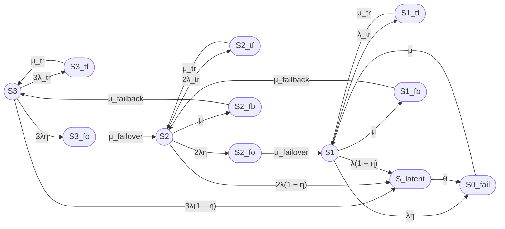

`report12_full.md` (исправленный)

# Отчёт 12: Модель трёхузлового кластера (12 состояний)

### 1. Формулировка модели

Рассматривается восстанавливаемый отказоустойчивый трёхузловой кластер с нагруженным резервированием, одной ремонтной бригадой, временными сбоями, скрытыми отказами и операциями failover/failback.

Модель имеет 12 состояний:
- Работоспособные: $S_3$, $S_2$, $S_1$;
- Неработоспособные: $S_{0\_fail}$, $S_{3\_tf}$, $S_{2\_tf}$, $S_{1\_tf}$, $S_{latent}$, $S_{3\_fo}$, $S_{2\_fo}$, $S_{2\_fb}$, $S_{1\_fb}$.

***

### 2. Граф состояний

***

### 3. Группы состояний

| Группа | Состояния |
|---|---|
| Работоспособные | $S_3$, $S_2$, $S_1$ |
| Неработоспособные | $S_{0\_fail}$, $S_{3\_tf}$, $S_{2\_tf}$, $S_{1\_tf}$, $S_{latent}$, $S_{3\_fo}$, $S_{2\_fo}$, $S_{2\_fb}$, $S_{1\_fb}$ |

***

### 4. Стационарный коэффициент готовности

**Unicode:**

Кг,ст = P3 + P2 + P1

**LaTeX:**

$$
K_{\mathrm{г,ст}} = P_3 + P_2 + P_1
$$

Из точного решения системы уравнений баланса марковской цепи получаются следующие строгие соотношения вероятностей:

$$
P_2 = \frac{3\lambda}{\mu} P_3
$$

$$
P_1 = \left( \frac{6\lambda^2}{\mu^2} + \frac{3\lambda(1-\eta)}{\mu} \right) P_3
$$

$$
K_{\mathrm{г,ст}} = P_3 \left( 1 + \frac{3\lambda}{\mu} + \frac{6\lambda^2}{\mu^2} + \frac{3\lambda(1-\eta)}{\mu} \right)
$$

Нормировочный знаменатель $D$ (сумма всех вероятностей, выраженных через $P_3$):

$$
D = 1 + \frac{P_2}{P_3} + \frac{P_1}{P_3} + \frac{P_{3tf}}{P_3} + \frac{P_{2tf}}{P_3} + \frac{P_{1tf}}{P_3} + \frac{P_{3fo}}{P_3} + \frac{P_{2fo}}{P_3} + \frac{P_{2fb}}{P_3} + \frac{P_{1fb}}{P_3} + \frac{P_{latent}}{P_3} + \frac{P_{0f}}{P_3}
$$

Где каждое слагаемое имеет точный аналитический вид:
- $\frac{P_2}{P_3} = \frac{3\lambda}{\mu}$
- $\frac{P_1}{P_3} = \frac{6\lambda^2}{\mu^2} + \frac{3\lambda(1-\eta)}{\mu}$
- $\frac{P_{3tf}}{P_3} = \frac{3\lambda_{tr}}{\mu_{tr}}$
- $\frac{P_{2tf}}{P_3} = \frac{6\lambda\lambda_{tr}}{\mu\mu_{tr}}$
- $\frac{P_{1tf}}{P_3} = \frac{P_1}{P_3} \cdot \frac{\lambda_{tr}}{\mu_{tr}}$
- $\frac{P_{3fo}}{P_3} = \frac{3\lambda\eta}{\mu_{failover}}$
- $\frac{P_{2fo}}{P_3} = \frac{P_2}{P_3} \cdot \frac{2\lambda\eta}{\mu_{failover}} = \frac{6\lambda^2\eta}{\mu\mu_{failover}}$
- $\frac{P_{2fb}}{P_3} = \frac{3\lambda}{\mu_{failback}}$
- $\frac{P_{1fb}}{P_3} = \frac{P_1}{P_3} \cdot \frac{\mu}{\mu_{failback}}$
- $\frac{P_{latent}}{P_3} = \frac{\lambda(1-\eta)}{\theta} \left( 3 + 2\frac{P_2}{P_3} + \frac{P_1}{P_3} \right)$
- $\frac{P_{0f}}{P_3} = \frac{\lambda(1-\eta)}{\mu} \left( 3 + 2\frac{P_2}{P_3} \right) + \frac{P_1}{P_3} \cdot \frac{\lambda}{\mu}$

Тогда:

$$
P_3 = \frac{1}{D}
$$

$$
K_{\mathrm{г,ст}} = \frac{1 + \frac{P_2}{P_3} + \frac{P_1}{P_3}}{D}
$$

***

### 5. Численный расчет

**Исходные данные:**

| Параметр | Значение | Единицы |
|---|---|---|
| $MTBF$ | 30000 | ч |
| $MTTR$ | 24 | ч |
| $T_{failover}$ | 30 | с |
| $T_{failback}$ | 90 | с |
| $T_{tr}$ | 180 | с |
| $\eta$ | 0.99 | — |
| $T_{detect}$ | 8 | ч |
| $MTBF_{tr}$ | 8760 | ч |

**Интенсивности:**

**Unicode:**

λ = 3.3333333333e-05 ч⁻¹

μ = 0.04166666667 ч⁻¹

λ_tr = 1.1415525114e-04 ч⁻¹

μ_tr = 20 ч⁻¹

μ_failover = 120 ч⁻¹

μ_failback = 40 ч⁻¹

θ = 0.125 ч⁻¹

η = 0.99

**Слагаемые D:**

| Слагаемое | Значение |
|---|---:|
| $1$ | 1.0000000000e+00 |
| $P_2/P_3$ | 2.4000000000e-03 |
| $P_1/P_3$ | 2.7840000000e-05 |
| $P_{3tf}/P_3$ | 1.71232877e-05 |
| $P_{2tf}/P_3$ | 2.73972603e-08 |
| $P_{1tf}/P_3$ | 1.58904110e-10 |
| $P_{3fo}/P_3$ | 8.25000000e-07 |
| $P_{2fo}/P_3$ | 1.32000000e-09 |
| $P_{2fb}/P_3$ | 2.50000000e-06 |
| $P_{1fb}/P_3$ | 2.90000000e-08 |
| $P_{latent}/P_3$ | 8.01287424e-06 |
| $P_{0f}/P_3$ | 2.40606720e-05 |

**Сумма D:**

$$
D = 1.0024804197
$$

**Стационарные вероятности:**

$$
P_3 = \frac{1}{D} = 0.9975257175
$$

$$
P_2 = \frac{P_2}{P_3} \cdot P_3 = 0.0023940617
$$

$$
P_1 = \frac{P_1}{P_3} \cdot P_3 = 0.0000277711
$$

**Коэффициент готовности:**

**Unicode:**

Кг,ст = P3 + P2 + P1 = 0.9975257175 + 0.0023940617 + 0.0000277711 = 0.9999475504

**LaTeX:**

$$
K_{\mathrm{г,ст}} = 0.9999475504
$$

### Формулы

**Unicode:**

Кг,ст = P3 + P2 + P1

P2 = (3λ/μ) · P3

P1 = (6λ²/μ² + 3λ(1-η)/μ) · P3

Кг,ст = (1 + P2/P3 + P1/P3) / D

**LaTeX:**

$$
K_{\mathrm{г,ст}} = P_3 + P_2 + P_1
$$

$$
P_2 = \frac{3\lambda}{\mu} P_3
$$

$$
P_1 = \left( \frac{6\lambda^2}{\mu^2} + \frac{3\lambda(1-\eta)}{\mu} \right) P_3
$$

$$
K_{\mathrm{г,ст}} = \frac{1 + \frac{P_2}{P_3} + \frac{P_1}{P_3}}{D}
$$

### Численный результат

| Показатель | Значение |
|---|---:|
| $K_{\mathrm{г,ст}}$ | 0.9999475504 |
| $U_{\mathrm{ст}}$ | 5.24496 × 10⁻⁵ |
| Ожидаемый простой за 8760 ч | около 27.6 мин |

***
