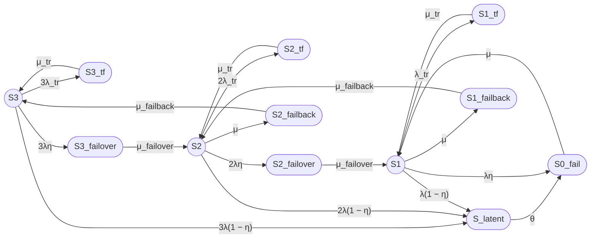

Выполнение промпта для модели 12/3 prompt13_full.md

### 1. Формулировка модели

Рассматривается восстанавливаемый отказоустойчивый трёхузловой кластер с нагруженным резервированием, одной ремонтной бригадой, временными сбоями, скрытыми отказами и операциями failover/failback.

Модель имеет 12 состояний:
- Работоспособные: $S_3$, $S_2$, $S_1$;
- Неработоспособные: $S_{0\_fail}$, $S_{3\_tf}$, $S_{2\_tf}$, $S_{1\_tf}$, $S_{latent}$, $S_{3\_failover}$, $S_{2\_failover}$, $S_{2\_failback}$, $S_{1\_failback}$.

***

### 2. Граф состояний

***

### 3. Группы состояний

| Группа | Состояния |
|---|---|
| Работоспособные | $S_3$, $S_2$, $S_1$ |
| Неработоспособные | $S_{0\_fail}$, $S_{3\_tf}$, $S_{2\_tf}$, $S_{1\_tf}$, $S_{latent}$, $S_{3\_failover}$, $S_{2\_failover}$, $S_{2\_failback}$, $S_{1\_failback}$ |

***

### 4. Стационарный коэффициент готовности

**Unicode:**

Кг,ст = P3 + P2 + P1

**LaTeX:**

$$
K_{\mathrm{г,ст}} = P_3 + P_2 + P_1
$$

После решения системы уравнений баланса получаем:

$$
P_2 = \frac{3\lambda}{\mu + 2\lambda\eta} P_3
$$

$$
P_1 = \frac{3\lambda^2}{(\mu + 2\lambda\eta)(\mu + \lambda\eta)} P_3
$$

$$
K_{\mathrm{г,ст}} = P_3 \left(1 + \frac{3\lambda}{\mu + 2\lambda\eta} + \frac{3\lambda^2}{(\mu + 2\lambda\eta)(\mu + \lambda\eta)}\right)
$$

Знаменатель $D$:

$$
\begin{aligned}
D = &1 + \frac{3\lambda}{\mu + 2\lambda\eta} + \frac{3\lambda^2}{(\mu + 2\lambda\eta)(\mu + \lambda\eta)} + \frac{3\lambda_{tr}}{\mu_{tr}} \\
&+ \frac{6\lambda\lambda_{tr}}{\mu_{tr}(\mu + 2\lambda\eta)} + \frac{3\lambda^2\lambda_{tr}}{\mu_{tr}(\mu + 2\lambda\eta)(\mu + \lambda\eta)} \\
&+ \frac{3\lambda\eta}{\mu_{failover}} + \frac{6\lambda^2\eta}{\mu_{failover}(\mu + 2\lambda\eta)} \\
&+ \frac{\mu}{\mu_{failback}} \cdot \left(\frac{3\lambda}{\mu + 2\lambda\eta} + \frac{3\lambda^2}{(\mu + 2\lambda\eta)(\mu + \lambda\eta)}\right) \\
&+ \frac{3\lambda(1-\eta)}{\theta} \left(1 + \frac{3\lambda}{\mu + 2\lambda\eta} + \frac{3\lambda^2}{(\mu + 2\lambda\eta)(\mu + \lambda\eta)}\right) \\
&+ \frac{3\lambda(1-\eta)}{\mu} \left(1 + \frac{3\lambda}{\mu + 2\lambda\eta} + \frac{3\lambda^2}{(\mu + 2\lambda\eta)(\mu + \lambda\eta)}\right)
\end{aligned}
$$

Тогда:

$$
P_3 = \frac{1}{D}
$$

$$
K_{\mathrm{г,ст}} = \frac{1 + \frac{3\lambda}{\mu + 2\lambda\eta} + \frac{3\lambda^2}{(\mu + 2\lambda\eta)(\mu + \lambda\eta)}}{D}
$$

***

### 5. Численный расчет

**Исходные данные:**

| Параметр | Значение | Единицы |
|---|---|---|
| $MTBF$ | 30000 | ч |
| $MTTR$ | 24 | ч |
| $T_{failover}$ | 30 | с |
| $T_{failback}$ | 90 | с |
| $T_{tr}$ | 180 | с |
| $\eta$ | 0.99 | — |
| $T_{detect}$ | 8 | ч |
| $MTBF_{tr}$ | 8760 | ч |

**Интенсивности:**

**Unicode:**

λ = 3.3333333333e-05 ч⁻¹

μ = 0.04166666667 ч⁻¹

λ_tr = 1.1415525114e-04 ч⁻¹

μ_tr = 20 ч⁻¹

μ_failover = 120 ч⁻¹

μ_failback = 40 ч⁻¹

θ = 0.125 ч⁻¹

η = 0.99

**LaTeX:**

$$
\lambda = 3.3333333333 \times 10^{-5}\ \text{ч}^{-1}
$$

$$
\mu = 0.04166666667\ \text{ч}^{-1}
$$

$$
\lambda_{tr} = 1.1415525114 \times 10^{-4}\ \text{ч}^{-1}
$$

$$
\mu_{tr} = 20\ \text{ч}^{-1}
$$

$$
\mu_{failover} = 120\ \text{ч}^{-1}
$$

$$
\mu_{failback} = 40\ \text{ч}^{-1}
$$

$$
\theta = 0.125\ \text{ч}^{-1}
$$

$$
\eta = 0.99
$$

**Промежуточные отношения:**

$$
\frac{\lambda}{\mu + 2\lambda\eta} = 7.98734804 \times 10^{-4}
$$

$$
\frac{\lambda}{\mu + \lambda\eta} = 7.99366901 \times 10^{-4}
$$

$$
\frac{3\lambda}{\mu + 2\lambda\eta} = 2.39620441 \times 10^{-3}
$$

$$
\frac{3\lambda^2}{(\mu + 2\lambda\eta)(\mu + \lambda\eta)} = 1.91544650 \times 10^{-6}
$$

**Слагаемые D:**

| Слагаемое | Значение |
|---|---:|
| 1 | 1.0000000000 |
| $3\lambda/(\mu + 2\lambda\eta)$ | 2.39620441e-03 |
| $3\lambda^2/[(\mu + 2\lambda\eta)(\mu + \lambda\eta)]$ | 1.91544650e-06 |
| $3\lambda_{tr}/\mu_{tr}$ | 1.712329e-05 |
| $6\lambda\lambda_{tr}/[\mu_{tr}(\mu + 2\lambda\eta)]$ | 2.735393e-08 |
| $3\lambda^2\lambda_{tr}/[\mu_{tr}(\mu + 2\lambda\eta)(\mu + \lambda\eta)]$ | 1.093291e-11 |
| $3\lambda\eta/\mu_{failover}$ | 8.25000000e-07 |
| $6\lambda^2\eta/[\mu_{failover}(\mu + 2\lambda\eta)]$ | 1.31791243e-09 |
| $(\mu/\mu_{failback}) \cdot [3\lambda/(\mu + 2\lambda\eta) + 3\lambda^2/((\mu + 2\lambda\eta)(\mu + \lambda\eta))]$ | 2.49226247e-06 |
| $3\lambda(1-\eta)/\theta \cdot (1 + 3\lambda/(\mu + 2\lambda\eta) + 3\lambda^2/[(\mu + 2\lambda\eta)(\mu + \lambda\eta)])$ | 8.01918496e-06 |
| $3\lambda(1-\eta)/\mu \cdot (1 + 3\lambda/(\mu + 2\lambda\eta) + 3\lambda^2/[(\mu + 2\lambda\eta)(\mu + \lambda\eta)])$ | 2.40575549e-05 |

**Сумма D:**

$$
D = 1.0024481816
$$

**Стационарные вероятности:**

$$
P_3 = \frac{1}{D} = 0.9975577974
$$

$$
P_2 = \frac{3\lambda}{\mu + 2\lambda\eta} \cdot P_3 = 0.0023903524
$$

$$
P_1 = \frac{3\lambda^2}{(\mu + 2\lambda\eta)(\mu + \lambda\eta)} \cdot P_3 = 1.91077 \times 10^{-6}
$$

**Коэффициент готовности:**

**Unicode:**

Кг,ст = P3 + P2 + P1 = 0.9975577974 + 0.0023903524 + 0.0000019108 = 0.9999500606

**LaTeX:**

$$
K_{\mathrm{г,ст}} = 0.9999500606
$$

**Неготовность:**

$$
U_{\mathrm{ст}} = 1 - K_{\mathrm{г,ст}} = 4.99394 \times 10^{-5}
$$

**Ожидаемый простой за год:**

$$
T_{\mathrm{простой}} = 8760 \cdot 4.99394 \times 10^{-5} = 0.4375\ \text{ч} \approx 26.25\ \text{мин}
$$

***

### 6. Ограничения модели

- Экспоненциальные распределения времён до событий.
- Независимость отказов узлов (нет общих причин).
- Скрытый отказ агрегирован в одно состояние $S_{latent}$.
- Failover/failback — отдельные транзитные неработоспособные состояния.
- Одна ремонтная бригада.
- Стационарный режим, без переходных процессов.
- Модель на уровне узлов, без деталей ПО, данных, сети.

***

## Итого

### Граф состояний

### Легенда состояний

| Состояние | Смысл |
|---|---|
| $S_3$ | Три узла работоспособны |
| $S_2$ | Два узла работоспособны |
| $S_1$ | Один узел работоспособен |
| $S_{0\_fail}$ | Все три узла отказали |
| $S_{3\_tf}$, $S_{2\_tf}$, $S_{1\_tf}$ | Временные сбои |
| $S_{latent}$ | Скрытый отказ |
| $S_{3\_failover}$, $S_{2\_failover}$ | Failover |
| $S_{2\_failback}$, $S_{1\_failback}$ | Failback |

### Формулы

**Unicode:**

Кг,ст = P3 + P2 + P1

P2 = (3λ/(μ + 2λη)) · P3

P1 = (3λ²/[(μ + 2λη)(μ + λη)]) · P3

Кг,ст = (1 + 3λ/(μ + 2λη) + 3λ²/[(μ + 2λη)(μ + λη)]) / D

**LaTeX:**

$$
K_{\mathrm{г,ст}} = P_3 + P_2 + P_1
$$

$$
P_2 = \frac{3\lambda}{\mu + 2\lambda\eta} P_3
$$

$$
P_1 = \frac{3\lambda^2}{(\mu + 2\lambda\eta)(\mu + \lambda\eta)} P_3
$$

$$
K_{\mathrm{г,ст}} = \frac{1 + \frac{3\lambda}{\mu + 2\lambda\eta} + \frac{3\lambda^2}{(\mu + 2\lambda\eta)(\mu + \lambda\eta)}}{D}
$$

### Численный результат

| Показатель | Значение |
|---|---:|
| $K_{\mathrm{г,ст}}$ | 0.9999500606 |
| $U_{\mathrm{ст}}$ | 4.99394 × 10⁻⁵ |
| Ожидаемый простой за 8760 ч | около 26.25 мин |

### Ограничения модели

Модель не учитывает общие причины отказов, зависимости инфраструктуры и ПО, неэкспоненциальные распределения, задержки диагностики, переходную готовность и детали реализации кластеризации на уровне ПО.
