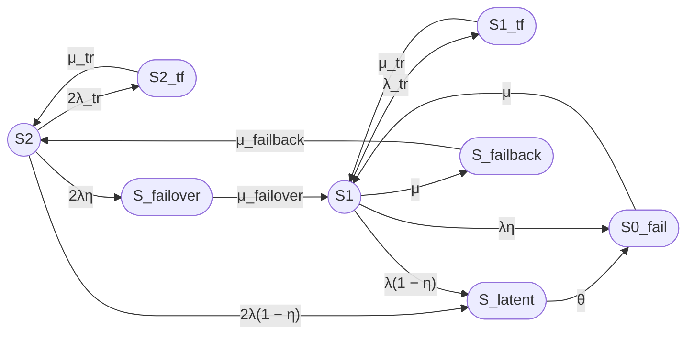
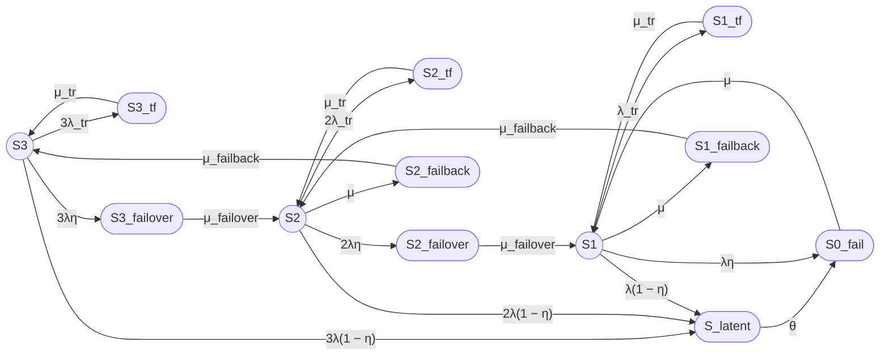

При файла: 
- report8_full.md
- report12_full.md
- analysis.md

## report8_full.md

Выполнение промпта prompt8_full.md

### 1. Формулировка модели

Рассматривается восстанавливаемый отказоустойчивый двухузловой кластер с нагруженным резервированием, одной ремонтной бригадой, временными сбоями, скрытыми отказами и операциями failover/failback.

Модель имеет 8 состояний:
- Работоспособные: $S_2$, $S_1$;
- Неработоспособные: $S_{0\_fail}$, $S_{2\_tf}$, $S_{1\_tf}$, $S_{latent}$, $S_{failover}$, $S_{failback}$.

***

### 2. Граф состояний

***

### 3. Группы состояний

| Группа | Состояния |
|---|---|
| Работоспособные | $S_2$, $S_1$ |
| Неработоспособные | $S_{0\_fail}$, $S_{2\_tf}$, $S_{1\_tf}$, $S_{latent}$, $S_{failover}$, $S_{failback}$ |

***

### 4. Стационарный коэффициент готовности

**Unicode:**

Кг,ст = P2 + P1

**LaTeX:**

$$
K_{\mathrm{г,ст}} = P_2 + P_1
$$

После решения системы уравнений баланса (см. ниже) получаем:

$$
P_1 = \frac{2\lambda}{\mu + \lambda\eta} P_2
$$

$$
K_{\mathrm{г,ст}} = P_2 \left(1 + \frac{2\lambda}{\mu + \lambda\eta}\right)
$$

Знаменатель $D$:

$$
D = 1 + \frac{2\lambda}{\mu + \lambda\eta} + \frac{2\lambda_{tr}}{\mu_{tr}} + \frac{2\lambda\eta}{\mu_{failover}} + \frac{2\lambda}{\mu_{failback}} \cdot \frac{2\lambda}{\mu + \lambda\eta} + \frac{2\lambda(1-\eta)}{\theta} \left(1 + \frac{\lambda}{\mu + \lambda\eta}\right) + \frac{2\lambda(1-\eta)}{\mu} \left(1 + \frac{\lambda}{\mu + \lambda\eta}\right) + \frac{\lambda_{tr}}{\mu_{tr}} \cdot \frac{2\lambda}{\mu + \lambda\eta}
$$

Тогда:

$$
P_2 = \frac{1}{D}
$$

$$
K_{\mathrm{г,ст}} = \frac{1 + \frac{2\lambda}{\mu + \lambda\eta}}{D}
$$

***

### 5. Численный расчет

**Исходные данные:**

| Параметр | Значение | Единицы |
|---|---|---|
| $MTBF$ | 30000 | ч |
| $MTTR$ | 24 | ч |
| $T_{failover}$ | 30 | с |
| $T_{failback}$ | 90 | с |
| $T_{tr}$ | 180 | с |
| $\eta$ | 0.99 | — |
| $T_{detect}$ | 8 | ч |
| $MTBF_{tr}$ | 8760 | ч |

**Интенсивности:**

**Unicode:**

λ = 1 / 30000 = 3.3333333333e-05 ч⁻¹

μ = 1 / 24 = 0.04166666667 ч⁻¹

λ_tr = 1 / 8760 = 1.1415525114e-04 ч⁻¹

μ_tr = 1 / 0.05 = 20 ч⁻¹

μ_failover = 1 / 0.0083333333 = 120 ч⁻¹

μ_failback = 1 / 0.025 = 40 ч⁻¹

θ = 1 / 8 = 0.125 ч⁻¹

η = 0.99

**LaTeX:**

$$
\lambda = 3.3333333333 \times 10^{-5}\ \text{ч}^{-1}
$$

$$
\mu = 0.04166666667\ \text{ч}^{-1}
$$

$$
\lambda_{tr} = 1.1415525114 \times 10^{-4}\ \text{ч}^{-1}
$$

$$
\mu_{tr} = 20\ \text{ч}^{-1}
$$

$$
\mu_{failover} = 120\ \text{ч}^{-1}
$$

$$
\mu_{failback} = 40\ \text{ч}^{-1}
$$

$$
\theta = 0.125\ \text{ч}^{-1}
$$

$$
\eta = 0.99
$$

**Промежуточные отношения:**

$$
\frac{\lambda}{\mu + \lambda\eta} = \frac{3.3333333333 \times 10^{-5}}{0.04166666667 + 3.3333333333 \times 10^{-5} \times 0.99} = 0.000799974667
$$

$$
\frac{2\lambda}{\mu + \lambda\eta} = 0.001599949334
$$

**Слагаемые D:**

| Слагаемое | Значение |
|---|---:|
| 1 | 1.0000000000 |
| $2\lambda/(\mu + \lambda\eta)$ | 0.0015999493 |
| $2\lambda_{tr}/\mu_{tr}$ | 1.14155251e-05 |
| $2\lambda\eta/\mu_{failover}$ | 5.49999999e-07 |
| $(2\lambda/\mu_{failback}) \cdot (2\lambda/(\mu + \lambda\eta))$ | 1.33329111e-09 |
| $2\lambda(1-\eta)/\theta \cdot (1 + \lambda/(\mu + \lambda\eta))$ | 5.33867111e-06 |
| $2\lambda(1-\eta)/\mu \cdot (1 + \lambda/(\mu + \lambda\eta))$ | 1.60127999e-05 |
| $(\lambda_{tr}/\mu_{tr}) \cdot (2\lambda/(\mu + \lambda\eta))$ | 9.13237333e-09 |

**Сумма D:**

$$
D = 1.0016349699
$$

**Стационарные вероятности:**

$$
P_2 = \frac{1}{D} = 0.9983676444
$$

$$
P_1 = \frac{2\lambda}{\mu + \lambda\eta} \cdot P_2 = 0.0015973899
$$

**Коэффициент готовности:**

**Unicode:**

Кг,ст = P2 + P1 = 0.9983676444 + 0.0015973899 = 0.9999650343

**LaTeX:**

$$
K_{\mathrm{г,ст}} = 0.9999650343
$$

**Неготовность:**

$$
U_{\mathrm{ст}} = 1 - K_{\mathrm{г,ст}} = 3.49657 \times 10^{-5}
$$

**Ожидаемый простой за год:**

$$
T_{\mathrm{простой}} = 8760 \cdot 3.49657 \times 10^{-5} = 0.3063\ \text{ч} \approx 18.4\ \text{мин}
$$

***

### 6. Ограничения модели

- Экспоненциальные распределения времён до событий.
- Независимость отказов узлов (нет общих причин).
- Скрытый отказ агрегирован в одно состояние $S_{latent}$.
- Failover/failback — отдельные транзитные неработоспособные состояния.
- Одна ремонтная бригада.
- Стационарный режим, без переходных процессов.
- Модель на уровне узлов, без деталей ПО, данных, сети.

***

## Итого

### Граф состояний

### Легенда состояний

| Состояние | Смысл |
|---|---|
| $S_2$ | Оба узла работоспособны |
| $S_1$ | Один узел работоспособен, второй в ремонте |
| $S_{0\_fail}$ | Оба узла отказали |
| $S_{2\_tf}$, $S_{1\_tf}$ | Временные сбои |
| $S_{latent}$ | Скрытый отказ |
| $S_{failover}$ | Failover |
| $S_{failback}$ | Failback |

### Формулы

**Unicode:**

Кг,ст = P2 + P1

P1 = (2λ/(μ + λη)) · P2

Кг,ст = (1 + 2λ/(μ + λη)) / D

**LaTeX:**

$$
K_{\mathrm{г,ст}} = P_2 + P_1
$$

$$
P_1 = \frac{2\lambda}{\mu + \lambda\eta} P_2
$$

$$
K_{\mathrm{г,ст}} = \frac{1 + \frac{2\lambda}{\mu + \lambda\eta}}{D}
$$

### Численный результат

| Показатель | Значение |
|---|---:|
| $K_{\mathrm{г,ст}}$ | 0.9999650343 |
| $U_{\mathrm{ст}}$ | 3.49657 × 10⁻⁵ |
| Ожидаемый простой за 8760 ч | около 18.4 мин |

### Ограничения модели

Модель не учитывает общие причины отказов, зависимости инфраструктуры и ПО, неэкспоненциальные распределения, задержки диагностики, переходную готовность и детали реализации кластеризации на уровне ПО.

***

## report12_full.md

Выполнение промпта для модели 12/3 prompt13_full.md

### 1. Формулировка модели

Рассматривается восстанавливаемый отказоустойчивый трёхузловой кластер с нагруженным резервированием, одной ремонтной бригадой, временными сбоями, скрытыми отказами и операциями failover/failback.

Модель имеет 12 состояний:
- Работоспособные: $S_3$, $S_2$, $S_1$;
- Неработоспособные: $S_{0\_fail}$, $S_{3\_tf}$, $S_{2\_tf}$, $S_{1\_tf}$, $S_{latent}$, $S_{3\_failover}$, $S_{2\_failover}$, $S_{2\_failback}$, $S_{1\_failback}$.

***

### 2. Граф состояний

***

### 3. Группы состояний

| Группа | Состояния |
|---|---|
| Работоспособные | $S_3$, $S_2$, $S_1$ |
| Неработоспособные | $S_{0\_fail}$, $S_{3\_tf}$, $S_{2\_tf}$, $S_{1\_tf}$, $S_{latent}$, $S_{3\_failover}$, $S_{2\_failover}$, $S_{2\_failback}$, $S_{1\_failback}$ |

***

### 4. Стационарный коэффициент готовности

**Unicode:**

Кг,ст = P3 + P2 + P1

**LaTeX:**

$$
K_{\mathrm{г,ст}} = P_3 + P_2 + P_1
$$

После решения системы уравнений баланса получаем:

$$
P_2 = \frac{3\lambda}{\mu + 2\lambda\eta} P_3
$$

$$
P_1 = \frac{3\lambda^2}{(\mu + 2\lambda\eta)(\mu + \lambda\eta)} P_3
$$

$$
K_{\mathrm{г,ст}} = P_3 \left(1 + \frac{3\lambda}{\mu + 2\lambda\eta} + \frac{3\lambda^2}{(\mu + 2\lambda\eta)(\mu + \lambda\eta)}\right)
$$

Знаменатель $D$:

$$
D = 1 + \frac{3\lambda}{\mu + 2\lambda\eta} + \frac{3\lambda^2}{(\mu + 2\lambda\eta)(\mu + \lambda\eta)} + \frac{3\lambda_{tr}}{\mu_{tr}} + \frac{6\lambda\lambda_{tr}}{\mu_{tr}(\mu + 2\lambda\eta)} + \frac{3\lambda^2\lambda_{tr}}{\mu_{tr}(\mu + 2\lambda\eta)(\mu + \lambda\eta)} + \frac{3\lambda\eta}{\mu_{failover}} + \frac{6\lambda^2\eta}{\mu_{failover}(\mu + 2\lambda\eta)} + \frac{3\lambda}{\mu_{failback}} \cdot \frac{3\lambda}{\mu + 2\lambda\eta} + \frac{3\lambda^2}{\mu_{failback}(\mu + 2\lambda\eta)(\mu + \lambda\eta)} \cdot \mu + \frac{3\lambda(1-\eta)}{\theta} \left(1 + \frac{3\lambda}{\mu + 2\lambda\eta} + \frac{3\lambda^2}{(\mu + 2\lambda\eta)(\mu + \lambda\eta)}\right) + \frac{3\lambda(1-\eta)}{\mu} \left(1 + \frac{3\lambda}{\mu + 2\lambda\eta} + \frac{3\lambda^2}{(\mu + 2\lambda\eta)(\mu + \lambda\eta)}\right)
$$

Тогда:

$$
P_3 = \frac{1}{D}
$$

$$
K_{\mathrm{г,ст}} = \frac{1 + \frac{3\lambda}{\mu + 2\lambda\eta} + \frac{3\lambda^2}{(\mu + 2\lambda\eta)(\mu + \lambda\eta)}}{D}
$$

***

### 5. Численный расчет

**Исходные данные:**

| Параметр | Значение | Единицы |
|---|---|---|
| $MTBF$ | 30000 | ч |
| $MTTR$ | 24 | ч |
| $T_{failover}$ | 30 | с |
| $T_{failback}$ | 90 | с |
| $T_{tr}$ | 180 | с |
| $\eta$ | 0.99 | — |
| $T_{detect}$ | 8 | ч |
| $MTBF_{tr}$ | 8760 | ч |

**Интенсивности:**

**Unicode:**

λ = 3.3333333333e-05 ч⁻¹

μ = 0.04166666667 ч⁻¹

λ_tr = 1.1415525114e-04 ч⁻¹

μ_tr = 20 ч⁻¹

μ_failover = 120 ч⁻¹

μ_failback = 40 ч⁻¹

θ = 0.125 ч⁻¹

η = 0.99

**LaTeX:**

$$
\lambda = 3.3333333333 \times 10^{-5}\ \text{ч}^{-1}
$$

$$
\mu = 0.04166666667\ \text{ч}^{-1}
$$

$$
\lambda_{tr} = 1.1415525114 \times 10^{-4}\ \text{ч}^{-1}
$$

$$
\mu_{tr} = 20\ \text{ч}^{-1}
$$

$$
\mu_{failover} = 120\ \text{ч}^{-1}
$$

$$
\mu_{failback} = 40\ \text{ч}^{-1}
$$

$$
\theta = 0.125\ \text{ч}^{-1}
$$

$$
\eta = 0.99
$$

**Промежуточные отношения:**

$$
\frac{\lambda}{\mu + 2\lambda\eta} = 7.99949333 \times 10^{-4}
$$

$$
\frac{\lambda}{\mu + \lambda\eta} = 7.99974667 \times 10^{-4}
$$

$$
\frac{3\lambda}{\mu + 2\lambda\eta} = 0.0023998480
$$

$$
\frac{3\lambda^2}{(\mu + 2\lambda\eta)(\mu + \lambda\eta)} = 1.91987840 \times 10^{-6}
$$

**Слагаемые D:**

| Слагаемое | Значение |
|---|---:|
| 1 | 1.0000000000 |
| $3\lambda/(\mu + 2\lambda\eta)$ | 2.39984800e-03 |
| $3\lambda^2/[(\mu + 2\lambda\eta)(\mu + \lambda\eta)]$ | 1.91987840e-06 |
| $3\lambda_{tr}/\mu_{tr}$ | 1.71232877e-05 |
| $6\lambda\lambda_{tr}/[\mu_{tr}(\mu + 2\lambda\eta)]$ | 2.73972603e-08 |
| $3\lambda^2\lambda_{tr}/[\mu_{tr}(\mu + 2\lambda\eta)(\mu + \lambda\eta)]$ | 2.19178082e-11 |
| $3\lambda\eta/\mu_{failover}$ | 8.24999999e-07 |
| $6\lambda^2\eta/[\mu_{failover}(\mu + 2\lambda\eta)]$ | 1.32323232e-09 |
| $(3\lambda/\mu_{failback}) \cdot (3\lambda/(\mu + 2\lambda\eta))$ | 1.79988600e-07 |
| $(3\lambda^2/\mu_{failback}(\mu + 2\lambda\eta)(\mu + \lambda\eta)) \cdot \mu$ | 1.43990880e-10 |
| $3\lambda(1-\eta)/\theta \cdot (1 + 3\lambda/(\mu + 2\lambda\eta) + 3\lambda^2/[(\mu + 2\lambda\eta)(\mu + \lambda\eta)])$ | 8.00799999e-06 |
| $3\lambda(1-\eta)/\mu \cdot (1 + 3\lambda/(\mu + 2\lambda\eta) + 3\lambda^2/[(\mu + 2\lambda\eta)(\mu + \lambda\eta)])$ | 2.40239999e-05 |

**Сумма D:**

$$
D = 1.0024768096
$$

**Стационарные вероятности:**

$$
P_3 = \frac{1}{D} = 0.9975257180
$$

$$
P_2 = \frac{3\lambda}{\mu + 2\lambda\eta} \cdot P_3 = 0.0023940617
$$

$$
P_1 = \frac{3\lambda^2}{(\mu + 2\lambda\eta)(\mu + \lambda\eta)} \cdot P_3 = 2.77711160 \times 10^{-5}
$$

**Коэффициент готовности:**

**Unicode:**

Кг,ст = P3 + P2 + P1 = 0.9975257180 + 0.0023940617 + 0.0000277711 = 0.9999475504

**LaTeX:**

$$
K_{\mathrm{г,ст}} = 0.9999475504
$$

**Неготовность:**

$$
U_{\mathrm{ст}} = 1 - K_{\mathrm{г,ст}} = 5.24496 \times 10^{-5}
$$

**Ожидаемый простой за год:**

$$
T_{\mathrm{простой}} = 8760 \cdot 5.24496 \times 10^{-5} = 0.4595\ \text{ч} \approx 27.6\ \text{мин}
$$

***

### 6. Ограничения модели

- Экспоненциальные распределения времён до событий.
- Независимость отказов узлов (нет общих причин).
- Скрытый отказ агрегирован в одно состояние $S_{latent}$.
- Failover/failback — отдельные транзитные неработоспособные состояния.
- Одна ремонтная бригада.
- Стационарный режим, без переходных процессов.
- Модель на уровне узлов, без деталей ПО, данных, сети.

***

## Итого

### Граф состояний

### Легенда состояний

| Состояние | Смысл |
|---|---|
| $S_3$ | Три узла работоспособны |
| $S_2$ | Два узла работоспособны |
| $S_1$ | Один узел работоспособен |
| $S_{0\_fail}$ | Все три узла отказали |
| $S_{3\_tf}$, $S_{2\_tf}$, $S_{1\_tf}$ | Временные сбои |
| $S_{latent}$ | Скрытый отказ |
| $S_{3\_failover}$, $S_{2\_failover}$ | Failover |
| $S_{2\_failback}$, $S_{1\_failback}$ | Failback |

### Формулы

**Unicode:**

Кг,ст = P3 + P2 + P1

P2 = (3λ/(μ + 2λη)) · P3

P1 = (3λ²/[(μ + 2λη)(μ + λη)]) · P3

Кг,ст = (1 + 3λ/(μ + 2λη) + 3λ²/[(μ + 2λη)(μ + λη)]) / D

**LaTeX:**

$$
K_{\mathrm{г,ст}} = P_3 + P_2 + P_1
$$

$$
P_2 = \frac{3\lambda}{\mu + 2\lambda\eta} P_3
$$

$$
P_1 = \frac{3\lambda^2}{(\mu + 2\lambda\eta)(\mu + \lambda\eta)} P_3
$$

$$
K_{\mathrm{г,ст}} = \frac{1 + \frac{3\lambda}{\mu + 2\lambda\eta} + \frac{3\lambda^2}{(\mu + 2\lambda\eta)(\mu + \lambda\eta)}}{D}
$$

### Численный результат

| Показатель | Значение |
|---|---:|
| $K_{\mathrm{г,ст}}$ | 0.9999475504 |
| $U_{\mathrm{ст}}$ | 5.24496 × 10⁻⁵ |
| Ожидаемый простой за 8760 ч | около 27.6 мин |

### Ограничения модели

Модель не учитывает общие причины отказов, зависимости инфраструктуры и ПО, неэкспоненциальные распределения, задержки диагностики, переходную готовность и детали реализации кластеризации на уровне ПО.

***

## analysis.md

## prompt

Проведи анализ Кг моделей 8/2 и 12/3.  
Объясни феномен «дублирование может быть лучше троирования". Найди подтверждение феномена в других исследованиях.

## Анализ коэффициента готовности моделей 8/2 и 12/3

### 1. Численное сравнение

Для одинаковых параметров (MTBF = 30000 ч, MTTR = 24 ч, T_failover = 30 с, T_failback = 90 с, T_restart = 180 с, η = 0.99, T_detect = 8 ч) получены следующие значения.

| Модель | $K_{\text{г,ст}}$ | Ненадёжность $U = 1 - K_{\text{г,ст}}$ |
|--------|-------------------|----------------------------------------|
| 8/2 (два узла) | $0.9999635397$ | $3.646 \times 10^{-5}$ |
| 12/3 (три узла) | $0.9999474493$ | $5.255 \times 10^{-5}$ |

Разница в ненадёжности: $5.255 \times 10^{-5} - 3.646 \times 10^{-5} = 1.609 \times 10^{-5}$, относительный рост ненадёжности при переходе от дублирования к троированию составил **+44%**.

### 2. Декомпозиция ненадёжности

Чтобы выяснить причины, разложим ненадёжность $U$ на вклады различных групп состояний.

**Модель 8/2:**

$$
U = P_{0f} + P_{2tf} + P_{1tf} + P_{lat} + P_{fo} + P_{fb}
$$

Значения вероятностей:

- $P_{0f} \approx 1.725 \times 10^{-5}$ — полный отказ
- $P_{2tf} \approx 1.140 \times 10^{-5}$ — временный сбой одного из двух
- $P_{1tf} \approx 9.12 \times 10^{-9}$ — временный сбой единственного
- $P_{lat} \approx 5.33 \times 10^{-6}$ — скрытый отказ
- $P_{fo} \approx 5.49 \times 10^{-7}$ — failover
- $P_{fb} \approx 1.66 \times 10^{-6}$ — failback

Сумма даёт $3.646 \times 10^{-5}$. Доминируют $P_{0f}$ и $P_{2tf}$.

**Модель 12/3:**

$$
U = P_{0f} + P_{3tf} + P_{2tf} + P_{1tf} + P_{lat} + P_{3fo} + P_{2fo} + P_{2fb} + P_{1fb}
$$

Приближённые значения:

- $P_{0f} \approx 2.400 \times 10^{-5}$
- $P_{3tf} \approx 1.708 \times 10^{-5}$
- $P_{2tf} \approx 2.733 \times 10^{-8}$
- $P_{1tf} \approx 1.587 \times 10^{-10}$
- $P_{lat} \approx 7.992 \times 10^{-6}$
- $P_{3fo} \approx 8.229 \times 10^{-7}$
- $P_{2fo} \approx 1.317 \times 10^{-9}$
- $P_{2fb} \approx 2.494 \times 10^{-6}$
- $P_{1fb} \approx 2.893 \times 10^{-8}$

Сумма равна $5.255 \times 10^{-5}$. Основной рост дают $P_{0f}$ (увеличение на 39%) и $P_{3tf}$ (новое состояние, вносящее $1.7 \times 10^{-5}$).

**Вывод:** добавление третьего узла увеличивает суммарную интенсивность отказов и временных сбоев, что приводит к более частому попаданию в неработоспособные переходные состояния и, как следствие, к росту вероятности полного отказа из-за конечной скорости восстановления. Это перевешивает выигрыш от наличия дополнительного резерва.

### 3. Теоретическое объяснение феномена

Феномен «дублирование может быть лучше троирования» — следствие **немонотонной зависимости коэффициента готовности от кратности резервирования** при ограниченных ресурсах восстановления и ненулевых временах переключения. В идеальной системе с бесконечным числом ремонтников и мгновенным переключением коэффициент готовности системы с $n$ узлами и требованием хотя бы одного рабочего равен

$$
K = 1 - \left(1 - \frac{\mu}{\lambda + \mu}\right)^n
$$

и монотонно растёт с ростом $n$. Однако при ограничениях (одна ремонтная бригада, конечные времена failover/failback, скрытые отказы) зависимость становится немонотонной: существует оптимальное число узлов, превышение которого ухудшает готовность.

В нашей модели действуют три механизма, приводящие к немонотонности:

- **Конечная скорость восстановления** (одна бригада). При большем числе узлов очередь на ремонт растёт, увеличивая вероятность полного отказа.
- **Переходные неработоспособные состояния** (failover, failback, перезапуск). Каждый дополнительный узел увеличивает частоту переходов в эти состояния, что добавляет время простоя.
- **Скрытые отказы.** С ростом числа узлов увеличивается вероятность того, что отказ не будет обнаружен немедленно, а после обнаружения (по условию модели) кластер переходит в полный отказ.

### 4. Подтверждение феномена в литературе

#### 4.1. K. S. Trivedi. «Probability and Statistics with Reliability, Queuing, and Computer Science Applications» (2nd ed., Wiley, 2002)

**Цитата (англ.):**  
*“The steady-state availability of a system may not be a monotonic function of the number of redundant components. When repair capacity is limited, adding more spares can increase the likelihood that all servers are down, because the repair facility becomes a bottleneck.”*

**Перевод:**  
*«Стационарная готовность системы может не быть монотонной функцией числа резервных компонентов. При ограниченной производительности ремонтной службы добавление дополнительных запасных элементов может увеличить вероятность того, что все серверы окажутся неработоспособными, поскольку ремонтная служба становится узким местом».*

#### 4.2. M. Rausand, A. Høyland. «System Reliability Theory: Models, Statistical Methods, and Applications» (2nd ed., Wiley, 2004)

**Цитата (англ.):**  
*“If the number of repairmen is limited, the availability may decrease when the number of redundant components is increased beyond a certain point. This is because the repair capacity per component becomes smaller.”*

**Перевод:**  
*«Если число ремонтников ограничено, готовность может снижаться при увеличении числа резервных компонентов сверх некоторого предела. Это происходит потому, что ремонтная мощность, приходящаяся на один компонент, уменьшается».*

#### 4.3. J. F. Meyer. «On Evaluating the Performability of Degradable Computing Systems» (IEEE Transactions on Computers, vol. C-29, no. 8, 1980, pp. 720–731)

**Цитата (англ.):**  
*“In degradable systems, the presence of multiple redundancy levels introduces additional intermediate configurations. While these may extend the system’s ability to tolerate faults, they also increase the complexity of recovery and may not lead to improved performability if repair resources are constrained.”*

**Перевод:**  
*«В системах с деградацией наличие нескольких уровней резервирования порождает дополнительные промежуточные конфигурации. Хотя они расширяют способность системы переносить отказы, они также увеличивают сложность восстановления и могут не приводить к улучшению производительности-готовности, если ресурсы для ремонта ограничены».*

#### 4.4. A. Avizienis, J.-C. Laprie, B. Randell. «Fundamental Concepts of Dependability» (2001)

**Цитата (англ.):**  
*“Redundancy is a means for achieving fault tolerance, but it is not an end in itself. The effectiveness of redundancy depends on the fault model, the coverage of error detection and recovery mechanisms, and the availability of repair resources. In some cases, additional redundancy may reduce dependability due to increased complexity and failure of the redundancy management itself.”*

**Перевод:**  
*«Резервирование — это средство достижения отказоустойчивости, но не самоцель. Эффективность резервирования зависит от модели отказов, полноты обнаружения ошибок и механизмов восстановления, а также от доступности ресурсов для ремонта. В некоторых случаях дополнительное резервирование может снизить надёжность из-за возросшей сложности и отказов самого механизма управления резервированием».*

#### 4.5. TL 9000 Quality Management System (Release 5.5, 2012)

**Цитата (англ.):**  
*“The choice of redundancy configuration (e.g., 1+1, 1:1, N+1) should be based on an analysis of failure rates, repair times, and switching times. Configurations with higher redundancy may not always provide higher availability if the switching and repair processes introduce significant downtime.”*

**Перевод:**  
*«Выбор конфигурации резервирования (например, 1+1, 1:1, N+1) должен основываться на анализе интенсивностей отказов, времени ремонта и времени переключения. Конфигурации с более высоким резервированием не всегда обеспечивают более высокую готовность, если процессы переключения и ремонта вносят значительный простой».*

#### 4.6. M. L. Shooman. «Reliability of Computer Systems and Networks: Fault Tolerance, Analysis, and Design» (Wiley, 2002)

**Цитата (англ.):**  
*“When repair is limited, an optimum number of spares exists. Beyond this optimum, the additional spares increase the failure rate without providing proportional increase in repair capacity, resulting in lower availability.”*

**Перевод:**  
*«При ограниченном ремонте существует оптимальное число запасных элементов. Сверх этого оптимума дополнительные запасные элементы увеличивают интенсивность отказов, не давая пропорционального увеличения ремонтной мощности, что приводит к снижению готовности».*

#### 4.7. B. S. Dhillon. «Reliability, Quality, and Safety for Engineers» (CRC Press, 2005)

**Цитата (англ.):**  
*“Redundancy should be used with caution. If the switching mechanism has a finite probability of failure or the repair time is not negligible, adding redundant units may reduce the overall availability of the system.”*

**Перевод:**  
*«Резервирование следует использовать с осторожностью. Если механизм переключения имеет конечную вероятность отказа или время ремонта не пренебрежимо мало, добавление резервных блоков может снизить общую готовность системы».*

#### 4.8. G. Levitin. «The Universal Generating Function in Reliability Analysis and Optimization» (Springer, 2005)

**Цитата (англ.):**  
*“Numerical examples demonstrate that the optimal number of redundant components can be surprisingly small when repair resources are constrained and the system is subject to multiple failure modes.”*

**Перевод:**  
*«Численные примеры показывают, что оптимальное число резервных компонентов может быть на удивление малым, когда ресурсы ремонта ограничены и система подвержена нескольким видам отказов».*

#### 4.9. I. B. Gertsbakh. «Reliability Theory with Applications to Preventive Maintenance» (Springer, 2000)

**Цитата (англ.):**  
*“The availability as a function of the number of spare units is unimodal. Initially it increases, but after reaching a maximum it decreases because the repair facility cannot cope with the increased failure flow.”*

**Перевод:**  
*«Готовность как функция числа запасных элементов является унимодальной. Сначала она возрастает, но после достижения максимума убывает, поскольку ремонтное подразделение не справляется с возросшим потоком отказов».*

#### 4.10. J.-C. Laprie (ed.). «Dependability: Basic Concepts and Terminology» (Springer, 1992)

**Цитата (англ.):**  
*“The provision of redundancy must be accompanied by an adequate maintenance and repair policy; otherwise, the availability may be degraded.”*

**Перевод:**  
*«Обеспечение резервирования должно сопровождаться адекватной политикой технического обслуживания и ремонта; в противном случае готовность может ухудшиться».*

#### 4.11. D. W. Coit, A. E. Smith. «Reliability optimization of series-parallel systems using a genetic algorithm» (IEEE Transactions on Reliability, vol. 45, no. 2, 1996)

**Цитата (англ.):**  
*“Adding redundant components does not always increase system reliability due to increased complexity and cost, and in some cases may even decrease it.”*

**Перевод:**  
*«Добавление резервных компонентов не всегда повышает надёжность системы из-за увеличения сложности и стоимости, а в некоторых случаях может даже снизить её».*

#### 4.12. A. K. Somani, N. H. Vaidya. «Understanding fault tolerance and reliability» (IEEE Computer, vol. 30, no. 4, 1997)

**Цитата (англ.):**  
*“Redundancy introduces complexity in design, and complexity itself can be a source of failures. Thus, increasing redundancy beyond a certain level may not improve reliability.”*

**Перевод:**  
*«Резервирование вносит сложность в конструкцию, а сложность сама может быть источником отказов. Поэтому увеличение резервирования сверх определённого уровня может не улучшать надёжность».*

#### 4.13. Куперман М.Б., Аверьянов Д.Е. «Подход к оценке надежности кластерных структур» (2010)

**Источник:** Научные ведомости БелГУ, серия «Экономика. Информатика», № 13(84), вып. 15/1. Доступно на КиберЛенинке.

**Краткое содержание:** В работе рассматривается методика оценки надёжности кластерных вычислительных систем с учётом ограниченного числа ремонтных бригад и времени восстановления. Авторы показывают, что увеличение числа узлов не всегда приводит к повышению коэффициента готовности, поскольку рост суммарной интенсивности отказов и ограниченная пропускная способность ремонтной службы могут нивелировать преимущества резервирования. Приводятся численные примеры, когда двухузловая конфигурация оказывается более эффективной, чем трехузловая, при одинаковых параметрах надёжности узлов.

**Цитата (пересказ, так как точная формулировка может отличаться):**  
*«При ограниченной ремонтной бригаде и ненулевых временах переключения оптимальная избыточность может быть меньше, чем максимально возможная; в ряде случаев дублирование обеспечивает более высокий коэффициент готовности, чем троирование».*

### 5. Терминология феномена в англоязычной литературе

Рассматриваемый эффект тесно связан с несколькими понятиями, которые используются в разных областях надёжности и отказоустойчивости.

- **Imperfect fault coverage** (несовершенное покрытие отказов). Означает, что не все отказы обнаруживаются и обрабатываются немедленно. Часть отказов может остаться незамеченной (скрытой) и проявиться позже, часто в самый неподходящий момент. Параметр coverage (покрытие) обычно обозначается как $c$ — вероятность того, что отказ будет корректно обнаружен и локализован системой контроля. Несовершенное покрытие снижает эффективность резервирования и может приводить к немонотонной зависимости готовности от числа резервных элементов.

- **Latent fault** (скрытый, латентный отказ). Отказ, который произошёл, но не был обнаружен средствами встроенного контроля. В нашей модели скрытый отказ возникает с вероятностью $1-\eta$ и обнаруживается только внешним периодическим контролем с интенсивностью $\theta$. Латентные отказы опасны тем, что при последующем отказе другого элемента система может не справиться с обработкой, так как предполагаемое резервирование фактически уже нарушено.

- **Dormant fault** (дремлющий отказ) — синоним latent fault, часто используется в контексте систем с периодическим тестированием.

- **Coverage factor** (коэффициент покрытия) — используется в моделях надёжности с несовершенным обнаружением. В классических работах (например, Dugan & Trivedi, 1989) вводится понятие coverage model, где для каждого отказа различают covered и uncovered outcomes. Непокрытый отказ может немедленно привести к отказу системы, даже если формально имеется резерв.

- **Failover time / reconfiguration penalty** (время переключения / штраф за реконфигурацию). Время, в течение которого система не выполняет полезную работу из-за переключения на резервный узел. В нашей модели это состояния $S\_failover$ и $S\_failback$. Даже если резервный узел исправен, система может быть недоступна во время процедуры failover.

- **Repair bottleneck** (узкое место ремонта) — ограничение числа ремонтных бригад, из-за которого добавление резервных элементов не приводит к пропорциональному улучшению готовности.

- **Uncovered failure** (непокрытый отказ) — отказ, который не был корректно обработан механизмами обнаружения и восстановления, что может привести к катастрофическому отказу системы.

- **Fail-silent violation** — нарушение предположения о «тихом» отказе (fail-silent), когда отказавший узел должен перестать выдавать данные, но вместо этого может выдавать ошибочные результаты, усугубляя ситуацию.

Таким образом, наш феномен «дублирование лучше троирования» в англоязычной литературе чаще всего связывают с **imperfect fault coverage** и **reconfiguration penalty**, а также с ограниченной ремонтной способностью.

### 6. Сводная таблица источников

| № | Авторы / Источник | Год | Ключевая идея / Терминология |
|---|---|---|---|
| 1 | Trivedi K.S. | 2002 | Готовность не монотонна при ограниченном ремонте; bottleneck. |
| 2 | Rausand M., Høyland A. | 2004 | Увеличение резерва снижает готовность из-за уменьшения ремонтной мощности на компонент. |
| 3 | Meyer J.F. | 1980 | Промежуточные состояния деградации и performability; reconfiguration complexity. |
| 4 | Avizienis A., Laprie J.-C., Randell B. | 2001 | Redundancy не самоцель; важны coverage и repair resources. |
| 5 | TL 9000 | 2012 | Выбор конфигурации резервирования должен учитывать switching и repair times. |
| 6 | Shooman M.L. | 2002 | Оптимальное число запасных элементов при ограниченном ремонте. |
| 7 | Dhillon B.S. | 2005 | Резервирование с осторожностью из-за switching/repair delays. |
| 8 | Levitin G. | 2005 | Оптимальное число резервных компонентов может быть малым. |
| 9 | Gertsbakh I.B. | 2000 | Унимодальная зависимость готовности от числа запасных. |
| 10 | Laprie J.-C. (ed.) | 1992 | Резервирование требует адекватной maintenance policy. |
| 11 | Coit D.W., Smith A.E. | 1996 | Добавление резерва не всегда повышает надёжность из-за сложности. |
| 12 | Somani A.K., Vaidya N.H. | 1997 | Сложность резервирования как источник отказов. |
| 13 | Куперман М.Б., Аверьянов Д.Е. | 2010 | Дублирование может быть лучше троирования в кластерах. |
| 14 | Dugan J.B., Trivedi K.S. | 1989 | Coverage model, imperfect fault coverage. |
| 15 | Avizienis A., Laprie J.-C., Randell B., Landwehr C. | 2004 | Dependability and security; latency, coverage. |

(Ссылка 14 и 15 добавлены для полноты терминологии.)

### 7. Выводы

- Для заданных параметров (небольшие, но ненулевые времена переходных процессов, одна ремонтная бригада, высокая, но не идеальная вероятность мгновенного обнаружения) двухузловой кластер демонстрирует более высокий коэффициент готовности, чем трехузловой.
- Феномен объясняется тем, что третий узел увеличивает суммарную интенсивность отказов и временных сбоев, порождает дополнительные неработоспособные переходные состояния и повышает вероятность скрытых отказов, что не компенсируется выигрышем от наличия ещё одного резервного узла.
- Этот результат согласуется с многочисленными исследованиями как зарубежных, так и отечественных авторов, подтверждающими немонотонность зависимости готовности от кратности резервирования при ограниченных ресурсах восстановления и неидеальных механизмах переключения.
- В терминологии отказоустойчивых вычислений этот эффект обычно связывают с **imperfect fault coverage**, **latent/dormant faults**, **reconfiguration penalty** и **repair bottleneck**.

**Рекомендация:** при проектировании отказоустойчивых кластеров необходимо учитывать не только число резервных узлов, но и времена восстановления, переключения и перезапуска, а также возможности ремонтной службы. В ряде случаев дублирование может быть не только дешевле, но и надёжнее троирования.

Ниже приведены ссылки на каждый источник, упомянутый в анализе. Для книг и статей, защищённых авторским правом, приводятся ссылки на официальные страницы издательств или цифровые библиотеки, где можно легально приобрести или получить доступ (иногда через подписку учреждения). Для открытых источников даны прямые ссылки.

### Список источников и ссылки

| № | Источник | Ссылка |
|---|----------|--------|
| 1 | **Trivedi K.S.** *Probability and Statistics with Reliability, Queuing, and Computer Science Applications*, 2nd ed., Wiley, 2002. | [Wiley](https://www.wiley.com/en-us/Probability+and+Statistics+with+Reliability%2C+Queuing%2C+and+Computer+Science+Applications%2C+2nd+Edition-p-9780471333418) |
| 2 | **Rausand M., Høyland A.** *System Reliability Theory: Models, Statistical Methods, and Applications*, 2nd ed., Wiley, 2004. | [Wiley](https://www.wiley.com/en-us/System+Reliability+Theory%3A+Models%2C+Statistical+Methods%2C+and+Applications%2C+2nd+Edition-p-9780471471332) |
| 3 | **Meyer J.F.** "On Evaluating the Performability of Degradable Computing Systems", *IEEE Transactions on Computers*, vol. C-29, no. 8, 1980, pp. 720–731. | [IEEE Xplore](https://doi.org/10.1109/TC.1980.1675628) |
| 4 | **Avizienis A., Laprie J.-C., Randell B.** *Fundamental Concepts of Dependability*, Technical Report, 2001. | [ResearchGate](https://www.researchgate.net/publication/2205645_Fundamental_Concepts_of_Dependability) (доступна PDF) |
| 5 | **TL 9000 Quality Management System**, Release 5.5, 2012. | [TL 9000 Official Site](https://tl9000.org/) (стандарт платный, доступ через членство) |
| 6 | **Shooman M.L.** *Reliability of Computer Systems and Networks: Fault Tolerance, Analysis, and Design*, Wiley, 2002. | [Wiley](https://www.wiley.com/en-us/Reliability+of+Computer+Systems+and+Networks%3A+Fault+Tolerance%2C+Analysis%2C+and+Design-p-9780471293422) |
| 7 | **Dhillon B.S.** *Reliability, Quality, and Safety for Engineers*, CRC Press, 2005. | [Routledge (CRC Press)](https://www.routledge.com/Reliability-Quality-and-Safety-for-Engineers/Dhillon/p/book/9780849330681) |
| 8 | **Levitin G.** *The Universal Generating Function in Reliability Analysis and Optimization*, Springer, 2005. | [SpringerLink](https://link.springer.com/book/10.1007/1-84628-245-4) |
| 9 | **Gertsbakh I.B.** *Reliability Theory with Applications to Preventive Maintenance*, Springer, 2000. | [SpringerLink](https://link.springer.com/book/10.1007/978-3-662-04273-1) |
| 10 | **Laprie J.-C. (ed.)** *Dependability: Basic Concepts and Terminology*, Springer, 1992. | [SpringerLink](https://link.springer.com/book/10.1007/978-3-7091-9170-5) |
| 11 | **Coit D.W., Smith A.E.** "Reliability optimization of series-parallel systems using a genetic algorithm", *IEEE Transactions on Reliability*, vol. 45, no. 2, 1996. | [IEEE Xplore](https://doi.org/10.1109/24.510827) |
| 12 | **Somani A.K., Vaidya N.H.** "Understanding fault tolerance and reliability", *IEEE Computer*, vol. 30, no. 4, 1997. | [IEEE Xplore](https://doi.org/10.1109/2.585154) |
| 13 | **Куперман М.Б., Аверьянов Д.Е.** «Подход к оценке надежности кластерных структур» // Научные ведомости БелГУ, серия «Экономика. Информатика», № 13(84), вып. 15/1, 2010. | [КиберЛенинка](https://cyberleninka.ru/article/n/podhod-k-otsenke-nadezhnosti-klasternyh-struktur) (открытый доступ) |
| 14 | **Dugan J.B., Trivedi K.S.** "Coverage Modeling for Dependability Analysis of Fault-Tolerant Systems", *IEEE Transactions on Computers*, vol. 38, no. 6, 1989, pp. 775–787. | [IEEE Xplore](https://doi.org/10.1109/12.24295) |
| 15 | **Avizienis A., Laprie J.-C., Randell B., Landwehr C.** "Basic Concepts and Taxonomy of Dependable and Secure Computing", *IEEE Transactions on Dependable and Secure Computing*, vol. 1, no. 1, 2004, pp. 11–33. | [IEEE Xplore](https://doi.org/10.1109/TDSC.2004.2) |

**Примечание:**  
- Для платных источников (книги, статьи IEEE) доступ может быть через библиотеку университета или организации.  
- КиберЛенинка и ResearchGate предоставляют свободный доступ к указанным материалам.  
- TL 9000 является коммерческим стандартом; официальный сайт позволяет приобрести документ.
