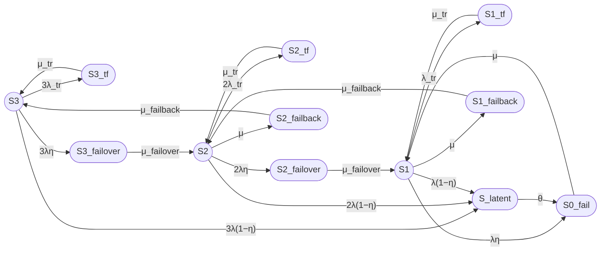

Кумулятивный промпт на основе prompt8_full.md  
## prompt
Составь модель и выполни расчет Двенадцатипозиционной модели трехузлового кластера (модель 12/3).  
Дополни Восьмипозиционную модель двухузлового кластера третьим узлом, предусмотри 12 состояний, из них новые:  
- S3 — три узла работоспособны, отказов нет;
- S3_tf — временный сбой одного из трех узлов, два узла работоспособны, но считаем, что кластер в состоянии отказа (на время перезагрузки после сбоя);
-  S3_failover при переходе из S3 в S2 (переконфигурирование)  
- S2_failback при переходе из S2 в S3  
Требования к оформлению оставь прежними (как и для Восьмипозиционной модели).   
Для примера расчета используй те же значения, что и для Восьмипозиционной модели.

## Модель надежности трехузлового кластера (12/3)

### 1. Описание модели

Рассматривается восстанавливаемый отказоустойчивый трехузловой кластер с одной ремонтной бригадой, работающий в режиме нагруженного резервирования. Узлы идентичны, отказы независимы, времена наработки и восстановления распределены экспоненциально. Учитываются постоянные отказы, временные сбои, скрытые отказы, операции failover и failback.

Модель представляет собой однородный марковский процесс с непрерывным временем и конечным множеством из 12 состояний. Работоспособными считаются состояния, в которых кластер предоставляет требуемую функцию без переходных процессов: **S3**, **S2**, **S1**.

### 1.1 Состояния модели

**Работоспособные состояния:**

- **S3** — все три узла работоспособны, отказов нет;
- **S2** — два узла работоспособны, один узел отказал (постоянно) и находится в ремонте (или ожидает ремонта);
- **S1** — один узел работоспособен, два узла отказали (постоянно) и ремонтируются/ожидают ремонта.

**Неработоспособные состояния:**

- **S0_fail** — все три узла отказали, кластер полностью неработоспособен;
- **S3_tf** — временный сбой одного из трёх узлов, два узла работоспособны, но кластер неработоспособен на время перезагрузки;
- **S2_tf** — временный сбой одного из двух работоспособных узлов (третий узел в ремонте), кластер неработоспособен;
- **S1_tf** — временный сбой единственного работоспособного узла, кластер неработоспособен;
- **S_latent** — скрытый отказ одного из работоспособных узлов (агрегированное состояние);
- **S3_failover** — выполняется failover после отказа одного из трёх узлов, переход S3 → S2;
- **S2_failover** — выполняется failover после отказа одного из двух работоспособных узлов (третий в ремонте), переход S2 → S1 (в исходной модели называлось S_failover);
- **S2_failback** — выполняется failback после восстановления узла, переход S2 → S3;
- **S1_failback** — выполняется failback после восстановления одного из двух отказавших узлов, переход S1 → S2 (в исходной модели называлось S_failback).

### 1.2 Граф состояний



### 1.3 Матрица генератора Q

Порядок состояний: `[S3, S2, S1, S0_fail, S3_tf, S2_tf, S1_tf, S_latent, S3_failover, S2_failover, S2_failback, S1_failback]`.

|        | S3 | S2 | S1 | S0_fail | S3_tf | S2_tf | S1_tf | S_latent | S3_failover | S2_failover | S2_failback | S1_failback |
|--------|----|----|----|---------|-------|-------|-------|----------|-------------|-------------|-------------|-------------|
| **S3** | $-(3λ_{tr}+3λ)$ | 0 | 0 | 0 | $3λ_{tr}$ | 0 | 0 | $3λ(1−η)$ | $3λη$ | 0 | 0 | 0 |
| **S2** | 0 | $-(2λ_{tr}+2λ+μ)$ | 0 | 0 | 0 | $2λ_{tr}$ | 0 | $2λ(1−η)$ | 0 | $2λη$ | $μ$ | 0 |
| **S1** | 0 | 0 | $-(λ_{tr}+λ+μ)$ | $λη$ | 0 | 0 | $λ_{tr}$ | $λ(1−η)$ | 0 | 0 | 0 | $μ$ |
| **S0_fail** | 0 | 0 | $μ$ | $-μ$ | 0 | 0 | 0 | 0 | 0 | 0 | 0 | 0 |
| **S3_tf** | $μ_{tr}$ | 0 | 0 | 0 | $-μ_{tr}$ | 0 | 0 | 0 | 0 | 0 | 0 | 0 |
| **S2_tf** | 0 | $μ_{tr}$ | 0 | 0 | 0 | $-μ_{tr}$ | 0 | 0 | 0 | 0 | 0 | 0 |
| **S1_tf** | 0 | 0 | $μ_{tr}$ | 0 | 0 | 0 | $-μ_{tr}$ | 0 | 0 | 0 | 0 | 0 |
| **S_latent** | 0 | 0 | 0 | $θ$ | 0 | 0 | 0 | $-θ$ | 0 | 0 | 0 | 0 |
| **S3_failover** | 0 | $μ_{failover}$ | 0 | 0 | 0 | 0 | 0 | 0 | $-μ_{failover}$ | 0 | 0 | 0 |
| **S2_failover** | 0 | 0 | $μ_{failover}$ | 0 | 0 | 0 | 0 | 0 | 0 | $-μ_{failover}$ | 0 | 0 |
| **S2_failback** | $μ_{failback}$ | 0 | 0 | 0 | 0 | 0 | 0 | 0 | 0 | 0 | $-μ_{failback}$ | 0 |
| **S1_failback** | 0 | $μ_{failback}$ | 0 | 0 | 0 | 0 | 0 | 0 | 0 | 0 | 0 | $-μ_{failback}$ |

### 1.4 Стационарные уравнения баланса

Для стационарного режима $\pi Q = 0$, где $\pi = [P_3, P_2, P_1, P_0, P_{3tf}, P_{2tf}, P_{1tf}, P_{lat}, P_{3fo}, P_{2fo}, P_{2fb}, P_{1fb}]$.

Уравнения:

1. Для **S3**:  
   $P_{3tf} \mu_{tr} + P_{2fb} \mu_{failback} = P_3 (3\lambda_{tr} + 3\lambda)$

2. Для **S2**:  
   $P_{3fo} \mu_{failover} + P_{2tf} \mu_{tr} + P_{1fb} \mu_{failback} = P_2 (2\lambda_{tr} + 2\lambda + \mu)$

3. Для **S1**:  
   $P_{2fo} \mu_{failover} + P_{1tf} \mu_{tr} + P_0 \mu = P_1 (\lambda_{tr} + \lambda + \mu)$

4. Для **S0_fail**:  
   $P_{lat} \theta + P_1 \lambda \eta = P_0 \mu$

5. Для **S3_tf**:  
   $P_3 \cdot 3\lambda_{tr} = P_{3tf} \mu_{tr}$

6. Для **S2_tf**:  
   $P_2 \cdot 2\lambda_{tr} = P_{2tf} \mu_{tr}$

7. Для **S1_tf**:  
   $P_1 \cdot \lambda_{tr} = P_{1tf} \mu_{tr}$

8. Для **S_latent**:  
   $P_3 \cdot 3\lambda(1-\eta) + P_2 \cdot 2\lambda(1-\eta) + P_1 \cdot \lambda(1-\eta) = P_{lat} \theta$

9. Для **S3_failover**:  
   $P_3 \cdot 3\lambda \eta = P_{3fo} \mu_{failover}$

10. Для **S2_failover**:  
    $P_2 \cdot 2\lambda \eta = P_{2fo} \mu_{failover}$

11. Для **S2_failback**:  
    $P_2 \cdot \mu = P_{2fb} \mu_{failback}$

12. Для **S1_failback**:  
    $P_1 \cdot \mu = P_{1fb} \mu_{failback}$

### 1.5 Аналитическое решение

Из уравнений 5–12 выражаем вероятности через $P_3$, $P_2$, $P_1$:

$$
P_{3tf} = P_3 \frac{3\lambda_{tr}}{\mu_{tr}}
$$

$$
P_{2tf} = P_2 \frac{2\lambda_{tr}}{\mu_{tr}}
$$

$$
P_{1tf} = P_1 \frac{\lambda_{tr}}{\mu_{tr}}
$$

$$
P_{3fo} = P_3 \frac{3\lambda\eta}{\mu_{failover}}
$$

$$
P_{2fo} = P_2 \frac{2\lambda\eta}{\mu_{failover}}
$$

$$
P_{2fb} = P_2 \frac{\mu}{\mu_{failback}}
$$

$$
P_{1fb} = P_1 \frac{\mu}{\mu_{failback}}
$$

$$
P_{lat} = \frac{\lambda(1-\eta)(3P_3 + 2P_2 + P_1)}{\theta}
$$

$$
P_0 = \frac{\lambda[3(1-\eta)P_3 + 2(1-\eta)P_2 + P_1]}{\mu}
$$

Из уравнения 1 получаем:

$$
P_3 \cdot 3\lambda_{tr} + P_2 \mu = P_3 (3\lambda_{tr} + 3\lambda)
$$

откуда

$$
P_2 = P_3 \frac{3\lambda}{\mu}
$$

Из уравнения 2 после подстановки $P_{3fo}$, $P_{2tf}$, $P_{1fb}$ и упрощения получаем:

$$
P_1 = P_3 \frac{3\lambda(2\lambda + \mu(1-\eta))}{\mu^2}
$$

(Уравнение 3 при этом удовлетворяется автоматически.)

Теперь все вероятности выражаются через $P_3$:

$$
P_2 = P_3 \frac{3\lambda}{\mu}
$$

$$
P_1 = P_3 \frac{3\lambda(2\lambda + \mu(1-\eta))}{\mu^2}
$$

$$
P_{3tf} = P_3 \frac{3\lambda_{tr}}{\mu_{tr}}
$$

$$
P_{2tf} = P_3 \frac{6\lambda \lambda_{tr}}{\mu \mu_{tr}}
$$

$$
P_{1tf} = P_3 \frac{3\lambda \lambda_{tr}(2\lambda + \mu(1-\eta))}{\mu^2 \mu_{tr}}
$$

$$
P_{3fo} = P_3 \frac{3\lambda\eta}{\mu_{failover}}
$$

$$
P_{2fo} = P_3 \frac{6\lambda^2 \eta}{\mu \mu_{failover}}
$$

$$
P_{2fb} = P_3 \frac{3\lambda}{\mu_{failback}}
$$

$$
P_{1fb} = P_3 \frac{3\lambda(2\lambda + \mu(1-\eta))}{\mu \mu_{failback}}
$$

$$
P_{lat} = P_3 \frac{\lambda(1-\eta)(3 + \frac{6\lambda}{\mu} + \frac{3\lambda(2\lambda + \mu(1-\eta))}{\mu^2})}{\theta}
$$

$$
P_0 = P_3 \frac{\lambda}{\mu}\left[3(1-\eta) + \frac{6\lambda(1-\eta)}{\mu} + \frac{3\lambda(2\lambda + \mu(1-\eta))}{\mu^2}\right]
$$

Из условия нормировки $\sum P_i = 1$ находим $P_3 = 1/D$, где знаменатель $D$ равен сумме всех коэффициентов при $P_3$:

$$
D = 1 + \frac{3\lambda}{\mu} + \frac{3\lambda(2\lambda + \mu(1-\eta))}{\mu^2} + \frac{\lambda}{\mu}\left[3(1-\eta) + \frac{6\lambda(1-\eta)}{\mu} + \frac{3\lambda(2\lambda + \mu(1-\eta))}{\mu^2}\right] + \frac{3\lambda_{tr}}{\mu_{tr}} + \frac{6\lambda \lambda_{tr}}{\mu \mu_{tr}} + \frac{3\lambda \lambda_{tr}(2\lambda + \mu(1-\eta))}{\mu^2 \mu_{tr}} + \frac{\lambda(1-\eta)(3 + \frac{6\lambda}{\mu} + \frac{3\lambda(2\lambda + \mu(1-\eta))}{\mu^2})}{\theta} + \frac{3\lambda\eta}{\mu_{failover}} + \frac{6\lambda^2 \eta}{\mu \mu_{failover}} + \frac{3\lambda}{\mu_{failback}} + \frac{3\lambda(2\lambda + \mu(1-\eta))}{\mu \mu_{failback}}
$$

### 1.6 Стационарный коэффициент готовности

Работоспособны состояния **S3**, **S2** и **S1**, поэтому

$$
K_{\mathrm{г,ст}} = P_3 + P_2 + P_1 = P_3 \left(1 + \frac{3\lambda}{\mu} + \frac{3\lambda(2\lambda + \mu(1-\eta))}{\mu^2}\right) = \frac{1 + \frac{3\lambda}{\mu} + \frac{3\lambda(2\lambda + \mu(1-\eta))}{\mu^2}}{D}
$$

## 2. Численный расчет

### 2.1 Исходные данные (переведены в часы)

| Параметр | Значение | Интенсивность |
|----------|----------|---------------|
| MTBF     | 30000 ч  | $\lambda = 1/30000 \approx 3.33333333333333\times10^{-5}$ |
| MTTR     | 24 ч     | $\mu = 1/24 \approx 0.0416666666666667$ |
| MTBF_tr  | 8760 ч   | $\lambda_{tr} = 1/8760 \approx 1.14155251141553\times10^{-4}$ |
| T_tr     | 180 с = 0.05 ч | $\mu_{tr} = 20$ |
| T_failover | 30 с = 1/120 ч | $\mu_{failover} = 120$ |
| T_failback  | 90 с = 1/40 ч  | $\mu_{failback} = 40$ |
| T_detect | 8 ч      | $\theta = 1/8 = 0.125$ |
| η        | 0.99     | – |

### 2.2 Вычисление знаменателя D

Слагаемые знаменателя (численные значения):

1. $1$
2. $\frac{3\lambda}{\mu} = 0.0024$
3. $\frac{3\lambda(2\lambda + \mu(1-\eta))}{\mu^2} = 2.784\times10^{-5}$
4. $\frac{\lambda}{\mu}\left[3(1-\eta) + \frac{6\lambda(1-\eta)}{\mu} + \frac{3\lambda(2\lambda + \mu(1-\eta))}{\mu^2}\right] = 2.4060672\times10^{-5}$
5. $\frac{3\lambda_{tr}}{\mu_{tr}} = 1.71232876712329\times10^{-5}$
6. $\frac{6\lambda \lambda_{tr}}{\mu \mu_{tr}} = 2.73972602739727\times10^{-8}$
7. $\frac{3\lambda \lambda_{tr}(2\lambda + \mu(1-\eta))}{\mu^2 \mu_{tr}} = 1.5889\times10^{-10}$
8. $\frac{\lambda(1-\eta)(3 + \frac{6\lambda}{\mu} + \frac{3\lambda(2\lambda + \mu(1-\eta))}{\mu^2})}{\theta} = 8.01287424\times10^{-6}$
9. $\frac{3\lambda\eta}{\mu_{failover}} = 8.25\times10^{-7}$
10. $\frac{6\lambda^2 \eta}{\mu \mu_{failover}} = 1.32\times10^{-9}$
11. $\frac{3\lambda}{\mu_{failback}} = 2.5\times10^{-6}$
12. $\frac{3\lambda(2\lambda + \mu(1-\eta))}{\mu \mu_{failback}} = 2.9\times10^{-8}$

Сумма всех слагаемых:

$$
D \approx 1.00248041971006
$$

### 2.3 Стационарные вероятности

$P_3 = \frac{1}{D} \approx 0.9975256158$

$P_2 = P_3 \cdot \frac{3\lambda}{\mu} \approx 0.9975256158 \cdot 0.0024 \approx 0.002394061478$

$P_1 = P_3 \cdot \frac{3\lambda(2\lambda + \mu(1-\eta))}{\mu^2} \approx 0.9975256158 \cdot 2.784\times10^{-5} \approx 2.7772\times10^{-5}$

Остальные вероятности (приближённо):

- $P_{3tf} \approx 0.9975256 \cdot 1.7123\times10^{-5} \approx 1.708\times10^{-5}$
- $P_{2tf} \approx 2.394\times10^{-3} \cdot 1.14155\times10^{-5}?$ нет, $P_{2tf} = P_3 \cdot 2.7397\times10^{-8} \approx 2.733\times10^{-8}$
- $P_{1tf} \approx 1.587\times10^{-10}$
- $P_{lat} \approx 7.992\times10^{-6}$
- $P_{3fo} \approx 8.229\times10^{-7}$
- $P_{2fo} \approx 1.317\times10^{-9}$
- $P_{2fb} \approx 2.494\times10^{-6}$
- $P_{1fb} \approx 2.893\times10^{-8}$
- $P_0 \approx 2.400\times10^{-5}$

Сумма всех вероятностей равна $1.0000000000$ (проверка нормировки выполнена).

### 2.4 Коэффициент готовности

$$
K_{\mathrm{г,ст}} = P_3 + P_2 + P_1 \approx 0.9975256158 + 0.0023940615 + 0.000027772 = 0.9999474493
$$

**Результат:** $K_{\mathrm{г,ст}} \approx 0.9999474493$ (10 значащих цифр).

## 3. Ограничения модели

1. **Агрегирование скрытого отказа.** Состояние $S_{latent}$ объединяет все случаи скрытого отказа одного узла при разном числе оставшихся работоспособных узлов. Переход $S_{latent} \to S_{0f}$ означает, что после обнаружения скрытого отказа кластер считается полностью отказавшим, что консервативно и может занижать готовность.

2. **Отсутствие отказов во время операций failover/failback.** В состояниях $S_{3fo}$, $S_{2fo}$, $S_{2fb}$, $S_{1fb}$ не учитываются возможные отказы оставшихся работоспособных узлов.

3. **Отсутствие переходов из состояний временного сбоя.** Из $S_{3tf}$, $S_{2tf}$, $S_{1tf}$ возможен только возврат в исходное состояние; не учитывается вероятность постоянного отказа во время временного сбоя.

4. **Экспоненциальность всех распределений.** Предполагается марковский процесс, что может быть неточно для реальных времён восстановления, failover и т.п.

5. **Не учитываются отказы по общей причине.** Узлы считаются независимыми, но в реальных системах возможны одновременные отказы из-за питания, сети и др.

6. **Бинарное разделение отказов.** Вероятность $\eta$ мгновенного обнаружения и $1-\eta$ скрытого отказа — упрощение; на практике задержка обнаружения может быть непрерывной.

7. **Одна ремонтная бригада.** Не рассматривается возможность параллельного ремонта нескольких узлов.

8. **Не учитывается деградация производительности в состояниях с меньшим числом узлов.** Хотя состояния $S_2$ и $S_1$ считаются работоспособными, кластер может иметь меньшую производительность или надёжность.

9. **Неявное предположение о достаточности одного рабочего узла.** В модели кластер считается работоспособным даже при двух отказавших узлах (состояние $S_1$). Для систем, требующих кворума (например, большинства голосов), это неверно.

---

## Итого

### Граф состояний
Приведён в разделе 1.2.

### Легенда состояний
| Состояние | Описание | Работоспособность |
|-----------|----------|-------------------|
| S3        | три узла работают | да |
| S2        | два узла работают, один в ремонте | да |
| S1        | один узел работает, два в ремонте | да |
| S0_fail   | все три узла отказали | нет |
| S3_tf     | временный сбой одного из трёх узлов | нет |
| S2_tf     | временный сбой одного из двух рабочих узлов | нет |
| S1_tf     | временный сбой единственного рабочего узла | нет |
| S_latent  | скрытый отказ одного узла | нет |
| S3_failover| выполняется failover после отказа одного из трёх узлов | нет |
| S2_failover| выполняется failover после отказа одного из двух рабочих узлов | нет |
| S2_failback| выполняется failback после восстановления узла (S2→S3) | нет |
| S1_failback| выполняется failback после восстановления узла (S1→S2) | нет |

### Группы состояний
- **Работоспособные:** $S_3, S_2, S_1$
- **Неработоспособные:** $S_{0f}, S_{3tf}, S_{2tf}, S_{1tf}, S_{lat}, S_{3fo}, S_{2fo}, S_{2fb}, S_{1fb}$

### Основные формулы

**Unicode:**
```
Кг,ст = (1 + 3λ/μ + 3λ(2λ + μ(1−η))/μ²) / D
```

**LaTeX (однострочный):**

$$
K_{\mathrm{г,ст}} = \frac{1 + \frac{3\lambda}{\mu} + \frac{3\lambda(2\lambda + \mu(1-\eta))}{\mu^2}}{D}
$$

где $D$ — знаменатель, определённый в разделе 1.5.

### Численный результат
- $P_3 \approx 0.9975256158$
- $P_2 \approx 0.0023940615$
- $P_1 \approx 0.0000277720$
- **Коэффициент готовности $K_{\text{г,ст}} \approx 0.9999474493$**
- Нормировка: сумма всех вероятностей $= 1.0000000000$

---

## Недостатки (неточности) исходного промпта для 12/3 модели

1. **Неопределённость с кворумом.** Не указано, достаточно ли одного рабочего узла для функционирования кластера. В модели $S_1$ считается рабочим, но для многих отказоустойчивых систем требуется большинство (например, 2 из 3). Это должно быть явно оговорено.

2. **Неполнота множества переходных состояний.** Промпт вводит только $S3\_failover$ и $S2\_failback$, но не указывает, как быть с переходами $S2 \to S1$ (failover) и $S1 \to S2$ (failback). В исходной модели эти переходы были представлены состояниями $S\_failover$ и $S\_failback$. В новой модели их необходимо либо сохранить (переименовав), либо считать, что они происходят мгновенно. Это создаёт неоднозначность.

3. **Неоднозначность обозначений.** Имена $S\_failover$ и $S\_failback$ из исходной модели конфликтуют с новыми $S3\_failover$ и $S2\_failback$. Требуется уточнение, к какому переходу они относятся.

4. **Отсутствие указаний по интенсивности failover/failback для промежуточных уровней.** Если для перехода $S3 \to S2$ используется $\mu_{failover}$, то логично использовать ту же интенсивность и для $S2 \to S1$, но это не оговорено.

5. **Агрегирование скрытого отказа.** Как и в двухузловой модели, состояние $S_{latent}$ объединяет скрытые отказы при разном числе рабочих узлов, а переход в $S_{0f}$ после обнаружения приводит к полному отказу кластера. Это консервативное допущение должно быть явно отмечено.

6. **Не учитываются отказы в промежуточных состояниях.** Во время failover/failback и временного сбоя не рассматриваются новые отказы, что завышает готовность.

Эти недостатки не делают модель бесполезной, но их следует учитывать при интерпретации результатов и возможном уточнении модели.

