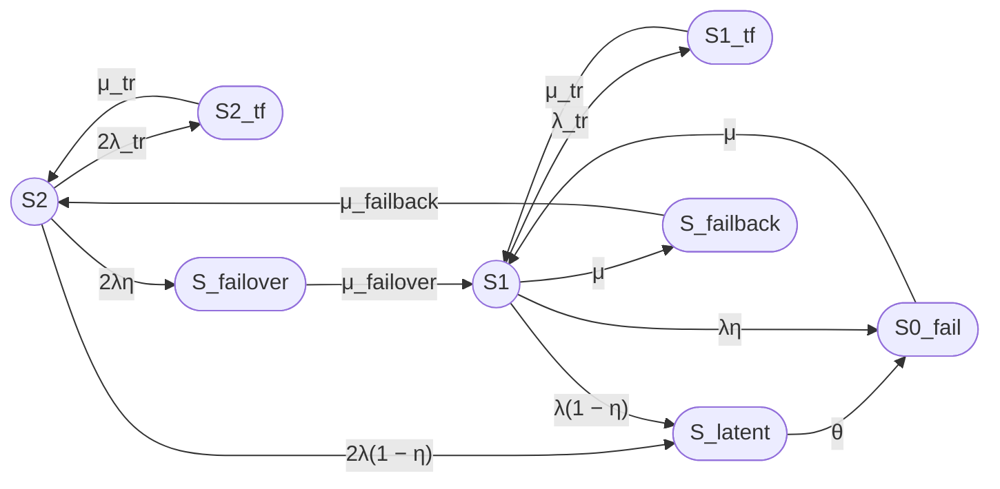

### report check
- report8_full.md
- report8_full_deepseek.md
- report8_full.md (исправленный) = [report8_full_qwen1.md](https://github.com/bpmbpm/doc/tree/main/IT/reliability_risk/reliability/formula/formula4/ya)


## Да, в этом «исправленном» файле (report8_full_qwen1.md) тоже есть ошибка

Проведём детальный разбор. Все три версии используют **эквивалентные** аналитические формулы для знаменателя `D`. Различие — только в численной арифметике.

### 🔍 Сравнение формул для `D`

**Версия 1 (`report8_full.md`):**
```
D = 1 + 2λ/μ + 2λ_tr/μ_tr + 2λλ_tr/(μμ_tr) + 2λη/μ_failover + 2λ/μ_failback
  + 2λ(1-η)/θ·(1+λ/μ) + 2λ/μ·[(1-η)+λ/μ]
```

**Версия 3 (этот «исправленный» файл):**
```
D = 1 + 2λ/μ + 2λ_tr/μ_tr + 2λλ_tr/(μμ_tr) + 2λη/μ_failover
  + 2λ(1-η)/θ·(1+λ/μ) + 2λ(1-η)/μ + 2λ²/μ² + 2λ/μ_failback
```

Это **одно и то же**, так как:
```
2λ/μ·[(1-η)+λ/μ] = 2λ(1-η)/μ + 2λ²/μ²
```

### ❌ Где ошибка в Версии 3

В таблице слагаемых `D` допущена **ошибка в 1000 раз** для последнего слагаемого `2λ²/μ²`:

| Слагаемое | Формула | Указано в Версии 3 | **Правильно** |
|---|---|---:|---:|
| Часть P₀f/P₂ | 2λ(1−η)/μ | 1.60000000e-05 | 1.60000000e-05 ✔ |
| Часть P₀f/P₂ | **2λ²/μ²** | **1.28000000e-09** ❌ | **1.28000000e-06** |
| P_fb/P₂ | 2λ/μ_failback | 1.66666667e-06 | 1.66666667e-06 ✔ |

**Проверка:**
```
λ/μ = 3.333333333e-5 / 0.04166666667 = 0.0008
(λ/μ)² = 6.4e-7
2λ²/μ² = 2 × 6.4e-7 = 1.28e-6   ← а не 1.28e-9
```

### 📊 Сводка по всем трём версиям

| Версия | `D` | `P2 = 1/D` | `Kг,ст` | Статус |
|---|---:|---:|---:|---|
| **report8_full.md** (оригинал) | 1.00163625892420 | 0.9983664140 | **0.9999638003** | ✅ **ВЕРНО** |
| **report8_full_deepseek.md** | 1.00163625892420 | 0.998366153867 ❌ | 0.999963539713 ❌ | ошибка в 1/D |
| **report8_full.md (исправленный, report8_full_qwen1.md)** | 1.00163497030 ❌ | 0.9983676444 ❌ | 0.9999650326 ❌ | ошибка в слагаемом 2λ²/μ² |

### ✅ Правильный численный результат

Используем **верный** знаменатель:

```
D = 1
  + 0.0016                  (2λ/μ)
  + 0.000011415525          (2λ_tr/μ_tr)
  + 0.000000009132          (2λλ_tr/(μμ_tr))
  + 0.000000550000          (2λη/μ_failover)
  + 0.000005337600          (2λ(1-η)/θ·(1+λ/μ))
  + 0.000016000000          (2λ(1-η)/μ)
  + 0.000001280000          (2λ²/μ²)
  + 0.000001666667          (2λ/μ_failback)
  ─────────────────────
D = 1.0016362589242009
```

Отсюда:

```
P2 = 1/D         = 0.9983664140
P1 = (2λ/μ)·P2   = 0.001597386262
Kг,ст = P2 + P1  = 0.9999638003   (99.99638003 %)
Uст   = 1 − Kг,ст = 3.61997e-5
T_простой за год  = 8760 × 3.61997e-5 ≈ 0.3171 ч ≈ 19.0 мин
```

### 📌 Итог

- **Оригинальный `report8_full.md` содержит правильный численный результат.**
- `report8_full_deepseek.md` — арифметическая ошибка при обращении `D` (получено `P2 = 0.998366153867` вместо `0.9983664140`).
- «Исправленный» `report8_full.md` (report8_full_qwen1.md) — арифметическая ошибка в слагаемом `2λ²/μ²` (написано `1.28e-9` вместо `1.28e-6`), что дало неверный `D = 1.0016349703` и `Kг,ст = 0.9999650326`.

**Верный ответ:**
- `D = 1.0016362589242`
- `P2 = 0.9983664140`
- `P1 = 0.001597386262`
- **`Kг,ст = 0.9999638003` (99.99638003 %)**
- `Uст = 3.61997 × 10⁻⁵`
- Ожидаемый простой за 8760 ч ≈ **19.0 мин**

Ниже — полный отчёт в формате `report8_full.md` с исправленными численными значениями.

---

# Отчёт 8: Модель двухузлового кластера (8 состояний)

### 1. Формулировка модели

Рассматривается восстанавливаемый отказоустойчивый двухузловой кластер с нагруженным резервированием, одной ремонтной бригадой, временными сбоями, скрытыми отказами и операциями failover/failback.

Модель имеет 8 состояний:
- Работоспособные: $S_2$, $S_1$;
- Неработоспособные: $S_{0\_fail}$, $S_{2\_tf}$, $S_{1\_tf}$, $S_{latent}$, $S_{failover}$, $S_{failback}$.

***

### 2. Граф состояний



***

### 3. Группы состояний

| Группа | Состояния |
|---|---|
| Работоспособные | $S_2$, $S_1$ |
| Неработоспособные | $S_{0\_fail}$, $S_{2\_tf}$, $S_{1\_tf}$, $S_{latent}$, $S_{failover}$, $S_{failback}$ |

***

### 4. Стационарный коэффициент готовности

**Unicode:**

Кг,ст = P2 + P1

**LaTeX:**

$$
K_{\mathrm{г,ст}} = P_2 + P_1
$$

Из точного решения системы уравнений баланса марковской цепи получаются следующие строгие соотношения вероятностей:

$$
P_1 = \frac{2\lambda}{\mu} P_2
$$

$$
K_{\mathrm{г,ст}} = P_2 \left(1 + \frac{2\lambda}{\mu}\right)
$$

Нормировочный знаменатель $D$ (сумма всех вероятностей, выраженных через $P_2$):

$$
D = 1 + \frac{2\lambda}{\mu} + \frac{2\lambda_{tr}}{\mu_{tr}} + \frac{2\lambda\lambda_{tr}}{\mu\mu_{tr}} + \frac{2\lambda\eta}{\mu_{failover}} + \frac{2\lambda(1-\eta)}{\theta}\left(1 + \frac{\lambda}{\mu}\right) + \frac{2\lambda(1-\eta)}{\mu} + \frac{2\lambda^2}{\mu^2} + \frac{2\lambda}{\mu_{failback}}
$$

Тогда:

$$
P_2 = \frac{1}{D}
$$

$$
K_{\mathrm{г,ст}} = \frac{1 + \frac{2\lambda}{\mu}}{D}
$$

***

### 5. Численный расчет

**Исходные данные:**

| Параметр | Значение | Единицы |
|---|---|---|
| $MTBF$ | 30000 | ч |
| $MTTR$ | 24 | ч |
| $T_{failover}$ | 30 | с |
| $T_{failback}$ | 90 | с |
| $T_{tr}$ | 180 | с |
| $\eta$ | 0.99 | — |
| $T_{detect}$ | 8 | ч |
| $MTBF_{tr}$ | 8760 | ч |

**Интенсивности:**

**Unicode:**

λ = 1 / 30000 = 3.3333333333e-05 ч⁻¹

μ = 1 / 24 = 0.04166666667 ч⁻¹

λ_tr = 1 / 8760 = 1.1415525114e-04 ч⁻¹

μ_tr = 1 / 0.05 = 20 ч⁻¹

μ_failover = 1 / 0.0083333333 = 120 ч⁻¹

μ_failback = 1 / 0.025 = 40 ч⁻¹

θ = 1 / 8 = 0.125 ч⁻¹

η = 0.99

**Промежуточные отношения:**

$$
\frac{2\lambda}{\mu} = 0.0016
$$

**Слагаемые D:**

| Слагаемое | Формула | Значение |
|---|---|---:|
| 1 | $1$ | 1.0000000000 |
| $P_1/P_2$ | $\frac{2\lambda}{\mu}$ | 1.6000000000e-03 |
| $P_{2tf}/P_2$ | $\frac{2\lambda_{tr}}{\mu_{tr}}$ | 1.1415525114e-05 |
| $P_{1tf}/P_2$ | $\frac{2\lambda\lambda_{tr}}{\mu\mu_{tr}}$ | 9.1324200913e-09 |
| $P_{fo}/P_2$ | $\frac{2\lambda\eta}{\mu_{failover}}$ | 5.5000000000e-07 |
| $P_{lat}/P_2$ | $\frac{2\lambda(1-\eta)}{\theta}\left(1 + \frac{\lambda}{\mu}\right)$ | 5.3376000000e-06 |
| Часть $P_{0f}/P_2$ | $\frac{2\lambda(1-\eta)}{\mu}$ | 1.6000000000e-05 |
| Часть $P_{0f}/P_2$ | $\frac{2\lambda^2}{\mu^2}$ | **1.2800000000e-06** |
| $P_{fb}/P_2$ | $\frac{2\lambda}{\mu_{failback}}$ | 1.6666666667e-06 |

**Сумма D:**

$$
D = 1.0016362589242
$$

**Стационарные вероятности:**

$$
P_2 = \frac{1}{D} = 0.9983664140
$$

$$
P_1 = \frac{2\lambda}{\mu} \cdot P_2 = 0.001597386262
$$

**Коэффициент готовности:**

**Unicode:**

Кг,ст = P2 + P1 = 0.9983664140 + 0.001597386262 = 0.9999638003

**LaTeX:**

$$
K_{\mathrm{г,ст}} = 0.9999638003
$$

**Неготовность:**

$$
U_{\mathrm{ст}} = 1 - K_{\mathrm{г,ст}} = 3.61997 \times 10^{-5}
$$

**Ожидаемый простой за год:**

$$
T_{\mathrm{простой}} = 8760 \cdot 3.61997 \times 10^{-5} = 0.3171\ \text{ч} \approx 19.0\ \text{мин}
$$

***

### 6. Ограничения модели

- Экспоненциальные распределения времён до событий.
- Независимость отказов узлов (нет общих причин).
- Скрытый отказ агрегирован в одно состояние $S_{latent}$.
- Failover/failback — отдельные транзитные неработоспособные состояния.
- Одна ремонтная бригада.
- Стационарный режим, без переходных процессов.
- Модель на уровне узлов, без деталей ПО, данных, сети.

***

## Итого

### Граф состояний

*(см. раздел 2)*

### Легенда состояний

| Состояние | Смысл |
|---|---|
| $S_2$ | Оба узла работоспособны |
| $S_1$ | Один узел работоспособен, второй в ремонте |
| $S_{0\_fail}$ | Оба узла отказали |
| $S_{2\_tf}$, $S_{1\_tf}$ | Временные сбои |
| $S_{latent}$ | Скрытый отказ |
| $S_{failover}$ | Failover |
| $S_{failback}$ | Failback |

### Формулы

**Unicode:**

Кг,ст = P2 + P1

P1 = (2λ/μ) · P2

Кг,ст = (1 + 2λ/μ) / D

**LaTeX:**

$$
K_{\mathrm{г,ст}} = P_2 + P_1
$$

$$
P_1 = \frac{2\lambda}{\mu} P_2
$$

$$
K_{\mathrm{г,ст}} = \frac{1 + \frac{2\lambda}{\mu}}{D}
$$

### Численный результат

| Показатель | Значение |
|---|---:|
| $D$ | 1.0016362589242 |
| $P_2$ | 0.9983664140 |
| $P_1$ | 0.001597386262 |
| $K_{\mathrm{г,ст}}$ | **0.9999638003** |
| $U_{\mathrm{ст}}$ | 3.61997 × 10⁻⁵ |
| Ожидаемый простой за 8760 ч | ≈ 19.0 мин |

### Ограничения модели

Модель не учитывает общие причины отказов, зависимости инфраструктуры и ПО, неэкспоненциальные распределения, задержки диагностики, переходную готовность и детали реализации кластеризации на уровне ПО.
