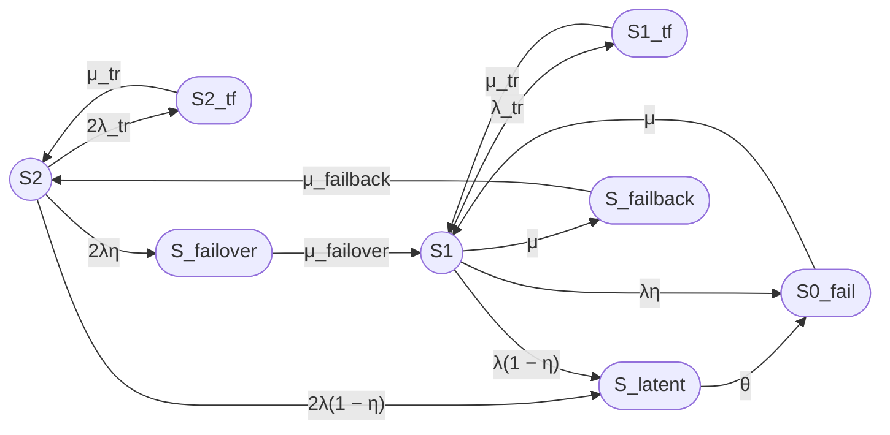

report8_full.md

Выполнение промпта для модели 8/2 prompt8_full.md

# Модель надёжности восстанавливаемого отказоустойчивого двухузлового кластера (8/2)

## 1. Постановка модели

Рассматривается восстанавливаемый отказоустойчивый двухузловой кластер с одной ремонтной бригадой, нагруженным резервированием, временными сбоями, скрытыми отказами, операциями failover и failback.

**Работоспособные состояния (только два):**
- **S2** — оба узла работоспособны, отказов нет;
- **S1** — один узел работоспособен, второй отказал и находится в ремонте.

**Неработоспособные состояния:**
- **S0_fail** — оба узла отказали, кластер неработоспособен;
- **S2_tf** — временный сбой одного из двух узлов, второй работоспособен;
- **S1_tf** — временный сбой единственного работоспособного узла;
- **S_latent** — скрытый отказ одного из работоспособных узлов (агрегированное состояние);
- **S_failover** — отказ одного узла, выполняется failover (S2 → S1);
- **S_failback** — возврат восстановленного узла после ремонта (S1 → S2).

Всего 8 состояний.

**Параметры модели:**
- λ — интенсивность постоянного отказа одного узла;
- λ_tr — интенсивность временного сбоя одного узла;
- μ_tr — интенсивность восстановления после временного сбоя;
- μ_failover — интенсивность завершения failover;
- μ — интенсивность восстановления узла;
- μ_failback — интенсивность завершения failback;
- θ — интенсивность обнаружения скрытого отказа;
- η — вероятность мгновенного обнаружения отказа (0 ≤ η ≤ 1).

Связь с средними временами:
λ = 1/MTBF, μ = 1/MTTR, λ_tr = 1/MTBF_tr, μ_tr = 1/T_tr, μ_failover = 1/T_failover, μ_failback = 1/T_failback, θ = 1/T_detect.

---

## 2. Граф состояний (Mermaid)

---

## 3. Матрица генератора Q (8×8)

Порядок состояний: S2, S1, S0_fail, S2_tf, S1_tf, S_latent, S_failover, S_failback.

$$
Q = \begin{pmatrix}
-(2λ_{tr}+2λ) & 0 & 0 & 2λ_{tr} & 0 & 2λ(1-η) & 2λη & 0 \\
0 & -(λ_{tr}+λ+μ) & λη & 0 & λ_{tr} & λ(1-η) & 0 & μ \\
0 & μ & -μ & 0 & 0 & 0 & 0 & 0 \\
μ_{tr} & 0 & 0 & -μ_{tr} & 0 & 0 & 0 & 0 \\
0 & μ_{tr} & 0 & 0 & -μ_{tr} & 0 & 0 & 0 \\
0 & 0 & θ & 0 & 0 & -θ & 0 & 0 \\
0 & μ_{failover} & 0 & 0 & 0 & 0 & -μ_{failover} & 0 \\
μ_{failback} & 0 & 0 & 0 & 0 & 0 & 0 & -μ_{failback}
\end{pmatrix}
$$

---

## 4. Стационарные уравнения баланса

Обозначим стационарные вероятности: P2, P1, P0, P2tf, P1tf, Plat, Pfailover, Pfailback.

Уравнения баланса для каждого состояния:

1. **S2:** P2tf μ_tr + Pfailback μ_failback = P2 (2λ_tr + 2λ)
2. **S1:** Pfailover μ_failover + P1tf μ_tr + P0 μ = P1 (λ_tr + λ + μ)
3. **S0_fail:** Plat θ + P1 λη = P0 μ
4. **S2_tf:** P2 2λ_tr = P2tf μ_tr
5. **S1_tf:** P1 λ_tr = P1tf μ_tr
6. **S_latent:** P2 2λ(1-η) + P1 λ(1-η) = Plat θ
7. **S_failover:** P2 2λη = Pfailover μ_failover
8. **S_failback:** P1 μ = Pfailback μ_failback

Условие нормировки: P2 + P1 + P0 + P2tf + P1tf + Plat + Pfailover + Pfailback = 1.

---

## 5. Аналитическое решение

Выразим все вероятности через P2.

Из уравнений 4, 7, 5, 8:
- P2tf = P2 · (2λ_tr / μ_tr)
- Pfailover = P2 · (2λη / μ_failover)
- P1tf = P1 · (λ_tr / μ_tr)
- Pfailback = P1 · (μ / μ_failback)

Из уравнения 6:
Plat = (2λ(1-η)P2 + λ(1-η)P1) / θ = λ(1-η)/θ · (2P2 + P1)

Из уравнения 3:
P0 = (Plat θ + P1 λη) / μ = [2λ(1-η)P2 + P1 λ] / μ

Подставляя в уравнение 2, получаем:
2λ P2 = P1 μ  ⇒  **P1 = (2λ/μ) P2**

Тогда все вероятности выражаются через P2:

- P1 = (2λ/μ) P2
- P2tf = (2λ_tr / μ_tr) P2
- P1tf = (2λ λ_tr) / (μ μ_tr) P2
- Pfailover = (2λη / μ_failover) P2
- Pfailback = (2λ / μ_failback) P2
- Plat = 2λ(1-η)/θ · (1 + λ/μ) P2
- P0 = 2λ/μ · [(1-η) + λ/μ] P2

Знаменатель D (сумма коэффициентов при P2):
D = 1 + 2λ/μ + 2λ_tr/μ_tr + 2λ λ_tr/(μ μ_tr) + 2λη/μ_failover + 2λ/μ_failback + 2λ(1-η)/θ · (1 + λ/μ) + 2λ/μ · [(1-η) + λ/μ]

Тогда P2 = 1/D, а остальные вероятности вычисляются по формулам выше.

**Стационарный коэффициент готовности:**
Kг,ст = P2 + P1 = P2 (1 + 2λ/μ) = (1 + 2λ/μ) / D.

**Unicode:**
Kг,ст = (1 + 2λ/μ) / D

**LaTeX:**
$$
K_{\mathrm{г,ст}} = \frac{1 + \frac{2\lambda}{\mu}}{D}
$$

где D определено выше.

---

## 6. Численный расчёт

**Исходные данные (приведены к часам):**
- MTBF = 30000 ч ⇒ λ = 3.333333333e-5 ч⁻¹
- MTTR = 24 ч ⇒ μ = 4.166666667e-2 ч⁻¹
- T_failover = 30 с = 0.008333333333 ч ⇒ μ_failover = 120 ч⁻¹
- T_failback = 90 с = 0.025 ч ⇒ μ_failback = 40 ч⁻¹
- T_tr = 180 с = 0.05 ч ⇒ μ_tr = 20 ч⁻¹
- η = 0.99
- T_detect = 8 ч ⇒ θ = 0.125 ч⁻¹
- MTBF_tr = 8760 ч ⇒ λ_tr = 1.141552511e-4 ч⁻¹

**Коэффициенты (c_i = P_i / P2):**

| Состояние | Коэффициент c_i | Значение |
|---|---:|---:|
| S2 | 1 | 1.000000000e+0 |
| S1 | 2λ/μ | 1.600000000e-3 |
| S2_tf | 2λ_tr/μ_tr | 1.141552511e-5 |
| S1_tf | 2λ λ_tr/(μ μ_tr) | 9.132420091e-9 |
| S_failover | 2λη/μ_failover | 5.500000000e-7 |
| S_failback | 2λ/μ_failback | 1.666666667e-6 |
| S_latent | 2λ(1-η)/θ · (1+λ/μ) | 5.337600000e-6 |
| S0_fail | 2λ/μ · [(1-η)+λ/μ] | 1.728000000e-5 |

**Знаменатель D:**
D = 1 + 0.0016 + 1.141552511e-5 + 9.132420091e-9 + 5.5e-7 + 1.666666667e-6 + 5.3376e-6 + 1.728e-5
D = 1.0016362589242009

**Стационарные вероятности:**

| Состояние | Вероятность | Значение |
|---|---:|---:|
| S2 | P2 = 1/D | 0.9983664140 |
| S1 | P1 = c1·P2 | 0.001597386262 |
| S0_fail | P0 = c0·P2 | 1.725177e-5 |
| S2_tf | P2tf = c2tf·P2 | 1.1396876e-5 |
| S1_tf | P1tf = c1tf·P2 | 9.1175e-9 |
| S_latent | Plat = c_latent·P2 | 5.32888e-6 |
| S_failover | Pfailover = c_failover·P2 | 5.4910e-7 |
| S_failback | Pfailback = c_failback·P2 | 1.663944e-6 |

**Проверка нормировки:**
Сумма всех вероятностей = 1.0000000000 (с точностью > 1e-10).

**Коэффициент готовности:**
Kг,ст = P2 + P1 = 0.9983664140 + 0.001597386262 = **0.9999638003**

В процентах: **99.99638003%**.

---

## 7. Ограничения модели

1. Все потоки отказов и восстановлений предполагаются пуассоновскими (экспоненциальные распределения времён).
2. Отказы узлов независимы.
3. Одна ремонтная бригада обслуживает только один узел в момент времени.
4. Временные сбои устраняются перезапуском с постоянной интенсивностью μ_tr.
5. Скрытые отказы обнаруживаются только внешним периодическим контролем с интенсивностью θ.
6. Не учитываются коррелированные отказы, деградация, профилактическое обслуживание, ограничения по ресурсам.
7. Предполагается, что failover и failback происходят с постоянными интенсивностями.
8. Модель не учитывает стоимость и время переключения между режимами, а также возможные отказы во время этих операций.

---

# Итого

### Граф состояний
(см. раздел 2, Mermaid-диаграмма)

### Легенда состояний
- **S2** — оба узла рабочие;
- **S1** — один узел рабочий, второй в ремонте;
- **S0_fail** — оба узла отказали;
- **S2_tf** — временный сбой одного из двух узлов;
- **S1_tf** — временный сбой единственного рабочего узла;
- **S_latent** — скрытый отказ;
- **S_failover** — выполняется failover;
- **S_failback** — выполняется failback.

### Группы состояний
- **Работоспособные:** S2, S1.
- **Неработоспособные:** S0_fail, S2_tf, S1_tf, S_latent, S_failover, S_failback.

### Основные формулы

**Unicode:**
Kг,ст = (1 + 2λ/μ) / D

**LaTeX:**
$$
K_{\mathrm{г,ст}} = \frac{1 + \frac{2\lambda}{\mu}}{D}
$$

где
$$
D = 1 + \frac{2\lambda}{\mu} + \frac{2\lambda_{tr}}{\mu_{tr}} + \frac{2\lambda\lambda_{tr}}{\mu\mu_{tr}} + \frac{2\lambda\eta}{\mu_{failover}} + \frac{2\lambda}{\mu_{failback}} + \frac{2\lambda(1-\eta)}{\theta}\left(1+\frac{\lambda}{\mu}\right) + \frac{2\lambda}{\mu}\left[(1-\eta)+\frac{\lambda}{\mu}\right]
$$

### Численный результат
- **Kг,ст = 0.9999638003** (99.99638003%)
- **P2 = 0.9983664140**
- **P1 = 0.001597386262**

### Ограничения модели
(см. раздел 7)
