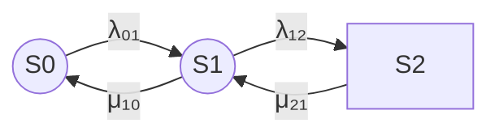

## 4
уточнения:

Не понятно что означает: S0,S0,-λ₀₁

измени промпт и ответ с учетом:
([S]) - отказ
((S)) - работа

Текстовая легенда - это не mermaid, а markdown.
Нужен только стационарный коэффициент готовности

# answer


# Исправленный промпт

```text
Рассчитай стационарный коэффициент готовности восстанавливаемого отказоустойчивого кластера методом непрерывной однородной цепи Маркова.

## 1. Исходная модель

Рассматривается кластер из двух одинаковых узлов с восстановлением.

Состояния марковской модели определяются числом отказавших узлов:

- S0 — отказов нет, оба узла работоспособны;
- S1 — отказал один узел, один узел остается работоспособным;
- S2 — отказали оба узла, оба узла неработоспособны.

Кластер считается работоспособным в состояниях S0 и S1.

Состояние S2 является неработоспособным состоянием кластера.

Переходы между состояниями:

- S0 → S1 — отказ одного из двух работоспособных узлов;
- S1 → S2 — отказ оставшегося работоспособного узла;
- S1 → S0 — восстановление отказавшего узла;
- S2 → S1 — восстановление одного из двух отказавших узлов.

## 2. Обозначения интенсивностей

Используй следующие обозначения:

- λ₀₁ — интенсивность перехода S0 → S1;
- λ₁₂ — интенсивность перехода S1 → S2;
- μ₁₀ — интенсивность перехода S1 → S0;
- μ₂₁ — интенсивность перехода S2 → S1.

Для двух одинаковых независимых узлов с интенсивностью отказа одного узла λ:

λ₀₁ = 2λ,

λ₁₂ = λ.

Для одного ремонтного канала с интенсивностью восстановления μ:

μ₁₀ = μ,

μ₂₁ = μ.

Если в состоянии S2 используются два независимых ремонтных канала, допускается принять μ₂₁ = 2μ, но этот вариант рассмотри отдельно.

## 3. Требуемый результат

Нужно получить только стационарный коэффициент готовности кластера.

Не выводи:

- нестационарный коэффициент готовности;
- функции P₀(t), P₁(t), P₂(t);
- решения системы во времени;
- коэффициент неготовности, если он не нужен для вывода коэффициента готовности;
- приближенные формулы, если они не нужны для основного результата.

Допускается кратко привести стационарные вероятности как промежуточный этап вывода.

## 4. Требования к расчету

1. Кратко сформулируй модель в терминах теории надежности.

2. Укажи:
   - работоспособные состояния;
   - неработоспособное состояние;
   - интенсивности переходов;
   - используемые допущения.

3. Построй граф состояний в Mermaid.

4. Выведи матрицу интенсивностей переходов в порядке состояний S0, S1, S2.

5. Выведи стационарные уравнения.

6. Найди стационарные вероятности.

7. Получи стационарный коэффициент готовности:

Кг,ст = P₀ + P₁.

8. Рассмотри частный случай:

λ₀₁ = 2λ,

λ₁₂ = λ,

μ₁₀ = μ₂₁ = μ.

9. В конце обязательно добавь раздел:

## Итоговая формула

В нем укажи формулу общего случая и формулу симметричного частного случая.

## 5. Требования к Mermaid

Используй Mermaid, совместимый с GitHub.

Для состояний используй идентификаторы:

- S0;
- S1;
- S2.

Визуальное обозначение узлов должно соответствовать следующим правилам:

- `((S))` — работоспособное состояние;
- `[S]` — неработоспособное состояние.

Основной граф должен иметь направление слева направо:

S0 → S1 → S2.

Используй следующий стиль записи:



Не используй:

- цветовые стили;
- `classDef`;
- `class`;
- `style`;
- заливку;
- красные или серые контуры;
- текстовые описания внутри узлов;
- дополнительные Mermaid-узлы для легенды.

## 6. Требования к легенде

Легенда должна быть обычным Markdown-текстом, а не Mermaid.

После графа добавь:

- `((S))` — работоспособное состояние, окружность;
- `[S]` — неработоспособное состояние, квадрат;
- S0 — нет отказов;
- S1 — отказ одного узла;
- S2 — отказ двух узлов.

## 7. Требования к формулам

Оформи ответ в режиме GitHub Markdown, формулы без LaTeX-обертки.

Не используй:

- `$$`;
- `$...$`;
- `\(...\)`;
- `\[...\]`;
- `\frac`;
- `\boxed`;
- другие LaTeX-команды и LaTeX-обертки.

Формулы записывай линейным текстом с использованием Unicode-символов:

- λ;
- μ;
- ₀;
- ₁;
- ₂.

Пример:

Кг,ст = μ₂₁(μ₁₀ + λ₀₁) /
        (μ₁₀μ₂₁ + λ₀₁μ₂₁ + λ₀₁λ₁₂)

Для матриц используй обычный текст или таблицу Markdown.

## 8. Матрица переходов

Используй порядок состояний S0, S1, S2.

Матрица генератора:

Q =

[ -λ₀₁,                  λ₀₁,                 0 ]

[  μ₁₀,       -(μ₁₀ + λ₁₂),              λ₁₂ ]

[     0,                  μ₂₁,            -μ₂₁ ]

Стационарные вероятности должны быть получены из уравнений:

0 = -λ₀₁P₀ + μ₁₀P₁

0 = λ₀₁P₀ - (μ₁₀ + λ₁₂)P₁ + μ₂₁P₂

0 = λ₁₂P₁ - μ₂₁P₂

P₀ + P₁ + P₂ = 1

## 9. Обязательная итоговая запись

В конце напиши:

Для представленной модели наиболее корректная итоговая запись:

Кг,ст =
    μ₂₁(μ₁₀ + λ₀₁) /
    (μ₁₀μ₂₁ + λ₀₁μ₂₁ + λ₀₁λ₁₂)

Для симметричного случая:

λ₀₁ = 2λ,

λ₁₂ = λ,

μ₁₀ = μ₂₁ = μ.

Тогда:

Кг,ст =
    (μ² + 2λμ) /
    (μ² + 2λμ + 2λ²)
```

# Ответ по исправленному промпту

## 1. Формализация модели

Рассматривается восстанавливаемый отказоустойчивый кластер из двух одинаковых узлов.

Состояния модели:

- S0 — отказов нет, оба узла работоспособны;
- S1 — отказал один узел, один узел остается работоспособным;
- S2 — отказали оба узла, оба узла неработоспособны.

Кластер работоспособен в состояниях S0 и S1. Состояние S2 является неработоспособным.

Модель предполагает:

- постоянные интенсивности отказов и восстановления;
- экспоненциальные распределения времени до отказа и восстановления;
- независимые отказы узлов;
- отсутствие отказов по общей причине;
- один ремонтный канал;
- отсутствие задержек обнаружения, переключения и возврата узла в кластер.

Марковские методы с постоянными интенсивностями переходов применяются для анализа надежности и готовности ремонтируемых систем в соответствии с подходом ГОСТ Р МЭК 61165—2019. [protect.gost](https://protect.gost.ru/gost/details/ccf715c0-edc9-4095-ba04-8bcc7e19c444)

## 2. Интенсивности переходов

- λ₀₁ — интенсивность перехода S0 → S1;
- λ₁₂ — интенсивность перехода S1 → S2;
- μ₁₀ — интенсивность перехода S1 → S0;
- μ₂₁ — интенсивность перехода S2 → S1.

Для двух одинаковых независимых узлов:

λ₀₁ = 2λ

λ₁₂ = λ

Для одного ремонтного канала:

μ₁₀ = μ₂₁ = μ

## 3. Граф состояний

В графе:

- `((S))` обозначает работоспособное состояние;
- `[S]` обозначает неработоспособное состояние.


Состояния расположены слева направо:

S0 → S1 → S2.

## 4. Текстовая легенда

- `((S))` — работоспособное состояние, окружность.
- `[S]` — неработоспособное состояние, квадрат.
- S0 — нет отказов.
- S1 — отказ одного узла.
- S2 — отказ двух узлов.

## 5. Матрица интенсивностей переходов

Используется порядок состояний S0, S1, S2.

Матрица генератора:

Q =

[ -λ₀₁,                  λ₀₁,                 0 ]

[  μ₁₀,       -(μ₁₀ + λ₁₂),              λ₁₂ ]

[     0,                  μ₂₁,            -μ₂₁ ]

В табличной форме:

| Состояние | S0 | S1 | S2 |
|---|---:|---:|---:|
| S0 | -λ₀₁ | λ₀₁ | 0 |
| S1 | μ₁₀ | -(μ₁₀ + λ₁₂) | λ₁₂ |
| S2 | 0 | μ₂₁ | -μ₂₁ |

В этой записи, например, элемент строки S0 и столбца S0 равен -λ₀₁. Это не переход S0 → S0, а диагональный элемент матрицы генератора, равный минусу суммы интенсивностей исходящих переходов из состояния S0.

Элемент строки S0 и столбца S1 равен λ₀₁ и соответствует переходу S0 → S1.

## 6. Стационарные уравнения

В стационарном режиме производные вероятностей равны нулю:

0 = -λ₀₁P₀ + μ₁₀P₁

0 = λ₀₁P₀ - (μ₁₀ + λ₁₂)P₁ + μ₂₁P₂

0 = λ₁₂P₁ - μ₂₁P₂

P₀ + P₁ + P₂ = 1

Из первого уравнения:

P₁ = λ₀₁P₀ / μ₁₀

Из третьего уравнения:

P₂ = λ₁₂P₁ / μ₂₁

Стационарные вероятности:

P₀ = μ₁₀μ₂₁ /
     (μ₁₀μ₂₁ + λ₀₁μ₂₁ + λ₀₁λ₁₂)

P₁ = λ₀₁μ₂₁ /
     (μ₁₀μ₂₁ + λ₀₁μ₂₁ + λ₀₁λ₁₂)

P₂ = λ₀₁λ₁₂ /
     (μ₁₀μ₂₁ + λ₀₁μ₂₁ + λ₀₁λ₁₂)

## 7. Стационарный коэффициент готовности

Кластер работоспособен в состояниях S0 и S1:

Кг,ст = P₀ + P₁

Подставляя стационарные вероятности:

Кг,ст =
    (μ₁₀μ₂₁ + λ₀₁μ₂₁) /
    (μ₁₀μ₂₁ + λ₀₁μ₂₁ + λ₀₁λ₁₂)

Вынеся μ₂₁ в числителе:

Кг,ст =
    μ₂₁(μ₁₀ + λ₀₁) /
    (μ₁₀μ₂₁ + λ₀₁μ₂₁ + λ₀₁λ₁₂)

## 8. Симметричный случай

Для двух одинаковых независимых узлов и одного ремонтного канала:

λ₀₁ = 2λ

λ₁₂ = λ

μ₁₀ = μ₂₁ = μ

После подстановки:

Кг,ст =
    μ(μ + 2λ) /
    (μ² + 2λμ + 2λ²)

или:

Кг,ст =
    (μ² + 2λμ) /
    (μ² + 2λμ + 2λ²)

## 9. Аналогичные расчеты и источники

- [ГОСТ Р МЭК 61165—2019 «Надежность в технике. Применение марковских методов»](https://protect.gost.ru/gost/details/ccf715c0-edc9-4095-ba04-8bcc7e19c444) — нормативное руководство по моделированию и анализу систем с применением марковских методов. В стандарте указано, что интенсивности переходов рассматриваются как не зависящие от времени константы. [protect.gost](https://protect.gost.ru/gost/details/ccf715c0-edc9-4095-ba04-8bcc7e19c444)

- [ГОСТ Р МЭК 61165—2019, текст стандарта](https://files.stroyinf.ru/Data2/1/4293727/4293727169.pdf) — содержит положения о применении марковских методов и определении коэффициента готовности через вероятности работоспособных состояний. [files.stroyinf](https://files.stroyinf.ru/Data2/1/4293727/4293727169.pdf)

- [Марковские модели надежности](https://relind.ru/Ch2/P21.html) — материал по построению графов состояний, матриц интенсивностей и стационарных вероятностей. [relind](https://relind.ru/Ch2/P21.html)

- [Mermaid Flowchart Syntax](https://github.com/mermaid-js/mermaid/blob/master/docs/syntax/flowchart.md) — документация по синтаксису Mermaid, включая обозначения круглых и прямоугольных узлов. [github](https://github.com/mermaid-js/mermaid/blob/master/docs/syntax/flowchart.md)

## Итоговая формула

Для представленной модели наиболее корректная итоговая запись:

Кг,ст =
    μ₂₁(μ₁₀ + λ₀₁) /
    (μ₁₀μ₂₁ + λ₀₁μ₂₁ + λ₀₁λ₁₂)

Для симметричного случая:

λ₀₁ = 2λ

λ₁₂ = λ

μ₁₀ = μ₂₁ = μ

Тогда:

Кг,ст =
    (μ² + 2λμ) /
    (μ² + 2λμ + 2λ²)
    
