## 1
Укажи всю хронологию ГОСТ по теории надёжности, как саму серию 27., так и что было до нее и что после. Указывай названия серий (их английский перевод).  
В mermaid создай дерево ветвлений и пояснения почему это сделано (почему ввели новую серию или ГОСТ вне серии и т.п.).  
Проанализируй все ГОСТ, в названии которых есть «надёжность».

Основная линия ГОСТ по надёжности строится вокруг системы стандартов «Надежность в технике» (номер системы 27), которая формируется с начала 1980‑х, затем развивается и интегрируется с риск‑менеджментом и международными стандартами IEC/ISO. [dependability](https://www.dependability.ru/jour/article/viewFile/61/147.pdf)

## 1. Базовая хронология ГОСТ 27.\*

### До появления системы 27

До формальной системы 27 требования к надёжности присутствовали в отдельных отраслевых и общетехнических ГОСТ, но как самостоятельная «серия по надёжности» они ещё не выделены. Ранние стандарты затрагивали климатические условия эксплуатации, безопасность, технологические процессы и т.п., где надёжность упоминалась как аспект качества (например, ГОСТ 15150‑69 по климатическому исполнению). [dependability](https://www.dependability.ru/jour/article/viewFile/61/147.pdf)

Ключевой предтечей «серии» 27 являются методические указания РД 50‑… по сбору и обработке информации о надёжности и испытаниям, которые закладывали понятийную и методическую базу будущей системы стандартов. [dependability](https://www.dependability.ru/jour/article/viewFile/61/147.pdf)

### Формирование системы стандартов «Надежность в технике» (ССНТ)

- ГОСТ 27.001‑81 «Система стандартов “Надежность в технике”. Основные положения» – первый фундаментальный стандарт, который формализует систему как отдельную область межгосударственной стандартизации.  
- ГОСТ 27.001‑95 «Система стандартов “Надежность в технике”. Основные положения / System of standards for dependability in technics. Basic principles» – переработка и развитие ГОСТ 27.001‑81, вводится в РФ с 1997‑01‑01, задаёт структуру, объекты стандартизации и схему обозначения всех ГОСТ 27.\*.

ГОСТ 27.001‑95 определяет, что система включает только основополагающие стандарты (ССНТ), распространяющиеся на большинство видов технических объектов и устанавливающие общие положения, принципы, правила и методы управления их надёжностью.

### Терминология и основные понятия

- ГОСТ 27.002‑89 «Надёжность в технике. Основные понятия. Термины и определения / Industrial product dependability. General principles. Terms and definitions» – первый словарь по надёжности, связанный с ГОСТ 27.001 как базовым документом. [protect.gost](https://protect.gost.ru/gost/details/46499d03-5a3e-408c-82a6-c5d15cfd1fe0)
- ГОСТ 27.002‑2015 – актуализированная редакция того же стандарта, гармонизированная с МЭК и расширяющая понятийный аппарат. [protect.gost](https://protect.gost.ru/gost/details/46499d03-5a3e-408c-82a6-c5d15cfd1fe0)

В рамках ССНТ также используется специализированная терминология для частных областей (например, технологические системы, надёжность объекта, непрерывность деятельности). [dependability](https://www.dependability.ru/jour/article/viewFile/61/147.pdf)

### Развитие по группам 0–4 (по ГОСТ 27.001‑95)

ГОСТ 27.001‑95 выделяет группы объектов стандартизации:  

- Группа 0 – общие вопросы: терминология, основные положения, классификация отказов, модели отказов.  
- Группа 1 – организация работ по обеспечению надёжности.  
- Группа 2 – способы обеспечения надёжности (конструктивные, технологические, эксплуатационные).  
- Группа 3 – анализ и расчёт надёжности.  
- Группа 4 – испытания, контроль, оценка надёжности.

На этой основе далее развиваются конкретные ГОСТы 27.0xx, 27.1xx, 27.2xx, 27.3xx, 27.4xx и 27.5xx, многие из которых подтверждают или заменяют более ранние документы 1980‑х–1990‑х годов. [dependability](https://www.dependability.ru/jour/article/viewFile/61/147.pdf)

## 2. Хронология ключевых ГОСТ с «надёжностью» в названии

Ниже – дерево основных ГОСТ с «надёжность» в заголовке (не только 27.\*, но и связанные серии по риск‑менеджменту, технологическим системам, АСУ и др.) по данным систематизированного списка стандартов по надёжности. [dependability](https://www.dependability.ru/jour/article/viewFile/61/147.pdf)

```mermaid
graph TD

%% Корневой уровень – общие основы
A["До серии 27.\nРанние ГОСТ с упоминанием надежности\n(климат, безопасность, технологические процессы)"] --> B["ГОСТ 27.001-81\nССНТ. Основные положения"]
B --> C["ГОСТ 27.001-95\nSystem of standards for dependability in technics.\nBasic principles"]

%% Терминология
C --> D["ГОСТ 27.002-89\nIndustrial product dependability.\nTerms and definitions"]
D --> D2["ГОСТ 27.002-2015\nDependability in technics.\nTerms and definitions"]

%% Группа 0 – общие положения, модели отказов, СУН
C --> G0["Группа 0 (ССНТ)\nОсновные понятия, СУН, модели отказов"]
G0 --> G0a["ГОСТ Р 27.001-2009\nНадежность в технике.\nСистема управления надежностью.\nОсновные положения"]
G0 --> G0b["ГОСТ Р 27.004-2009\nНадежность в технике.\nМодели отказов"]
G0 --> G0c["ГОСТ 27.004-85\nНадежность в технике.\nСистемы технологические.\nТермины и определения"]
G0 --> G0d["ГОСТ Р 27.101-2021\nНадежность в технике.\nНадежность выполнения задания\nи управление непрерывностью деятельности.\nТермины и определения"]

%% Группа 2 – технологические системы
C --> G2["Группа 2 (ССНТ и смежные)\nСистемные аспекты, технологические системы"]
G2 --> G2a["ГОСТ 27.202-83\nНадежность в технике.\nТехнологические системы.\nОценка по параметрам качества"]
G2 --> G2b["ГОСТ 27.203-83\nНадежность в технике.\nТехнологические системы.\nОбщие требования к методам оценки"]
G2 --> G2c["ГОСТ 27.204-83\nНадежность в технике.\nТехнологические системы.\nТехнические требования к методам оценки\nпо производительности"]
G2 --> G2d["ГОСТ Р 27.203-2012\nНадежность в технике (ССНТ).\nУправление устареванием"]

%% Группа 3 – анализ, расчёт, риск
C --> G3["Группа 3 (ССНТ)\nАнализ и расчет надежности,\nанализ риска"]
G3 --> G3a["ГОСТ 27.301-95\nНадежность в технике (ССНТ).\nРасчет надежности.\nОсновные положения"]
G3 --> G3b["ГОСТ Р 27.301-2011\nНадежность в технике (ССНТ).\nУправление надежностью.\nТехника анализа безотказности.\nОсновные положения"]
G3 --> G3c["ГОСТ 27.310-95\nНадежность в технике.\nАнализ видов, последствий\nи критичности отказов.\nОсновные положения"]
G3 --> G3d["ГОСТ Р 27.302-2009\nНадежность в технике.\nАнализ дерева неисправностей"]
G3 --> G3e["ГОСТ Р 27.303-2021\nНадежность в технике.\nАнализ видов и последствий отказов"]
G3 --> G3f["ГОСТ Р 27.010-2019\nDependability in technics.\nMathematical expressions\nfor reliability, availability, maintainability"]
G3 --> G3g["ГОСТ Р 27.011-2019\nDependability in technics.\nProbabilistic risk analysis\nof technical systems"]

%% Группа 4 – испытания
C --> G4["Группа 4 (ССНТ)\nИспытания, контроль,\nобработка данных"]
G4 --> G4a["ГОСТ 27.402-95\nНадежность в технике.\nПланы испытаний для контроля\nMTBF (экспоненциальное распределение)"]
G4 --> G4b["ГОСТ Р 27.403-2009\nНадежность в технике.\nПланы испытаний для контроля\nвероятности безотказной работы"]
G4 --> G4c["ГОСТ Р 27.404-2009\nНадежность в технике.\nПланы испытаний для контроля\nкоэффициента готовности"]
G4 --> G4d["ГОСТ Р 27.405-2011\nНадежность в технике.\nОтбраковочные испытания\nна ранние отказы сложных систем"]

%% Группа 5 – информация, ЗИП
C --> G5["Группа 5 (ССНТ)\nИнформационное обеспечение,\nЗИП, данные"]
G5 --> G5a["ГОСТ 27.507-2015\nНадежность в технике (ССНТ).\nЗапасные части, инструменты\nи принадлежности.\nОценка и расчет запасов"]

%% Связанные стандарты по надежности, АСУ, риск-менеджменту
C --> S["Смежные серии\nМенеджмент риска, АСУ, отраслевые"]
S --> S1["ГОСТ Р 51901.5-2005\nRisk management.\nGuidance on reliability analysis methods"]
S --> S2["ГОСТ Р 51901.6-2005\nRisk management.\nReliability growth programme"]
S --> S3["ГОСТ Р 51901.16-2005\nRisk management.\nReliability growth.\nStatistical methods"]
S --> S4["ГОСТ Р 51901.14-2007\nRisk management.\nReliability block diagram\nand Boolean methods"]
S --> S5["ГОСТ Р МЭК 60300-1-2017\nRisk management.\nGuidance on dependability management"]
S --> S6["ГОСТ Р МЭК 61078-2021\nDependability in technics.\nReliability block diagram"]
S --> S7["ГОСТ Р МЭК 61165-2019\nDependability in technics.\nApplication of Markov methods"]
S --> S8["ГОСТ Р МЭК 62502-2014\nRisk management.\nEvent tree analysis"]
S --> S9["ГОСТ 24.701-86\nНадежность автоматизированных систем управления.\nОсновные положения"]
S --> S10["ГОСТ 34.201-89\nИнформационная технология.\nДокументы при создании АСУ\n(связь с надежностью)"]
S --> S11["ГОСТ Р ИСО 22301-2021\nСистемы менеджмента\nнепрерывности деятельности.\nТребования"]
S --> S12["ГОСТ Р ИСО 22313-2021\nСистемы менеджмента\nнепрерывности деятельности.\nРуководство"]
```

### Почему появляются новые серии и редакции

- Обновление научно‑технической базы: переход от «просто расчёта надёжности» к управлению надёжностью (ГОСТ Р 27.001‑2009, ГОСТ Р 27.301‑2011) отражает смещение фокуса от статических оценок к процессному менеджменту и интеграции с системами качества и риск‑менеджментом. [dependability](https://www.dependability.ru/jour/article/viewFile/61/147.pdf)
- Гармонизация с IEC/ISO: введение ГОСТ Р 27.010‑2019, 27.011‑2019, 27.012‑2019, а также ГОСТ Р МЭК 61078‑2021, 61165‑2019, 62508‑2014 и др. – результат адаптации международных стандартов по dependability, risk и human factor к российской практике. [dependability](https://www.dependability.ru/jour/article/viewFile/61/147.pdf)
- Уточнение области применения: технологические системы (ГОСТ 27.202–204‑83), автоматизированные системы управления (ГОСТ 24.701‑86, 34.201‑89), непрерывность деятельности (ГОСТ Р ИСО 22301/22313‑2021) выделяются в отдельные серии и ГОСТ, поскольку требуют специфических моделей отказов и показателей эффективности/надёжности. [dependability](https://www.dependability.ru/jour/article/viewFile/61/147.pdf)

## 3. Логика ветвлений и методологические мотивы

### Система 27 как «надёжность в технике»

ГОСТ 27.001‑95 чётко фиксирует, что ССНТ – это именно система базовых межгосударственных стандартов, охватывающих:  

- общие вопросы и терминологию (группа 0);  
- организацию работ по обеспечению надёжности (группа 1);  
- способы обеспечения надёжности на стадиях жизненного цикла (группа 2);  
- анализ и расчёт надёжности (группа 3);  
- испытания, контроль, оценку надёжности (группа 4).

При этом стандарты по конкретным видам техники (например, космические комплексы, нефтегаз, автомобильная промышленность) могут развиваться как «комплексы стандартов по надёжности», но формально не входят в состав ССНТ – отсюда отдельные ГОСТ Р 58625, ГОСТ Р 20815 и др. [dependability](https://www.dependability.ru/jour/article/viewFile/61/147.pdf)

### Переход к управлению надёжностью и риском

Появление ГОСТ Р 27.001‑2009 («Система управления надёжностью») и ГОСТ Р 27.601‑2011 (управление надёжностью, техническое обслуживание и его обеспечение) отражает переход от классической теории надёжности к интеграции с менеджментом риска и эксплуатационной готовностью. [dependability](https://www.dependability.ru/jour/article/viewFile/61/147.pdf)

Введение серии 51901.\* («Менеджмент риска») и их связь с анализом надёжности (методы анализа, программы роста надёжности, булевы методы и структурные схемы) показывает движение к риск‑ориентированному управлению жизненным циклом активов. [dependability](https://www.dependability.ru/jour/article/viewFile/61/147.pdf)

### Системные аспекты, технологические системы, непрерывность

ГОСТ 27.202–27.204‑83 формируют отдельную ветку по технологическим системам, где надёжность оценивается через параметры качества продукции и производительности. [dependability](https://www.dependability.ru/jour/article/viewFile/61/147.pdf)

Позднее появляется ветка по надёжности выполнения задания и управлению непрерывностью деятельности (ГОСТ Р 27.101‑2021, ГОСТ Р ИСО 22301/22313‑2021), объединяющая классическую надёжность техники с business continuity и операционным риском. [dependability](https://www.dependability.ru/jour/article/viewFile/61/147.pdf)

## 4. Табличное резюме ключевых стандартов с «надёжностью» в названии

| Номер ГОСТ | Русское название (кратко) | Английский заголовок / смысл | Методологическая роль |
|-----------|---------------------------|------------------------------|------------------------|
| ГОСТ 27.001‑95 | Система стандартов «Надежность в технике». Основные положения | System of standards for dependability in technics. Basic principles | Определяет структуру ССНТ, группы объектов, правила обозначения. |
| ГОСТ 27.002‑89 / 2015 | Надёжность в технике. Основные понятия. Термины и определения | Industrial product dependability. Terms and definitions | Базовый словарь понятий надёжности для всех последующих ГОСТ. [protect.gost](https://protect.gost.ru/gost/details/46499d03-5a3e-408c-82a6-c5d15cfd1fe0) |
| ГОСТ Р 27.001‑2009 | Надёжность в технике. Система управления надёжностью. Основные положения | Dependability in technics. Reliability management system. Basic principles | Переход к процессному управлению надёжностью и СУН. [dependability](https://www.dependability.ru/jour/article/viewFile/61/147.pdf) |
| ГОСТ Р 27.004‑2009 | Надёжность в технике. Модели отказов | Dependability in technics. Failure models | Стандартизация классификаций и моделей отказов (включая связь с 27.010). [dependability](https://www.dependability.ru/jour/article/viewFile/61/147.pdf) |
| ГОСТ 27.202–204‑83 | Надёжность в технике. Технологические системы… | Dependability in technics. Technological systems… | Специализация методов оценки надёжности для технологических систем. [dependability](https://www.dependability.ru/jour/article/viewFile/61/147.pdf) |
| ГОСТ 27.301‑95 | Надёжность в технике (ССНТ). Расчёт надёжности. Основные положения | Dependability in technics (SSNT). Reliability calculation. Basic principles | Обобщённая методология расчёта показателей надёжности. [dependability](https://www.dependability.ru/jour/article/viewFile/61/147.pdf) |
| ГОСТ Р 27.301‑2011 | Надёжность в технике (ССНТ). Управление надёжностью. Техника анализа безотказности | Dependability in technics (SSNT). Reliability management. Failure analysis techniques | Смещение акцента от расчёта к анализу безотказности и управлению. [dependability](https://www.dependability.ru/jour/article/viewFile/61/147.pdf) |
| ГОСТ 27.310‑95 | Надёжность в технике. Анализ видов, последствий и критичности отказов | Dependability in technics. FMECA. Basic principles | Формализует FMECA для различных объектов. [dependability](https://www.dependability.ru/jour/article/viewFile/61/147.pdf) |
| ГОСТ Р 27.302‑2009 | Надёжность в технике. Анализ дерева неисправностей | Dependability in technics. Fault tree analysis | Вводит FTA как базовый инструмент анализа риска и надёжности. [dependability](https://www.dependability.ru/jour/article/viewFile/61/147.pdf) |
| ГОСТ Р 27.303‑2021 | Надёжность в технике. Анализ видов и последствий отказов | Dependability in technics. FMEA | Актуализированная FMEA, увязанная с IEC/ISO. [dependability](https://www.dependability.ru/jour/article/viewFile/61/147.pdf) |
| ГОСТ Р 27.010‑2019 | Надёжность в технике. Математические выражения для показателей безотказности, готовности, ремонтопригодности | Dependability in technics. Mathematical expressions for reliability, availability, maintainability | Стандартизует математический аппарат показателей RAM. [dependability](https://www.dependability.ru/jour/article/viewFile/61/147.pdf) |
| ГОСТ Р 27.011‑2019 | Надёжность в технике. Вероятностный анализ риска технических систем | Dependability in technics. Probabilistic risk analysis of technical systems | Связывает классическую надёжность с PRA и сценарным анализом. [dependability](https://www.dependability.ru/jour/article/viewFile/61/147.pdf) |
| ГОСТ 27.402‑95 | Надёжность в технике. Планы испытаний для контроля средней наработки до отказа | Dependability in technics. Test plans for MTBF control | Фокус на экспоненциальной модели и планах испытаний. [dependability](https://www.dependability.ru/jour/article/viewFile/61/147.pdf) |
| ГОСТ Р 27.403‑2009 | Надёжность в технике. Планы испытаний для контроля вероятности безотказной работы | Dependability in technics. Test plans for reliability | Дополняет 27.402 и 27.404 для разных показателей. [dependability](https://www.dependability.ru/jour/article/viewFile/61/147.pdf) |
| ГОСТ Р 27.404‑2009 | Надёжность в технике. Планы испытаний для контроля коэффициента готовности | Dependability in technics. Test plans for availability | Интеграция надёжности и ремонтопригодности через готовность. [dependability](https://www.dependability.ru/jour/article/viewFile/61/147.pdf) |
| ГОСТ Р 27.405‑2011 | Надёжность в технике. Отбраковочные испытания на ранние отказы | Dependability in technics. Screening tests for early failures | Прикладной стандарт для сложных уникальных систем. [dependability](https://www.dependability.ru/jour/article/viewFile/61/147.pdf) |
| ГОСТ 27.507‑2015 | Надёжность в технике (ССНТ). ЗИП. Оценка и расчёт запасов | Dependability in technics (SSNT). Spares, tools and accessories | Связывает надёжность с логистикой и запасами. [dependability](https://www.dependability.ru/jour/article/viewFile/61/147.pdf) |
| ГОСТ Р 51901.5/6/16‑2005 | Менеджмент риска. Надёжность, рост надёжности | Risk management – reliability and reliability growth | Мост между серией 27 и системами риск‑менеджмента. [dependability](https://www.dependability.ru/jour/article/viewFile/61/147.pdf) |
| ГОСТ Р МЭК 60300‑1, 61078, 61165, 62502 | Менеджмент риска и надёжность | IEC dependability standards adopted as GOST | Импорт и адаптация международной теории dependability. [dependability](https://www.dependability.ru/jour/article/viewFile/61/147.pdf) |
| ГОСТ 24.701‑86 | Надёжность автоматизированных систем управления. Основные положения | Dependability of automated control systems. Basic principles | Расширение концепции надёжности на АСУ. [dependability](https://www.dependability.ru/jour/article/viewFile/61/147.pdf) |

Если нужно, могу развить это дерево до уровня «онтологии ГОСТ по надёжности» с формальными отношениями (is_a, part_of, regulates, method_for) и предложить модель интеграции с вашей архитектурой OpEx/семантического управления.

