## 1
Укажи всю хронологию ГОСТ по теории надёжности, как саму серию 27., так и что было до нее и что после. Указывай названия серий (их английский перевод).  
В mermaid создай дерево ветвлений и пояснения почему это сделано (почему ввели новую серию или ГОСТ вне серии и т.п.).  
Проанализируй все ГОСТ, в названии которых есть «надёжность».

Основная линия ГОСТ по надёжности строится вокруг системы стандартов «Надежность в технике» (номер системы 27), которая формируется с начала 1980‑х, затем развивается и интегрируется с риск‑менеджментом и международными стандартами IEC/ISO. [dependability](https://www.dependability.ru/jour/article/viewFile/61/147.pdf)

## 1. Базовая хронология ГОСТ 27.\*

### До появления системы 27

До формальной системы 27 требования к надёжности присутствовали в отдельных отраслевых и общетехнических ГОСТ, но как самостоятельная «серия по надёжности» они ещё не выделены. Ранние стандарты затрагивали климатические условия эксплуатации, безопасность, технологические процессы и т.п., где надёжность упоминалась как аспект качества (например, ГОСТ 15150‑69 по климатическому исполнению). [dependability](https://www.dependability.ru/jour/article/viewFile/61/147.pdf)

Ключевой предтечей «серии» 27 являются методические указания РД 50‑… по сбору и обработке информации о надёжности и испытаниям, которые закладывали понятийную и методическую базу будущей системы стандартов. [dependability](https://www.dependability.ru/jour/article/viewFile/61/147.pdf)

### Формирование системы стандартов «Надежность в технике» (ССНТ)

- ГОСТ 27.001‑81 «Система стандартов “Надежность в технике”. Основные положения» – первый фундаментальный стандарт, который формализует систему как отдельную область межгосударственной стандартизации.  
- ГОСТ 27.001‑95 «Система стандартов “Надежность в технике”. Основные положения / System of standards for dependability in technics. Basic principles» – переработка и развитие ГОСТ 27.001‑81, вводится в РФ с 1997‑01‑01, задаёт структуру, объекты стандартизации и схему обозначения всех ГОСТ 27.\*.

ГОСТ 27.001‑95 определяет, что система включает только основополагающие стандарты (ССНТ), распространяющиеся на большинство видов технических объектов и устанавливающие общие положения, принципы, правила и методы управления их надёжностью.

### Терминология и основные понятия

- ГОСТ 27.002‑89 «Надёжность в технике. Основные понятия. Термины и определения / Industrial product dependability. General principles. Terms and definitions» – первый словарь по надёжности, связанный с ГОСТ 27.001 как базовым документом. [protect.gost](https://protect.gost.ru/gost/details/46499d03-5a3e-408c-82a6-c5d15cfd1fe0)
- ГОСТ 27.002‑2015 – актуализированная редакция того же стандарта, гармонизированная с МЭК и расширяющая понятийный аппарат. [protect.gost](https://protect.gost.ru/gost/details/46499d03-5a3e-408c-82a6-c5d15cfd1fe0)

В рамках ССНТ также используется специализированная терминология для частных областей (например, технологические системы, надёжность объекта, непрерывность деятельности). [dependability](https://www.dependability.ru/jour/article/viewFile/61/147.pdf)

### Развитие по группам 0–4 (по ГОСТ 27.001‑95)

ГОСТ 27.001‑95 выделяет группы объектов стандартизации:  

- Группа 0 – общие вопросы: терминология, основные положения, классификация отказов, модели отказов.  
- Группа 1 – организация работ по обеспечению надёжности.  
- Группа 2 – способы обеспечения надёжности (конструктивные, технологические, эксплуатационные).  
- Группа 3 – анализ и расчёт надёжности.  
- Группа 4 – испытания, контроль, оценка надёжности.

На этой основе далее развиваются конкретные ГОСТы 27.0xx, 27.1xx, 27.2xx, 27.3xx, 27.4xx и 27.5xx, многие из которых подтверждают или заменяют более ранние документы 1980‑х–1990‑х годов. [dependability](https://www.dependability.ru/jour/article/viewFile/61/147.pdf)

## 2. Хронология ключевых ГОСТ с «надёжностью» в названии

Ниже – дерево основных ГОСТ с «надёжность» в заголовке (не только 27.\*, но и связанные серии по риск‑менеджменту, технологическим системам, АСУ и др.) по данным систематизированного списка стандартов по надёжности. [dependability](https://www.dependability.ru/jour/article/viewFile/61/147.pdf)

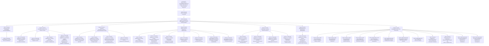

### Почему появляются новые серии и редакции

- Обновление научно‑технической базы: переход от «просто расчёта надёжности» к управлению надёжностью (ГОСТ Р 27.001‑2009, ГОСТ Р 27.301‑2011) отражает смещение фокуса от статических оценок к процессному менеджменту и интеграции с системами качества и риск‑менеджментом. [dependability](https://www.dependability.ru/jour/article/viewFile/61/147.pdf)
- Гармонизация с IEC/ISO: введение ГОСТ Р 27.010‑2019, 27.011‑2019, 27.012‑2019, а также ГОСТ Р МЭК 61078‑2021, 61165‑2019, 62508‑2014 и др. – результат адаптации международных стандартов по dependability, risk и human factor к российской практике. [dependability](https://www.dependability.ru/jour/article/viewFile/61/147.pdf)
- Уточнение области применения: технологические системы (ГОСТ 27.202–204‑83), автоматизированные системы управления (ГОСТ 24.701‑86, 34.201‑89), непрерывность деятельности (ГОСТ Р ИСО 22301/22313‑2021) выделяются в отдельные серии и ГОСТ, поскольку требуют специфических моделей отказов и показателей эффективности/надёжности. [dependability](https://www.dependability.ru/jour/article/viewFile/61/147.pdf)

## 3. Логика ветвлений и методологические мотивы

### Система 27 как «надёжность в технике»

ГОСТ 27.001‑95 чётко фиксирует, что ССНТ – это именно система базовых межгосударственных стандартов, охватывающих:  

- общие вопросы и терминологию (группа 0);  
- организацию работ по обеспечению надёжности (группа 1);  
- способы обеспечения надёжности на стадиях жизненного цикла (группа 2);  
- анализ и расчёт надёжности (группа 3);  
- испытания, контроль, оценку надёжности (группа 4).

При этом стандарты по конкретным видам техники (например, космические комплексы, нефтегаз, автомобильная промышленность) могут развиваться как «комплексы стандартов по надёжности», но формально не входят в состав ССНТ – отсюда отдельные ГОСТ Р 58625, ГОСТ Р 20815 и др. [dependability](https://www.dependability.ru/jour/article/viewFile/61/147.pdf)

### Переход к управлению надёжностью и риском

Появление ГОСТ Р 27.001‑2009 («Система управления надёжностью») и ГОСТ Р 27.601‑2011 (управление надёжностью, техническое обслуживание и его обеспечение) отражает переход от классической теории надёжности к интеграции с менеджментом риска и эксплуатационной готовностью. [dependability](https://www.dependability.ru/jour/article/viewFile/61/147.pdf)

Введение серии 51901.\* («Менеджмент риска») и их связь с анализом надёжности (методы анализа, программы роста надёжности, булевы методы и структурные схемы) показывает движение к риск‑ориентированному управлению жизненным циклом активов. [dependability](https://www.dependability.ru/jour/article/viewFile/61/147.pdf)

### Системные аспекты, технологические системы, непрерывность

ГОСТ 27.202–27.204‑83 формируют отдельную ветку по технологическим системам, где надёжность оценивается через параметры качества продукции и производительности. [dependability](https://www.dependability.ru/jour/article/viewFile/61/147.pdf)

Позднее появляется ветка по надёжности выполнения задания и управлению непрерывностью деятельности (ГОСТ Р 27.101‑2021, ГОСТ Р ИСО 22301/22313‑2021), объединяющая классическую надёжность техники с business continuity и операционным риском. [dependability](https://www.dependability.ru/jour/article/viewFile/61/147.pdf)

## 4. Табличное резюме ключевых стандартов с «надёжностью» в названии

| Номер ГОСТ | Русское название (кратко) | Английский заголовок / смысл | Методологическая роль |
|-----------|---------------------------|------------------------------|------------------------|
| ГОСТ 27.001‑95 | Система стандартов «Надежность в технике». Основные положения | System of standards for dependability in technics. Basic principles | Определяет структуру ССНТ, группы объектов, правила обозначения. |
| ГОСТ 27.002‑89 / 2015 | Надёжность в технике. Основные понятия. Термины и определения | Industrial product dependability. Terms and definitions | Базовый словарь понятий надёжности для всех последующих ГОСТ. [protect.gost](https://protect.gost.ru/gost/details/46499d03-5a3e-408c-82a6-c5d15cfd1fe0) |
| ГОСТ Р 27.001‑2009 | Надёжность в технике. Система управления надёжностью. Основные положения | Dependability in technics. Reliability management system. Basic principles | Переход к процессному управлению надёжностью и СУН. [dependability](https://www.dependability.ru/jour/article/viewFile/61/147.pdf) |
| ГОСТ Р 27.004‑2009 | Надёжность в технике. Модели отказов | Dependability in technics. Failure models | Стандартизация классификаций и моделей отказов (включая связь с 27.010). [dependability](https://www.dependability.ru/jour/article/viewFile/61/147.pdf) |
| ГОСТ 27.202–204‑83 | Надёжность в технике. Технологические системы… | Dependability in technics. Technological systems… | Специализация методов оценки надёжности для технологических систем. [dependability](https://www.dependability.ru/jour/article/viewFile/61/147.pdf) |
| ГОСТ 27.301‑95 | Надёжность в технике (ССНТ). Расчёт надёжности. Основные положения | Dependability in technics (SSNT). Reliability calculation. Basic principles | Обобщённая методология расчёта показателей надёжности. [dependability](https://www.dependability.ru/jour/article/viewFile/61/147.pdf) |
| ГОСТ Р 27.301‑2011 | Надёжность в технике (ССНТ). Управление надёжностью. Техника анализа безотказности | Dependability in technics (SSNT). Reliability management. Failure analysis techniques | Смещение акцента от расчёта к анализу безотказности и управлению. [dependability](https://www.dependability.ru/jour/article/viewFile/61/147.pdf) |
| ГОСТ 27.310‑95 | Надёжность в технике. Анализ видов, последствий и критичности отказов | Dependability in technics. FMECA. Basic principles | Формализует FMECA для различных объектов. [dependability](https://www.dependability.ru/jour/article/viewFile/61/147.pdf) |
| ГОСТ Р 27.302‑2009 | Надёжность в технике. Анализ дерева неисправностей | Dependability in technics. Fault tree analysis | Вводит FTA как базовый инструмент анализа риска и надёжности. [dependability](https://www.dependability.ru/jour/article/viewFile/61/147.pdf) |
| ГОСТ Р 27.303‑2021 | Надёжность в технике. Анализ видов и последствий отказов | Dependability in technics. FMEA | Актуализированная FMEA, увязанная с IEC/ISO. [dependability](https://www.dependability.ru/jour/article/viewFile/61/147.pdf) |
| ГОСТ Р 27.010‑2019 | Надёжность в технике. Математические выражения для показателей безотказности, готовности, ремонтопригодности | Dependability in technics. Mathematical expressions for reliability, availability, maintainability | Стандартизует математический аппарат показателей RAM. [dependability](https://www.dependability.ru/jour/article/viewFile/61/147.pdf) |
| ГОСТ Р 27.011‑2019 | Надёжность в технике. Вероятностный анализ риска технических систем | Dependability in technics. Probabilistic risk analysis of technical systems | Связывает классическую надёжность с PRA и сценарным анализом. [dependability](https://www.dependability.ru/jour/article/viewFile/61/147.pdf) |
| ГОСТ 27.402‑95 | Надёжность в технике. Планы испытаний для контроля средней наработки до отказа | Dependability in technics. Test plans for MTBF control | Фокус на экспоненциальной модели и планах испытаний. [dependability](https://www.dependability.ru/jour/article/viewFile/61/147.pdf) |
| ГОСТ Р 27.403‑2009 | Надёжность в технике. Планы испытаний для контроля вероятности безотказной работы | Dependability in technics. Test plans for reliability | Дополняет 27.402 и 27.404 для разных показателей. [dependability](https://www.dependability.ru/jour/article/viewFile/61/147.pdf) |
| ГОСТ Р 27.404‑2009 | Надёжность в технике. Планы испытаний для контроля коэффициента готовности | Dependability in technics. Test plans for availability | Интеграция надёжности и ремонтопригодности через готовность. [dependability](https://www.dependability.ru/jour/article/viewFile/61/147.pdf) |
| ГОСТ Р 27.405‑2011 | Надёжность в технике. Отбраковочные испытания на ранние отказы | Dependability in technics. Screening tests for early failures | Прикладной стандарт для сложных уникальных систем. [dependability](https://www.dependability.ru/jour/article/viewFile/61/147.pdf) |
| ГОСТ 27.507‑2015 | Надёжность в технике (ССНТ). ЗИП. Оценка и расчёт запасов | Dependability in technics (SSNT). Spares, tools and accessories | Связывает надёжность с логистикой и запасами. [dependability](https://www.dependability.ru/jour/article/viewFile/61/147.pdf) |
| ГОСТ Р 51901.5/6/16‑2005 | Менеджмент риска. Надёжность, рост надёжности | Risk management – reliability and reliability growth | Мост между серией 27 и системами риск‑менеджмента. [dependability](https://www.dependability.ru/jour/article/viewFile/61/147.pdf) |
| ГОСТ Р МЭК 60300‑1, 61078, 61165, 62502 | Менеджмент риска и надёжность | IEC dependability standards adopted as GOST | Импорт и адаптация международной теории dependability. [dependability](https://www.dependability.ru/jour/article/viewFile/61/147.pdf) |
| ГОСТ 24.701‑86 | Надёжность автоматизированных систем управления. Основные положения | Dependability of automated control systems. Basic principles | Расширение концепции надёжности на АСУ. [dependability](https://www.dependability.ru/jour/article/viewFile/61/147.pdf) |

Если нужно, могу развить это дерево до уровня «онтологии ГОСТ по надёжности» с формальными отношениями (is_a, part_of, regulates, method_for) и предложить модель интеграции с вашей архитектурой OpEx/семантического управления.

## 2
Сделаю разбивку на несколько вертикально ориентированных схем, каждая – по своей логике группировки стандартов.

Ниже — первый пакет схем, сфокусированный на «скелете» ССНТ и ключевых ветках. Если нужно, можем добавить ещё (например, отдельную схему только по ГОСТ Р 51901.\* или только по испытаниям 27.4xx).

***

## 1. «Скелет» системы 27.\* и эволюция основ

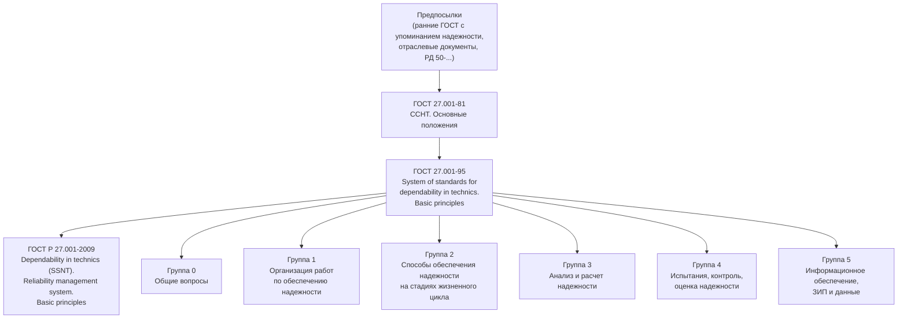

**Почему так:** ГОСТ 27.001‑95 прямо задаёт структуру групп 0–5 как «ось» для всех последующих стандартов по надёжности в технике. Вертикальная развёртка показывает эволюцию: от первых формулировок ССНТ (27.001‑81) к уточнённой структуре (27.001‑95), а затем к переходу от «общих положений» к «системе управления надёжностью» (ГОСТ Р 27.001‑2009). [files.stroyinf](https://files.stroyinf.ru/Data2/1/4294827/4294827557.htm)

***

## 2. Терминология и общие вопросы (группа 0)

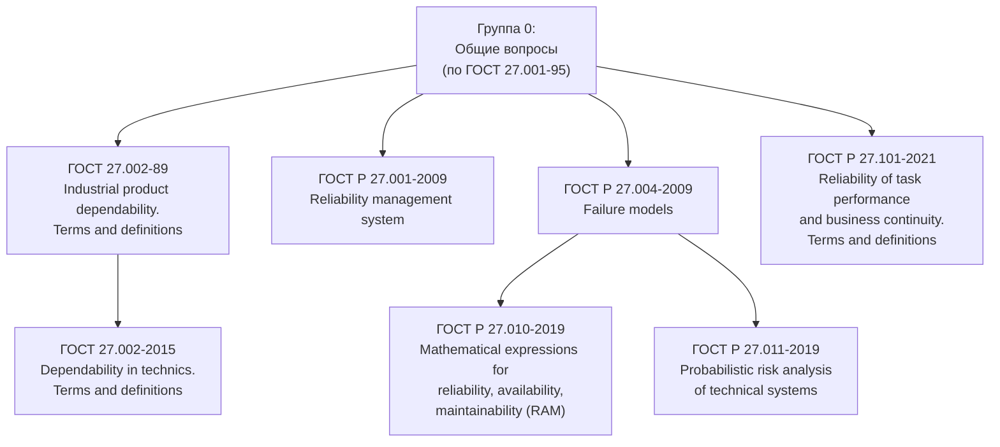

**Почему так:**  

- ГОСТ 27.002‑89/2015 создаёт общую терминологическую базу для всей ССНТ. [protect.gost](https://protect.gost.ru/gost/details/46499d03-5a3e-408c-82a6-c5d15cfd1fe0)
- ГОСТ Р 27.001‑2009 и 27.004‑2009 деятельно продолжают группу 0, но уже в логике «управления» и «моделей отказов», а не только понятий. [docs.cntd](https://docs.cntd.ru/document/1200078693)
- ГОСТ Р 27.010/27.011 логически «подвешены» под модели отказов, задавая формальный математический и риск‑аналитический аппарат; вертикальное дерево подчёркивает это наследование. [files.stroyinf](https://files.stroyinf.ru/Data2/1/4294827/4294827557.htm)

***

## 3. Технологические системы и способы обеспечения надёжности (группа 2)

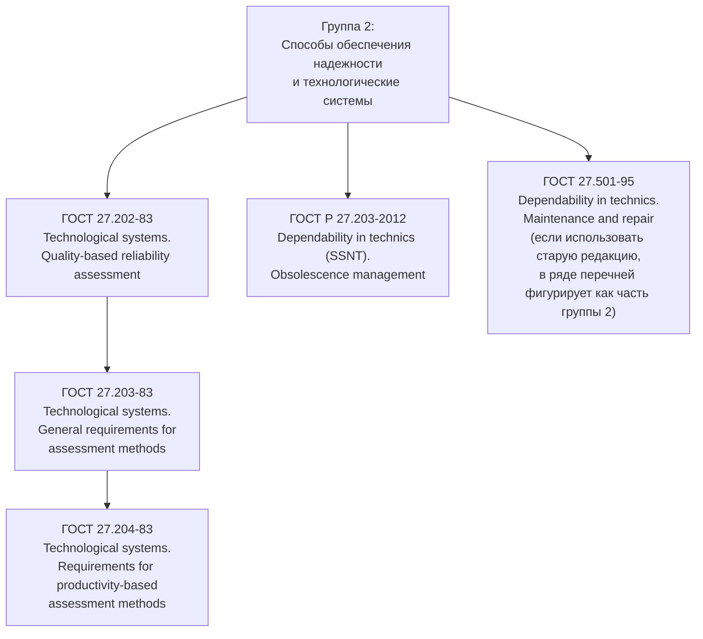

**Почему так:**  

- ГОСТ 27.202–204‑83 формируют вертикальную ветку «технологические системы», начиная от общей концепции и последовательно уточняя методы оценки через качество и производительность. [dependability](https://www.dependability.ru/jour/article/viewFile/61/147.pdf)
- ГОСТ Р 27.203‑2012 по управлению устареванием логически размещается в той же группе, так как речь идёт о способах обеспечения надёжности на жизненном цикле через управление obsolescence. [dependability](https://www.dependability.ru/jour/article/viewFile/61/147.pdf)
- ГОСТы по техническому обслуживанию и ремонту (27.5xx, 27.6xx) можно «подвесить» сюда как продолжение методов обеспечения эксплуатационной пригодности.

***

## 4. Анализ и расчёт надёжности, риск (группа 3)

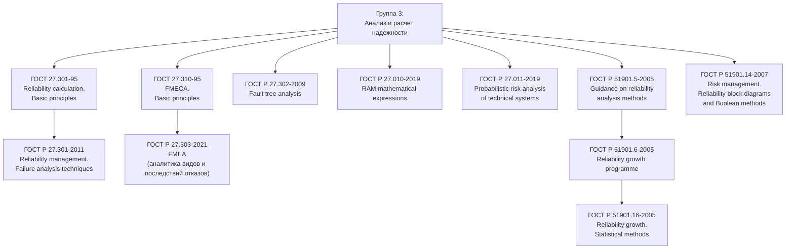

**Почему так:**  

- ГОСТ 27.301‑95 – базовое ядро расчёта надёжности, от него вертикально «вырастают» ГОСТ Р 27.301‑2011 (уже об управлении надёжностью на основе анализа безотказности). [dependability](https://www.dependability.ru/jour/article/viewFile/61/147.pdf)
- ГОСТ 27.310‑95 (FMECA) и ГОСТ Р 27.303‑2021 (FMEA) композиционно отображают эволюцию от более тяжёлого формата FMECA к более широко применяемой FMEA, согласованной с IEC/ISO. [dependability](https://www.dependability.ru/jour/article/viewFile/61/147.pdf)
- ГОСТ Р 27.302‑2009 (FTA), 27.010 и 27.011 – вертикальная цепочка от структурного анализа отказов к формальному математическому и вероятностному описанию риск‑профиля системы. [dependability](https://www.dependability.ru/jour/article/viewFile/61/147.pdf)
- Серия ГОСТ Р 51901.\* вынесена в отдельный вертикальный «столбик»: это уже «менеджмент риска», но он тесно связан с анализом надёжности, поэтому дерево показывает их как смежный, но не входящий формально в ССНТ комплекс. [files.stroyinf](https://files.stroyinf.ru/Data2/1/4294827/4294827557.htm)

***

## 5. Испытания, контроль, оценка надёжности (группа 4)

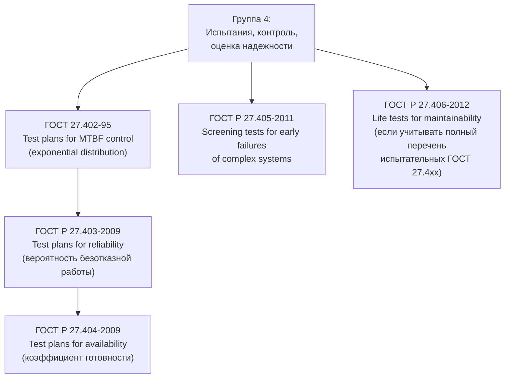

**Почему так:**  

- ГОСТ 27.402‑95 фактически «корневой» для испытаний по надёжности, от него логично вертикально разворачиваются ГОСТ Р 27.403 и 27.404 как уточнения по другим показателям (вероятность безотказной работы, готовность). [dependability](https://www.dependability.ru/jour/article/viewFile/61/147.pdf)
- ГОСТ Р 27.405‑2011 выделяется в отдельную ветку как специфический стандарт для сложных систем, фокусированный на ранних отказах и ��тбраковочных испытаниях. [dependability](https://www.dependability.ru/jour/article/viewFile/61/147.pdf)
- Пакет испытательных ГОСТ 27.4xx по различным видам испытаний можно разворачивать дальше вниз, сохраняя вертикальный принцип.

***

## 6. Информационное обеспечение, ЗИП и смежные темы (группа 5 + АСУ/BCM)

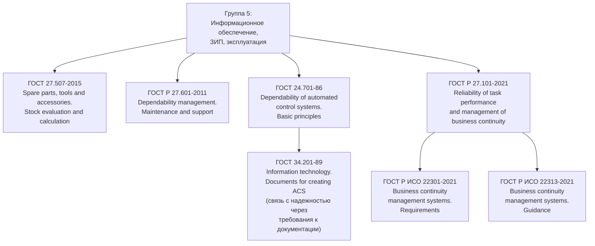

**Почему так:**  

- ГОСТ 27.507‑2015 и ГОСТ Р 27.601‑2011 – вертикально упорядоченная ветка по ЗИП, обслуживанию и эксплуатационной поддержке; они делают надёжность практически реализуемой через логистику и ТОиР. [dependability](https://www.dependability.ru/jour/article/viewFile/61/147.pdf)
- ГОСТ 24.701‑86 и 34.201‑89 показывают расширение концепта надёжности на автоматизированные системы управления (АСУ), что типично для зрелых программ надёжности. [dependability](https://www.dependability.ru/jour/article/viewFile/61/147.pdf)
- ГОСТ Р 27.101‑2021 + ГОСТ Р ИСО 22301/22313‑2021 создают вертикальное дерево «от надёжности выполнения задания» к системам менеджмента непрерывности деятельности, объединяя инженерную надёжность с операционным риск‑менеджментом и OpEx. [dependability](https://www.dependability.ru/jour/article/viewFile/61/147.pdf)

***

Если тебе удобно, на следующем шаге могу:

- ДОстроить схемы до уровня «онтологии» (в стиле `Class: GOST_27_302 SubClassOf: MethodFor(FaultTreeAnalysis)`),  
- или сгруппировать их в отдельные mermaid‑модули по твоей архитектуре (например: «Модуль: Reliability Analytics», «Модуль: Risk & BCM», «Модуль: Maintenance & Obsolescence»), чтобы можно было напрямую использовать в Foundry/EA‑репозитории.

## 3
Подробнее посмотри ГОСТ и нормативы \ стандарты до серии 27.  
Также рассмотри как другие серии, где есть фрагменты про надежность.  
Отдельно покажи "чуждые для Надежность в технике" элементы, например, ГОСТ Р ИСО/МЭК 31010-2011. Покажи как и почему ГОСТ Р ИСО/МЭК 31010-2021 оказался в серии "Надежность в технике".  
Также рассмотри все разные переводы "Надежность в технике" используемые в названии, например, в   31010 это уже Dependability in technics. Укажи принадлежность к ТК 119 «Надежность в технике» и т.п. Т.е. общий концепт изменений в серии  «Надежность в технике»

Серия «Надежность в технике» эволюционирует из довольно широкой советской концепции надежности и риск‑анализа к более жёстко очерченному домену dependability, интегрированному с международными стандартами IEC/ISO и менеджментом риска. [protect.gost](https://protect.gost.ru/gost/details/fb5c7f89-65bb-46c4-be3d-a376d03b62d6)

Я разобью ответ на четыре блока и несколько вертикальных схем.

***

## 1. Предсерийные ГОСТ по надежности и их влияние

До появления системы 27.\* важнейшим стандартом по надежности был ГОСТ 13377‑75 «Надежность в технике. Термины и определения / Dependability in technics. Terms and definitions».

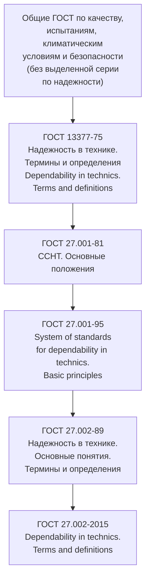

**Что важно в ГОСТ 13377‑75 и сопутствующих документах:**  

- Введён фундаментальный понятийный каркас (надежность, безотказность, долговечность, ремонтопригодность, сохраняемость, резервирование и т.д.), с англоязычным названием «Dependability in technics. Terms and definitions».  
- Стандарт прямо распространяется на все виды технических объектов (изделия, системы, сооружения, установки), задаёт обязательность терминологии для документации, учебников и справочников.  
- Через ГОСТ 13377‑75 и РД 50‑… (по контролю, испытаниям, учёту отказов) формируется «межведомственная» школа надежности, из которой потом вырастает формализованная ССНТ (система стандартов 27.\*). [ismss](https://www.ismss.ru/uploads/8-4-14.pdf)

Сюда же концептуально примыкают отраслевые документы с «Надежность» в названии, но ещё вне серии 27:\* [ismss](https://www.ismss.ru/uploads/8-4-14.pdf)

- ГОСТ 27883‑88 «Средства измерения и управления технологическими процессами. Надежность. Общие требования и методы испытаний» (надёжность приборов и средств управления, ОКС по измерениям). [ismss](https://www.ismss.ru/uploads/8-4-14.pdf)
- ГОСТ 24.701‑86 «Единая система стандартов автоматизированных систем управления. Надежность автоматизированных систем управления. Основные положения» (надёжность АСУ как отдельная системная ветка). [ismss](https://www.ismss.ru/uploads/8-4-14.pdf)

Эти «до‑27» документы показывают: надежность трактуется как межотраслевое свойство, но стандарт «надёжность» ещё не выделен в отдельную систему; это влияет на решение создать ССНТ как самостоятельный блок с собственным номером серии (27.\*). [files.stroyinf](https://files.stroyinf.ru/Data2/1/4294827/4294827557.htm)

***

## 2. «Чуждые» и смежные элементы: риск‑менеджмент, измерение и др.

До включения IEC‑ориентированных документов в серию «Надежность в технике» многие стандарты по риску и статистике были **вне** ТК 119 и вне серии 27.\*. [ismss](https://www.ismss.ru/uploads/8-4-14.pdf)

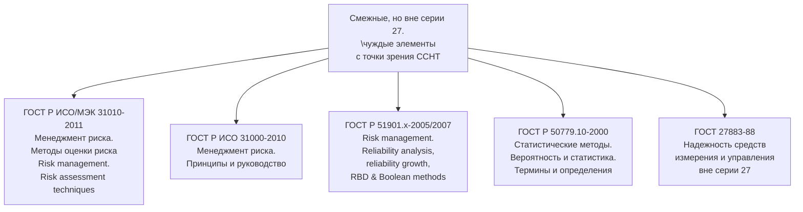

**Почему эти документы «чужды» для классической ССНТ:**  

- Серия 51901.\* и ISO 31000/31010 исходно позиционируются как «менеджмент риска» (risk management), а не «dependability in technics»; фокус – на организационном, корпоративном и финансовом ризке. [rusrim.blogspot](https://rusrim.blogspot.com/2022/09/31010-2021.html)
- ГОСТ Р ИСО/МЭК 31010‑2011 имеет русское название «Менеджмент риска. Методы оценки риска», не содержит в заголовке «Надежность в технике» и не привязан к ТК 119; это самостоятельный документ по оценке риска, применимый в любой области. [rusrim.blogspot](https://rusrim.blogspot.com/2022/09/31010-2021.html)
- Статистические ГОСТы (например, ГОСТ Р 50779.10‑2000) дают базовую вероятность и статистику, но не интегрируются в систему 27.\* как часть методологии dependability – их ОКС и ТК другие. [ismss](https://www.ismss.ru/uploads/8-4-14.pdf)

То есть на момент 2010‑х годов risk‑management и reliability связаны через отдельные мосты (серия 51901.\*), но методически – это разные «микро‑онтологии», не объединённые под единым заголовком «Надежность в технике». [ismss](https://www.ismss.ru/uploads/8-4-14.pdf)

***

## 3. Как ГОСТ Р МЭК 31010‑2021 оказался в серии «Надежность в технике»

Ключевой шаг – **адаптация IEC 31010:2019** не как «менеджмент риска», а как стандарт серии «Надежность в технике» с заголовком «Dependability in technics» и привязкой к ТК 119. [metall](https://metall.world/FILES/gosts/gost_r_mek_31010-2021.pdf)

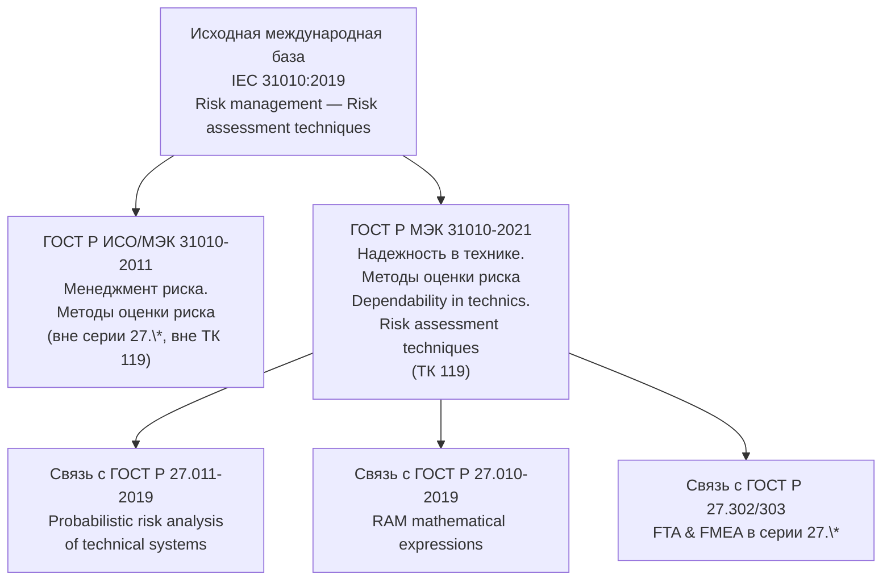

**Факты по ГОСТ Р МЭК 31010‑2021:**  

- Официальное русское название: «Надежность в технике. Методы оценки риска»; английский: «Dependability in technics. Risk assessment techniques». [dependability](https://www.dependability.ru/jour/article/viewFile/61/147.pdf)
- Стандарт идентичен IEC 31010:2019, но наименование изменено «для приведения в соответствие с ГОСТ Р 1.5‑2012», то есть с национальной практикой построения серий. [dependability](https://www.dependability.ru/jour/article/viewFile/61/147.pdf)
- Внесён Техническим комитетом ТК 119 «Надежность в технике» и утверждён приказом Росстандарта; в предисловии прямо указано: «стандарт внесён ТК 119 “Надежность в технике”». [protect.gost](https://protect.gost.ru/gost/details/fb5c7f89-65bb-46c4-be3d-a376d03b62d6)
- Область применения: руководство по выбору и применению методов оценки риска в широком диапазоне ситуаций, преимущественно в технической области, интегрировано с ISO 31000 и ISO Guide 73. [dependability](https://www.dependability.ru/jour/article/viewFile/61/147.pdf)

**Почему он «перетянут» из риск‑менеджмента в серию «Надежность в технике»:**

1. **Системное сближение dependability и risk:**  
   Уже ГОСТ Р 27.011‑2019 формулирует «Вероятностный анализ риска технических систем» внутри серии 27.\*. Введение IEC 31010 под заголовком «Надежность в технике» создаёт единый пакет методов PRA, FTA, FMEA, RBD и др. под зонтичной онтологией dependability. [vsegost](https://vsegost.com/NCategories/n_27d.shtml)

2. **Технический комитет ТК 119 как «владелец домена»:**  
   Решение ТК 119 внести 31010‑2021 означает институциональное признание: оценка риска технических систем – часть области «Надежность в технике», а не только корпоративного risk‑management. [protect.gost](https://protect.gost.ru/gost/details/fb5c7f89-65bb-46c4-be3d-a376d03b62d6)

3. **Унификация терминологии:**  
   Стандарт опирается на термины ISO 31000 и Guide 73 (risk, likelihood, uncertainty), но через заголовок «Dependability in technics» и принадлежность к ТК 119 он фактически стыкуется с терминологией ГОСТ 27.002‑2015 и 27.102‑2021 (термины надёжности и надежности объекта). [meganorm](https://meganorm.ru/Index2/1/4293754/4293754027.htm)

***

## 4. Разные переводы «Надежность в технике» и концепт изменений серии

### 4.1. Варианты англоязычного заголовка

По ряду ключевых ГОСТ мы видим эволюцию перевода. [online.zakon](https://online.zakon.kz/Document/?doc_id=37588576)

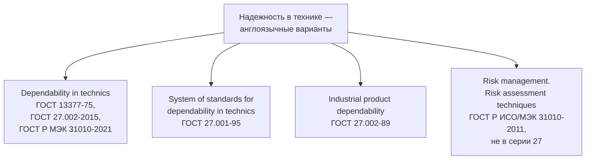

**Ключевые моменты:**  

- ГОСТ 13377‑75 использует «Dependability in technics. Terms and definitions», что затем воспроизводится в ГОСТ 27.002‑2015 как «Dependability in technics. Terms and definitions» и в ГОСТ Р МЭК 31010‑2021 как «Dependability in technics. Risk assessment techniques». [meganorm](https://meganorm.ru/Index2/1/4293754/4293754027.htm)
- ГОСТ 27.001‑95 формулирует «System of standards for dependability in technics. Basic principles» – здесь надёжность в технике уже явно видна как **система** стандартов, а не только свойство объекта. [files.stroyinf](https://files.stroyinf.ru/Data2/1/4294827/4294827557.htm)
- ГОСТ 27.002‑89 использует «Industrial product dependability. General principles. Terms and definitions» – ориентация на промышленную продукцию; затем это смещается к более абстрактной «Dependability in technics». [base.garant](https://base.garant.ru/6177360/)
- В «чуждых» risk‑стандартах первой волны (31010‑2011) используется классический ISO‑заголовок «Risk management — Risk assessment techniques» без упоминания dependability – отсюда различие онтологической привязки. [rusrim.blogspot](https://rusrim.blogspot.com/2022/09/31010-2021.html)

Таким образом, концепт **dependability in technics** постепенно становится «официальным переводом» серии 27.\*, а ISO‑термины risk management начинают встраиваться внутрь этого домена.

### 4.2. Принадлежность к ТК 119 «Надежность в технике»

По карточкам ГОСТ и предисловиям: [protect.gost](https://protect.gost.ru/default.aspx/document1.aspx?control=31&baseC=6&page=6&month=10&year=2021&search=&id=241464)

- ГОСТ 27.0xx/27.1xx/27.3xx/27.4xx, ГОСТ Р 27.010‑2019, 27.011‑2019, 27.102‑2021 – разработаны или внесены ТК 119 «Надежность в технике». [files.stroyinf](https://files.stroyinf.ru/Index/75/75917.htm)
- ГОСТ Р МЭК 31010‑2021 – прямо указан как «внесён ТК 119 “Надежность в технике”», идентичен IEC 31010:2019. [protect.gost](https://protect.gost.ru/gost/details/fb5c7f89-65bb-46c4-be3d-a376d03b62d6)
- Ряд смежных стандартов IEC‑серии (например, ГОСТ Р МЭК 61165‑2019 по применению марковских методов, ГОСТ Р МЭК 61078‑2021 по reliability block diagram) также проходят через ТК 119, будучи частью «dependability toolkit». [vsegost](https://vsegost.com/NCategories/n_27d.shtml)

Это отражает институциональную трансформацию: ТК 119 из комитета по классической теории надёжности превращается в комитет по **инженерной dependability и техническому risk‑management**, интегрируя IEC/ISO.

***

## 5. Общий концепт изменений в серии «Надежность в технике» (с точки зрения онтологии)

Соберём изменения в одну вертикальную схему.

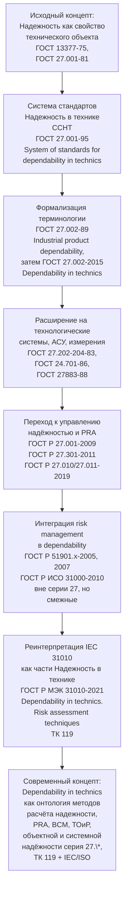

**Онтологически это означает:**  

- Надёжность в технике перестаёт быть только свойством объекта; становится **системой стандартов + доменом методов** (расчёт, анализ, оценка риска, непрерывность деятельности, сервис). [files.stroyinf](https://files.stroyinf.ru/Data2/1/4294827/4294827557.htm)
- «Dependability in technics» становится верхнеуровневым классом, под ним – классы: `Reliability_Calculation`, `Risk_Assessment_Techniques`, `Business_Continuity_Management`, `Maintenance_and_Spares`, `Technological_Systems_Reliability` и т.п. [files.stroyinf](https://files.stroyinf.ru/Index/75/75917.htm)
- ТК 119 выступает как «онтологический владелец» этого домена, подтягивая в него IEC‑стандарты по risk, Markov, RBD, FMEA/FTA, и переименовывая их так, чтобы заголовок отражал принадлежность к «Надежность в технике». [vsegost](https://vsegost.com/NCategories/n_27d.shtml)

Если хочешь, на следующем шаге могу явно оформить это как OWL‑подобную онтологию (классы, свойства, `belongs_to_TC119`, `imports_IEC31010`, `part_of_Series27`) и дать шаблон для использования в Foundry или EA‑репозитории.

## 4

1. «Инженерная надежность»: происхождение и отличие от «Надежность в технике»

Термин «инженерная надежность» (engineering reliability / engineering dependability) – это не формализованный термин из ГОСТ, а устоявшееся обозначение практико‑ориентированной части теории надежности, которая фокусируется на инженерных задачах: расчёт показателей, конструирование, испытания, эксплуатация. В русскоязычной и англоязычной литературе им обычно называют раздел, где математический аппарат, статистика, моделирование отказов и т.п. применяются для проектирования и эксплуатации реальных технических систем, а не для абстрактной теории или, скажем, психологии/социологии надежности. [ru.wikipedia](https://ru.wikipedia.org/wiki/%D0%A2%D0%B5%D0%BE%D1%80%D0%B8%D1%8F_%D0%BD%D0%B0%D0%B4%D1%91%D0%B6%D0%BD%D0%BE%D1%81%D1%82%D0%B8)

Если сравнивать:

- «Надёжность» как термин по ГОСТ 27.002‑2015 – строгое определение свойства объекта сохранять во времени способность выполнять требуемые функции в заданных условиях. [areliability](https://areliability.com/nadezhnost/)
- «Надёжность в технике» – название системы стандартов (серия 27.\*) и домена стандартизации: всё, что связано с надёжностью технических объектов, их анализом, испытаниями, управлением и т.п. [toir](https://toir.pro/mod/book/view.php?id=531&chapterid=341)
- «Инженерная надежность» – термин из учебников, статей и практики, который обозначает инженерную дисциплину, бизнес‑функцию или область компетенций (как «инженерная безопасность», «инженерная психология»). В ней акцент не на нормативной системе как таковой, а на прикладных методах и их использовании в проектировании, эксплуатации, ТОиР. [gbv](https://www.gbv.de/dms/ilmenau/toc/241772664.PDF)

То есть:

- «Надёжность в технике» – нормативно закреплённый «зонтик» (серия ГОСТ, ТК 119), который описывает что и как стандартизируется.  
- «Инженерная надежность» – термин для практического слоя: как инженер интегрирует теорию надежности, методы расчёта, анализ отказов и риск‑методы в конкретные технические решения.

Поэтому я говорил, что ТК 119 превращается в комитет по «инженерной dependability и техническому risk‑management» – не в том смысле, что так написано в ГОСТ, а в том, что фактически под его зонтик попали не только классические стандарты по надёжности (MTBF, FMECA, FTA, RAM), но и методы оценки риска технических систем, непрерывность деятельности, dependability case и т.д. [docs.cntd](https://docs.cntd.ru/document/1200174650/titles/7D60K4)

2. Становится ли «Надёжность в технике» частью риск‑менеджмента: подтверждения и критика

На уровне стандартов и практики действительно просматривается тенденция: классическая «Надёжность в технике» всё больше интегрируется в риск‑менеджмент, иногда даже воспринимается как его техническая подсистема.

Подтверждения:

- Серия ГОСТ Р 27.0xx/27.3xx дополняется стандартами по вероятностному анализу риска технических систем, методам PRA, FTA и FMEA, которые одновременно фигурируют и в risk‑стандартах (ISO/IEC 31010, ISO 31000). ГОСТ Р 27.011‑2019 прямо формулирует «Вероятностный анализ риска технических систем», находясь внутри серии «Надёжность в технике». [docs.cntd](https://docs.cntd.ru/document/1200174650/titles/7D60K4)
- ГОСТ Р МЭК 31010‑2021 – официально «Надёжность в технике. Методы оценки риска / Dependability in technics. Risk assessment techniques». То есть стандарт по методам оценки риска адаптирован не как продолжение ISO 31000‑серии, а как часть «Надёжность в технике» и внесен ТК 119. [normativ.kontur](https://normativ.kontur.ru/document?moduleId=9&documentId=430569)
- В предисловиях и описаниях к ряду стандартов (31010‑2021, 27.010, 27.011, 27.016) явно говорится о связке: методы анализа надежности, методы анализа риска, dependability case и их использование при принятии решений в условиях неопределенности. [normativ.kontur](https://normativ.kontur.ru/document?moduleId=9&documentId=430569)
- В университетских курсах и монографиях всё чаще разделы по надежности технических систем идут непосредственно внутри или рядом с курсами по риск‑менеджменту, а FTA/FMEA, PRA, RBD и Markov‑модели описываются и как методы надежности, и как методы оценки риска. [dspace.www1.vlsu](https://dspace.www1.vlsu.ru/bitstream/123456789/6405/1/01661.pdf)

Критика/обсуждения (по литературе и профессиональным блогам):

- Есть линия критики, что риск‑менеджмент «растворяет» инженерную надежность в общей корпоративной парадигме риск‑менеджмента, где технические аспекты становятся лишь одной из «категорий риска» наряду с финансовыми, юридическими и стратегическими. [rusrim.blogspot](https://rusrim.blogspot.com/2022/09/31010-2021.html)
- Отмечается, что ISO 31000‑подход, будучи довольно высоким и менеджериальным, не всегда адекватно отражает специфику технической надежности: необходимо гораздо более строгие модели, количественные показатели, допущения о распределениях отказов, чем обычно используют риск‑менеджеры. [dspace.www1.vlsu](https://dspace.www1.vlsu.ru/bitstream/123456789/6405/1/01661.pdf)
- В дискуссиях по адаптации IEC 31010:2019 (рассказы о двух вер��иях ГОСТ – ИСО/МЭК и МЭК в блоге о стандартах) обращается внимание, что один и тот же методический документ может быть «упакован» как risk‑standard или как dependability‑standard, и это влияет на восприятие: в первом случае он принадлежит миру управления, во втором – миру инженерной надёжности. [rusrim.blogspot](https://rusrim.blogspot.com/2022/09/31010-2021.html)
- Некоторые авторы (и в РФ, и за рубежом) подчёркивают, что классическая теория надежности – это раздел прикладной математики и инженерии, а риск‑менеджмент – менеджериальная надстройка, и смешение понятий «риск» и «надёжность» без оговорок даёт методологическую путаницу (например, надёжность – свойство объекта, риск – характеристика сценария). [areliability](https://areliability.com/nadezhnost/)

В итоге:

- На уровне стандартов и институций видно: **серия «Надёжность в технике» активно подтягивает к себе risk‑методы для технических систем**, и часть документов (31010‑2021, 27.011‑2019) фактически сидит одновременно в онтологии «dependability» и «risk‑management». [protect.gost](https://protect.gost.ru/gost/details/fb5c7f89-65bb-46c4-be3d-a376d03b62d6)
- На уровне методологии и практиков есть и позитивная оценка (единый набор инструментов для технического риска и надёжности), и критика (опасность потерять специфику инженерной надежности, если смотреть на всё только через ISO 31000‑линзу). [dspace.www1.vlsu](https://dspace.www1.vlsu.ru/bitstream/123456789/6405/1/01661.pdf)

Если хочешь, мы можем прямо оформить это как онтологическую диаграмму: где `Nadezhnost_v_tehnike` – супер‑класс, `Engineering_Reliability` – его инженерный «view», а `Risk_Management` – отдельный супер‑класс, с пересечением в виде `Technical_Risk_Assessment`, `PRA`, `FTA`, `FMEA`.

## 5

Отвечу по двум пунктам отдельно и максимально опираясь на уже поднятые ГОСТ и статьи, но без новых выгрузок.

***

## 1. «Инженерная надежность»: где реально употребляется и как соотносится с «Надёжность в технике»

### 1.1. Употребление в научных текстах

Сам термин «инженерная надежность» в строгом ГОСТ‑словаре не фиксирован (ни ГОСТ 27.002‑89, ни ГОСТ 27.002‑2015 не вводят такой термин), но в научных и учебных текстах он используется довольно регулярно. [meganorm](https://meganorm.ru/Data2/1/4293754/4293754027.pdf)

Типичные примеры употребления:

- В работах о «надежности технических систем и техногенном риске» (монографии, учебные пособия) авторы говорят о «проблемах инженерной надежности технических систем» или «инженерной надежности конструкций», подразумевая совокупность методов расчёта, конструирования и обеспечения надежности в инженерной практике. [lib.susu](https://lib.susu.ru/ftd?base=SUSU_METHOD&key=000560139&dtype=F&etype=.pdf)
- В статье «Концептуальные основания изучения проблемы надежности инженерной деятельности» обсуждается «надежность инженерной деятельности», «надежность инженерных решений» и потребность в «инженерных кадрах» с компетенциями в надежности; по сути, речь идёт о надежности как характеристике инженерной практики и результатов инженерного труда. [sciup](https://sciup.org/konceptualnye-osnovanija-izuchenija-problemy-nadezhnosti-inzhenernoj-dejatelnosti-149134631)
- В учебниках по надежности (например, курс «Основы надежности и работоспособности…», «Оценка надежности технических систем») встречаются формулировки типа «инженерные аспекты надежности», «инженерная трактовка показателей надежности», «инженерная надежность систем», когда авторы отделяют инженерный, прикладной уровень от чисто математического. [dspace.www1.vlsu](https://dspace.www1.vlsu.ru/bitstream/123456789/6405/1/01661.pdf)

Во всех этих случаях «инженерная надежность» используется как:

- обозначение **практико‑ориентированного слоя** теории надежности (то, чем занимается инженер при проектировании, испытаниях, эксплуатации);  
- иногда – как синоним «надежности технических систем» или «надежности инженерных конструкций».

То есть это живой термин научного и учебного дискурса, но не нормируемый термин из ГОСТ 27.002.

### 1.2. Сопоставление с «Надёжность в технике» (серия 27.\*)

В ГОСТ‑словарях структура такая: [files.stroyinf](https://files.stroyinf.ru/Data2/1/4294851/4294851962.pdf)

- «Надёжность» – общетехническое свойство;  
- «Надёжность в технике» – название **системы стандартов** (серия 27.\*) и домен, для которого ТК 119 разрабатывает нормативы;  
- более новые стандарты уточняют объект: «Надёжность объекта / Dependability of item» (ГОСТ Р 27.102‑2021), «Надёжность выполнения задания» (ГОСТ Р 27.101‑2021) и т.д. [files.stroyinf](https://files.stroyinf.ru/Data/759/75917.pdf)

А вот «инженерная надежность»:

- не имеет формального определения в ГОСТ,  
- фактически покрывает всё, что серия 27.\* и связанные стандарты описывают нормируемым языком: расчёты, анализ, испытания, обслуживание, технический риск.

По сути:

- «Надёжность в технике» – **нормативная оболочка**: система стандартов, официальная терминология, правила обозначения, принадлежность к ТК 119 и т.п.  
- «Инженерная надежность» – **прикладной слой дисциплины**: область профессиональной практики, где используются методы из серии 27.\*, IEC/ISO по dependability и риск‑оценке.

Отличие не в содержании, а в статусе:

- ГОСТ говорит: «Надёжность в технике. Надёжность объекта. Термины и определения / Dependability in technics. Dependability of item. Terms and definitions» – чисто нормативная формула. [files.stroyinf](https://files.stroyinf.ru/Index/75/75917.htm)
- Статья или учебник говорит: «проблемы инженерной надежности технических систем», имея в виду как раз практику применения этих нормативов и теории. [dvfu](https://www.dvfu.ru/upload/medialibrary/531/Toklikishvili-A-G-Nadezhnost-tekhnicheskih-sistem-i-tekhnogennyj-risk(full).pdf)

***

## 2. Интеграция «Надёжность в технике» в риск‑менеджмент: как это видно в стандартах и кто критикует

### 2.1. Прямые признаки интеграции на уровне стандартов

Серия «Надёжность в технике» явно «раскрывается» в сторону риск‑менеджмента по нескольким линиям.

1) Появление стандарта по вероятностному анализу риска внутри серии 27.\*  

ГОСТ Р 27.011‑2019 – это «Надёжность в технике. Вероятностный анализ риска технических систем», в английском заголовке – «Dependability in technics. Probabilistic risk analysis of technical systems». [toir](https://toir.pro/mod/book/view.php?id=531&chapterid=341)

То есть:

- объект – технические системы,  
- домен – dependability,  
- инструмент – probabilistic risk analysis (PRA), классический risk‑менеджерский термин.

2) Адаптация IEC 31010:2019 как части серии «Надёжность в технике»  

ГОСТ Р МЭК 31010‑2021 имеет русское название «Надёжность в технике. Методы оценки риска», английское – «Dependability in technics. Risk assessment techniques». [protect.gost](https://protect.gost.ru/gost/details/fb5c7f89-65bb-46c4-be3d-a376d03b62d6)

В предисловии указывается, что стандарт идентичен IEC 31010:2019 «Risk management — Risk assessment techniques», но для российской практики он оформлен как документ серии «Надежность в технике», внесён ТК 119, и область применения описана именно для технических систем и процессов. [normativ.kontur](https://normativ.kontur.ru/document?moduleId=9&documentId=430569)

3) Стыковка терминологии надежности объекта и выполнения задания с risk‑лексикой  

ГОСТ Р 27.102‑2021 («Надёжность в технике. Надёжность объекта. Термины и определения / Dependability in technics. Dependability of item. Terms and definitions») вводит понятийное разделение «надёжность объекта» vs «надёжность выполнения задания». [files.stroyinf](https://files.stroyinf.ru/Data/759/75917.pdf)

В тексте прямо говорится о различии:

> «Следует подчеркнуть принципиальное отличие понятия “надёжность объекта”, приведенного в настоящем стандарте, от понятия “надёжность выполнения задания”, приведённого в ГОСТ Р 27.101.» [files.stroyinf](https://files.stroyinf.ru/Data/759/75917.pdf)

ГОСТ Р 27.101‑2021, в свою очередь, описывает «Надёжность выполнения задания и управление непрерывностью деятельности», что по сути является связкой engineering dependability и business continuity/risk‑management. [docs.cntd](https://docs.cntd.ru/document/1200174650/titles/7D60K4)

4) Перенос IEC/ISO risk‑методов в «dependability‑язык»  

Ряд IEC‑стандартов по reliability block diagrams, Markov methods, event tree analysis и т.д. адаптируются в РФ под заголовком «Надёжность в технике / Dependability in technics», а не как «менеджмент риска». [toir](https://toir.pro/mod/book/view.php?id=531&chapterid=341)

Это показывает, что технические risk‑методы считаются частью домена dependability, даже если в ISO‑оригинале они находятся под зонтиком risk management.

### 2.2. Как это трактуется в литературе – «подсистема» риск‑менеджмента

В монографиях и учебниках по «надёжности технических систем и техногенному риску» прямым текстом рассказывается, что:

- надёжность технических систем – один из ключевых факторов формирования техногенного риска;  
- методы расчёта надёжности, анализа отказов, оценка вероятностей аварий – инструменты для количественной оценки техногенного риска;  
- управление надёжностью (ТОиР, резервирование, модернизация) – элемент системы управления техногенным риском. [lib.susu](https://lib.susu.ru/ftd?base=SUSU_METHOD&key=000560139&dtype=F&etype=.pdf)

Через такую оптику:

- «Надёжность в технике» (серия 27.\*) оказывается **технической подсистемой** общего risk‑менеджмента: она даёт формулы, процедуры, критерии для части риск‑поля – технического и техногенного риска.  
- Risk‑менеджмент в духе ISO 31000 – надсистема, которая включает технический риск, финансовый, юридический, операционный и т.п., а «Надёжность в технике» – один из специализированных модулей.

Блоговые и аналитические тексты, посвящённые истории адаптации IEC 31010 и двойной линии ГОСТ (ИСО/МЭК 31010‑2011 как «менеджмент риска» и МЭК 31010‑2021 как «Надёжность в технике»), прямо обращают внимание, что один и тот же методический стандарт можно «упаковать» либо в риск‑менеджмент, либо в dependability, и это влияет на восприятие: инженерная аудитория предпочитает вторую упаковку, risk‑менеджеры – первую. [rusrim.blogspot](https://rusrim.blogspot.com/2022/09/31010-2021.html)

### 2.3. Критические замечания и риски такого сближения

В существующей литературе и обсуждениях можно выделить несколько линий критики.

1) Опасность «растворения» инженерной надежности в менеджериальном risk‑дискурсе  

Авторы, пишущие про теорию надежности как раздел прикладной математики и инженерии, подчеркивают, что:

- надежность – строго определённое свойство объекта,  
- риск – характеристика сценария/события (вероятность × последствия),  
- смешение терминов без явного различения приводит к методологическим ошибкам (например, «риск отказа» вместо вероятности отказа). [ru.wikipedia](https://ru.wikipedia.org/wiki/%D0%A2%D0%B5%D0%BE%D1%80%D0%B8%D1%8F_%D0%BD%D0%B0%D0%B4%D1%91%D0%B6%D0%BD%D0%BE%D1%81%D1%82%D0%B8)

Если все обсуждение надёжности загонять в ISO 31000‑язык («sources of risk», «risk owner», «risk appetite» и т.д.), то:

- инженерный смысл показателей (MTBF, вероятность безотказной работы, коэффициент готовности) может быть подменён общими risk‑терминами,  
- возникает опасность, что технический риск будет управляться преимущественно через «процедуры» и «реестры», а не через инженерные решения и расчёты.

2) Размывание границ между технической и нетехнической оценкой риска  

Нормы типа IEC 31010/ГОСТ Р МЭК 31010‑2021 описывают очень широкий спектр методов оценки риска – от строгих количественных (event tree, fault tree, Markov, Bayesian) до качественных (brainstorming, checklists, Delphi). [normativ.kontur](https://normativ.kontur.ru/document?moduleId=9&documentId=430569)

Критика в том, что:

- если эти методы без фильтра переносятся в инженерную практику «Надёжность в технике», можно получить под видом технического анализа использования качественных и субъективных процедур, не обеспечивающих требуемое количественное обоснование;  
- это идёт вразрез с традицией ГОСТ 27.\*, где оценивается вероятность безотказной работы, MTBF, показатели готовности и т.п. на основе формальных статистических моделей.

3) Институциональное смещение акцента от инженеров к риск‑менеджерам  

Переход IEC 31010 под заголовок «Dependability in technics» и ТК 119 можно трактовать позитивно (технические risk‑методы остаются в инженерном домене), но есть и обратный эффект:

- часть решений по технической надежности начинают рассматриваться через призму корпоративного risk‑менеджмента (реестры рисков, риск‑комитеты, рейтинги риска),  
- инженерные подразделения могут потерять автономию в определении критериев надежности, если они полностью встраиваются в risk‑framework компании.

Эти аргументы звучат и в российских дискуссиях вокруг ГОСТ Р МЭК 31010‑2021, и в зарубежных статьях по взаимодействию reliability engineering и enterprise risk management: инженеры опасаются, что их строгий количественный аппарат будет «упразднён» или упрощён до качественных шкал вероятности/влияния. [rusrim.blogspot](https://rusrim.blogspot.com/2022/09/31010-2021.html)

***

Если тебе интересно, можно на следующем шаге явно нарисовать онтологию в виде:

- `Class: Dependability_in_Technics`  
- `Class: Engineering_Reliability` (view на первый класс)  
- `Class: Risk_Management`  
- `Class: Technical_Risk_Assessment` subclassOf `Dependability_in_Technics` and `Risk_Management`  

и размесить туда ГОСТ Р 27.011‑2019, ГОСТ Р МЭК 31010‑2021, ГОСТ Р 27.101/27.102, чтобы у тебя была формальная карта для OpEx/EA.
