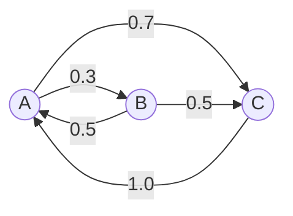

## 1 markov soft
программы и сервисы визуализации марковских цепей

Для визуализации марковских цепей есть как специализированные программы, так и инструменты общего назначения, которые можно использовать в связке с библиотеками. Я подобрала варианты под разные сценарии — от готовых веб-сервисов до инструментов для самостоятельной сборки.

## Веб-сервисы и интерактивные платформы
* **[markov.yoriz.co.uk](https://markov.yoriz.co.uk/)** — интерактивный симулятор. Можно менять вероятности переходов прямо в браузере и сразу видеть, как меняется граф и траектория системы. Удобно для экспериментов и наглядного разбора примеров.
* **[Desmos](https://www.desmos.com/calculator/tclco6ytwr?lang=ru)** — в калькуляторе Desmos есть инструмент для визуализации матрицы переходов марковской цепи. Подходит, если нужно быстро набросать граф и посмотреть на связи.

 [```7```](https://markov.yoriz.co.uk/)[```2```](https://www.desmos.com/calculator/tclco6ytwr?lang=ru)

## Программы для локальной работы
* **Программа Волкова Д. А.** — десктотное приложение (работает на Windows 7/8/10). Позволяет вручную задать исходные состояния и интенсивности переходов, автоматически построить граф состояний, рассчитать финальные вероятности и сохранить отчёт в PDF. Хороший выбор, если нужна комплексная работа с моделью и документирование результатов. [```3```](https://elibrary.ru/wxmpwy)

## Инструменты для программирования (Python)
Если вы работаете в Python, есть несколько путей:
* **Модуль `markovchain` на PyPI**. Позволяет создать объект, представляющий марковскую цепь по матрице переходов, и построить граф с помощью метода `createTransitionGraph()` с последующей визуализацией через `draw()`. [```6```](https://pypi.org/project/markovchain/)[```8```](https://github.com/enlacroix/markov_chains)
* **Модуль `markov_chains` на GitHub**. Помимо построения графа, даёт инструменты для анализа: выявление циклических подклассов, существенных состояний и их периода (метод `describe()`). [```8```](https://github.com/enlacroix/markov_chains)
* **Библиотека NetworkX**. Сама по себе не специализируется на марковских цепях, но отлично подходит как основа: с её помощью можно построить граф переходов из матрицы (например, полученной из данных) и передать результат в инструменты визуализации вроде **Graphviz** (для файлов формата `.dot`) или **Gephi** (для `.gexf`). [```5```](https://habr.com/ru/companies/skyeng/articles/473124/)

## Какой путь выбрать?
* Если нужно быстро проверить идею и поэкспериментировать — берите интерактивный онлайн-сервис.
* Если задача — провести полноценный анализ (найти финальные вероятности, классифицировать состояния), а потом оформить отчёт — подойдёт локальная десктопная программа.
* Если вы уже работаете с данными и матрицами в Python, логичнее встроить визуализацию в рабочий процесс, используя специализированные библиотеки.

## 1.1

Ниже — развёрнутый анализ инструментов и сервисов для визуализации марковских цепей: с разбивкой по задачам, форматам вывода, возможностям анализа и примерами того, как их можно применять в связке (в том числе с учётом вашего опыта работы с браузерными JS-проектами и GitHub Pages).

---

## Онлайн-сервисы и быстрые симуляторы

**markov.yoriz.co.uk** — самый простой способ «покрутить» цепь без кода.  
- **Что умеет:** интерактивно менять вероятности переходов, видеть перестраивающийся граф, запускать симуляции траекторий.  
- **Для чего подходит:** обучение, объяснение идеи студентам, проверка гипотез «на пальцах».  
- **Ограничения:** нет экспорта в виде кода или графа для дальнейшего анализа; нельзя загрузить свою матрицу переходов.

**Desmos (калькулятор)** — если нужно визуализировать именно матрицу переходов и простые связи.  
- **Плюсы:** быстрый старт, понятный интерфейс.  
- **Минусы:** не предназначен для серьёзных графов; масштабирование и читаемость быстро ухудшаются.

---

## Десктопные и академические программы

**Программа Волкова Д. А.** (Windows) — хороший вариант, когда нужен отчёт и расчёты «в одном окне».  
- **Функционал:** ввод состояний и интенсивностей, автоматический граф, расчёт финальных вероятностей, экспорт в PDF.  
- **Сильная сторона:** закрывает задачу «построить, посчитать, оформить» без программирования.  
- **Слабая сторона:** закрытая экосистема, нет интеграции с кодом/скриптами.

---

## Python-стек: библиотеки и как их комбинировать

### markovchain (PyPI)
- **Назначение:** быстрое создание объекта цепи по матрице переходов, базовый граф.  
- **Как использовать:** `createTransitionGraph()` → `draw()`.  
- **Когда брать:** если нужна простая визуализация и минимальные вычисления.

### markov_chains (GitHub, enlacroix)
- **Плюс:** помимо графа, умеет классифицировать состояния — выделять циклические подклассы, существенные состояния, определять периоды.  
- **Практический смысл:** это как раз то, что нужно для анализа структуры цепи (эргодичность, поглощающие состояния и т.п.).

### NetworkX + Graphviz / Gephi
Это «золотой стандарт» для гибких задач.
- **NetworkX:** строит граф из матрицы, хранит веса рёбер (вероятности), позволяет программно фильтровать состояния, выделять компоненты связности.  
- **Graphviz:** делает красивые статические графы в формате `.dot` → PNG/SVG.  
- **Gephi:** подходит, если состояний много и важна наглядная укладка графа (ForceAtlas2 и аналоги). Поддерживает `.gexf`.  
- **Сценарий:** вы формируете граф в NetworkX, экспортируете в Graphviz для отчётов или в Gephi для сложной визуализации.

### Matplotlib / Seaborn
Если нужны не графы, а временные траектории или распределения.
- **Примеры визуализации:** траектории состояний во времени, гистограммы распределения по состояниям, динамика сходимости к стационарному распределению.  
- **Полезно:** когда важно показать не структуру, а поведение цепи (например, для доклада или статьи).

### Plotly
Интерактивные графы и траектории прямо в браузере (Jupyter, VS Code Notebook, GitHub Pages).  
- **Плюсы:** можно навести на узел/ребро и увидеть вероятности, зумить/перетаскивать, встраивать в веб.  
- **Связь с вашим опытом:** Plotly-графики легко встроить в браузерный JS-проект и опубликовать на GitHub Pages — это близко к тому, что вы уже делали с SVG и диаграммами.

---

## R-экосистема (если нужен статистический уклон)

**Пакет markovchain в R** — аналог одноимённой Python-библиотеки, но с упором на статистические тесты и формальные проверки свойств цепи.  
**Пакет igraph** — мощная альтернатива NetworkX для построения и анализа графов.  
**ggplot2** — для аккуратных статических графиков.  

---

## Инструменты для формальных моделей и MDP

Если дальше вы планируете переходить к **марковским процессам принятия решений (MDP)** и обучению с подкреплением:
- **MDPtoolbox (Python/R):** численные методы для MDP, можно визуализировать политику и значения состояний отдельно от графа переходов.  
- **Gym + кастомная визуализация:** для симуляций и анимации траекторий агента.

---

## Графические редакторы и «ручной» подход

Иногда проще нарисовать граф вручную и подписать вероятности:
- **Draw.io (diagrams.net):** бесплатно, экспорт в PNG/SVG, удобно для презентаций и документации.  
- **Lucidchart:** больше шаблонов, совместная работа.  
- **Mermaid:** если вы уже использовали диаграммы в Markdown — можно описать цепь как направленный граф с весами и вставить в README на GitHub. Это полностью ложится на ваш опыт с диаграммами Mermaid и публикацией на GitHub Pages.

Пример Mermaid для простой цепи:


---

## Как выбрать инструмент под задачу

| Задача | Лучший выбор | Почему |
|--------|--------------|--------|
| Быстро показать идею, «покрутить» вероятности | markov.yoriz.co.uk | Минимум усилий, мгновенная обратная связь |
| Построить граф и посчитать финальные вероятности, оформить отчёт | Программа Волкова / NetworkX + Matplotlib | Полные расчёты и готовый вывод |
| Встроить визуализацию в JS-проект, опубликовать на GitHub Pages | Plotly / Mermaid / NetworkX → SVG | Интерактив, совместимость с вебом |
| Анализ структуры цепи (существенные состояния, эргодичность) | markov_chains (enlacroix) / NetworkX | Классификация состояний, формальные свойства |
| Много состояний, нужна красивая укладка графа | NetworkX + Gephi | Лучшая визуализация сложных графов |
| Статистический анализ и проверка гипотез | R: markovchain + igraph + ggplot2 | Статистические тесты, строгие методы |
| MDP и обучение с подкреплением | MDPtoolbox + кастомные графики | Поддержка политик, значений состояний |

---

## Практические сценарии с учётом вашего стека

Учитывая, что вы работали с браузерным JS, SVG, GitHub Pages и диаграммами:

1. **Быстрый прототип на Mermaid.** Описываете цепь в Markdown, вставляете в README — сразу есть понятная визуализация для коллег и репозитория.
2. **Интерактивная панель на Plotly.** Генерируете граф и траектории в Python, экспортируете JSON-данные, затем в JS-приложении отображаете интерактивные графики. Это логично продолжает ваш опыт с SVG Viewer и диаграммами.
3. **Статический SVG-граф через NetworkX + Graphviz.** Делаете красивый граф, сохраняете как SVG, размещаете на GitHub Pages, при необходимости добавляете JS-обёртку для подсветки состояний при наведении.

---

## Важные нюансы визуализации

- **Подписи весов.** На рёбрах обязательно должны быть вероятности (или интенсивности для непрерывного времени). Без этого граф теряет смысл.
- **Цветовое кодирование.** Можно выделять поглощающие, существенные, периодические классы разными цветами — это сильно улучшает читаемость.
- **Масштабирование.** При большом числе состояний граф быстро становится нечитаемым: лучше либо группировать состояния, либо использовать Gephi/Force-алгоритмы, либо показывать только ключевые переходы.
- **Анимация траекторий.** Если цель — объяснить динамику, полезно добавить симуляцию нескольких траекторий поверх графа (Plotly, простой JS-скрипт).

---

