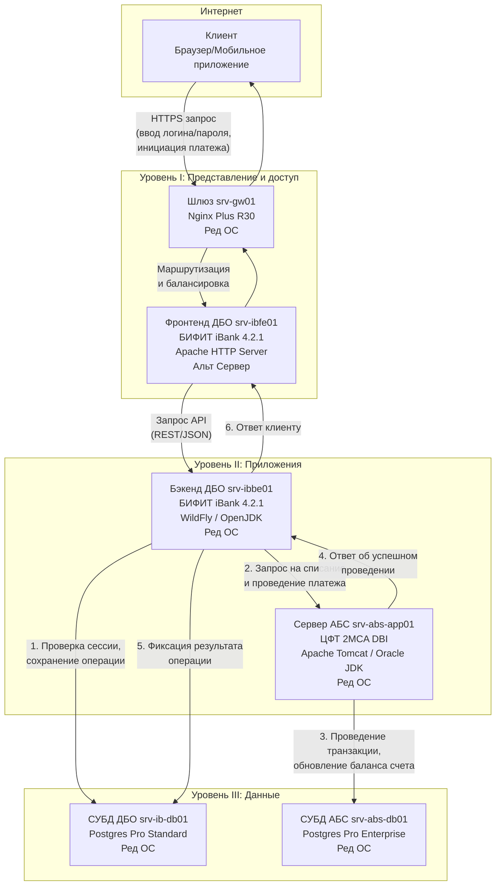
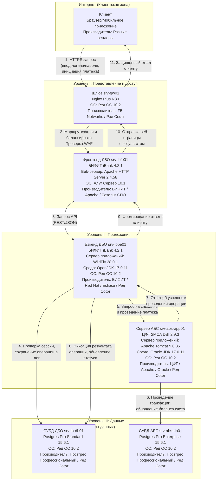

## example 1
Cоставь пример трехзвенной архитектуры серверов банка (on-premise), включая АБС (ЦФТ-Банк Платформы 2MCA DBI), CRM (Terrasoft), корпоративное хранилище (Open Source), кредитный конвейер (ELMA), ДБО (Бифит) и др.  
Укажи таблицей для каждого звена (кроме клиентского), включая поля: сокращенное название системы, полное название системы, разработчик, версия ПО, тип модель сервера, изготовитель сервера. Максимально подробно.   
Добавь схему в mermaid взаимодействия с клиентом из интернет (через ДБО).

### **Исправленная детализация Уровня данных (Data Tier) с разделением СУБД**

#### **УРОВЕНЬ III: Уровень данных (Data Tier)**

**Сервер 3.1: Сервер СУБД АБС (Postgres Pro)**
*   **Роль:** Хранение транзакционных данных АБС.
*   **Имя узла:** `srv-abs-db01.data.local`
*   **Аппаратное обеспечение:**
    *   **Модель:** Aquarius C86 T1F D88
    *   **Производитель сервера:** ГК «Аквариус», Россия.
    *   **CPU:** 4 x Intel Xeon Platinum 8468 (96 ядер/192 потока). **Производитель:** Intel Corp., США.
    *   **RAM:** 1.5 TB DDR5-4800 ECC. **Производитель:** Samsung Electronics, Южная Корея.
    *   **Дисковые массивы:** **Система:** 2 x 960 GB SSD SAS (RAID-1). **Производитель дисков:** Seagate Technology, США. **Данные:** 12 x 15.36 TB NVMe SSD (RAID-50). **Производитель дисков:** Samsung Electronics, Южная Корея. **WAL:** 2 x 800 GB Intel Optane SSD (RAID-1). **Производитель:** Intel Corp., США.
*   **Системное ПО:**
    *   **ОС:** Ред ОС Сервер 10.2. **Производитель:** ООО «Ред Софт», Россия.
*   **Прикладное ПО:**
    *   **СУБД:** Postgres Pro Enterprise 15.6.1. **Производитель:** ООО «Постгрес Профессиональный», Россия.
    *   **Утилиты резервного копирования:** Postgres Pro pg_probackup 15.6.1. **Производитель:** ООО «Постгрес Профессиональный», Россия.

**Сервер 3.2: Сервер СУБД ДБО БИФИТ iBank**
*   **Роль:** Хранение данных интернет-банка (шаблоны, платежи, сессии, история операций).
*   **Имя узла:** `srv-ib-db01.data.local`
*   **Аппаратное обеспечение:**
    *   **Модель:** Aquarius C86 T1F S26
    *   **Производитель сервера:** ГК «Аквариус», Россия.
    *   **CPU:** 2 x Intel Xeon Gold 5420+ (28 ядра/56 потоков). **Производитель:** Intel Corp., США.
    *   **RAM:** 384 GB DDR5-4800 ECC. **Производитель:** Micron Technology, США.
    *   **Диски:** 2 x 960 GB SSD SAS (RAID-1, ОС), 6 x 7.68 TB NVMe SSD (RAID-10, данные). **Производитель дисков:** Kioxia Corporation, Япония.
*   **Системное ПО:**
    *   **ОС:** Ред ОС Сервер 10.2. **Производитель:** ООО «Ред Софт», Россия.
*   **Прикладное ПО:**
    *   **СУБД:** Postgres Pro Standard 15.6.1. **Производитель:** ООО «Постгрес Профессиональный», Россия.

**Сервер 3.3: Сервер СУБД CRM Creatio**
*   **Роль:** Хранение данных CRM (клиенты, лиды, сделки, взаимодействия).
*   **Имя узла:** `srv-crm-db01.data.local`
*   **Аппаратное обеспечение:**
    *   **Модель:** Dell PowerEdge R760xd
    *   **Производитель сервера:** Dell Inc., США.
    *   **CPU:** 2 x Intel Xeon Gold 6448Y (32 ядра/64 потока). **Производитель:** Intel Corp., США.
    *   **RAM:** 512 GB DDR5-4800. **Производитель:** SK Hynix, Южная Корея.
    *   **Диски:** 2 x 960 GB SSD SAS (RAID-1, ОС), 8 x 7.68 TB SSD SAS (RAID-10, данные). **Производитель дисков:** Dell (OEM), США.
*   **Системное ПО:**
    *   **ОС:** Microsoft Windows Server 2022 Datacenter. **Производитель:** Microsoft Corporation, США.
*   **Прикладное ПО:**
    *   **СУБД:** Microsoft SQL Server 2022 Enterprise Edition (CU 12). **Производитель:** Microsoft Corporation, США.

**Сервер 3.4: Сервер СУБД Кредитного конвейера (ELMA BPM)**
*   **Роль:** Хранение данных процессов, документов и журналов ELMA BPM.
*   **Имя узла:** `srv-loan-db01.data.local`
*   **Аппаратное обеспечение:**
    *   **Модель:** TATLIN 2.0 D82
    *   **Производитель сервера:** АО «НЦИТ» (YADRO), Россия.
    *   **CPU:** 2 x Intel Xeon Gold 5420+ (28 ядра/56 потоков). **Производитель:** Intel Corp., США.
    *   **RAM:** 256 GB DDR5-4800 ECC. **Производитель:** Samsung Electronics, Южная Корея.
    *   **Диски:** 2 x 480 GB SSD SATA (RAID-1, ОС), 6 x 3.84 TB NVMe SSD (RAID-10, данные). **Производитель дисков:** Intel Corp., США.
*   **Системное ПО:**
    *   **ОС:** Альт Сервер 10.1. **Производитель:** ООО «Базальт СПО», Россия.
*   **Прикладное ПО:**
    *   **СУБД:** Postgres Pro Standard 15.6.1. **Производитель:** ООО «Постгрес Профессиональный», Россия.

**Сервер 3.5: Сервер базы данных Корпоративного хранилища (DWH DB)**
*   **Роль:** Хранение консолидированных исторических данных, аналитических витрин.
*   **Имя узла:** `srv-dwh-db01.data.local`
*   **Аппаратное обеспечение:**
    *   **Модель:** Aquarius C86 T1F D88
    *   **Производитель сервера:** ГК «Аквариус», Россия.
    *   **CPU:** 2 x Intel Xeon Platinum 8468 (48 ядер/96 потоков). **Производитель:** Intel Corp., США.
    *   **RAM:** 768 GB DDR5-4800 ECC. **Производитель:** Micron Technology, США.
    *   **Дисковые массивы:** **Система:** 2 x 960 GB SSD SAS (RAID-1). **Горячие данные:** 8 x 15.36 TB NVMe SSD (RAID-10). **Холодные данные:** 12 x 18 TB HDD SAS (RAID-6). **Производитель дисков:** Seagate Technology, США.
*   **Системное ПО:**
    *   **ОС:** Ред ОС Сервер 10.2. **Производитель:** ООО «Ред Софт», Россия.
*   **Прикладное ПО:**
    *   **СУБД (слой витрин):** Postgres Pro Enterprise 15.6.1. **Производитель:** ООО «Постгрес Профессиональный», Россия.
    *   **OLAP-движок:** ClickHouse 24.5.1 (standalone). **Производитель:** ClickHouse, Inc., США.

**Сервер 3.6: Сервер системы хранения данных (СХД) и резервного копирования**
*   **Роль:** Централизованное хранение резервных копий и файловых ресурсов.
*   **Имя узла:** `srv-storage01.backup.local`
*   **Аппаратное обеспечение:**
    *   **Модель:** Аэродиск S3000 (All-Flash + Hybrid)
    *   **Производитель СХД:** ООО «Аэродиск», Россия.
    *   **Контроллеры:** 2 активных контроллера.
    *   **Кэш:** 1 TB DRAM + 3.2 TB NVMe. **Производитель памяти:** Samsung Electronics, Южная Корея.
    *   **Дисковые пулы:** **Флэш-пул:** 24 x 3.84 TB SSD. **Производитель:** Аэродиск (OEM). **Гибридный пул:** 60 x 16 TB HDD. **Производитель:** Western Digital, США.
*   **Системное ПО:**
    *   **Прошивка СХД:** Аэродиск ОС 5.2. **Производитель:** ООО «Аэродиск», Россия.
*   **Прикладное ПО:**
    *   **Сервер резервного копирования:** Veeam Backup & Replication 12.2. **Производитель:** Veeam Software Group GmbH, Швейцария (разработка — Россия).

---

### **Схема взаимодействия клиента через ДБО (Mermaid)**

**Пояснение к схеме:**
1.  **Уровень I (Представление):** Клиент взаимодействует с безопасным шлюзом (`srv-gw01`), который направляет трафик на веб-интерфейс (`srv-ibfe01`).
2.  **Уровень II (Приложения):** Бизнес-логика обработки запроса выполняется на сервере `srv-ibbe01`. Для проведения финансовой транзакции он обращается к ядру АБС (`srv-abs-app01`).
3.  **Уровень III (Данные):**
    *   Данные сессий, шаблонов и логов ДБО хранятся в своей СУБД (`srv-ib-db01`).
    *   Изменение состояния счета (баланса) проводится в основной транзакционной СУБД АБС (`srv-abs-db01`).
4.  Ответ проходит обратный путь к клиенту, информируя его о результате операции.

## example 2
Еще детальнее

# Трехуровневая архитектура ИТ-инфраструктуры банка

## Полная спецификация серверных компонентов

### **УРОВЕНЬ I: Уровень представления и доступа (Presentation Tier)**

#### **Сервер 1.1: Шлюз безопасности и балансировки нагрузки (DMZ)**
| Параметр | Значение |
| :--- | :--- |
| **Роль и имя узла** | `srv-gw01.dmz.local` |
| **Назначение** | Терминация SSL, балансировка нагрузки L7, защита WAF, маршрутизация запросов |
| **Сетевое положение** | Сегмент DMZ (периметр) |
| **Аппаратное обеспечение** | |
| **Модель сервера** | TATLIN 2.0 S24 |
| **Производитель сервера** | АО «НЦИТ» (бренд YADRO), Россия |
| **Процессор** | 2 x Intel Xeon Silver 4410Y (20 ядер/40 потоков) |
| **Производитель процессора** | Intel Corp., США |
| **Оперативная память** | 128 GB DDR4-3200 ECC |
| **Производитель памяти** | Micron Technology, США / Samsung Electronics, Южная Корея |
| **Накопители** | 2 x 480 GB SSD SATA (RAID-1), 4 x 1.92 TB NVMe SSD (RAID-10) |
| **Производитель накопителей** | Western Digital, США / Samsung Electronics, Южная Корея |
| **Сетевой адаптер** | 2 x Mellanox ConnectX-5 (25 GbE) |
| **Производитель сетевого адаптера** | NVIDIA, США |
| **Системное ПО** | |
| **Операционная система** | Ред ОС Сервер 10.2 |
| **Производитель ОС** | ООО «Ред Софт», Россия |
| **Межсетевой экран** | iptables (nftables) |
| **Производитель МЭ** | Сообщество NetFilter |
| **Прикладное ПО** | |
| **Веб-сервер/Балансировщик** | Nginx Plus R30 |
| **Производитель** | F5 Networks, Inc., США |
| **Модуль WAF** | NAXSI 1.3 |
| **Производитель** | Open-Source проект |
| **API Gateway** | Kong Gateway (OSS) 3.4.1 |
| **Производитель** | Kong Inc., США |

#### **Сервер 1.2: Фронтенд ДБО БИФИТ iBank (Веб-интерфейс)**
| Параметр | Значение |
| :--- | :--- |
| **Роль и имя узла** | `srv-ibfe01.app.local` |
| **Назначение** | Обслуживание веб-интерфейса и статических ресурсов интернет-банка |
| **Сетевое положение** | Сегмент приложений |
| **Аппаратное обеспечение** | |
| **Модель сервера** | Aquarius C86 T1F S26 |
| **Производитель сервера** | ГК «Аквариус», Россия |
| **Процессор** | 2 x Intel Xeon Silver 4310 (24 ядра/48 потоков) |
| **Производитель процессора** | Intel Corp., США |
| **Оперативная память** | 96 GB DDR4-3200 ECC |
| **Производитель памяти** | Micron Technology, США |
| **Накопители** | 2 x 480 GB SSD SAS (RAID-1) |
| **Производитель накопителей** | Seagate Technology, США |
| **Системное ПО** | |
| **Операционная система** | Альт Сервер 10.1 |
| **Производитель ОС** | ООО «Базальт СПО», Россия |
| **Прикладное ПО** | |
| **Веб-сервер** | Apache HTTP Server 2.4.58 |
| **Производитель** | Apache Software Foundation, США |
| **Интерфейс ДБО** | БИФИТ iBank (Web Frontend) 4.2.1 |
| **Производитель** | ООО «БИФИТ», Россия |
| **Среда исполнения** | Node.js 20.11.1 |
| **Производитель** | OpenJS Foundation |

---

### **УРОВЕНЬ II: Уровень приложений (Application Tier)**

#### **Сервер 2.1: Сервер приложений АБС ЦФТ (Ядро)**
| Параметр | Значение |
| :--- | :--- |
| **Роль и имя узла** | `srv-abs-app01.app.local` |
| **Назначение** | Выполнение бизнес-логики АБС |
| **Сетевое положение** | Сегмент приложений |
| **Аппаратное обеспечение** | |
| **Модель сервера** | Aquarius C86 T1F S28H |
| **Производитель сервера** | ГК «Аквариус», Россия |
| **Процессор** | 2 x Intel Xeon Gold 6430 (32 ядра/64 потока) |
| **Производитель процессора** | Intel Corp., США |
| **Оперативная память** | 512 GB DDR5-4800 ECC |
| **Производитель памяти** | Samsung Electronics, Южная Корея |
| **Накопители** | 2 x 960 GB SSD SAS (RAID-1), 8 x 3.84 TB NVMe SSD (RAID-10) |
| **Производитель накопителей** | Seagate Technology, США / Samsung Electronics, Южная Корея |
| **Системное ПО** | |
| **Операционная система** | Ред ОС Сервер 10.2 |
| **Производитель ОС** | ООО «Ред Софт», Россия |
| **Прикладное ПО** | |
| **Ядро АБС** | ЦФТ-Банк Платформы 2MCA DBI 2.9.3 |
| **Производитель** | АО «Центр финансовых технологий», Россия |
| **Сервер приложений** | Apache Tomcat 9.0.85 (спецсборка ЦФТ) |
| **Производитель** | Apache Software Foundation, США |
| **Среда исполнения** | Oracle JDK 17.0.11 |
| **Производитель** | Oracle America, Inc., США |
| **Криптография** | КриптоПро CSP 5.0 |
| **Производитель** | ООО «КриптоПро», Россия |

#### **Сервер 2.2: Сервер приложений ДБО БИФИТ iBank (Бэкенд)**
| Параметр | Значение |
| :--- | :--- |
| **Роль и имя узла** | `srv-ibbe01.app.local` |
| **Назначение** | Обработка бизнес-логики интернет-банка |
| **Сетевое положение** | Сегмент приложений |
| **Аппаратное обеспечение** | |
| **Модель сервера** | Aquarius C86 T1F S26 |
| **Производитель сервера** | ГК «Аквариус», Россия |
| **Процессор** | 2 x Intel Xeon Silver 4310 (24 ядра/48 потоков) |
| **Производитель процессора** | Intel Corp., США |
| **Оперативная память** | 192 GB DDR4-3200 ECC |
| **Производитель памяти** | Micron Technology, США |
| **Накопители** | 2 x 960 GB SSD SAS (RAID-1), 4 x 1.92 TB NVMe SSD (RAID-10) |
| **Производитель накопителей** | Seagate Technology, США / Kioxia Corporation, Япония |
| **Системное ПО** | |
| **Операционная система** | Ред ОС Сервер 10.2 |
| **Производитель ОС** | ООО «Ред Софт», Россия |
| **Прикладное ПО** | |
| **Бэкенд ДБО** | БИФИТ iBank (Application Server) 4.2.1 |
| **Производитель** | ООО «БИФИТ», Россия |
| **Сервер приложений** | WildFly 28.0.1 |
| **Производитель** | Red Hat, Inc., США (сообщество) |
| **Среда исполнения** | OpenJDK 17.0.11 |
| **Производитель** | Eclipse Foundation (Temurin) |

#### **Сервер 2.3: Сервер приложений CRM Creatio**
| Параметр | Значение |
| :--- | :--- |
| **Роль и имя узла** | `srv-crm-app01.app.local` |
| **Назначение** | Обработка бизнес-логики CRM |
| **Сетевое положение** | Сегмент приложений |
| **Аппаратное обеспечение** | |
| **Модель сервера** | Dell PowerEdge R760 |
| **Производитель сервера** | Dell Inc., США |
| **Процессор** | 2 x Intel Xeon Gold 6448Y (32 ядра/64 потока) |
| **Производитель процессора** | Intel Corp., США |
| **Оперативная память** | 256 GB DDR5-4800 |
| **Производитель памяти** | SK Hynix, Южная Корея |
| **Накопители** | 2 x 480 GB SSD SAS (RAID-1), 6 x 3.84 TB SSD SAS (RAID-10) |
| **Производитель накопителей** | Dell (OEM), США |
| **Системное ПО** | |
| **Операционная система** | Microsoft Windows Server 2022 Standard |
| **Производитель ОС** | Microsoft Corporation, США |
| **Веб-сервер** | Internet Information Services (IIS) 10.0 |
| **Производитель** | Microsoft Corporation, США |
| **Прикладное ПО** | |
| **CRM** | Creatio (on-premise) 8.0.9 |
| **Производитель** | Creatio (Terrasoft), США/Кипр |
| **Среда исполнения** | .NET 8.0.6 |
| **Производитель** | .NET Foundation / Microsoft, США |
| **Кэш и поиск** | Redis 7.2.5, Elasticsearch 8.13.4 |
| **Производитель** | Redis Ltd., США / Elastic N.V., Нидерланды |

#### **Сервер 2.4: Сервер приложений Кредитного конвейера ELMA BPM**
| Параметр | Значение |
| :--- | :--- |
| **Роль и имя узла** | `srv-loan-app01.app.local` |
| **Назначение** | Автоматизация кредитных процессов (workflow) |
| **Сетевое положение** | Сегмент приложений |
| **Аппаратное обеспечение** | |
| **Модель сервера** | TATLIN 2.0 S24 |
| **Производитель сервера** | АО «НЦИТ» (YADRO), Россия |
| **Процессор** | 2 x Intel Xeon Silver 4410Y (20 ядер/40 потоков) |
| **Производитель процессора** | Intel Corp., США |
| **Оперативная память** | 192 GB DDR4-3200 ECC |
| **Производитель памяти** | Samsung Electronics, Южная Корея |
| **Накопители** | 2 x 480 GB SSD SATA (RAID-1), 4 x 1.92 TB NVMe SSD (RAID-10) |
| **Производитель накопителей** | Western Digital, США / Intel Corp., США |
| **Системное ПО** | |
| **Операционная система** | Альт Сервер 10.1 |
| **Производитель ОС** | ООО «Базальт СПО», Россия |
| **Прикладное ПО** | |
| **BPM-система** | ELMA BPM Suite Enterprise 4.2.10.55 |
| **Производитель** | ELMA, Россия |
| **Брокер сообщений** | RabbitMQ 3.13.2 |
| **Производитель** | VMware, Inc. (Pivotal), США |
| **Среда исполнения** | .NET Core Runtime 8.0.6 |
| **Производитель** | .NET Foundation / Microsoft, США |

#### **Сервер 2.5: Сервер приложений Корпоративного хранилища данных (ETL & BI)**
| Параметр | Значение |
| :--- | :--- |
| **Роль и имя узла** | `srv-dwh-etl01.app.local` |
| **Назначение** | Извлечение, преобразование, загрузка данных; формирование аналитических отчетов |
| **Сетевое положение** | Сегмент приложений |
| **Аппаратное обеспечение** | |
| **Модель сервера** | Aquarius C86 T1F S26 |
| **Производитель сервера** | ГК «Аквариус», Россия |
| **Процессор** | 2 x Intel Xeon Gold 5420+ (28 ядра/56 потоков) |
| **Производитель процессора** | Intel Corp., США |
| **Оперативная память** | 384 GB DDR5-4800 ECC |
| **Производитель памяти** | Micron Technology, США |
| **Накопители** | 2 x 960 GB SSD SAS (RAID-1), 4 x 3.84 TB NVMe SSD (RAID-10) |
| **Производитель накопителей** | Seagate Technology, США / Samsung Electronics, Южная Корея |
| **Системное ПО** | |
| **Операционная система** | Ред ОС Сервер 10.2 |
| **Производитель ОС** | ООО «Ред Софт», Россия |
| **Контейнеризация** | Docker CE 24.0.7 |
| **Производитель** | Docker, Inc. (Mirantis), США |
| **Прикладное ПО** | |
| **ETL-оркестратор** | Apache Airflow 2.9.2 (в Docker) |
| **Производитель** | Apache Software Foundation, США |
| **ETL-инструмент** | Apache Hop 2.7.0 (нативный) |
| **Производитель** | Apache Software Foundation, США |
| **BI-платформа** | Apache Superset 4.0.1 (в Docker) |
| **Производитель** | Apache Software Foundation, США |

---

### **УРОВЕНЬ III: Уровень данных (Data Tier)**

#### **Сервер 3.1: Сервер СУБД АБС (Postgres Pro)**
| Параметр | Значение |
| :--- | :--- |
| **Роль и имя узла** | `srv-abs-db01.data.local` |
| **Назначение** | Хранение транзакционных данных АБС |
| **Сетевое положение** | Сегмент данных |
| **Аппаратное обеспечение** | |
| **Модель сервера** | Aquarius C86 T1F D88 |
| **Производитель сервера** | ГК «Аквариус», Россия |
| **Процессор** | 4 x Intel Xeon Platinum 8468 (96 ядер/192 потока) |
| **Производитель процессора** | Intel Corp., США |
| **Оперативная память** | 1.5 TB DDR5-4800 ECC |
| **Производитель памяти** | Samsung Electronics, Южная Корея |
| **Накопители** | 2 x 960 GB SSD SAS (RAID-1, ОС), 12 x 15.36 TB NVMe SSD (RAID-50, данные), 2 x 800 GB Intel Optane SSD (RAID-1, WAL) |
| **Производитель накопителей** | Seagate Technology, США / Samsung Electronics, Южная Корея / Intel Corp., США |
| **Системное ПО** | |
| **Операционная система** | Ред ОС Сервер 10.2 |
| **Производитель ОС** | ООО «Ред Софт», Россия |
| **Прикладное ПО** | |
| **СУБД** | Postgres Pro Enterprise 15.6.1 |
| **Производитель** | ООО «Постгрес Профессиональный», Россия |
| **Утилиты резервного копирования** | Postgres Pro pg_probackup 15.6.1 |
| **Производитель** | ООО «Постгрес Профессиональный», Россия |

#### **Сервер 3.2: Сервер СУБД ДБО БИФИТ iBank**
| Параметр | Значение |
| :--- | :--- |
| **Роль и имя узла** | `srv-ib-db01.data.local` |
| **Назначение** | Хранение данных интернет-банка |
| **Сетевое положение** | Сегмент данных |
| **Аппаратное обеспечение** | |
| **Модель сервера** | Aquarius C86 T1F S26 |
| **Производитель сервера** | ГК «Аквариус», Россия |
| **Процессор** | 2 x Intel Xeon Gold 5420+ (28 ядра/56 потоков) |
| **Производитель процессора** | Intel Corp., США |
| **Оперативная память** | 384 GB DDR5-4800 ECC |
| **Производитель памяти** | Micron Technology, США |
| **Накопители** | 2 x 960 GB SSD SAS (RAID-1, ОС), 6 x 7.68 TB NVMe SSD (RAID-10, данные) |
| **Производитель накопителей** | Seagate Technology, США / Kioxia Corporation, Япония |
| **Системное ПО** | |
| **Операционная система** | Ред ОС Сервер 10.2 |
| **Производитель ОС** | ООО «Ред Софт», Россия |
| **Прикладное ПО** | |
| **СУБД** | Postgres Pro Standard 15.6.1 |
| **Производитель** | ООО «Постгрес Профессиональный», Россия |

#### **Сервер 3.3: Сервер СУБД CRM Creatio**
| Параметр | Значение |
| :--- | :--- |
| **Роль и имя узла** | `srv-crm-db01.data.local` |
| **Назначение** | Хранение данных CRM |
| **Сетевое положение** | Сегмент данных |
| **Аппаратное обеспечение** | |
| **Модель сервера** | Dell PowerEdge R760xd |
| **Производитель сервера** | Dell Inc., США |
| **Процессор** | 2 x Intel Xeon Gold 6448Y (32 ядра/64 потока) |
| **Производитель процессора** | Intel Corp., США |
| **Оперативная память** | 512 GB DDR5-4800 |
| **Производитель памяти** | SK Hynix, Южная Корея |
| **Накопители** | 2 x 960 GB SSD SAS (RAID-1, ОС), 8 x 7.68 TB SSD SAS (RAID-10, данные) |
| **Производитель накопителей** | Dell (OEM), США |
| **Системное ПО** | |
| **Операционная система** | Microsoft Windows Server 2022 Datacenter |
| **Производитель ОС** | Microsoft Corporation, США |
| **Прикладное ПО** | |
| **СУБД** | Microsoft SQL Server 2022 Enterprise Edition (CU 12) |
| **Производитель** | Microsoft Corporation, США |

#### **Сервер 3.4: Сервер СУБД Кредитного конвейера (ELMA BPM)**
| Параметр | Значение |
| :--- | :--- |
| **Роль и имя узла** | `srv-loan-db01.data.local` |
| **Назначение** | Хранение данных процессов, документов и журналов ELMA BPM |
| **Сетевое положение** | Сегмент данных |
| **Аппаратное обеспечение** | |
| **Модель сервера** | TATLIN 2.0 D82 |
| **Производитель сервера** | АО «НЦИТ» (YADRO), Россия |
| **Процессор** | 2 x Intel Xeon Gold 5420+ (28 ядра/56 потоков) |
| **Производитель процессора** | Intel Corp., США |
| **Оперативная память** | 256 GB DDR5-4800 ECC |
| **Производитель памяти** | Samsung Electronics, Южная Корея |
| **Накопители** | 2 x 480 GB SSD SATA (RAID-1, ОС), 6 x 3.84 TB NVMe SSD (RAID-10, данные) |
| **Производитель накопителей** | Western Digital, США / Intel Corp., США |
| **Системное ПО** | |
| **Операционная система** | Альт Сервер 10.1 |
| **Производитель ОС** | ООО «Базальт СПО», Россия |
| **Прикладное ПО** | |
| **СУБД** | Postgres Pro Standard 15.6.1 |
| **Производитель** | ООО «Постгрес Профессиональный», Россия |

#### **Сервер 3.5: Сервер базы данных Корпоративного хранилища (DWH DB)**
| Параметр | Значение |
| :--- | :--- |
| **Роль и имя узла** | `srv-dwh-db01.data.local` |
| **Назначение** | Хранение консолидированных исторических данных, аналитических витрин |
| **Сетевое положение** | Сегмент данных |
| **Аппаратное обеспечение** | |
| **Модель сервера** | Aquarius C86 T1F D88 |
| **Производитель сервера** | ГК «Аквариус», Россия |
| **Процессор** | 2 x Intel Xeon Platinum 8468 (48 ядер/96 потоков) |
| **Производитель процессора** | Intel Corp., США |
| **Оперативная память** | 768 GB DDR5-4800 ECC |
| **Производитель памяти** | Micron Technology, США |
| **Накопители** | 2 x 960 GB SSD SAS (RAID-1, ОС), 8 x 15.36 TB NVMe SSD (RAID-10, горячие данные), 12 x 18 TB HDD SAS (RAID-6, холодные данные) |
| **Производитель накопителей** | Seagate Technology, США |
| **Системное ПО** | |
| **Операционная система** | Ред ОС Сервер 10.2 |
| **Производитель ОС** | ООО «Ред Софт», Россия |
| **Прикладное ПО** | |
| **СУБД (слой витрин)** | Postgres Pro Enterprise 15.6.1 |
| **Производитель** | ООО «Постгрес Профессиональный», Россия |
| **OLAP-движок** | ClickHouse 24.5.1 (standalone) |
| **Производитель** | ClickHouse, Inc., США |

#### **Сервер 3.6: Сервер системы хранения данных (СХД) и резервного копирования**
| Параметр | Значение |
| :--- | :--- |
| **Роль и имя узла** | `srv-storage01.backup.local` |
| **Назначение** | Централизованное хранение резервных копий и файловых ресурсов |
| **Сетевое положение** | Изолированный сегмент "Бэкап" |
| **Аппаратное обеспечение** | |
| **Модель СХД** | Аэродиск S3000 (All-Flash + Hybrid) |
| **Производитель СХД** | ООО «Аэродиск», Россия |
| **Контроллеры** | 2 активных контроллера |
| **Производитель контроллеров** | ООО «Аэродиск», Россия |
| **Кэш** | 1 TB DRAM + 3.2 TB NVMe |
| **Производитель памяти** | Samsung Electronics, Южная Корея |
| **Дисковые пулы** | **Флэш-пул:** 24 x 3.84 TB SSD **Гибридный пул:** 60 x 16 TB HDD |
| **Производитель дисков** | Аэродиск (OEM) / Western Digital, США |
| **Системное ПО** | |
| **Прошивка СХД** | Аэродиск ОС 5.2 |
| **Производитель** | ООО «Аэродиск», Россия |
| **Прикладное ПО** | |
| **Сервер резервного копирования** | Veeam Backup & Replication 12.2 |
| **Производитель** | Veeam Software Group GmbH, Швейцария (разработка — Россия) |

---

## Схема взаимодействия клиента через ДБО (Mermaid)

**Легенда и пояснение к схеме:**

1. **Клиентская зона:** Пользователь взаимодействует через браузер или мобильное приложение.
2. **Уровень I (Представление):** 
   - Запрос проходит через шлюз безопасности (`srv-gw01`) с проверкой WAF
   - Направляется на веб-интерфейс ДБО (`srv-ibfe01`)
3. **Уровень II (Приложения):**
   - Бизнес-логика выполняется на бэкенде ДБО (`srv-ibbe01`)
   - Для финансовых транзакций происходит обращение к ядру АБС (`srv-abs-app01`)
4. **Уровень III (Данные):**
   - Данные ДБО (сессии, логи, шаблоны) хранятся в отдельной СУБД (`srv-ib-db01`)
   - Финансовые данные и состояние счетов - в основной СУБД АБС (`srv-abs-db01`)
5. **Обратный путь:** Ответ проходит все уровни обратно к клиенту.

---

## Ключевые характеристики архитектуры:

1. **Трехуровневая модель:** Четкое разделение на Presentation, Application и Data tiers
2. **Импортозамещение:** Преимущественное использование российского ПО и оборудования на критичных уровнях
3. **Стек с открытым исходным кодом (Open Source Stack):** Для ETL и BI использованы Apache Airflow, Apache Hop, Apache Superset
4. **Производители указаны явно:** Для каждого компонента указан конкретный производитель
5. **Масштабируемость:** Каждый уровень может масштабироваться независимо
6. **Безопасность:** Сегментация сети, DMZ, WAF, разделение прав доступа

Данная архитектура соответствует требованиям Банка России № 18-МР и обеспечивает надежную работу банковских систем.

