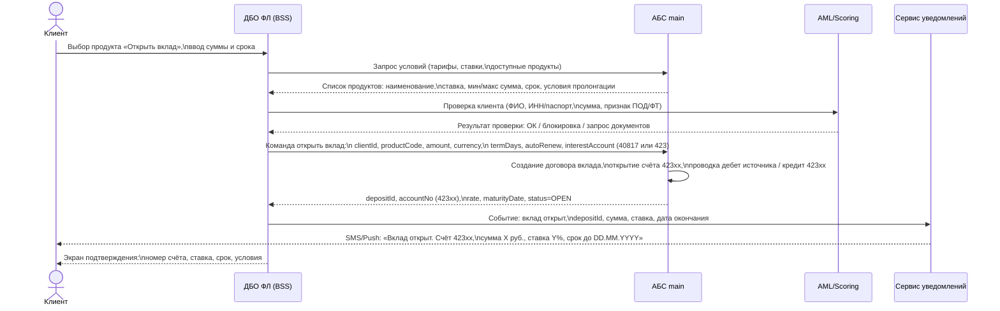
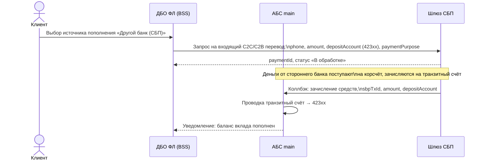
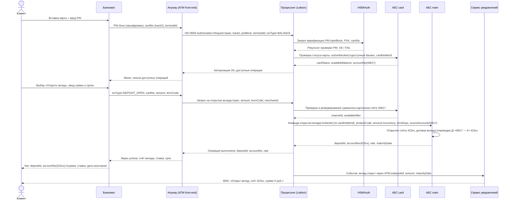
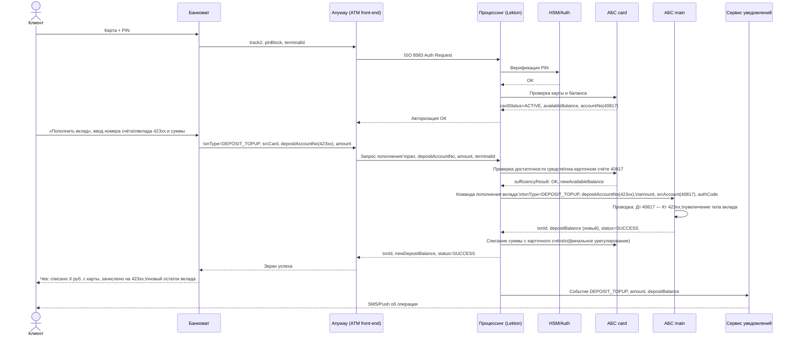
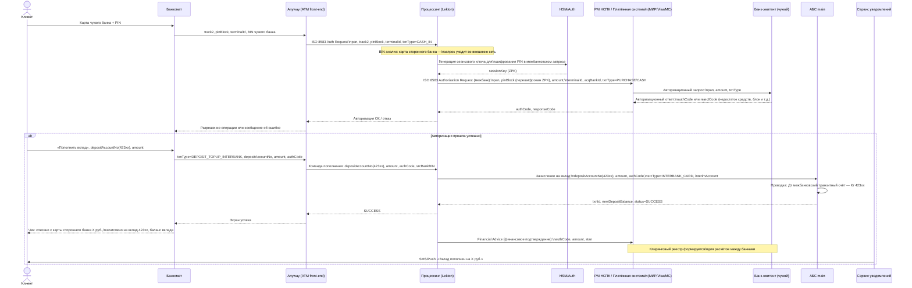
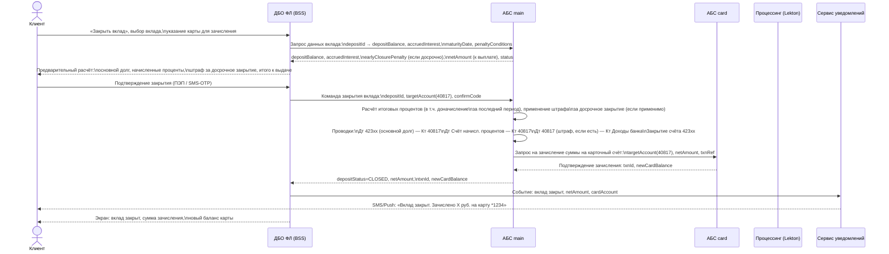
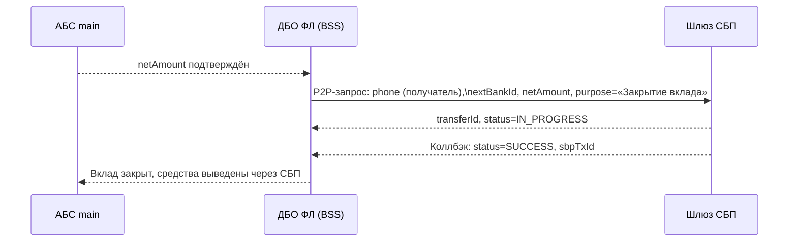
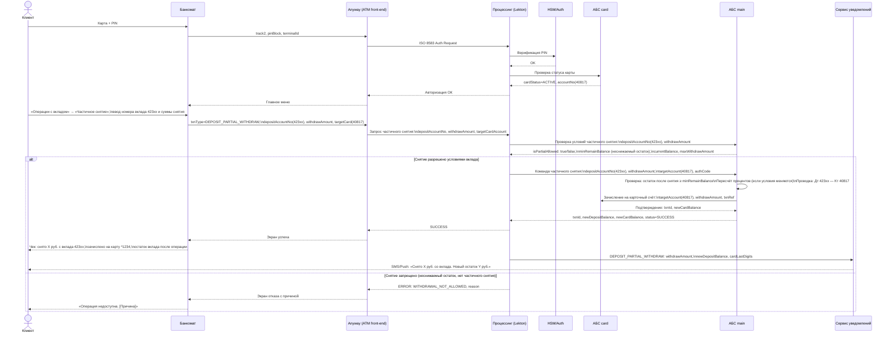
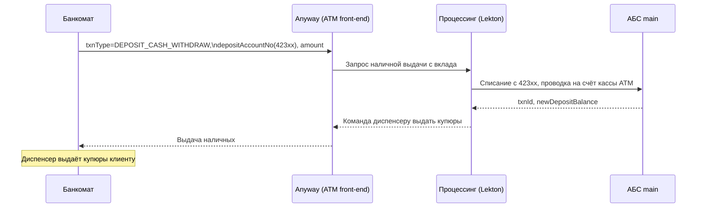

# Схема взаимодействия ИТ-систем банка: операции с вкладами ФЛ

## Используемые системы

| Аббревиатура | Полное название | Роль |
|---|---|---|
| **АБС main** | Автоматизированная банковская система (главная книга) | Ведение счетов вклада 423, бухгалтерский учёт, договоры вклада |
| **АБС card** | Карточный бэк-офис | Ведение карточных счетов 40817, авторизационные лимиты |
| **Процессинг** | Lekton Classic (https://lekton.io/classic/) | Авторизация карточных операций, маршрутизация транзакций ATM/POS |
| **Anyway** | Anyway (https://finstream.ru/reshenija-dlja-bankov/anyway.html) | Front-end процессинг ATM: управление сценариями, интерфейс банкоматов |
| **ДБО ФЛ** | Интернет/мобильный банк (BSS, https://bssys.com/) | Клиентский канал для дистанционного обслуживания физлиц |
| **РМ НСПК** | Рабочее место НСПК | Обмен клиринговыми реестрами с НСПК (MasterCard/Visa/МИР) |
| **HSM/Auth** | Сервер авторизации / HSM | Криптографическая защита PIN, генерация сессионных ключей |
| **Notify** | Сервис уведомлений (SMS/Push) | Информирование клиента о транзакциях |
| **AML/Scoring** | Система ПОД/ФТ и скоринга | Проверка клиента при открытии вклада |

---

## Процесс 1. Открытие вклада через ДБО ФЛ

### Схема взаимодействия

### Вариант 1А — источник средств: текущий счёт / карта внутри банка
*(описан выше — списание с карточного счёта 40817 или текущего счёта клиента в АБС main)*

### Вариант 1Б — источник средств: перевод из стороннего банка через СБП

### Таблица информационных потоков — Процесс 1

| № | Направление | Данные | Цель |
|---|---|---|---|
| 1.1 | Клиент → ДБО | Параметры вклада: тип продукта, сумма, срок, счёт списания | Инициирование заявки |
| 1.2 | ДБО → АБС main | Запрос условий: clientId, productCode | Получение актуальных тарифов |
| 1.3 | АБС main → ДБО | Список продуктов: name, rate, minAmount, maxAmount, termDays, autoRenew | Отображение предложений клиенту |
| 1.4 | ДБО → AML | clientId, docSeries/docNo, INN, amount, operationType=DEPOSIT_OPEN | Проверка ПОД/ФТ |
| 1.5 | AML → ДБО | verdict: OK/BLOCK/REQUEST_DOCS, riskScore | Разрешение или блокировка операции |
| 1.6 | ДБО → АБС main | clientId, productCode, amount, currency, termDays, sourceAccount, interestAccount, autoRenew | Команда открытия вклада |
| 1.7 | АБС main → АБС main | Внутренние проводки: Дт sourceAccount — Кт 423хх | Бухгалтерское отражение |
| 1.8 | АБС main → ДБО | depositId, accountNo(423хх), rate, maturityDate, status=OPEN | Подтверждение открытия |
| 1.9 | ДБО → Notify | depositId, clientPhone, amount, rate, maturityDate | Триггер уведомления |
| 1.10 | Notify → Клиент | SMS/Push: реквизиты вклада | Информирование клиента |

---

## Процесс 2. Открытие вклада через банкомат

### Схема взаимодействия

### Таблица информационных потоков — Процесс 2

| № | Направление | Данные | Цель |
|---|---|---|---|
| 2.1 | ATM → Anyway | track2, pinBlock (зашифр. DES/3DES), terminalId, txnType=AUTH | Передача данных карты и PIN для авторизации |
| 2.2 | Anyway → Процессинг | ISO 8583: pan, track2, pinBlock, stan, terminalId, txnType | Маршрутизация авторизационного запроса |
| 2.3 | Процессинг → HSM | pinBlock, PVK (PIN Verification Key), cardNo | Верификация PIN без раскрытия значения |
| 2.4 | HSM → Процессинг | verifyResult: OK/FAIL | Результат криптопроверки |
| 2.5 | Процессинг → АБС card | cardNo, requestType=STATUS_BALANCE | Проверка карты и баланса |
| 2.6 | АБС card → Процессинг | cardStatus, availableBalance, accountNo(40817), cardHolderId | Данные для решения об авторизации |
| 2.7 | ATM → Anyway | txnType=DEPOSIT_OPEN, amount, termCode, cardNo | Параметры открытия вклада от клиента |
| 2.8 | Процессинг → АБС card | cardNo, amount, action=RESERVE | Блокировка средств под операцию |
| 2.9 | Процессинг → АБС main | clientId, productCode, amount, currency, termDays, sourceAccount(40817) | Создание договора вклада |
| 2.10 | АБС main → Процессинг | depositId, accountNo(423хх), rate, maturityDate, status=OPEN | Подтверждение открытия |
| 2.11 | Процессинг → Notify | clientPhone, depositId, amount, rate, maturityDate | Отправка уведомления |
| 2.12 | ATM → Клиент | Чековая лента: depositId, accountNo, сумма, ставка, дата окончания | Документальное подтверждение для клиента |

---

## Процесс 3. Пополнение вклада через банкомат картой своего банка

### Схема взаимодействия

### Таблица информационных потоков — Процесс 3

| № | Направление | Данные | Цель |
|---|---|---|---|
| 3.1 | ATM → Anyway | track2, pinBlock, terminalId | Авторизация держателя карты |
| 3.2 | Процессинг → HSM | pinBlock, PVK | Верификация PIN |
| 3.3 | Процессинг → АБС card | cardNo, requestType=BALANCE | Проверка баланса источника |
| 3.4 | ATM → Anyway | txnType=DEPOSIT_TOPUP, srcCardNo, depositAccountNo(423хх), amount | Параметры пополнения |
| 3.5 | Процессинг → АБС card | cardNo, amount, action=CHECK_SUFFICIENCY | Проверка достаточности средств |
| 3.6 | Процессинг → АБС main | txnType=DEPOSIT_TOPUP, depositAccountNo(423хх), amount, srcAccount(40817), authCode, txnRef | Команда зачисления на вклад |
| 3.7 | АБС main → Процессинг | txnId, newDepositBalance, valueDate, status=SUCCESS | Подтверждение зачисления |
| 3.8 | Процессинг → АБС card | authCode, amount, action=DEBIT_FINAL | Окончательное списание с карты |
| 3.9 | ATM → Клиент | Чек: сумма списания с карты, новый остаток вклада, txnId | Подтверждение операции |

---

## Процесс 4. Пополнение вклада через банкомат картой чужого банка

### Схема взаимодействия

### Вариант 4А — международная карта (Visa/MasterCard)
Аналогично, но вместо НСПК используется международная сеть. После санкций 2022 года для клиентов с картами Visa/MC иностранных банков — операция недоступна в большинстве российских банков. Актуально для карт МИР или UnionPay.

### Вариант 4Б — карта МИР стороннего банка
*(отображён на основной схеме — наиболее актуальный вариант)*

### Таблица информационных потоков — Процесс 4

| № | Направление | Данные | Цель |
|---|---|---|---|
| 4.1 | ATM → Anyway | track2, pinBlock, terminalId, BIN эмитента | Идентификация карты стороннего банка |
| 4.2 | Процессинг → HSM | pinBlock, ZPK | Перешифрование PIN для межбанковской передачи |
| 4.3 | Процессинг → НСПК | ISO 8583: pan, pinBlock(ZPK), amount, terminalId, acqBankId, txnType | Запрос авторизации в банке-эмитенте |
| 4.4 | НСПК → Банк-эмитент | pan, amount, txnType, acqBankId | Маршрутизация авторизации |
| 4.5 | Банк-эмитент → НСПК | authCode / rejectCode, availableBalance | Решение по авторизации |
| 4.6 | НСПК → Процессинг | authCode, responseCode | Результат межбанковской авторизации |
| 4.7 | Процессинг → АБС main | depositAccountNo(423хх), amount, authCode, srcType=INTERBANK_CARD, interimTransitAccount | Зачисление средств на вклад |
| 4.8 | АБС main → Процессинг | txnId, newDepositBalance, status=SUCCESS | Подтверждение зачисления |
| 4.9 | Процессинг → НСПК | Financial Advice: authCode, stan, amount | Финансовое подтверждение (клиринг) |
| 4.10 | НСПК → РМ НСПК (реестры) | Клиринговый реестр: список транзакций за день, суммы, банки | Межбанковские расчёты |
| 4.11 | ATM → Клиент | Чек: сумма, счёт вклада 423хх, баланс, txnId | Документальное подтверждение |

---

## Процесс 5. Закрытие вклада через ДБО с зачислением на карту

### Схема взаимодействия

### Вариант 5А — закрытие в срок (maturityDate = сегодня)
Штраф за досрочное закрытие не применяется. Проценты начислены в полном объёме.

### Вариант 5Б — досрочное закрытие
Применяется пересчёт процентов по ставке «до востребования» или по условиям договора. Разница вычитается (штраф).

### Вариант 5В — закрытие с выводом через СБП на счёт в другом банке

### Таблица информационных потоков — Процесс 5

| № | Направление | Данные | Цель |
|---|---|---|---|
| 5.1 | Клиент → ДБО | depositId, targetCardAccount(40817), confirmType | Инициирование закрытия |
| 5.2 | ДБО → АБС main | depositId, requestType=CLOSE_PREVIEW | Предварительный расчёт суммы к выплате |
| 5.3 | АБС main → ДБО | depositBalance, accruedInterest, earlyClosurePenalty, netAmount | Данные для согласования с клиентом |
| 5.4 | Клиент → ДБО | OTP-код подтверждения (SMS/Push) | Верификация намерения клиента |
| 5.5 | ДБО → АБС main | depositId, action=CLOSE, targetAccount(40817), confirmCode | Команда закрытия |
| 5.6 | АБС main → АБС main | Внутренние проводки: закрытие 423хх, начисление % | Бухгалтерское урегулирование |
| 5.7 | АБС main → АБС card | targetAccount(40817), netAmount, txnRef=depositClosure | Зачисление средств на карту |
| 5.8 | АБС card → АБС main | txnId, newCardBalance | Подтверждение зачисления |
| 5.9 | АБС main → ДБО | depositStatus=CLOSED, netAmount, txnId, newCardBalance | Итоговый статус операции |
| 5.10 | ДБО → Notify | clientPhone, netAmount, cardLastDigits, closureDate | Триггер уведомления |
| 5.11 | Notify → Клиент | SMS/Push: сумма зачисления, карта, дата | Информирование |

---

## Процесс 6. Частичное снятие со вклада через банкомат с зачислением на карту

### Схема взаимодействия

### Вариант 6А — вклад с возможностью частичного снятия
*(описан выше — стандартный вклад типа «Накопительный» с неснижаемым остатком)*

### Вариант 6Б — выдача наличными через банкомат (если вклад позволяет наличные выплаты)

### Таблица информационных потоков — Процесс 6

| № | Направление | Данные | Цель |
|---|---|---|---|
| 6.1 | ATM → Anyway | track2, pinBlock, terminalId | Авторизация держателя карты |
| 6.2 | Процессинг → HSM | pinBlock, PVK | Верификация PIN |
| 6.3 | Процессинг → АБС card | cardNo, requestType=STATUS | Проверка статуса карты |
| 6.4 | ATM → Anyway | txnType=DEPOSIT_PARTIAL_WITHDRAW, depositAccountNo(423хх), withdrawAmount, targetCardAccount(40817) | Параметры частичного снятия |
| 6.5 | Процессинг → АБС main | depositAccountNo(423хх), requestType=CHECK_PARTIAL_WITHDRAW, withdrawAmount | Проверка допустимости операции |
| 6.6 | АБС main → Процессинг | isPartialAllowed, minRemainBalance, currentBalance, maxWithdrawAmount | Условия частичного снятия по договору |
| 6.7 | Процессинг → АБС main | txnType=DEPOSIT_PARTIAL_WITHDRAW, depositAccountNo(423хх), withdrawAmount, targetAccount(40817), authCode | Команда списания с вклада |
| 6.8 | АБС main → АБС card | targetAccount(40817), withdrawAmount, txnRef | Зачисление на карту |
| 6.9 | АБС card → АБС main | txnId, newCardBalance | Подтверждение зачисления |
| 6.10 | АБС main → Процессинг | txnId, newDepositBalance, newCardBalance, status=SUCCESS | Итоговый статус операции |
| 6.11 | ATM → Клиент | Чек: снятая сумма, остаток вклада, новый баланс карты | Документальное подтверждение |
| 6.12 | Процессинг → Notify | withdrawAmount, newDepositBalance, cardLastDigits | Триггер уведомления |

---

## Сводная таблица систем и их роли в процессах

| Система | П1 (откр. ДБО) | П2 (откр. ATM) | П3 (попол. ATM своя карта) | П4 (попол. ATM чужая карта) | П5 (закр. ДБО) | П6 (снят. ATM) |
|---|:---:|:---:|:---:|:---:|:---:|:---:|
| **ДБО ФЛ (BSS)** | ✅ | — | — | — | ✅ | — |
| **АБС main** | ✅ | ✅ | ✅ | ✅ | ✅ | ✅ |
| **АБС card** | ✅ | ✅ | ✅ | — | ✅ | ✅ |
| **Процессинг (Lekton)** | — | ✅ | ✅ | ✅ | — | ✅ |
| **Anyway** | — | ✅ | ✅ | ✅ | — | ✅ |
| **HSM/Auth** | — | ✅ | ✅ | ✅ | — | ✅ |
| **РМ НСПК** | — | — | — | ✅ | — | — |
| **Сервис уведомлений** | ✅ | ✅ | ✅ | ✅ | ✅ | ✅ |
| **AML/Scoring** | ✅ | — | — | — | — | — |
| **Шлюз СБП** | опц. | — | — | — | опц. | — |

> **Примечание.** В процессах с банкоматом система **Anyway** выступает как front-end процессор (управляет сценариями ATM и диспенсером), а **Процессинг (Lekton)** — как авторизационный движок, выполняющий маршрутизацию ISO 8583 запросов и взаимодействие с банками-корреспондентами. Оба компонента вместе образуют ATM-канал обслуживания.
