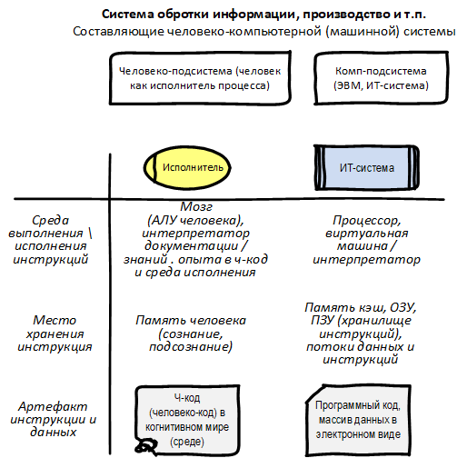

## Digital Twin 
### DT-Concept
Есть человеко-машинная система: Система обротки информации, производство и т.п.  
Составляющие человеко-компьютерной (машинной) системы: Человеческая часть и нечеловеческая. При 100% уровне автоматизации остаётся только нечеловеческая (включая RPA), а при 0% - только человеческая (полностью ручная обработка, только бумажный документооборот и т.п.). Дальнейшая детализация каждой составляющей показана на рис. 1.  
  
Рис. 1

### 1 Двойники. Физический и Цифровой двойник. 
 Цифровой двойник» \ Digital Twin (ЦД \ DT) vs физический двойник, «физик», Physical Twin, PT, - его модель собственно сам DT (плюс еще дополнительные условия). 
DT – это, прежде всего – Модель. Задача: на основе модели не только визуализировать действия PD, но и построить симулятор, который прокручивает (исполняет, вычисляет модель) и не только поясняет работу DT, но может и просчитать результат для новых вводных: новые входные данные на входе модели. При этом может использовать исторические данные работы PD (DT их принимает от PD и хранит у себя или имеет доступ в архив PD).    

### 2 Чем двойник не является
DT – это
- не про классические мониторинг и управление: BAM, SCADA, сетевой мониторинг типа HP Open View и еще масса иных мониторингов. Это и не классические BI-системы. 
- не резервная система \ контур. Конечно, если модель 100% исполняемая, то из нее можно получить код, продублировать конфиги из PH и запустить. Только таких технологий автоматизации еще нет (BPMN-engine исполняемая в лишь на 10%).
- не полностью автоматическая система (100% автоматизации) с абсолютным контролем, где каждый шаг записывается, далее все обобщается \ агрегирует и выводится на дашборды (BI и т.п.). Это не Абсолют «цифровой трансформации» - т.е. организация с 100% автоматизацией (полностью цифровая организация). 
- не Wiki (и не semantic Wiki), не EGK (Enterprise Knowledge Graph) организации. Другое дело – это [Создание цифровых двойников на основе семантических моделей](https://trinidata.ru/digital-twin.htm).
- не классические BPM \ EA. Когда полные и дельные модели предприятия (для начала процессов, т.е. «цифровой двойник процесса») будут создаваться автоматически (развитие Process mining, architecture as code и т.п.), то тогда это будет DT.  

### 3 Как строить модель?
DT – синоним «хорошая модель». Варианты построения:
- DT до или после PH:  Pre-Manufacture (Pre-Digital Twin) \ Post-Existing 
- ручной или автоматический (инструментальный, mining и т.п.).  
Повторно: для DT важен не код, который исполнит точно тоже, что и PD, а понятная модель, т.е. важнее, не что будет сделано, а как будет сделано.  
Ручной вариант построения модели – не рассматриваем, причина показана в [Digital Twin. Часть 2. Инструментальный Цифровой двойник](https://habr.com/ru/articles/927360/)

Применительно к ИТ-системам Pre-Digital Twin – более сложная технология, поэтому остановимся на Post-Existing.  
Смотрим на имеющуюся ИТ-систему. Имеем: 
- код и по нему мы можем создать модель выполнения. Это «структурный натурный экспонат» для формирования модели. 
- журналы \ логи работы ИТ-системы. Это «поведенческий натурный экспонат» для формирования модели.   
При 100% автоматизации за счет анализа кода (по коду строим модель) и анализа логов (Process mining) можно построить инструментальными методами модель, адекватную PH (оригиналу), т.е. DT. Далее их связать и использовать как DT (PD + DT-как можедь + связь PD и DT). Однако пока такие технологии «сырые» и "настоящих" DT нет (много только маркетинга DT). 
### 4 Автоматизированные процессы
Для систем с уровнем автоматизации более 0% и менее 100% имеем «Автоматизированный процесс», т.е. в системе присутствует код и ч-код. Ч-код – условно это инструкции, обрабатываемые мозгом человека (АЛУ человека, arithmetic logic unit) и хранящиеся в памяти человека. АЛУ человека и память Ч-кода (также оперативная и постоянная) размещены в черепной коробке.  
Да, у исполнителя процесса (роли) могут быть подробные регламенты, сами операции содержать «защиту от дурака» и т.п., но человек выполнит не то, что содержится в инструкциях, а то что будет в его ч-коде (в его голове). Наличие «человеческого фактора» принципиально меняет подход и это работает как выполнение инструкции (кода) в процессоре компа, но только вот содержание ч-кода – большая проблема для формализации (математизации, а модель – это как правило, про математику и логику).   
Тем не менее, даже в полностью ручных системах (0% автоматизации) возможны подходы типа Process mining. Например, можно на всех рабочих местах поставить камеры (как в проекте «за стеклом») и отслеживать все действия (операции, workflow \ docflow), распознавать документы, включая подписи (статус документов: утвержден, согласован и т.п.) и строить модель такую же, как в Process mining. Такой «Process mining для ручных операций» с приходом ИИ становится все реалистичнее.  
Конечно анализ мест хранения ч-кода и содержание инструкций ч-кода – это не решенная проблема: человек несознательно (не прочитал, прочитал, но не так понял) или сознательно (умышленно) может «класть» в ч-код инструкцию, отличную от заданной (документированной). В этом с одной стороны – преимущество человека над машиной, с другой – сложность в построении DT человеко-машинной системы (моделирование реального набора инструкций \ алгоритмов в голове человека).  

Вообще, начинать нужно с простого: формализовать Простейшие варианты (в стиле hello world): ЦД табуретки, ЦД процесса (бизнес-процесса), ЦД организации, например, состоящей из двух человек. Разговоров про Digital Twin - много, только "скачать и развернуть" - нечего. 
