## 1

# Техническое задание: приложение «МедАудит» — чек-лист проверки личных сайтов врачей

---

## 1. Назначение и контекст

Приложение автоматизирует проверку личных сайтов врачей на соответствие российскому законодательству: ФЗ-38 (реклама), ФЗ-152 (персональные данные), ФЗ-323 (охрана здоровья), ФЗ-99 (лицензирование), Приказу РКН № 18, Приказу Минздрава № 118н, Приказу Минцифры № 953.

**Входные данные:** URL сайта врача.
**Выходные данные:** структурированный отчёт с найденными нарушениями, ссылками на нормы закона, рекомендациями по исправлению и визуальной подсветкой проблемных фрагментов.

---

## 2. Архитектура приложения

```
┌──────────────────────────────────────────────────────────────────┐
│                        ПРИЛОЖЕНИЕ МЕДАУДИТ                          │
│                                                                    │
│  ┌──────────┐  ┌──────────┐  ┌──────────┐  ┌──────────┐           │
│  │ Frontend │  │ Backend  │  │ Parser   │  │ Analyzer │           │
│  │ React/Vue│  │ FastAPI  │  │ Engine   │  │ Engine   │           │
│  └────┬─────┘  └────┬─────┘  └────┬─────┘  └────┬─────┘           │
│       │             │              │              │                │
│  ┌────▼─────────────▼──────────────▼──────────────▼─────┐         │
│  │              Слои проверки (6 блоков)                │         │
│  │  A. Реклама  │ B. ПДн  │ C. Медицина │ D. Тех │ E. Языки │      │
│  └──────────────────────────────────────────────────────┘         │
│                              │                                     │
│  ┌───────────────────────────▼─────────────────────────┐          │
│  │              Report Engine                           │          │
│  │  JSON │ HTML │ PDF │ API (для интеграции)            │          │
│  └──────────────────────────────────────────────────────┘          │
└──────────────────────────────────────────────────────────────────┘
```

---

## 3. Общий алгоритм работы

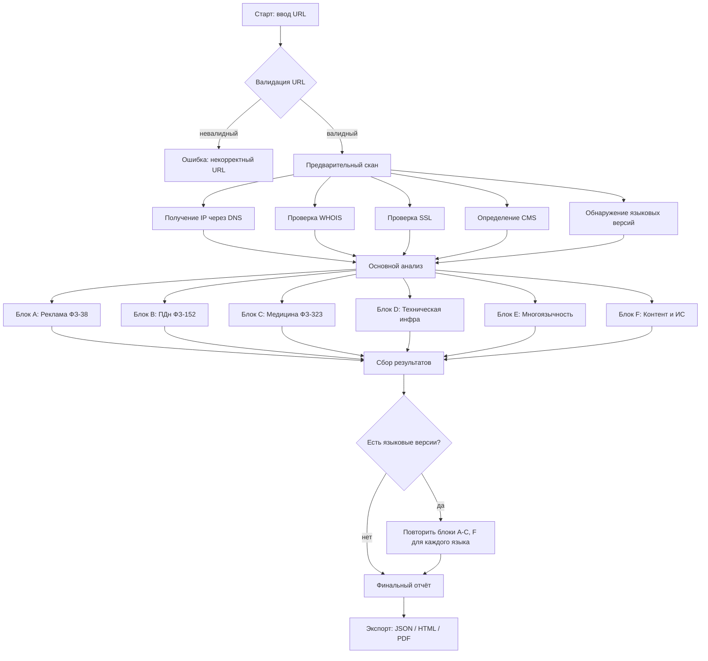

---

## 4. Предварительное сканирование

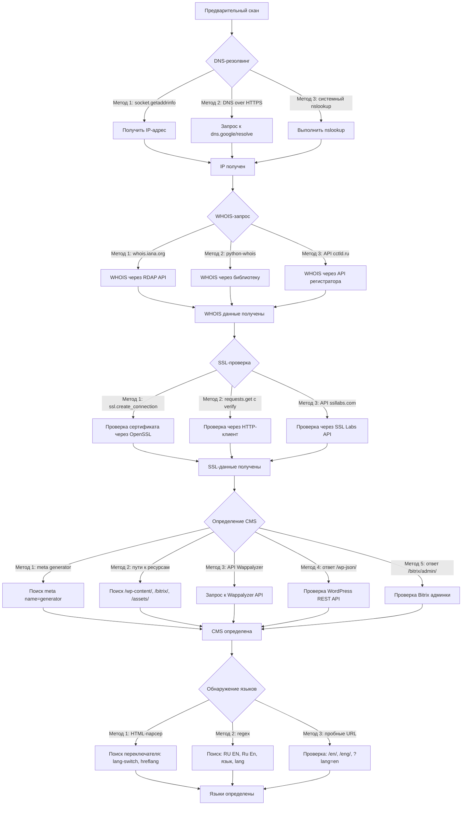

---

## 5. Блок A — Реклама медицинских услуг (ФЗ-38)

### A1. Проверка наличия дисклеймера

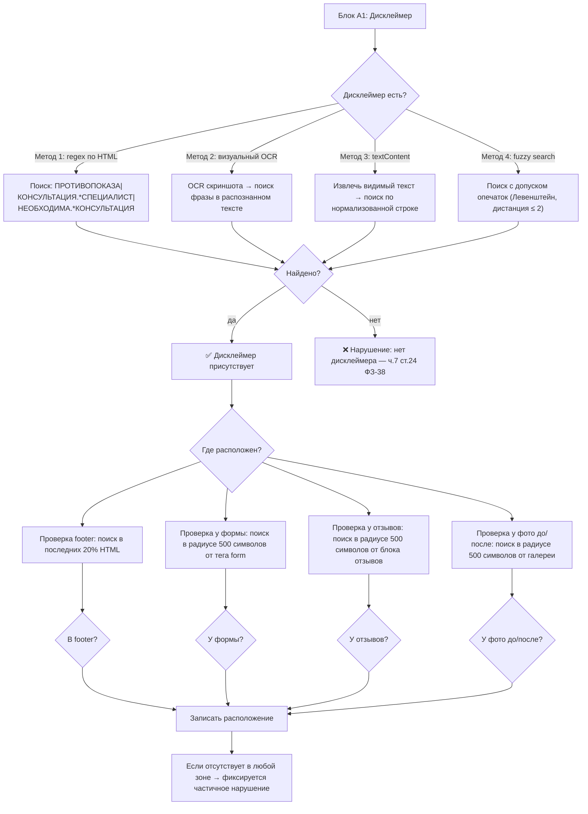

### A2. Проверка гарантий результата

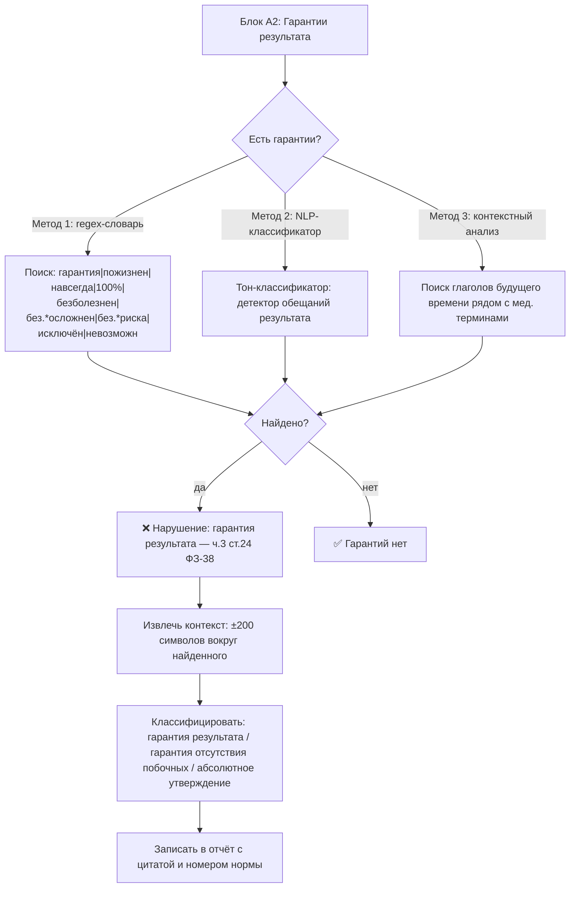

### A3. Проверка утверждений превосходства

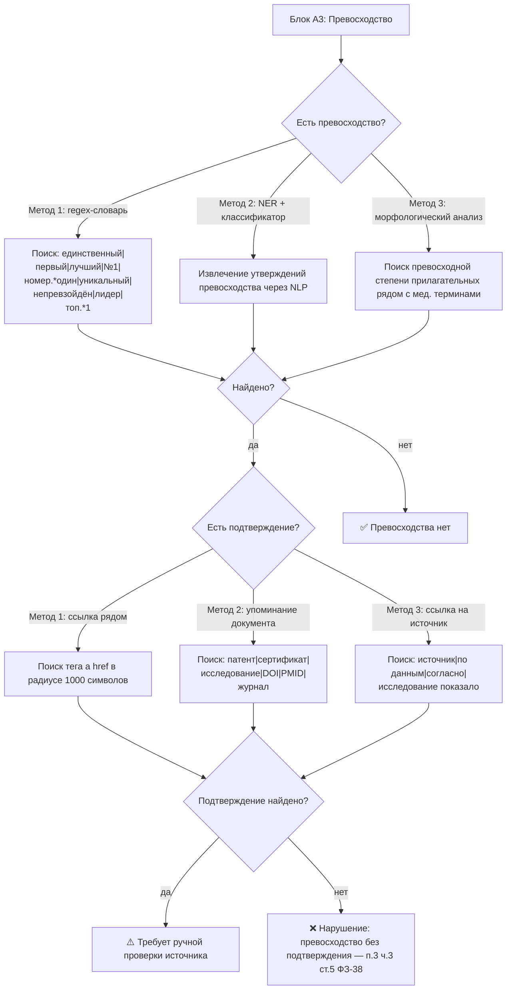

### A4. Сравнение с другими методами без источника

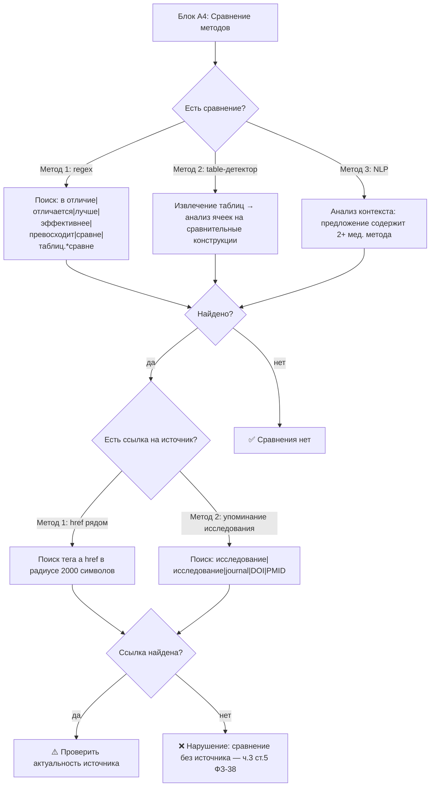

### A5. Сведения о рекламодателе

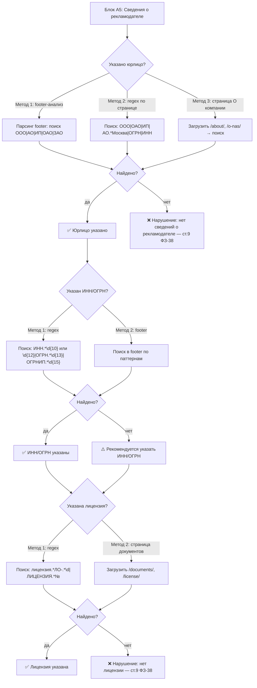

---

## 6. Блок B — Персональные данные (ФЗ-152)

```mermaid
flowchart TD
    B1["Блок B: ПДн ФЗ-152"] --> B2{Есть формы?}

    B2 -->|Метод 1: HTML-парсер| B3["Поиск тегов: form, input, textarea, button[type=submit]"]
    B2 -->|Метод 2: regex| B4["Поиск: <form|<input.*type=text|<input.*type=tel|<input.*type=email|<textarea"]
    B2 -->|Метод 3: визуальный| B5["Анализ скриншота на поля ввода"]
    B2 -->|Метод 4: интерактивный| B6["Эмуляция браузера → поиск интерактивных элементов"]

    B3 --> B7{Форма найдена?}
    B4 --> B7
    B5 --> B7
    B6 --> B7
    B7 -->|да| B8["Извлечь все поля формы"]
    B7 -->|нет| B9["Форм нет"]

    B8 --> B10{Поля собирают ПДн?}
    B10 -->|Метод 1: name/id атрибут| B11["Поиск: name=имя|name|phone|tel|email|фио|fullname"]
    B10 -->|Метод 2: placeholder| B12["Поиск: placeholder=имя|телефон|email|ваше имя"]
    B10 -->|Метод 3: type атрибут| B13["Поиск: type=tel|type=email|type=text"]
    B10 -->|Метод 4: label-анализ| B14["Поиск label, связанного с input"]
    B11 --> B15{ПДн в полях?}
    B12 --> B15
    B13 --> B15
    B14 --> B15
    B15 -->|да| B16["Оператор ПДн: ДА — форма"]
    B15 -->|нет| B17["Форма без ПДн"]

    B9 --> B18{Есть счётчики аналитики?}
    B16 --> B18
    B17 --> B18

    B18 -->|Метод 1: regex| B19["Поиск: ym(|mc.yandex|gtag(|google-analytics|hotjar|fbq(|top.mail.ru|liveinternet"]
    B18 -->|Метод 2: network-перехват| B20["Эмуляция браузера → отлов запросов к доменам аналитики"]
    B18 -->|Метод 3: Wappalyzer| B21["API Wappalyzer → список технологий"]
    B18 -->|Метод 4: cookie-анализ| B22["Проверка cookie, установленных при загрузке"]

    B19 --> B23{Найдены?}
    B20 --> B23
    B21 --> B23
    B22 --> B23
    B23 -->|да| B24["Оператор ПДн: ДА — аналитика"]
    B23 -->|нет| B25["Счётчиков нет"]

    B24 --> B26{Cookie-баннер есть?}
    B25 --> B26

    B26 -->|Метод 1: regex| B27["Поиск: cookie|cookies|файлы cookie|согласие.*cookie|мы используем"]
    B26 -->|Метод 2: CSS-селекторы| B28["Поиск: .cookie-banner|#cookie-notice|.cookie-consent|#cn-accept"]
    B26 -->|Метод 3: визуальный| B29["OCR скриншота → поиск 'cookie' в верхней/нижней части"]
    B26 -->|Метод 4: DOM-мутации| B30["Эмуляция → отлов вставки баннера через MutationObserver"]

    B27 --> B31{Найден?}
    B28 --> B31
    B29 --> B31
    B30 --> B31
    B31 -->|да| B32["✅ Cookie-баннер есть"]
    B31 -->|нет| B33["❌ Нарушение: нет cookie-баннера — ч.1 ст.9 ФЗ-152"]

    B33 --> B34{Есть трансграничная передача?}
    B32 --> B34
    B25 --> B34

    B34 -->|Метод 1: regex| B35["Поиск: fonts.googleapis|fonts.gstatic|recaptcha|g-recaptcha|youtube.com/embed|vimeo|google.com/maps|facebook.net|fbq("]
    B34 -->|Метод 2: network-перехват| B36["Отлов запросов к зарубежным IP-диапазонам"]
    B34 -->|Метод 3: geoip| B37["Определение геолокации всех внешних доменов"]
    B34 -->|Метод 4: CSP-анализ| B38["Анализ Content-Security-Policy на зарубежные домены"]

    B35 --> B39{Найдены?}
    B36 --> B39
    B37 --> B39
    B38 --> B39
    B39 -->|да| B40["❌ Нарушение: трансграничная передача — ч.4 ст.18 ФЗ-152"]
    B39 -->|нет| B41["✅ Трансграничной передачи нет"]

    B41 --> B42{Есть отзывы с именами?}
    B40 --> B42

    B42 -->|Метод 1: NER| B43["Извлечение PER-сущностей из текста отзывов"]
    B42 -->|Метод 2: regex-словарь| B44["Поиск: Имя Фамилия по словарю русских имён и фамилий"]
    B42 -->|Метод 3: CSS-селекторы| B45["Поиск: .review-author|.testimonial-name|.review-name|.author-name"]
    B42 -->|Метод 4: структура| B46["Анализ: блок с отзывом → поиск подписи автора"]

    B43 --> B47{Имена найдены?}
    B44 --> B47
    B45 --> B47
    B46 --> B47
    B47 -->|да| B48["❌ Нарушение: отзывы с именами без согласия — ст.10.1 ФЗ-152"]
    B47 -->|нет| B49["✅ Отзывы обезличены"]

    B49 --> B50{Есть фото до/после с лицами?}
    B48 --> B50

    B50 -->|Метод 1: face detection| B51["OpenCV / face-api → детекция лиц в галерее до/после"]
    B50 -->|Метод 2: alt-анализ| B52["Поиск: alt=до|alt=после|class=before-after"]
    B50 -->|Метод 3: визуальный| B53["Анализ скриншотов на наличие лиц"]

    B51 --> B54{Лица найдены?}
    B52 --> B54
    B53 --> B54
    B54 -->|да| B55["❌ Нарушение: биометрия без согласия — ст.11 ФЗ-152"]
    B54 -->|нет| B56["✅ Биометрии нет"]

    B16 --> B57{Есть Политика конфиденциальности?}
    B24 --> B57

    B57 -->|Метод 1: footer-ссылка| B58["Поиск в footer: политика|конфиденциаль|privacy"]
    B57 -->|Метод 2: пробные URL| B59["Проверка: /privacy/, /politika/, /policy/"]
    B57 -->|Метод 3: robots/sitemap| B60["Поиск в sitemap.xml URL с 'privacy' или 'политика'"]

    B58 --> B61{Найдена?}
    B59 --> B61
    B60 --> B61
    B61 -->|да| B62["✅ Политика есть → проверить содержание"]
    B61 -->|нет| B63["❌ Нарушение: нет Политики — ч.2 ст.18.1 ФЗ-152"]

    B62 --> B64{Указаны реквизиты оператора?}
    B64 -->|Метод 1: regex| B65["Поиск: ИНН|ОГРН|ООО|ИП|адрес в тексте Политики"]
    B64 -->|Метод 2: сравнение с footer| B66["Сравнение реквизитов Политики с footer сайта"]
    B65 --> B67{Совпадают?}
    B66 --> B67
    B67 -->|да| B68["✅ Реквизиты корректны"]
    B67 -->|нет| B69["⚠️ Реквизиты не совпадают с указанными на сайте"]

    B68 --> B70{Описаны сроки хранения?}
    B70 -->|Метод 1: regex| B71["Поиск: срок|хранен|уничтож|удал|лет|дней|месяц"]
    B71 --> B72{Найдено?}
    B72 -->|да| B73["✅ Сроки указаны"]
    B72 -->|нет| B74["⚠️ Рекомендуется указать сроки хранения"]

    B70 --> B75{Описаны cookie?}
    B75 -->|Метод 1: regex| B76["Поиск: cookie|файлы cookie|куки"]
    B76 --> B77{Найдено?}
    B77 -->|да| B78["✅ Cookie описаны"]
    B77 -->|нет| B79["⚠️ Рекомендуется описать cookie в Политике"]
```

---

## 7. Блок C — Медицинское законодательство (ФЗ-323)

```mermaid
flowchart TD
    C1["Блок C: Медицина ФЗ-323"] --> C2{Лицензия указана?}

    C2 -->|Метод 1: regex| C3["Поиск: лицензия.*ЛО-|ЛИЦЕНЗИЯ.*№|медицинск.*лиценз"]
    C2 -->|Метод 2: footer| C4["Парсинг footer на наличие лицензии"]
    C2 -->|Метод 3: страница документов| C5["Загрузить /documents/, /license/, /pravovaya/"]
    C2 -->|Метод 4: OCR скриншота| C6["OCR → поиск 'лицензия'"]

    C3 --> C7{Найдена?}
    C4 --> C7
    C5 --> C7
    C6 --> C7
    C7 -->|да| C8["✅ Лицензия указана"]
    C7 -->|нет| C9["❌ Нарушение: нет лицензии — ст.15 ФЗ-323"]

    C8 --> C10{Номер валидного формата?}
    C10 -->|Метод 1: regex| C11["Паттерн: ЛО-\d{2}-\d{2}-\d{6} или ЛО-\d{2}-01-\d{6}"]
    C11 --> C12{Валиден?}
    C12 -->|да| C13["✅ Формат корректен"]
    C12 -->|нет| C14["⚠️ Формат лицензии нестандартный"]

    C13 --> C15{Есть ссылка на реестр?}
    C15 -->|Метод 1: href рядом| C16["Поиск тега a href рядом с номером лицензии"]
    C15 -->|Метод 2: QR-код| C17["Поиск изображений, похожих на QR-код → декодирование"]
    C16 --> C18{Найдена?}
    C17 --> C18
    C18 -->|да| C19["✅ Ссылка на реестр есть"]
    C18 -->|нет| C20["⚠️ Рекомендуется добавить ссылку на реестр Росздравнадзора"]

    C19 --> C21{Сведения о враче полные?}
    C20 --> C21
    C9 --> C21

    C21 --> C22{Указано образование?}
    C22 -->|Метод 1: regex| C23["Поиск: образование|вуз|университет|институт|академи|лечебн.*дел"]
    C22 -->|Метод 2: NER| C24["Извлечение названий учебных заведений"]
    C23 --> C25{Найдено?}
    C24 --> C25
    C25 -->|да| C26["✅ Образование указано"]
    C25 -->|нет| C27["❌ Нарушение: нет образования — ст.69 ФЗ-323"]

    C26 --> C28{Указана аккредитация?}
    C27 --> C28
    C28 -->|Метод 1: regex| C29["Поиск: аккредитаци|сертификат.*специалист|удостоверение"]
    C29 --> C30{Найдено?}
    C30 -->|да| C31["✅ Аккредитация указана"]
    C30 -->|нет| C32["❌ Нарушение: нет аккредитации — ст.69 ФЗ-323"]

    C31 --> C33{Есть мед. рекомендации?}
    C32 --> C33

    C33 -->|Метод 1: regex| C34["Поиск: рекоменд.*сдать|назнач|схема.*лечен|дозир|перед.*операци.*необходимо"]
    C33 -->|Метод 2: NLP| C35["Классификатор: императивные мед. инструкции"]
    C34 --> C36{Найдено?}
    C35 --> C36
    C36 -->|да| C37{Есть дисклеймер к ним?}
    C36 -->|нет| C38["✅ Мед. рекомендаций нет"]
    C37 -->|Метод 1: поиск рядом| C39["Поиск: ознакомитель|не.*рекомендаци|не.*замен.*консульт в радиусе 1000 символов"]
    C39 --> C40{Найдено?}
    C40 -->|да| C41["✅ Дисклеймер к мед. рекомендациям есть"]
    C40 -->|нет| C42["❌ Нарушение: мед. рекомендации без дисклеймера — ст.2 ФЗ-323"]

    C41 --> C43{Есть версия для слабовидящих?}
    C42 --> C43

    C43 -->|Метод 1: regex| C44["Поиск: слабовидящ|версия.*слабовид|accessibility|увеличить.*шрифт|контраст"]
    C43 -->|Метод 2: CSS-анализ| C45["Поиск классов: .accessibility|.a11y|#font-size|.high-contrast"]
    C43 -->|Метод 3: кнопка| C46["Поиск кнопки/иконки доступности в HTML"]

    C44 --> C47{Найдена?}
    C45 --> C47
    C46 --> C47
    C47 -->|да| C48["✅ Версия для слабовидящих есть"]
    C47 -->|нет| C49["❌ Нарушение: нет версии для слабовидящих — Приказ Минцифры № 953"]
```

---

## 8. Блок D — Техническая инфраструктура

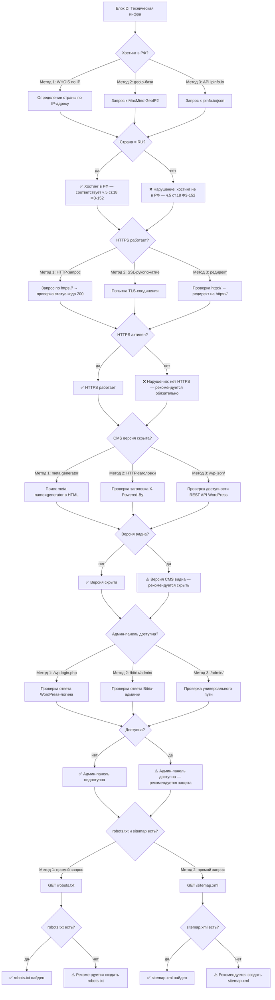

---

## 9. Блок E — Многоязычность

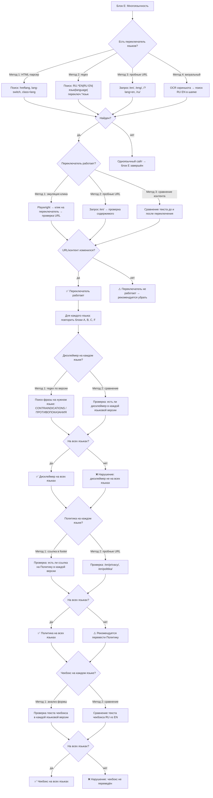

---

## 10. Блок F — Контент и интеллектуальная собственность

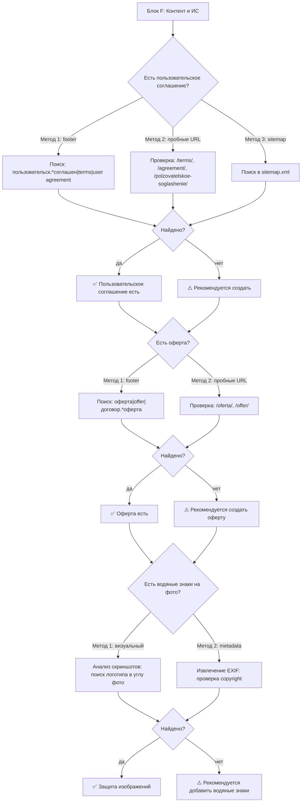

---

## 11. Структура данных отчёта

```json
{
  "meta": {
    "url": "https://doctorsviridov.ru/",
    "scan_date": "2026-09-22T16:44:19+03:00",
    "scanner_version": "1.0.0",
    "languages_detected": ["ru", "en"],
    "cms": "WordPress",
    "hosting_country": "RU",
    "ssl": true
  },
  "blocks": {
    "A_advertising": {
      "name": "Реклама (ФЗ-38)",
      "checks": [
        {
          "id": "A1.1",
          "title": "Наличие дисклеймера",
          "law": "ч.7 ст.24 ФЗ-38",
          "status": "fail",
          "severity": "critical",
          "methods_used": ["regex_html", "text_content", "fuzzy_search"],
          "methods_detail": {
            "regex_html": {"query": "ПРОТИВОПОКАЗА|КОНСУЛЬТАЦИЯ.*СПЕЦИАЛИСТ", "found": false},
            "text_content": {"normalized_query": "противопоказания необходима консультация", "found": false},
            "fuzzy_search": {"query": "ПРОТИВОПОКАЗА", "levenshtein_distance": 2, "found": false}
          },
          "evidence": null,
          "recommendation": "Добавить дисклеймер «ИМЕЮТСЯ ПРОТИВОПОКАЗАНИЯ. НЕОБХОДИМА КОНСУЛЬТАЦИЯ СПЕЦИАЛИСТА» на все страницы с описанием услуг, рядом с формами, в footer",
          "fine_max": 500000
        }
      ],
      "summary": {"total": 15, "pass": 4, "fail": 8, "warning": 3}
    },
    "B_personal_data": { },
    "C_medical": { },
    "D_technical": { },
    "E_multilingual": { },
    "F_content": { }
  },
  "summary": {
    "total_checks": 62,
    "critical_violations": 11,
    "warnings": 8,
    "passed": 43,
    "max_fine_estimate": 1700000,
    "compliance_score": 35
  }
}
```

---

## 12. Технический стек

| Компонент | Технология | Назначение |
|---|---|---|
| Backend | Python 3.12 + FastAPI | REST API, асинхронная обработка |
| HTML-парсер | BeautifulSoup4 + lxml | Извлечение тегов, текста, атрибутов |
| Браузерная эмуляция | Playwright (Chromium) | Интерактивные проверки, отлов network-запросов, скриншоты |
| OCR | Tesseract / Yandex Vision | Распознавание текста со скриншотов |
| NER | spaCy (ru_core_news_lg) | Извлечение имён, организаций из текста |
| NLP-классификатор | scikit-learn + transformers | Детекция гарантий, превосходства, мед. рекомендаций |
| Распознавание лиц | OpenCV + face-recognition | Детекция лиц на фото до/после |
| GeoIP | MaxMind GeoIP2 + ipinfo.io | Определение страны хостинга и внешних доменов |
| Frontend | React 18 + TypeScript | UI, визуализация отчёта |
| Хранение | PostgreSQL + Redis | Результаты сканирований, кэш |
| Экспорт | ReportLab (PDF) + Jinja2 (HTML) | Генерация отчётов |

---

## 13. Карта проверок с вариантами методов

Полная сводная таблица всех проверок и методов их выполнения:

| ID | Проверка | Метод 1 | Метод 2 | Метод 3 | Метод 4 |
|---|---|---|---|---|---|
| A1.1 | Дисклеймер есть | regex по HTML | OCR скриншота | textContent + нормализация | fuzzy search (Левенштейн) |
| A1.2 | Дисклеймер в footer | поиск в нижних 20% HTML | CSS-селектор `footer` | парсинг footer-виджета | — |
| A1.3 | Дисклеймер у формы | поиск в радиусе 500 символов от `<form>` | поиск в parent-контейнере формы | — | — |
| A2.1 | Гарантии результата | regex-словарь | NLP-классификатор | контекстный анализ глаголов | — |
| A3.1 | Превосходство | regex-словарь | NER + классификатор | морфология прилагательных | — |
| A3.2 | Подтверждение превосходства | поиск `href` рядом | поиск «патент/сертификат» | поиск «исследование/DOI» | — |
| A4.1 | Сравнение методов | regex | table-детектор | NLP (2+ метода в предложении) | — |
| A5.1 | Юрлицо указано | footer-парсинг | regex по странице | страница /about/ | — |
| A5.2 | Лицензия указана | regex | страница /documents/ | OCR скриншота | — |
| B1.1 | Формы на сайте | HTML-парсер (`form`, `input`) | regex | визуальный (скриншот) | эмуляция браузера |
| B1.2 | Поля собирают ПДн | `name`/`id` атрибуты | `placeholder` атрибут | `type` атрибут | `label`-анализ |
| B2.1 | Чекбокс согласия | HTML-парсер (`type=checkbox`) | regex по тексту | визуальный | — |
| B2.2 | Чекбокс предустановлен | атрибут `checked` | JS-анализ `setChecked` | — | — |
| B2.3 | Ссылка на текст согласия | поиск `href` рядом с чекбоксом | поиск отдельной страницы | — | — |
| B3.1 | Счётчики аналитики | regex (`ym(`, `gtag(`) | network-перехват | Wappalyzer API | cookie-анализ |
| B4.1 | Cookie-баннер | regex (`cookie`) | CSS-селекторы | визуальный (OCR) | MutationObserver |
| B5.1 | Трансграничная передача | regex (зарубежные домены) | network-перехват | GeoIP всех доменов | CSP-анализ |
| B6.1 | Отзывы с именами | NER (PER-сущности) | regex-словарь имён | CSS-селекторы автора | анализ структуры отзыва |
| B6.2 | Фото до/после с лицами | face detection (OpenCV) | `alt`-анализ | визуальный (скриншот) | — |
| B7.1 | Политика конфиденциальности | footer-ссылка | пробные URL | sitemap.xml | — |
| B7.2 | Реквизиты в Политике | regex (ИНН/ОГРН) | сравнение с footer | — | — |
| C1.1 | Лицензия указана | regex | footer-парсинг | страница /documents/ | OCR |
| C2.1 | Образование врача | regex | NER (учебные заведения) | — | — |
| C2.2 | Аккредитация | regex | — | — | — |
| C3.1 | Мед. рекомендации | regex (императивы) | NLP-классификатор | — | — |
| C4.1 | Версия для слабовидящих | regex | CSS-анализ | кнопка/иконка | — |
| D1.1 | Хостинг в РФ | WHOIS по IP | MaxMind GeoIP2 | ipinfo.io API | — |
| D2.1 | HTTPS | HTTP-запрос | TLS-рукопожатие | редирект http→https | — |
| D3.1 | Версия CMS скрыта | meta generator | HTTP-заголовок X-Powered-By | /wp-json/ | — |
| D4.1 | Админ-панель | /wp-login.php | /bitrix/admin/ | /admin/ | — |
| E1.1 | Переключатель языков | HTML-парсер (hreflang) | regex | пробные URL | визуальный (OCR) |
| E1.2 | Переключатель работает | эмуляция клика (Playwright) | пробные URL | сравнение контента | — |
| E2.1 | Дисклеймер на всех языках | regex по версии | сравнение версий | — | — |
| F1.1 | Пользовательское соглашение | footer | пробные URL | sitemap | — |

---

## 14. Приоритизация и severity

| Уровень | Обозначение | Действие | Пример |
|---|---|---|---|
| `critical` | ❌ Критичное нарушение | Блокирует отчёт, требует немедленного исправления | Нет дисклеймера, гарантия результата, нет лицензии |
| `high` | ❌ Серьёзное нарушение | Требует исправления в краткий срок | Отзывы с именами, нет Политики, трансграничная передача |
| `warning` | ⚠️ Предупреждение | Рекомендуется исправить | Нет ИНН, версия CMS видна, нет sitemap |
| `pass` | ✅ Соответствует | Нарушений не найдено | Дисклеймер есть, хостинг в РФ, HTTPS работает |

---

## 15. Обработка конфликтов между методами

Если разные методы проверки дают разные результаты:

| Ситуация | Алгоритм |
|---|---|
| Метод 1 → найдено, Метод 2 → не найдено | **Триггер предупреждения** «требует ручной проверки» + запуск всех доступных методов |
| Метод 1 → не найдено, Метод 2 → найдено | **Считается нарушением** — один метод подтверждает |
| Все методы → найдено | **Считается нарушением** — высокая уверенность |
| Все методы → не найдено | **Считается соответствующим** — высокая уверенность |
| OCR → не найдено, regex → найдено | **Приоритет regex** (работает с HTML, точнее) |
| regex → не найдено, OCR → найдено | **Триггер ручной проверки** (возможно, текст в изображении) |
| NLP → найдено, regex → не найдено | **Триггер ручной проверки** (семантическое совпадение, но не точное) |

---

## 16. Промпт для разработчика (краткая версия)

> Создай веб-приложение «МедАудит» на Python (FastAPI backend) + React (frontend). Приложение принимает URL сайта врача и проводит автоматизированную проверку по 6 блокам: реклама (ФЗ-38), персональные данные (ФЗ-152), медицина (ФЗ-323), техническая инфраструктура, многоязычность, контент.
>
> Каждая проверка использует от 2 до 4 независимых методов (regex по HTML, OCR скриншота, NLP-классификатор, эмуляция браузера, NER, face detection). Результаты методов комбинируются: если хотя бы один метод находит нарушение — оно фиксируется; если методы расходятся — маркируется «требует ручной проверки».
>
> Для многоязычных сайтов все проверки блоков A, B, C, F повторяются для каждого языка.
>
> Отчёт экспортируется в JSON, HTML и PDF. Каждое нарушение содержит: ID проверки, цитату с доказательством, ссылку на норму закона, рекомендацию по исправлению и максимальный штраф.
>
> Технологии: Playwright для эмуляции браузера, BeautifulSoup для парсинга, spaCy для NER, OpenCV для face detection, Tesseract для OCR, MaxMind GeoIP2 для геолокации, ReportLab для PDF.

---

Хотите, чтобы я составил аналогичное ТЗ, но как **рабочий прототип на Python** — с реализацией хотя бы блока A (реклама) и блока B (ПДн) в виде исполняемого кода?
