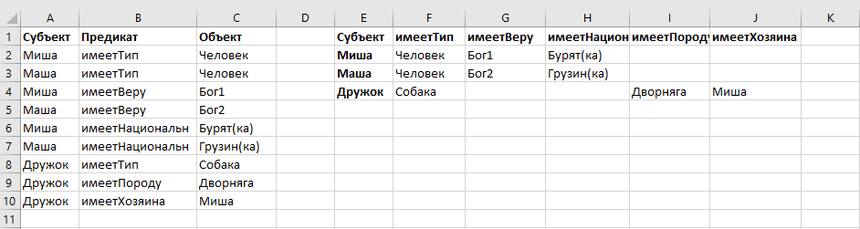

### RDF / EAV vs UDM
#### RDF
RDF – в «полном объеме» достаточно сложная конструкция (см. стандарт), но упрощенно – очень простая.  
RDF – это Триплет, элементарное высказывание (элементарное знание, атом знания), состоящее из трех элементов: субъекта, предиката и объекта (или, в терминах грамматики русского языка, подлежащего, сказуемого и дополнения), например: «змея является животным».  
RDF `{субъект > отношение (предикат) > объект \ литерал}` основан на [EAV-модели](https://habr.com/ru/articles/539170/).   
#### entity–attribute–value model (EAV)
[EAV](https://en.wikipedia.org/wiki/Entity%E2%80%93attribute%E2%80%93value_model) {Сущность > Атрибут (параметр, свойство) > Значение атрибута}
  
**Рис.1 Слева таблица EAV (поля A-B-C), справа таблица UDM (обычная таблица Excel)**  
Атрибут EAV = предикат RDF.  
На рисунке 1 слева показана таблица EAV (поля A-B-C), где фактически записан каждый триплет «в столбик», а справа ровно тот же набор выражений (утверждений, знаний) в «универсальной модели данных», где «все хранится в одной гигантской универсальной таблице» (см. "Universal Data Model", UDM: Maier, Ullman, Vardi).  
В простом варианте, когда набор (классификатор) типов объектов «плоский», для каждого типа объекта (rdf:type или как на рис. 1 «имеетТип») есть свой набор атрибутов, поэтому такая общая (сводная) UDM получается разреженной, т.к. в «не свойственных» объекту (субъекту) полях будет «пусто» (null, empty, blank).   
EAV и приведенная UDM – это две крайности подхода к хранению данных. Компромиссом является классический реляционная модель данных (Codd E.F. 1970) – это разбитие единой UDM на ряд таблиц, обычно по типу объекта, т.е. поля таблицы – это свойства, присущие только данному типу. 
Таблицы RM ([relational model](https://en.wikipedia.org/wiki/Relational_model), RM)  собираются в UDM через ключи.   
Таким образом, что в UDM, что в реляционном представлении (RM) предикаты RDF / EAV – это соответствующие поля таблиц (UDM / RM). 

#### Интерпретация метамоделей
Выше рассмотрели трансформации EAV/ UDM / RM для простых случаев (плоский классификатор объектов и т.п.).   
Иногда стоят задачи преобразования одной модели в другую. Например: [DSL X соответствует метамодели Y при интерпретации Z](https://teletype.in/@kimartamonov/qOfD3xyq3OG)  
В простейшем случае это обеспечивается через замену (через словарь интерпретации) одних предикатов на другие, т.е. предикаты метамодели X на соответствующие им предикаты метамодели Y. 
Если метамодель Х задана одной табличной формой, например, EAV (это тоже таблица из трех столбцов), а метамодель Y - другой табличной формой, например, UDM, то кроме определения парных предикатов (разноименных, но одинаковых по смыслу) понадобится еще и преобразование табличных форм, как было показано выше. 
#### Дополнения
EAV выражает только простейшую форму RDF, для более сложных понадобится поле ID. Четыре поля уже будут способны задать структуры TriG \ Quad, RDF Reification, RDF Star.  
Варианты RDF типа:
```
:Миша 
:имеетТип :Человек ;
:имеетВеру :Бог1 ;
:имеетНациональн :Бурят(ка) .
```
уже задают фактически заполненную таблицу в формате UDM / RM.   
В некоторых случаях вместо парных предикатов «Прямой предикат Х1 = Прямой предикат Y1» могут быть задействованы обратные (альтернативные) предикаты, системы логического вывода (отец, сын, внук) и т.п.   
