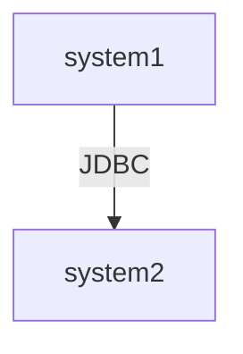

## RDF*
### info
- https://www.w3.org/2021/12/rdf-star.html
- https://github.com/semantic-systems/rdf-star-tutorial/blob/main/RDFstar-demo.md?ysclid=mfyb392six637812628
- «a» — сокращение для rdf:type
### example
#### link
Допустим есть две системы (database), соединенные линком, например, JDBC. Как показать эту связь на "языке знаний" (linked data)?  
##### mermaid

##### Необъектная связь
```
@prefix : <foo/> .
@prefix rdf: <http://www.w3.org/1999/02/22-rdf-syntax-ns#> .

:system1 :link :system2 .

:system1 rdf:type :system .
:system2 rdf:type :system .
```
##### Объектная связь
Связь имеет свой id, свойства и т.п.  
Если есть правило: не более одного линка (с учетом направления), то id удобно задавать "source-target", что обеспечит уникальность (drawio: id + label).  
Однако в общем случае, между двумя системами может быть множество линков. 

##### link1
``` 
@prefix : <foo/> .
@prefix rdf: <http://www.w3.org/1999/02/22-rdf-syntax-ns#> .
@prefix rdfs: <http://www.w3.org/2000/01/rdf-schema#> .

:system1 :link1 :system2 .

:link1
  rdfs:subPropertyOf :link ;
  :id "a1b2c3d4-e5f6-7890-1234-567890accdef" ;
  :protocol :jdbc ;
.

:link a rdf:Property .
:jdbc a :Protocol .
```

Cпаркл запрос, который вытягивает все встречающиеся протоколы связи:
```
prefix : <foo/>
prefix rdfs: <http://www.w3.org/2000/01/rdf-schema#>

select distinct ?protocol {
  ?s1 ?p ?s2 .
  ?p
    rdfs:subPropertyOf :link ;
    :protocol ?protocol ;
  .
}
```

#### RDF star
```
@prefix : <https://foo#> .
@prefix rdf: <http://www.w3.org/1999/02/22-rdf-syntax-ns#> .
@prefix rdfs: <http://www.w3.org/2000/01/rdf-schema#> .

:system1 :link :system2 
  {| 
    :id "a1b2c3d4-e5f6-7890-1234-567890accdef" ;  
    :protocol :jdbc ;
  |} .
  
:system1 :link :system3 
  {| 
    :id "12334455-6fda-0519-9876-20ea3210b119" ;  
    :protocol :soap ;
  |} .
      
:link a rdf:Property .
:jdbc a :Protocol .
:soap a :Protocol .
```

 
#### mermaid
- https://github.com/mermaid-js/mermaid
- https://mermaid.js.org/syntax/flowchart.html
- https://habr.com/ru/articles/652867/

