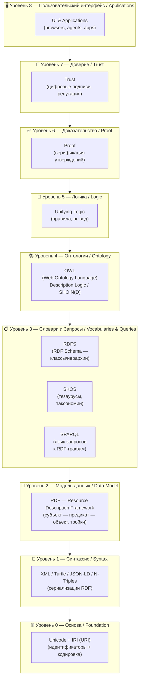
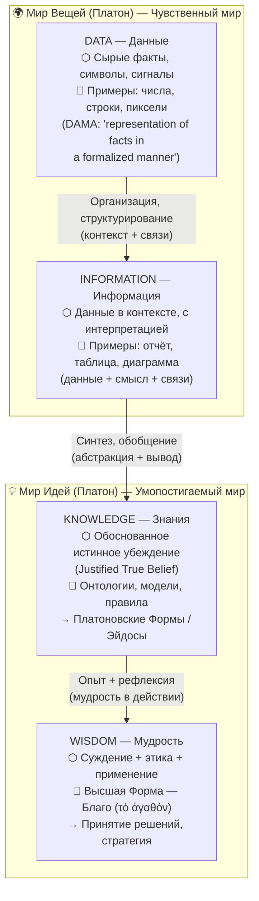
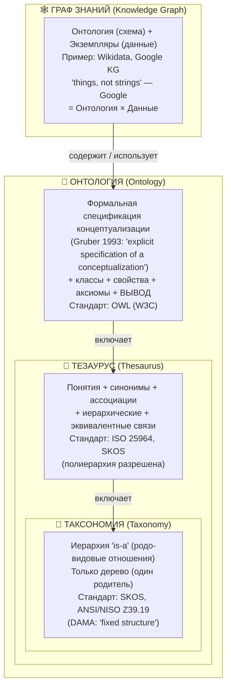
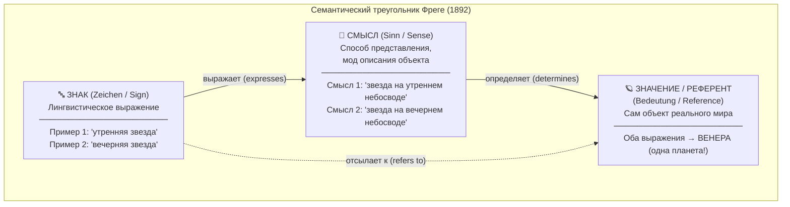
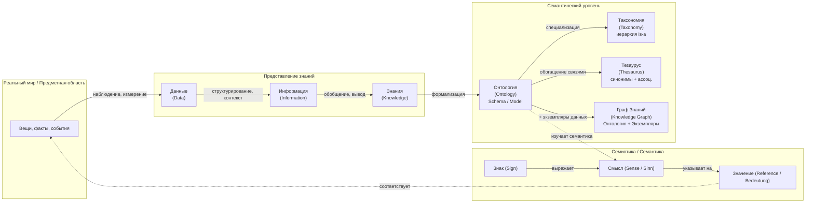

## 1

# 📚 Глубокий анализ понятий: онтология, семантика, смысл, категория, знания, граф знаний, таксономия и др.

---

> **Кратко:**  
> Этот разбор раскрывает философские и ИТ-значения ключевых понятий (онтология, семантика, смысл, категория, знания, граф знаний, таксономия), объясняет причины путаницы, показывает связь философии и ИТ, приводит точные формулировки из стандартов (W3C, DAMA DMBOK, ISO), сравнивает языки описания знаний, демонстрирует иерархию семантических технологий и параллель между DIKW и платоновским миром идей. Все схемы — в mermaid.

---

## 🧭 Структура ответа

1. [Философские основы: определения и объяснения](#philosophy)
2. [ИТ и стандарты: определения и формулировки](#it-definitions)
3. [Причины терминологической путаницы](#confusion)
4. [Параллель: Платон и DIKW](#plato-dikw)
5. [Сравнительная таблица языков описания знаний](#languages-table)
6. [Иерархия семантических технологий (Semantic Web Layer Cake)](#layer-cake)
7. [Mermaid-схемы](#mermaid)
8. [Выводы и ключевые различия](#conclusion)

---

## 1. Философские основы: определения и объяснения 

### Онтология

**Язык специалиста:**  
- Аристотель: онтология — наука о бытии как таковом, выделяет 10 высших категорий (субстанция, количество, качество и др.) .
- Хайдеггер: онтология — вопрос о смысле бытия, не просто каталог сущностей, а исследование того, что значит "быть" .

**Просто:**  
- Аристотель: "Что вообще существует?" — базовые типы вещей.
- Хайдеггер: "Что значит существовать?" — мы уникальны, потому что задаём этот вопрос.

---

### Семантика и смысл

**Язык специалиста:**  
- Фреге: различает знак (Zeichen), смысл (Sinn — способ представления), значение/референт (Bedeutung — объект) .  
  Пример: "утренняя звезда" и "вечерняя звезда" — разные смыслы, один референт (Венера).

**Просто:**  
- Слова могут по-разному описывать одно и то же (Венеру), но смысл выражения зависит от того, как мы его понимаем.

---

### Категория

**Язык специалиста:**  
- Кант: категории — априорные понятия, необходимые для познания (количество, качество, отношение, модальность) .  
  "Понятия без чувственных данных — пусты".

**Просто:**  
- У нас в голове есть "шаблоны", через которые мы воспринимаем мир (например, "причина-следствие").

---

### Знания

**Язык специалиста:**  
- Классика: "обоснованное истинное убеждение" (justified true belief) .

**Просто:**  
- Знание — это то, что мы уверены, что правда, и можем объяснить почему.

---

### Платон: мир идей и мир вещей

**Язык специалиста:**  
- Мир вещей — изменчивый, несовершенный; мир идей (Форм) — вечный, совершенный .  
  Знание возможно только о формах.

**Просто:**  
- Всё, что мы видим — копии идеальных "идей". Истинное знание — о невидимых совершенных прообразах.

---

### DIKW (Data → Information → Knowledge → Wisdom)

**Язык специалиста:**  
- Данные — сырые факты; информация — данные с контекстом; знания — синтезированная информация; мудрость — этическое применение знаний .

**Просто:**  
- Факты → осмысленные факты → понимание → умное применение.

---

## 2. ИТ и стандарты: определения и формулировки 

### Онтология (ИТ)

**Язык специалиста:**  
- Gruber (1993): "Онтология — явная спецификация концептуализации" .
- W3C OWL: "Онтология — наука о видах сущностей и их отношениях" .

**Просто:**  
- В ИТ онтология — это формальная схема, описывающая, какие объекты и связи бывают в предметной области.

---

### Таксономия

**Язык специалиста:**  
- DAMA DMBOK: "Таксономия — фиксированная структура" .
- SKOS: "Модель для выражения структуры концептуальных схем: тезаурусы, таксономии, классификации" .

**Просто:**  
- Таксономия — это дерево понятий (например, биологическая классификация).

---

### Тезаурус

**Язык специалиста:**  
- ISO 25964: "Тезаурус — сеть понятий с иерархическими, ассоциативными и эквивалентными связями".

**Просто:**  
- Тезаурус — словарь синонимов и связанных понятий, не только иерархия.

---

### Граф знаний

**Язык специалиста:**  
- Google: "Граф знаний — база знаний, связывающая сущности и их отношения: things, not strings" .
- W3C: "Коллекция троек (subject-predicate-object), представляющая факты" .

**Просто:**  
- Граф знаний — сеть фактов о вещах и их связях (например, Википедия как сеть).

---

### Семантическая паутина (Semantic Web)

**Язык специалиста:**  
- W3C: "Обеспечивает общий фреймворк для обмена и повторного использования данных" .

**Просто:**  
- Интернет, где данные понимают не только люди, но и машины.

---

### Linked Data (Тим Бернерс-Ли)

**Принципы:**
1. Используйте URI для именования вещей.
2. Используйте HTTP-URI.
3. При обращении к URI возвращайте полезную информацию (RDF, SPARQL).
4. Ссылайтесь на другие URI .

---

### DAMA DMBOK

- **Данные:** "Представление фактов, концепций или инструкций в формализованном виде" .
- **Метаданные:** "Данные о данных — определения, происхождение, классификация, контекст" .

---

## 3. Причины терминологической путаницы 

> **Key Takeaway:**  
> Путаница возникает из-за пересечения областей, разной детализации, эволюции стандартов и инструментов, а также из-за того, что одни и те же слова используются с разным смыслом в философии и ИТ.

### Основные причины

| Причина | Специалист | Просто |
|---|---|---|
| **1. Онтология: философия vs ИТ** | В философии — наука о бытии; в ИТ — формальная модель предметной области | В философии — "что есть?"; в ИТ — "как это формализовать для компьютера?" |
| **2. Таксономия ⊂ Тезаурус ⊂ Онтология** | Таксономия — дерево, тезаурус — сеть, онтология — формальная модель с аксиомами | Таксономия — простая иерархия, тезаурус — словарь синонимов, онтология — сложная схема |
| **3. Онтология vs Граф знаний** | Онтология — схема (TBox), граф знаний = онтология + экземпляры (ABox) | Онтология — "чертёж", граф знаний — "чертёж + факты" |
| **4. Семантика: философия vs ИТ** | Фреге: знак → смысл → значение; ИТ: "семантические технологии" = машинная обработка значений | В философии — "что значит слово?"; в ИТ — "как машина поймёт смысл?" |
| **5. Инструменты размывают границы** | SKOS, OWL позволяют моделировать таксономии, тезаурусы, онтологии одинаково | В ИТ всё можно сделать "графом", поэтому границы стираются |
| **6. Эволюция: семантические сети → графы знаний** | Семантические сети (AI, 1960-е) — предшественники современных графов знаний | Раньше были просто "сети", теперь — "графы знаний" |

---

## 4. Параллель: Платон и DIKW 

| Уровень | Платон | DIKW | Описание |
|---|---|---|---|
| 1 | Мир вещей | Данные | Сырые, изменчивые факты |
| 2 | — | Информация | Организованные данные с контекстом |
| 3 | Мир идей (Форм) | Знания | Совершенные, абстрактные структуры |
| 4 | Высшая Форма — Благо | Мудрость | Этическое применение знаний |

> **Key Finding:**  
> Онтологии в ИТ — попытка создать "машинный мир идей", где знания формализованы и доступны для вывода.

---

## 5. Сравнительная таблица языков описания знаний 

| Язык / Стандарт | Тип | Год | Орган стандартизации | Выразительность | Логический формализм | Основной сценарий | Вывод |
|---|---|---|---|---|---|---|---|
| **RDF** | Модель данных | 1999/2004 | W3C | Низкий | Тройки: субъект–предикат–объект | Linked Data, метаданные, базовые KG | Нет |
| **RDFS** | Язык схем | 2000/2004 | W3C | Низкий–Средний | Простые иерархии классов и свойств | Классы, подклассы, домен/диапазон | Ограниченный |
| **OWL Lite** | Язык онтологий | 2004 | W3C | Средний | Подмножество DL | Простые онтологии, иерархии | Да (ограниченный) |
| **OWL DL** | Язык онтологий | 2004 | W3C | Высокий (разрешимый) | SHOIN(D) — описательные логики | Сложные онтологии, рассуждения | Да (полный) |
| **OWL Full** | Язык онтологий | 2004 | W3C | Очень высокий (неразрешимый) | RDF + все конструкции OWL | Мета-моделирование | Без гарантий |
| **SKOS** | Модель словарей | 2009 | W3C | Низкий–Средний | RDF-граф, broader/narrower/related | Тезаурусы, таксономии, рубрикаторы | Минимальный |
| **SPARQL** | Язык запросов | 2008 | W3C | N/A | SQL-подобный для RDF | Запросы к RDF/OWL, федерат. поиск | Нет |
| **JSON-LD** | Сериализация | 2014 | W3C | N/A | JSON + контекст (маппинг → RDF) | Web API, Linked Data в вебе | Нет |
| **Turtle** | Сериализация | 2014 | W3C | N/A | Компактный текстовый синтаксис RDF | Читаемая запись RDF людьми | Нет |
| **KIF** | Обмен знаниями | 1992 | ANSI / ISO (CL) | Высокий | Логика 1-го порядка (FOL) | Обмен знаниями между AI-системами | Да (FOL) |
| **CycL** | Язык представления знаний | 1994 | Cycorp (proprietary) | Очень высокий | FOL + правила + мета-знания | Здравый смысл AI, база Cyc | Да (FOL+правила) |
| **DAML+OIL** | Язык онтологий (устарел) | 2001 | W3C (предшественник OWL) | Высокий | DL (SHIQ) | Ранние семантические веб-онтологии | Да |
| **Topic Maps (ISO 13250)** | Стандарт орг. знаний | 1999/2003 | ISO/IEC JTC1/SC34 | Средний–Высокий | Топики, ассоциации, вхождения (n-арные) | Субъектно-центрированная орг. знаний | Ограниченный |
| **Common Logic (ISO 24707)** | Мета-стандарт логики | 2007 | ISO/IEC | Очень высокий | FOL + мета; диалекты: KIF, CGIF, XCL | Обмен между лог. системами | Да (FOL+мета) |

---

## 6. Иерархия семантических технологий (Semantic Web Layer Cake) 

**от Unicode/IRI до UI/Applications**

---

## 7. Mermaid-схемы 

### 7.1 Semantic Web Layer Cake

---

### 7.2 Платон и DIKW

---

### 7.3 Таксономия ⊂ Тезаурус ⊂ Онтология → Граф знаний

---

### 7.4 Семантический треугольник Фреге

---

### 7.5 Обзорная карта всех ключевых понятий

---

## 8. Выводы и ключевые различия 

> **Key Takeaway:**  
> **Онтология** в философии — исследование того, что существует, а в ИТ — формальная модель предметной области.  
> **Семантика** в философии — анализ смысла и значения, в ИТ — технологии для машинной интерпретации данных.  
> **Таксономия, тезаурус, онтология, граф знаний** — разные уровни формализации и связности, но в ИТ часто реализуются схожими инструментами, что ведёт к путанице.  
> **Знания ≠ данные ≠ информация:**  
> - Данные — сырые факты  
> - Информация — данные с контекстом  
> - Знания — обобщённая, структурированная информация  
> - Мудрость — этическое применение знаний  
>  
> **Параллель с Платоном:**  
> - Мир вещей = данные  
> - Мир идей = знания (онтологии)  
> - Мудрость = высшая форма (Благо)

---

> **Для специалистов:**  
> Используйте точные определения из стандартов (W3C, DAMA, ISO), различайте уровни формализации, не смешивайте схему (онтология) и данные (граф знаний), учитывайте философские корни терминов.

> **Для всех:**  
> Не все "графы знаний" — это "онтологии", и не все "онтологии" — это просто "иерархии". Смысл слова зависит от контекста!

---

**Источники:**  
- [W3C OWL, RDF, SKOS, Linked Data]
- [DAMA DMBOK]
- [Gruber 1993]
- [Stanford Encyclopedia of Philosophy]
- [Google Knowledge Graph]
- [ISO 25964, ANSI/NISO Z39 уровень детализации!**
- 
