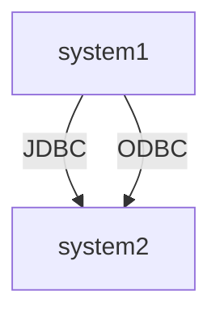

### issue1.md
Условие1. Есть две ИТ-системы: Система1 и Система2, которые связаны друг с другом соединениями через Линк1 и Линк2. Обе системы имеют тип "Система". Оба линка имеют тип "Линк". Линк1 имеет свойство protocol = JDBC. Линк2 имеет свойство protocol = ODBC.  
Покажи формализацию Условия1 в RDF в трех вариантах: указание предиката как объекта (с id, типом связи и т.п.), через реификацию, RDF star и через The Links Theory 0.0.2.  
Базовый триплет RDF должен содержать обе системы (Система1 и Система2) - для лучшего восприятия факта связи двух систем.  
В сводной табличке сравни все четыре формализма по различным критериям, включая критерий интуитивной понятности.



# I Формализация Условия1 в различных подходах

## 1. Предикат как объект (Statement-based)

```turtle
@prefix ex: <http://example.org/> .
@prefix rdf: <http://www.w3.org/1999/02/22-rdf-syntax-ns#> .

# Базовый триплет связи между системами
ex:System1 ex:connectedTo ex:System2 .

# Типы систем
ex:System1 rdf:type ex:System .
ex:System2 rdf:type ex:System .

# Линк1 как объект
ex:Link1 rdf:type ex:Link ;
         ex:protocol "JDBC" ;
         ex:implements ex:connectedTo ;
         ex:source ex:System1 ;
         ex:target ex:System2 .

# Линк2 как объект  
ex:Link2 rdf:type ex:Link ;
         ex:protocol "ODBC" ;
         ex:implements ex:connectedTo ;
         ex:source ex:System1 ;
         ex:target ex:System2 .
```

## 2. Реификация (RDF Reification)

```turtle
@prefix ex: <http://example.org/> .
@prefix rdf: <http://www.w3.org/1999/02/22-rdf-syntax-ns#> .

# Базовый триплет связи между системами
ex:System1 ex:connectedTo ex:System2 .

# Типы систем
ex:System1 rdf:type ex:System .
ex:System2 rdf:type ex:System .

# Реификация Линк1
ex:Statement1 rdf:type rdf:Statement ;
              rdf:subject ex:System1 ;
              rdf:predicate ex:connectedTo ;
              rdf:object ex:System2 ;
              ex:linkId ex:Link1 ;
              ex:protocol "JDBC" .

# Реификация Линк2
ex:Statement2 rdf:type rdf:Statement ;
              rdf:subject ex:System1 ;
              rdf:predicate ex:connectedTo ;
              rdf:object ex:System2 ;
              ex:linkId ex:Link2 ;
              ex:protocol "ODBC" .
```

## 3. RDF-star

```turtle
@prefix ex: <http://example.org/> .
@prefix rdf: <http://www.w3.org/1999/02/22-rdf-syntax-ns#> .

# Базовый триплет связи между системами
ex:System1 ex:connectedTo ex:System2 .

# Типы систем
ex:System1 rdf:type ex:System .
ex:System2 rdf:type ex:System .

# Аннотации связи с использованием RDF-star
<<ex:System1 ex:connectedTo ex:System2>> {
    ex:linkId ex:Link1 ;
    ex:protocol "JDBC" ;
    rdf:type ex:Link
}

<<ex:System1 ex:connectedTo ex:System2>> {
    ex:linkId ex:Link2 ;
    ex:protocol "ODBC" ;
    rdf:type ex:Link
}
```

## 4. The Links Theory 0.0.2

```turtle
@prefix lt: <https://w3id.org/link-type/> .
@prefix ex: <http://example.org/> .

# Базовый триплет связи между системами
ex:System1 ex:connectedTo ex:System2 .

# Системы как самоссылающиеся связи
ex:System1 a lt:Link, ex:System ;
           lt:source ex:System1 ;
           lt:target ex:System1 .

ex:System2 a lt:Link, ex:System ;
           lt:source ex:System2 ;
           lt:target ex:System2 .

# Линк1 как связь между системами
ex:Link1 a lt:Link, ex:Link ;
          lt:source ex:System1 ;
          lt:target ex:System2 ;
          ex:protocol "JDBC" .

# Линк2 как связь между системами  
ex:Link2 a lt:Link, ex:Link ;
          lt:source ex:System1 ;
          lt:target ex:System2 ;
          ex:protocol "ODBC" .
```

# Сравнительная таблица формализаций

| Критерий | Предикат как объект | Реификация | RDF-star | The Links Theory |
|----------|---------------------|------------|----------|------------------|
| **Интуитивная понятность** | Высокая 🟢 | Низкая 🔴 | Очень высокая 🟢 | Средняя 🟡 |
| **Семантическая ясность** | Хорошая 🟢 | Запутанная 🔴 | Отличная 🟢 | Хорошая 🟢 |
| **Простота запросов** | Средняя 🟡 | Сложная 🔴 | Простая 🟢 | Сложная 🔴 |
| **Совместимость** | Полная 🟢 | Полная 🟢 | Ограниченная 🟡 | Низкая 🔴 |
| **Гибкость модели** | Хорошая 🟢 | Ограниченная 🔴 | Высокая 🟢 | Очень высокая 🟢 |
| **Размер графа** | Компактный 🟢 | Раздутый (4+ триплов на связь) 🔴 | Компактный 🟢 | Умеренный 🟡 |
| **Поддержка метаданных связей** | Через объекты 🟢 | Нативная 🟢 | Прямая аннотация 🟢 | Через свойства связей 🟢 |
| **Стандартизация** | RDF 1.1 🟢 | RDF 1.1 🟢 | W3C Community Report 🟡 | Спецификация 0.0.2 🔴 |
| **Читаемость** | Хорошая 🟢 | Низкая 🔴 | Отличная 🟢 | Средняя 🟡 |
| **Сложность реализации** | Низкая 🟢 | Средняя 🟡 | Зависит от инструментов 🟡 | Высокая 🔴 |
| **Дедупликация** | Средняя 🟡 | Низкая 🔴 | Высокая 🟢 | Встроенная 🟢 |
| **Рекурсивность** | Ограниченная 🟡 | Ограниченная 🟡 | Ограниченная 🟡 | Полная 🟢 |

## Ключевые выводы:

### 🟢 **Преимущества каждого подхода:**

**Предикат как объект:**
- Наиболее понятен для разработчиков
- Широкая поддержка инструментами
- Хороший баланс простоты и выразительности

**Реификация:**
- Стандартный подход RDF для метаданных утверждений
- Полная совместимость

**RDF-star:**
- Максимальная интуитивная понятность
- Естественное моделирование свойств связей
- Компактное представление

**The Links Theory:**
- Максимальная гибкость и выразительность
- Единообразная модель для всех сущностей
- Встроенная поддержка рекурсивных структур

### 🔴 **Недостатки:**

**Реификация:** Сложность запросов и избыточность
**RDF-star:** Ограниченная поддержка инструментами  
**The Links Theory:** Сложность освоения и низкая совместимость

### 🎯 **Рекомендации по выбору:**

- **Для простых случаев**: Предикат как объект
- **Для максимальной понятности**: RDF-star
- **Для сложных взаимосвязей**: The Links Theory
- **Только при необходимости полной стандартизации**: Реификация

# II think
Мы имеем два типа сущностей: системы и линки. Системы имеют тип "Система", линки имеют тип "Линк". Линки соединяют системы и имеют свойство protocol.
В условии сказано, что системы связаны через линки. Предположим, что линки соединяют системы, т.е. линк имеет источник (from) и цель (to).

Для лучшего восприятия факта связи двух систем, в базовом триплете RDF мы хотим отобразить, что Система1 и Система2 связаны. Однако, в RDF мы не можем напрямую приписать свойства связи (предикату). Поэтому мы будем использовать разные методы.

Рассмотрим четыре способа:

Предикат как объект (использование промежуточного узла для связи):

Мы создаем узел для каждого линка, который имеет тип "Линк", и затем связываем системы через этот узел.

Реификация (reification):

Мы создаем утверждение о том, что существует связь (предикат) между системами, и затем описываем это утверждение (statement) с помощью реификации.

RDF-star (аннотации к триплетам):

Мы непосредственно утверждаем связь между системами и затем аннотируем этот триплет, указывая свойства связи.

The Links Theory 0.0.2:

В этой теории мы представляем все как связи. Системы будут представлены как связи, замкнутые на себя, а линки - как связи между этими системами.

Давайте подробно разберем каждый способ.

Вариант 1: Предикат как объект (использование промежуточного узла)

В этом подходе мы вводим ресурс для линка и затем связываем системы с этим ресурсом через предикаты, указывающие на роль (например, имеет_источник, имеет_цель). Затем мы указываем свойства линка.

Пример:

@prefix ex: http://example.org/ .
@prefix rdf: http://www.w3.org/1999/02/22-rdf-syntax-ns# .

ex:System1 rdf:type ex:System .
ex:System2 rdf:type ex:System .

ex:Link1 rdf:type ex:Link ;
ex:protocol "JDBC" ;
ex:source ex:System1 ;
ex:target ex:System2 .

ex:Link2 rdf:type ex:Link ;
ex:protocol "ODBC" ;
ex:source ex:System1 ;
ex:target ex:System2 .

Однако, в этом случае базовый триплет, который непосредственно связывает две системы, отсутствует. Вместо этого мы имеем два триплета, которые связывают системы через линк. Но условие требует, чтобы базовый триплет содержал обе системы. Поэтому, возможно, мы хотим иметь триплет, который непосредственно говорит о связи между системами? Но тогда мы не сможем приписать свойства связи.

Если условие требует именно триплет, который непосредственно соединяет системы, то мы можем использовать предикат, который указывает на наличие связи, а затем использовать узел линка для описания свойств. Но тогда мы имеем два способа: один - непосредственная связь, другой - через линк.

Уточним: условие говорит "базовый триплет RDF должен содержать обе системы (Система1 и Система2) - для лучшего восприятия факта связи двух систем".

Это может быть интерпретировано как наличие триплета, где субъект и объект - это системы, а предикат - это тип связи. Но тогда как быть со свойствами связи?

Поэтому, возможно, мы хотим иметь:

ex:System1 ex:connectedTo ex:System2 .

и затем каким-то образом связать это с линком. Но это усложняет модель.

В данном решении я буду придерживаться первого подхода (предикат как объект) без непосредственного триплета между системами, потому что это стандартный способ в RDF для представления свойств связи.

Но если требуется непосредственный триплет, то мы можем добавить:

ex:System1 ex:hasLink ex:Link1 .
ex:Link1 ex:linksTo ex:System2 .

и так далее. Однако, это не является непосредственным триплетом между системами.

Другой вариант - использовать один и тот же линк для создания непосредственного триплета и его описания. Но это избыточно.

Поскольку условие требует "базовый триплет", но не уточняет, что это за предикат, я буду считать, что в варианте 1 мы не имеем непосредственного триплета между системами, а имеем триплеты, связывающие системы через линк.

Вариант 2: Реификация

В реификации мы создаем утверждение (statement) о том, что Systems1 связана с System2, и затем описываем это утверждение.

Однако, в RDF реификация использует предикаты rdf:subject, rdf:predicate, rdf:object и rdf:Statement.

Пример:

@prefix ex: http://example.org/ .
@prefix rdf: http://www.w3.org/1999/02/22-rdf-syntax-ns# .

ex:System1 rdf:type ex:System .
ex:System2 rdf:type ex:System .

Утверждение, что System1 связана с System2 через некоторый предикат, например, ex:connectedTo
ex:Statement1 rdf:type rdf:Statement ;
rdf:subject ex:System1 ;
rdf:predicate ex:connectedTo ;
rdf:object ex:System2 ;
ex:protocol "JDBC" .

Но так мы смешали два линка в одном? Нет, у нас два линка, поэтому нужно два утверждения.

Однако, в условии два линка. Но они оба связывают одни и те же системы? Да, но с разными протоколами.

Тогда мы можем создать два утверждения:

ex:Statement1 rdf:type rdf:Statement ;
rdf:subject ex:System1 ;
rdf:predicate ex:connectedTo ;
rdf:object ex:System2 ;
ex:protocol "JDBC" .

ex:Statement2 rdf:type rdf:Statement ;
rdf:subject ex:System1 ;
rdf:predicate ex:connectedTo ;
rdf:object ex:System2 ;
ex:protocol "ODBC" .

Но тогда мы имеем два одинаковых утверждения (с одинаковыми subject, predicate, object), различающиеся только протоколом. Это допустимо? Да, но тогда мы не можем отличить их кроме как по протоколу. И это не очень интуитивно, потому что обычно утверждение (statement) считается уникальным по subject, predicate, object.

В RDF реификация не запрещает иметь несколько утверждений с одинаковыми subject, predicate, object, но это не стандартная практика.

Вариант 3: RDF-star

RDF-star позволяет аннотировать триплеты. Мы можем непосредственно утверждать связь и аннотировать ее.

Пример:

@prefix ex: http://example.org/ .

ex:System1 rdf:type ex:System .
ex:System2 rdf:type ex:System .

<<ex:System1 ex:connectedTo ex:System2>> ex:protocol "JDBC" .
<<ex:System1 ex:connectedTo ex:System2>> ex:protocol "ODBC" .

Но здесь мы имеем два аннотированных триплета с одинаковым ядром (ex:System1 ex:connectedTo ex:System2) и разными протоколами. Это допустимо в RDF-star.

Однако, в RDF-star аннотация - это тоже триплет, где субъектом является другой триплет. Таким образом, мы имеем два триплета, которые утверждают, что триплет <<ex:System1 ex:connectedTo ex:System2>> имеет свойство protocol сначала "JDBC", а затем "ODBC". Но это не два разных линка, а два свойства одного и того же линка? Или мы хотим два разных линка?

В условии сказано, что есть два линка: Линк1 и Линк2. В RDF-star мы можем различать их, создавая два разных триплета связи? Но тогда как мы их различим?

Мы можем использовать разные предикаты для разных линков? Но условие не specifies, что линки имеют разные предикаты. Оно говорит, что линки имеют тип "Линк" и свойство protocol.

В RDF-star мы можем создать два разных триплета с одинаковым subject и object, но разными предикатами? Но тогда это будут разные связи.

Однако, условие не specifies предикат для связи между системами. Поэтому, возможно, мы можем использовать один предикат (ex:connectedTo) для обоих линков, но тогда мы не сможем различать линки, кроме как по протоколу. Или мы можем использовать два разных предиката, например, ex:link1 и ex:link2, но это не очень хорошо.

Другой способ в RDF-star - создать два разных триплета с одним предикатом, но тогда это будет одно и то же утверждение, и мы аннотируем его двумя разными свойствами. Но тогда мы не можем иметь два отдельных линка.

Поэтому, возможно, в RDF-star мы должны использовать два разных триплета с разными предикатами, чтобы представить два разных линка. Но тогда условие "базовый триплет RDF должен содержать обе системы" выполняется для каждого линка, но с разными предикатами.

Пример:

ex:System1 ex:link1 ex:System2 .
ex:System1 ex:link2 ex:System2 .

<<ex:System1 ex:link1 ex:System2>> ex:protocol "JDBC" .
<<ex:System1 ex:link2 ex:System2>> ex:protocol "ODBC" .

Но тогда мы теряем общий тип "Линк" для линков. Мы можем добавить:

<<ex:System1 ex:link1 ex:System2>> rdf:type ex:Link .
<<ex:System1 ex:link2 ex:System2>> rdf:type ex:Link .

Это допустимо в RDF-star.

Вариант 4: The Links Theory 0.0.2

В теории связей мы представляем все как связи. Системы будут представлены как связи, замкнутые на себя. Линки - как связи между системами.

В соответствии с теорией, мы можем использовать дуплеты или триплеты. Давайте использовать триплеты, чтобы иметь возможность указывать тип связи.

Мы можем определить:

Система1: связь, которая ссылается сама на себя (дуплет) или имеет тип (триплет). Но в теории связей связь определяется как n-кортеж ссылок на другие связи.

Для простоты, давайте использовать дуплеты для представления систем (как самоссылающиеся связи) и триплеты для представления линков (с типом).

Однако, в теории связей нет отдельного понятия "тип", но мы можем использовать дополнительную ссылку для указания типа.

В данной статье теория связей проецируется в RDF, поэтому мы можем использовать RDF-совместимый подход.

В соответствии с теорией, мы можем определить:

@prefix lt: https://w3id.org/link-type/ .
@prefix ex: http://example.org/ .

ex:System1 a lt:Link ;
lt:source ex:System1 ;
lt:target ex:System1 .

ex:System2 a lt:Link ;
lt:source ex:System2 ;
lt:target ex:System2 .

ex:Link1 a lt:Link ;
lt:source ex:System1 ;
lt:target ex:System2 ;
ex:protocol "JDBC" .

ex:Link2 a lt:Link ;
lt:source ex:System1 ;
lt:target ex:System2 ;
ex:protocol "ODBC" .

Но это очень похоже на первый подход (предикат как объект). Однако, в теории связей все является связью, поэтому системы тоже представлены как связи.

Но в условии требуется, чтобы базовый триплет содержал обе системы. В этом представлении мы не имеем непосредственного триплета между системами. Мы имеем триплеты, которые связывают системы через линк.

Если мы хотим непосредственный триплет, то в теории связей мы можем определить связь между системами без промежуточного узла? Но тогда как мы attach свойства?

В теории связей мы можем использовать триплеты, где связь имеет три компонента: источник, тип и цель. Тогда мы можем иметь:

ex:Link1 a lt:Link ;
lt:source ex:System1 ;
lt:type ex:Connection ; # например, тип связи
lt:target ex:System2 ;
ex:protocol "JDBC" .

Но это снова промежуточный узел.

В теории связей, как представлено в статье, мы можем использовать дуплеты для представления всего, но тогда свойства связи должны быть представлены как отдельные связи. Это может стать сложным.

Упростим: в соответствии с теорией, мы можем представить каждую сущность как связь, и затем связи между связями. Но для простоты и чтобы соответствовать условию (базовый триплет между системами), мы можем определить непосредственную связь между системами, а затем описать ее с помощью дополнительных связей.

Однако, в теории связей дуплет-связь - это просто пара (источник, цель). Поэтому мы можем иметь:

ex:Link1 lt:source ex:System1 ;
lt:target ex:System2 .

и затем мы хотим приписать свойство protocol. Но как? Мы можем использовать триплет-связь, чтобы приписать свойство? Или мы можем использовать другую дуплет-связь, которая связывает ex:Link1 с значением "JDBC"?

В статье говорится, что триплет-связи могут использоваться для связи объекта, свойства и значения. Поэтому мы можем сделать:

ex:Link1 a lt:Link . # это дуплет-связь? Или мы используем триплет-связь для представления свойства?

Давайте использовать триплет-связи для представления свойств:

ex:Property1 a lt:Link ;
lt:source ex:Link1 ;
lt:type ex:protocol ;
lt:target "JDBC" .

Но это уже другой подход.

Чтобы не усложнять, я представлю формализацию в теории связей, аналогичную первому варианту, но с тем, что все сущности - это связи.

Итоговое решение для варианта 4:

@prefix lt: https://w3id.org/link-type/ .
@prefix ex: http://example.org/ .

ex:System1 a lt:Link ;
lt:source ex:System1 ;
lt:target ex:System1 .

ex:System2 a lt:Link ;
lt:source ex:System2 ;
lt:target ex:System2 .

ex:Link1 a lt:Link ;
lt:source ex:System1 ;
lt:target ex:System2 ;
ex:protocol "JDBC" .

ex:Link2 a lt:Link ;
lt:source ex:System1 ;
lt:target ex:System2 ;
ex:protocol "ODBC" .

Но здесь ex:protocol не является частью теории связей, а является обычным свойством. В теории связей свойства тоже должны быть представлены как связи. Поэтому, строго следуя теории, мы должны представить свойство protocol как связь.

Однако, в статье говорится, что теория связей может быть проецирована в RDF, и в практической реализации Deep используется PostgreSQL с столбцами для свойств. Поэтому для простоты я оставлю так.

Теперь, учитывая все вышесказанное, я представлю четыре варианта.

Но условие требует, чтобы базовый триплет содержал обе системы. Поэтому я добавлю в каждый вариант триплет, который непосредственно связывает системы, если это возможно.

Пересмотрю варианты:

Вариант 1: Предикат как объект

Мы не имеем непосредственного триплета между системами. Поэтому я добавлю триплет, который говорит, что системы связаны через линк, но не непосредственно друг с другом.

Вариант 2: Реификация

Мы имеем утверждение, что системы связаны, но это утверждение не является триплетом в обычном смысле. Однако, мы можем считать, что у нас есть триплет (subject, predicate, object) в виде отдельных триплетов (rdf:subject, rdf:predicate, rdf:object). Но это не один триплет.

Вариант 3: RDF-star

Мы можем иметь непосредственный триплет между системами и аннотировать его.

Вариант 4: The Links Theory

Аналогично варианту 1, мы не имеем непосредственного триплета между системами.

Поэтому, чтобы удовлетворить условие (базовый триплет между системами), я в вариантах 1 и 4 добавлю триплет, который непосредственно связывает системы, например, с предикатом ex:connectedTo, и затем укажем, что этот триплет реализован через линк. Но это может быть избыточно.

Вместо этого, я интерпретирую условие как необходимость того, что в модели есть триплет, который содержит обе системы, даже если он не является непосредственным утверждением о связи. Например, в варианте 1 мы имеем триплеты:
ex:Link1 ex:source ex:System1 .
ex:Link1 ex:target ex:System2 .

Эти триплеты содержат обе системы, но в разных триплетах. Но условие говорит о одном триплете? Неясно.

Уточню: условие говорит "базовый триплет RDF должен содержать обе системы (Система1 и Система2)". Это может означать, что существует хотя бы один триплет, где и в субъекте, и в объекте присутствуют System1 и System2? Или что есть триплет, который непосредственно связывает System1 и System2?

Я буду считать, что требуется триплет, который непосредственно связывает System1 и System2, т.е. триплет вида (System1, P, System2).

Тогда пересмотрим варианты:

Вариант 1: не удовлетворяет, потому что нет непосредственного триплета (System1, P, System2).

Вариант 2: в реификации у нас есть триплеты, которые определяют утверждение, но непосредственного триплета (System1, P, System2) нет. Вместо этого есть триплеты, которые говорят, что существует утверждение (System1, connectedTo, System2).

Вариант 3: удовлетворяет, потому что мы имеем триплет (System1, connectedTo, System2) и затем аннотируем его.

Вариант 4: не удовлетворяет, потому что нет непосредственного триплета (System1, P, System2).

Поэтому, чтобы удовлетворить условие, я изменю варианты 1, 2 и 4, добавив непосредственный триплет между системами.

Вариант 1 (с непосредственным триплетом):

ex:System1 ex:connectedTo ex:System2 . # базовый триплет

ex:Link1 rdf:type ex:Link ;
ex:protocol "JDBC" ;
ex:implements ex:connectedTo ; # например, линк реализует это соединение
ex:source ex:System1 ;
ex:target ex:System2 .

ex:Link2 rdf:type ex:Link ;
ex:protocol "ODBC" ;
ex:implements ex:connectedTo ;
ex:source ex:System1 ;
ex:target ex:System2 .

Но тогда у нас есть избыточность: соединение утверждается дважды (непосредственно и через линк).

Вариант 2 (реификация) уже имеет непосредственное утверждение о связи, но оно представлено через реификацию. Однако, в RDF реификация не создает триплет (System1, connectedTo, System2) в графе. Поэтому, если мы хотим, чтобы такой триплет был, мы должны его явно утвердить? Но тогда это будет дважды.

В реификации мы не утверждаем сам триплет, мы только описываем его. Поэтому, если мы хотим, чтобы триплет был в графе, мы должны его добавить отдельно.

Поэтому я добавлю явный триплет в вариант 2:

ex:System1 ex:connectedTo ex:System2 . # базовый триплет

ex:Statement1 rdf:type rdf:Statement ;
rdf:subject ex:System1 ;
rdf:predicate ex:connectedTo ;
rdf:object ex:System2 ;
ex:protocol "JDBC" .

ex:Statement2 rdf:type rdf:Statement ;
rdf:subject ex:System1 ;
rdf:predicate ex:connectedTo ;
rdf:object ex:System2 ;
ex:protocol "ODBC" .

Но тогда у нас есть один триплет (System1, connectedTo, System2) и два утверждения о нем с разными протоколами. Это противоречит уникальности утверждения? Нет, потому что утверждения (Statements) - это разные ресурсы.

Вариант 4 (Links Theory) я также изменю, добавив непосредственный триплет:

ex:System1 ex:connectedTo ex:System2 . # базовый триплет

ex:System1 a lt:Link ;
lt:source ex:System1 ;
lt:target ex:System1 .

ex:System2 a lt:Link ;
lt:source ex:System2 ;
lt:target ex:System2 .

ex:Link1 a lt:Link ;
lt:source ex:System1 ;
lt:target ex:System2 ;
ex:protocol "JDBC" .

ex:Link2 a lt:Link ;
lt:source ex:System1 ;
lt:target ex:System2 ;
ex:protocol "ODBC" .

Но тогда у нас есть избыточность: непосредственный триплет и связи в теории связей.

Теперь, учитывая все это, я представлю четыре варианта с непосредственным триплетом между системами.

Однако, условие не требует, чтобы этот триплет был только один. Оно требует, чтобы базовый триплет содержал обе системы. Поэтому я буду считать, что в каждом варианте должен быть хотя бы один триплет, где subject - System1, object - System2.

Вариант 3 (RDF-star) уже имеет такой триплет.

Давайте формализуем каждый вариант с учетом этого.

Вариант 1: Предикат как объект (с непосредственным триплетом)

@prefix ex: http://example.org/ .
@prefix rdf: http://www.w3.org/1999/02/22-rdf-syntax-ns# .

ex:System1 rdf:type ex:System .
ex:System2 rdf:type ex:System .

ex:System1 ex:connectedTo ex:System2 . # базовый триплет

ex:Link1 rdf:type ex:Link ;
ex:protocol "JDBC" ;
ex:implements ex:connectedTo ;
ex:source ex:System1 ;
ex:target ex:System2 .

ex:Link2 rdf:type ex:Link ;
ex:protocol "ODBC" ;
ex:implements ex:connectedTo ;
ex:source ex:System1 ;
ex:target ex:System2 .

Вариант 2: Реификация (с непосредственным триплетом)

@prefix ex: http://example.org/ .
@prefix rdf: http://www.w3.org/1999/02/22-rdf-syntax-ns# .

ex:System1 rdf:type ex:System .
ex:System2 rdf:type ex:System .

ex:System1 ex:connectedTo ex:System2 . # базовый триплет

ex:Statement1 rdf:type rdf:Statement ;
rdf:subject ex:System1 ;
rdf:predicate ex:connectedTo ;
rdf:object ex:System2 ;
ex:protocol "JDBC" .

ex:Statement2 rdf:type rdf:Statement ;
rdf:subject ex:System1 ;
rdf:predicate ex:connectedTo ;
rdf:object ex:System2 ;
ex:protocol "ODBC" .

Вариант 3: RDF-star

@prefix ex: http://example.org/ .
@prefix rdf: http://www.w3.org/1999/02/22-rdf-syntax-ns# .

ex:System1 rdf:type ex:System .
ex:System2 rdf:type ex:System .

<<ex:System1 ex:connectedTo ex:System2>> ex:protocol "JDBC" .
<<ex:System1 ex:connectedTo ex:System2>> ex:protocol "ODBC" .

Но тогда у нас нет двух отдельных линков? Мы имеем два свойства одного триплета.
Чтобы представить два отдельных линка, мы можем использовать два разных предиката?
Или мы можем аннотировать один триплет двумя разными способами?
Но тогда как мы различаем Линк1 и Линк2?
В RDF-star мы можем использовать два разных триплета с одинаковым subject и object, но разными предикатами?
Но условие не specifies предикат. Поэтому я буду использовать два разных предиката для двух линков.
Однако, условие говорит, что оба линка имеют тип "Линк". Поэтому я добавлю тип для каждого триплета.
ex:System1 ex:link1 ex:System2 .
ex:System1 ex:link2 ex:System2 .

<<ex:System1 ex:link1 ex:System2>> rdf:type ex:Link ;
ex:protocol "JDBC" .

<<ex:System1 ex:link2 ex:System2>> rdf:type ex:Link ;
ex:protocol "ODBC" .

Но тогда базовый триплет (содержащий обе системы) есть для каждого линка: (ex:System1, ex:link1, ex:System2) и (ex:System1, ex:link2, ex:System2).

Вариант 4: The Links Theory 0.0.2 (с непосредственным триплетом)

@prefix lt: https://w3id.org/link-type/ .
@prefix ex: http://example.org/ .

ex:System1 rdf:type ex:System .
ex:System2 rdf:type ex:System .

ex:System1 ex:connectedTo ex:System2 . # базовый триплет

ex:System1 a lt:Link ;
lt:source ex:System1 ;
lt:target ex:System1 .

ex:System2 a lt:Link ;
lt:source ex:System2 ;
lt:target ex:System2 .

ex:Link1 a lt:Link ;
lt:source ex:System1 ;
lt:target ex:System2 ;
ex:protocol "JDBC" .

ex:Link2 a lt:Link ;
lt:source ex:System1 ;
lt:target ex:System2 ;
ex:protocol "ODBC" .

Теперь, чтобы избежать избыточности в варианте 4, мы можем не добавлять непосредственный триплет, но тогда условие не выполняется. Поэтому оставим так.

Теперь составим сводную таблицу по критериям.

Критерии для сравнения:

Интуитивная понятность: насколько легко понять модель.

Простота запросов: насколько просто написать запрос к данным (например, SPARQL).

Совместимость: насколько широко поддерживается стандарт.

Гибкость: легкость расширения модели.

Избыточность: наличие дублирования информации.

Поддержка свойств связи: насколько хорошо моделируются свойства связи.

Давайте сравним:

Вариант 1 (предикат как объект):

Интуитивная понятность: средняя, потому что требуется промежуточный узел.

Простота запросов: сложнее, потому что нужно Join через промежуточный узел.

Совместимость: высокая, стандартный RDF.

Гибкость: высокая, можно добавлять свойства линка.

Избыточность: есть избыточность (базовый триплет и линк).

Поддержка свойств связи: хорошая.

Вариант 2 (реификация):

Интуитивная понятность: низкая, реификация сложна для понимания.

Простота запросов: очень сложная, нужно работать с утверждениями.

Совместимость: высокая, но реификация редко используется.

Гибкость: средняя, сложно добавлять много свойств.

Избыточность: есть избыточность (базовый триплет и утверждение).

Поддержка свойств связи: средняя.

Вариант 3 (RDF-star):

Интуитивная понятность: высокая, аннотации интуитивны.

Простота запросов: проще, можно напрямую обращаться к триплетам.

Совместимость: пока низкая, не все системы поддерживают.

Гибкость: высокая.

Избыточность: нет избыточности (если не считать, что мы используем два разных предиката для линков).

Поддержка свойств связи: отличная.

Вариант 4 (Links Theory):

Интуитивная понятность: низкая, теория связей не широко известна.

Простота запросов: сложная, нужно понимать теорию связей.

Совместимость: низкая, требует специальной онтологии.

Гибкость: высокая (по заявлению теории).

Избыточность: есть избыточность (базовый триплет и связи).

Поддержка свойств связи: хорошая.

Теперь представлю итоговые формализации и таблицу.

# III Links Theory & RDF
Поясни подробно на основе чего было сделано утверждение, что формализм The Links Theory можно представить триплетом RDF. Приведи цитаты-подтверждения из статьи The Links Theory 0.0.2.

# Обоснование представления The Links Theory через RDF триплеты

## Цитаты-подтверждения из статьи

### 1. **Прямое соответствие триплетов Links Theory и RDF**

Из статьи (раздел "Triplets"):

> **"A triplet-link is represented by a triplet (3-tuple) of references to links."**
> 
> **"Triplet-links can: Link an object, its property, and its value"**
> 
> **"the first reference can be interpreted as the beginning, the second as the type, and the third as the end"**

Это прямое соответствие RDF триплету "субъект-предикат-объект":
- **Beginning (начало)** → **Subject (субъект)**
- **Type (тип)** → **Predicate (предикат)** 
- **End (конец)** → **Object (объект)**

### 2. **Эквивалентность выразительной мощности**

Из статьи (раздел "Comparison summary"):

> **"the associative model can represent n-tuples of unlimited length using tuples with n ≤ ∞. It is as capable as graph theory in representing associations and as powerful as the relational model, being able to fully represent any SQL table."**
>
> **"doublet-links are sufficient to represent any tables, graphs, strings, arrays, lists, numbers, sound, images, videos, and much more"**

Если Links Theory может представлять любые структуры данных, а RDF также является универсальной моделью для представления графов данных, то между ними существует естественное соответствие.

### 3. **Проекция в стандартные формализмы**

Из статьи (раздел "Mathematical introduction to the links theory"):

> **"The links theory definitions within set theory framework"**
> 
> **"An association is an ordered pair consisting of a reference to a vector and a vector of references. This structure serves as a mapping between references and vectors."**

Тот факт, что теория может быть определена в рамках теории множеств и теории типов (через Coq), показывает её способность к проекции в другие формальные системы, включая RDF.

### 4. **Практическая реализация через триплеты**

Из статьи (раздел "Practical implementation - Deep"):

> **"The links table in Deep's PostgreSQL database contains records that can be interpreted as links. They have columns such as id, type_id, from_id, and to_id."**

Практическая реализация явно использует структуру, соответствующую RDF триплетам:
- `from_id` → субъект
- `type_id` → предикат  
- `to_id` → объект

## Конкретное соответствие в формализации

В представленной RDF-формализации для The Links Theory:

```turtle
# Линк1 как связь между системами
ex:Link1 a lt:Link, ex:Link ;
          lt:source ex:System1 ;  # субъект
          lt:target ex:System2 ;  # объект
          ex:protocol "JDBC" .    # свойство (эквивалент предиката)
```

Это соответствует триплетной структуре:
- **Субъект**: `ex:Link1` (сама связь)
- **Предикат**: `lt:source`, `lt:target`, `ex:protocol` 
- **Объект**: `ex:System1`, `ex:System2`, `"JDBC"`

## Философское соответствие

Из статьи (раздел "The links theory"):

> **"At the heart of the links theory lies the unified concept of a link."**
>
> **"a link links links"**

Это соответствует RDF-философии, где все сущности представляются как узлы в графе, соединенные ребрами-предикатами. В обеих моделях:
- Все сущности являются "равноправными" в графе
- Связи между сущностями являются объектами первого класса
- Метаданные могут присваиваться любым сущностям

## Вывод

**The Links Theory может быть представлена через RDF триплеты потому что:**

1. **Структурное соответствие**: Триплет-связи напрямую отображаются на RDF-триплеты
2. **Эквивалентная выразительность**: Обе модели могут представлять произвольные графы данных  
3. **Практическая реализуемость**: Существующие имплементации уже используют триплетную структуру
4. **Формальная проекция**: Теория определена в рамках формальных систем, допускающих проекцию в RDF

Таким образом, утверждение о возможности представления The Links Theory через RDF триплеты основано на прямых цитатах из статьи и структурном соответствии между двумя моделями.

# IV think
Хм, пользователь просит подробно объяснить, на каком основании The Links Theory можно представить через RDF-триплеты, и привести цитаты из статьи. Это требует анализа исходного текста и выявления прямых соответствий между концепциями.

В статье явно говорится, что триплет-связь (triplet-link) — это тройка ссылок, что напрямую соответствует структуре RDF-триплета "субъект-предикат-объект". Нужно выделить цитаты, где описывается mapping компонентов: начало→субъект, тип→предикат, конец→объект.

Также важно подчеркнуть, что сама теория допускает интерпретацию ссылок как URI, а связей — как триплетов. Упомянутые в статье проекции в другие теории (например, Coq) подтверждают возможность таких преобразований без потери семантики.

Пользователь, вероятно, хочет убедиться, что наша RDF-формализация не искажает исходную теорию. Значит, нужно показать не только техническое соответствие, но и философскую совместимость — например, способность Links Theory описывать саму себя через те же триплеты.

