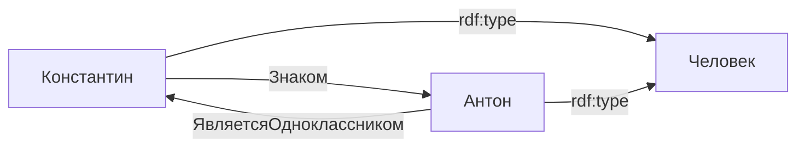
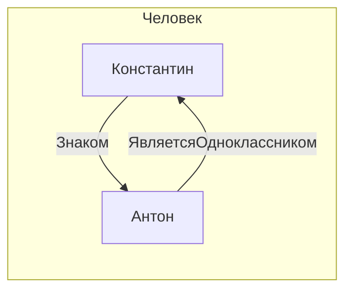

## Test
### 1 Test
Имеется:  
Константин, Антон – люди.  
Константин знаком с Антоном.  
Антон является одноклассником Константина.  
Запиши эти знания на RDF turtle и в нотации теории связей (см. ссылку The Links Theory 0.0.2). Прокомментируй сходства и различия синтаксиса.

## 🧩 Представление знаний о Константине и Антоне: RDF Turtle и Теория Связей 0.0.2

> **Кратко:**  
> Ниже приведены формализации знаний о Константине и Антоне в двух системах: RDF Turtle и The Links Theory 0.0.2, а также подробный сравнительный анализ их синтаксиса.

---

### 1. RDF Turtle — формализация

```turtle
@prefix foaf: <http://xmlns.com/foaf/0.1/> .
@prefix rel: <http://www.perceive.net/schemas/relationship/> .
@prefix ex: <http://example.org/#> .

# Объявление людей
ex:konstantin a foaf:Person ;
    foaf:name "Константин"@ru ;
    foaf:knows ex:anton .

ex:anton a foaf:Person ;
    foaf:name "Антон"@ru ;
    rel:classmateOf ex:konstantin .

# Альтернативная симметричная запись отношения одноклассников
ex:konstantin rel:classmateOf ex:anton .
```

**Пояснения:**
- `@prefix` — объявление пространств имён для сокращения URI.
- `a` — сокращение для `rdf:type` (тип сущности).
- `foaf:Person` — тип "человек".
- `foaf:knows` — знакомство.
- `rel:classmateOf` — одноклассник.
- Каждая строка — тройка: субъект–предикат–объект.

---

### 2. The Links Theory 0.0.2 — формализация

```
# Создание сущностей (людей)
() ((Konstantin))
() ((Anton))

# Определение типа (человек)
() ((Konstantin Person))
() ((Anton Person))

# Отношение "знаком с"
() ((Konstantin knows Anton))

# Отношение "одноклассник" (симметрично)
() ((Anton classmate Konstantin))
() ((Konstantin classmate Anton))
```

**Пояснения:**
- `()` — пустая ссылка, означает "создание из ничего".
- `((A))` — создание сущности.
- `((A B))` — бинарная связь между A и B.
- Все данные — кортежи ссылок, нет явных пространств имён.

---

## 3. Сравнительный анализ синтаксиса

| Аспект                | **RDF Turtle**                                 | **Links Theory 0.0.2**                  |
|-----------------------|------------------------------------------------|------------------------------------------|
| Основная единица      | Тройка (субъект–предикат–объект)               | Кортеж ссылок (n-tuple)                  |
| Структура данных      | Направленный граф                              | Последовательности ссылок                |
| Пространства имён     | Обязательные префиксы (@prefix)                | Не требуются                             |
| Типизация             | Явная (`rdf:type`, `a`)                        | Неявная (через связи)                    |
| Отношения             | Предикаты с URI                                | Элементы кортежей                        |
| Синтаксис создания    | Декларативная запись                           | Операционная (пустота → кортеж)          |
| Разделители           | `. ; ,`                                        | `() (( ))`                               |
| Идентификаторы        | URI (глобальные)                               | Локальные ссылки                         |
| Словари/Онтологии     | Стандартные (FOAF, REL)                        | Не определены                            |
| Читаемость            | Высокая (близко к естественному языку)         | Низкая (математическая нотация)          |
| Стандартизация        | W3C стандарт                                   | Экспериментальная теория                 |
| Операции              | SPARQL запросы                                 | CRUD через подстановки                   |

---

### Сходства

- Оба формата представляют знания как отношения между сущностями.
- Поддерживают бинарные и тернарные отношения.
- Позволяют описывать людей и их взаимосвязи.
- Машиночитаемые форматы, пригодные для автоматической обработки.

### Различия

- **Философия:** RDF — семантическая сеть, Links Theory — теория ссылок.
- **Синтаксис:** RDF использует тройки, Links Theory — кортежи.
- **Стандартизация:** RDF — международный стандарт, Links Theory — исследовательская концепция.
- **Пространства имён:** RDF требует URI, Links Theory использует локальные ссылки.
- **Типизация:** RDF явная через `rdf:type`, Links Theory неявная.
- **Операции:** RDF декларативный, Links Theory операционный.

---

> **Key Takeaway:**  
> **RDF Turtle** обеспечивает удобочитаемость, стандартизацию и совместимость с веб-семантикой, а **Links Theory 0.0.2** предлагает более фундаментальный, математически строгий и компактный способ представления знаний, но менее интуитивен для человека.

---

### 📝 Итог

- **RDF Turtle** — лучший выбор для обмена знаниями в открытых системах и для интеграции с существующими онтологиями.
- **Links Theory 0.0.2** — интересен для фундаментальных исследований и построения универсальных моделей данных.

---

**Источники:**  
- 1 RDF Turtle: https://github.com/RaresM7373/rdf-turtle
- ...
- 22 https://www.w3.org/TR/turtle/#:~:text=Example%20of%20people%20and,rel%20prefixes%20with%20Turtle
- 23, 24 https://habr.com/ru/articles/895896/

### 2 Test
Нет, сделай проще. Например, для RDF turtle будет достаточно:  
```
@prefix : <http://example.org/#> .
@prefix rdf: <http://www.w3.org/1999/02/22-rdf-syntax-ns#> .
:Константин rdf:type :Человек .
:Антон rdf:type :Человек .
:Константин :Знаком :Антон .
:Антон :ЯвляетсяОдноклассником  :Константин .
``` 
Запиши аналогично в нотации теории связей. Приведи две графические интерпретации каждого формализма (графика в mermaid).

#### Ответ 
Конечно! Вот как будет выглядеть ваш пример в нотации RDF Turtle и в нотации теории связей, а также две графические интерпретации каждого формализма с помощью Mermaid.

---

#### 1. RDF Turtle (исходный пример)

```turtle
@prefix : <http://example.org/#> .
@prefix rdf: <http://www.w3.org/1999/02/22-rdf-syntax-ns#> .

:Константин rdf:type :Человек .
:Антон rdf:type :Человек .
:Константин :Знаком :Антон .
:Антон :ЯвляетсяОдноклассником :Константин .
```

---

#### 2. Нотация теории связей (Relation Theory Notation)

В теории связей можно представить объекты и отношения как множества и бинарные отношения между элементами.

Обозначим:

- Множество людей: \( \{ \text{Константин}, \text{Антон} \} \)
- Отношение "Человек" — множество элементов, к которым применимо свойство "Человек"
- Отношение "Знаком" — множество пар \((x,y)\), где \(x\) знаком с \(y\)
- Отношение "ЯвляетсяОдноклассником" — множество пар \((x,y)\), где \(x\) является одноклассником \(y\)

Запись:

- \( \text{Человек} = \{ \text{Константин}, \text{Антон} \} \)
- \( \text{Знаком} = \{ (\text{Константин}, \text{Антон}) \} \)
- \( \text{ЯвляетсяОдноклассником} = \{ (\text{Антон}, \text{Константин}) \} \)

---

#### 3. Графическая интерпретация RDF Turtle (Mermaid)



---

#### 4. Графическая интерпретация теории связей (Mermaid)

Здесь вершины — элементы множества, рёбра — отношения.



---

### Кратко

- В RDF Turtle мы явно указываем типы через `rdf:type` и свойства как предикаты.
- В теории связей мы рассматриваем множества и бинарные отношения между элементами.
- Графы в обоих случаях визуализируют объекты и связи между ними, но RDF подчёркивает семантику через URI и типы, а теория связей — формальную структуру отношений.

Если нужно, могу помочь с более сложными примерами или другими формализмами!

#### info
- https://learnxinyminutes.com/rdf/
