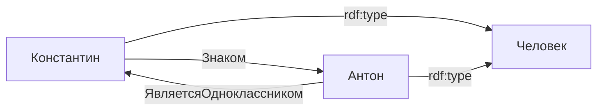
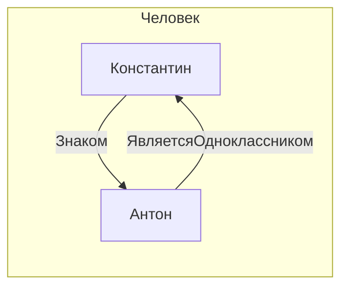

## Test
## 1 Test
Имеется:  
Константин, Антон – люди.  
Константин знаком с Антоном.  
Антон является одноклассником Константина.  
Запиши эти знания на RDF turtle и в нотации теории связей (см. ссылку The Links Theory 0.0.2). Прокомментируй сходства и различия синтаксиса.

## 🧩 Представление знаний о Константине и Антоне: RDF Turtle и Теория Связей 0.0.2

> **Кратко:**  
> Ниже приведены формализации знаний о Константине и Антоне в двух системах: RDF Turtle и The Links Theory 0.0.2, а также подробный сравнительный анализ их синтаксиса.

---

### 1. RDF Turtle — формализация

```turtle
@prefix foaf: <http://xmlns.com/foaf/0.1/> .
@prefix rel: <http://www.perceive.net/schemas/relationship/> .
@prefix ex: <http://example.org/#> .

# Объявление людей
ex:konstantin a foaf:Person ;
    foaf:name "Константин"@ru ;
    foaf:knows ex:anton .

ex:anton a foaf:Person ;
    foaf:name "Антон"@ru ;
    rel:classmateOf ex:konstantin .

# Альтернативная симметричная запись отношения одноклассников
ex:konstantin rel:classmateOf ex:anton .
```

**Пояснения:**
- `@prefix` — объявление пространств имён для сокращения URI.
- `a` — сокращение для `rdf:type` (тип сущности).
- `foaf:Person` — тип "человек".
- `foaf:knows` — знакомство.
- `rel:classmateOf` — одноклассник.
- Каждая строка — тройка: субъект–предикат–объект.

---

### 2. The Links Theory 0.0.2 — формализация

```
# Создание сущностей (людей)
() ((Konstantin))
() ((Anton))

# Определение типа (человек)
() ((Konstantin Person))
() ((Anton Person))

# Отношение "знаком с"
() ((Konstantin knows Anton))

# Отношение "одноклассник" (симметрично)
() ((Anton classmate Konstantin))
() ((Konstantin classmate Anton))
```

**Пояснения:**
- `()` — пустая ссылка, означает "создание из ничего".
- `((A))` — создание сущности.
- `((A B))` — бинарная связь между A и B.
- Все данные — кортежи ссылок, нет явных пространств имён.

---

## 3. Сравнительный анализ синтаксиса

| Аспект                | **RDF Turtle**                                 | **Links Theory 0.0.2**                  |
|-----------------------|------------------------------------------------|------------------------------------------|
| Основная единица      | Тройка (субъект–предикат–объект)               | Кортеж ссылок (n-tuple)                  |
| Структура данных      | Направленный граф                              | Последовательности ссылок                |
| Пространства имён     | Обязательные префиксы (@prefix)                | Не требуются                             |
| Типизация             | Явная (`rdf:type`, `a`)                        | Неявная (через связи)                    |
| Отношения             | Предикаты с URI                                | Элементы кортежей                        |
| Синтаксис создания    | Декларативная запись                           | Операционная (пустота → кортеж)          |
| Разделители           | `. ; ,`                                        | `() (( ))`                               |
| Идентификаторы        | URI (глобальные)                               | Локальные ссылки                         |
| Словари/Онтологии     | Стандартные (FOAF, REL)                        | Не определены                            |
| Читаемость            | Высокая (близко к естественному языку)         | Низкая (математическая нотация)          |
| Стандартизация        | W3C стандарт                                   | Экспериментальная теория                 |
| Операции              | SPARQL запросы                                 | CRUD через подстановки                   |

---

### Сходства

- Оба формата представляют знания как отношения между сущностями.
- Поддерживают бинарные и тернарные отношения.
- Позволяют описывать людей и их взаимосвязи.
- Машиночитаемые форматы, пригодные для автоматической обработки.

### Различия

- **Философия:** RDF — семантическая сеть, Links Theory — теория ссылок.
- **Синтаксис:** RDF использует тройки, Links Theory — кортежи.
- **Стандартизация:** RDF — международный стандарт, Links Theory — исследовательская концепция.
- **Пространства имён:** RDF требует URI, Links Theory использует локальные ссылки.
- **Типизация:** RDF явная через `rdf:type`, Links Theory неявная.
- **Операции:** RDF декларативный, Links Theory операционный.

---

> **Key Takeaway:**  
> **RDF Turtle** обеспечивает удобочитаемость, стандартизацию и совместимость с веб-семантикой, а **Links Theory 0.0.2** предлагает более фундаментальный, математически строгий и компактный способ представления знаний, но менее интуитивен для человека.

---

### 📝 Итог

- **RDF Turtle** — лучший выбор для обмена знаниями в открытых системах и для интеграции с существующими онтологиями.
- **Links Theory 0.0.2** — интересен для фундаментальных исследований и построения универсальных моделей данных.

---

**Источники:**  
- 1 RDF Turtle: https://github.com/RaresM7373/rdf-turtle
- ...
- 22 https://www.w3.org/TR/turtle/#:~:text=Example%20of%20people%20and,rel%20prefixes%20with%20Turtle
- 23, 24 https://habr.com/ru/articles/895896/

## 2 Test
Нет, сделай проще. Например, для RDF turtle будет достаточно:  
```
@prefix : <http://example.org/#> .
@prefix rdf: <http://www.w3.org/1999/02/22-rdf-syntax-ns#> .
:Константин rdf:type :Человек .
:Антон rdf:type :Человек .
:Константин :Знаком :Антон .
:Антон :ЯвляетсяОдноклассником  :Константин .
``` 
Запиши аналогично в нотации теории связей. Приведи две графические интерпретации каждого формализма (графика в mermaid).

#### Ответ 
Конечно! Вот как будет выглядеть ваш пример в нотации RDF Turtle и в нотации теории связей, а также две графические интерпретации каждого формализма с помощью Mermaid.

---

#### 1. RDF Turtle (исходный пример)

```turtle
@prefix : <http://example.org/#> .
@prefix rdf: <http://www.w3.org/1999/02/22-rdf-syntax-ns#> .

:Константин rdf:type :Человек .
:Антон rdf:type :Человек .
:Константин :Знаком :Антон .
:Антон :ЯвляетсяОдноклассником :Константин .
```

---

#### 2. Нотация теории связей (Relation Theory Notation)

В теории связей можно представить объекты и отношения как множества и бинарные отношения между элементами.

Обозначим:

- Множество людей: \( \{ \text{Константин}, \text{Антон} \} \)
- Отношение "Человек" — множество элементов, к которым применимо свойство "Человек"
- Отношение "Знаком" — множество пар \((x,y)\), где \(x\) знаком с \(y\)
- Отношение "ЯвляетсяОдноклассником" — множество пар \((x,y)\), где \(x\) является одноклассником \(y\)

Запись:

- \( \text{Человек} = \{ \text{Константин}, \text{Антон} \} \)
- \( \text{Знаком} = \{ (\text{Константин}, \text{Антон}) \} \)
- \( \text{ЯвляетсяОдноклассником} = \{ (\text{Антон}, \text{Константин}) \} \)

---

#### 3. Графическая интерпретация RDF Turtle (Mermaid)



---

#### 4. Графическая интерпретация теории связей (Mermaid)

Здесь вершины — элементы множества, рёбра — отношения.



---

### Кратко

- В RDF Turtle мы явно указываем типы через `rdf:type` и свойства как предикаты.
- В теории связей мы рассматриваем множества и бинарные отношения между элементами.
- Графы в обоих случаях визуализируют объекты и связи между ними, но RDF подчёркивает семантику через URI и типы, а теория связей — формальную структуру отношений.


## 3 Test
Правильный ответ должен быть:
```
(Тип: Тип Тип)  
(Одноклассники: Тип Одноклассники)
(Знакомые: Тип Знакомые)
 
(Одноклассники (Антон Константин))
(Знакомые (Константин Антон))
``` 
Прокомментируй эту запись (построчно) и обоснуй расхождения с твоим ответом.

### Ответ
Спасибо за уточнение! Давайте разберём вашу запись построчно и объясним, почему она отличается от моего предыдущего ответа.

---

#### Ваша запись:

```
(Тип: Тип Тип)
(Одноклассники: Тип Одноклассники)
(Знакомые: Тип Знакомые)

(Одноклассники (Антон Константин))
(Знакомые (Константин Антон))
```

---

### Построчный комментарий и обоснование

1. **`(Тип: Тип Тип)`**

   - Здесь задаётся базовый тип **Тип**, который является элементом самого себя или, скорее, обозначает, что `Тип` — это мета-конструкт, описывающий категории.
   - Это отражает идею из теории типов или формальных систем, где типы могут быть объектами для других типов.
   - В моём ответе я не использовал такую мета-структуру, а просто обозначил множества и отношения без явного выделения типа как объекта.

2. **`(Одноклассники: Тип Одноклассники)`**

   - Здесь определяется, что `Одноклассники` — это тип (или отношение) с мета-типом `Тип`.
   - То есть `Одноклассники` — это категория отношений, принадлежащая классу `Тип`.
   - В моём ответе я просто описал `Одноклассники` как множество пар, не выделяя явно мета-уровень типов.

3. **`(Знакомые: Тип Знакомые)`**

   - Аналогично, `Знакомые` — это тип (отношение) с мета-типом `Тип`.
   - Это подчёркивает, что отношения тоже имеют типы, что важно в формальных теориях.
   - В моём ответе это не было явно выражено.

4. **`(Одноклассники (Антон Константин))`**

   - Здесь записано, что пара `(Антон, Константин)` принадлежит отношению `Одноклассники`.
   - Это соответствует моему описанию множества пар, но в более формальном виде с явным указанием принадлежности.
   - В моём ответе я просто перечислил пары, не оформляя их как применение отношения.

5. **`(Знакомые (Константин Антон))`**

   - Аналогично, пара `(Константин, Антон)` принадлежит отношению `Знакомые`.
   - Это точное формальное описание факта, тогда как в моём ответе это было в виде ребра графа.

---

### Обоснование расхождений

- **Уровень формализма:**  
  Ваша запись — это более формальный, логико-типизированный стиль, где типы и отношения явно объявляются как объекты с типами. Это характерно для теорий типов, формальных семантик и некоторых формальных моделей знаний.

- **Моя запись — более прагматичная и ориентирована на практическое описание:**  
  Я описал множества и отношения как простые множества и пары, что ближе к классической теории множеств и RDF Turtle, где типы и отношения — это URI и предикаты, а не объекты с мета-типами.

- **Ваша запись подчёркивает мета-уровень:**  
  Это важно для строгих формальных систем, где типы и отношения — это объекты, с которыми можно работать, а не просто имена.

- **Моя запись ориентирована на визуализацию и практическое использование:**  
  Я сразу перешёл к конкретным элементам и связям, без явного выделения типов как объектов.

---

### Итог

- Ваша запись — это формализм с явным выделением типов и отношений как объектов с типами, что даёт более строгую и выразительную структуру.
- Мой ответ — более прикладной, ориентированный на RDF и теорию множеств, где типы и отношения — это просто множества и предикаты.
- Оба подхода корректны, но служат разным целям: формальная теория знаний vs практическое моделирование данных.

Если хотите, могу помочь преобразовать вашу формальную запись в другие формализмы или объяснить подробнее теорию типов и её связь с RDF!

### 4 Test
Если сравнить записи \ формализмы:
RDF turtle
```
@prefix : <http://example.org/#> .
@prefix rdf: <http://www.w3.org/1999/02/22-rdf-syntax-ns#> .
:Константин rdf:type :Человек .
:Антон rdf:type :Человек .
:Константин :Знаком :Антон .
:Антон :ЯвляетсяОдноклассником  :Константин .
```
и Теории связей:
```
(Тип: Тип Тип)  
(Однокласники: Тип Одноклассники)
(Знакомые: Тип Знакомые)
 
(Одноклассники (Антон Константин))
(Знакомые (Константин Антон))
```
то создается впечатление, что это просто: subject–verb–object (SVO) versus subject–object–verb (SOV) 
Насколько обоснован такой вывод? Какие аргументы в защиту и в опровержение?

### Ответ
Отличный вопрос! Давайте разберёмся, насколько корректно сравнивать RDF Turtle и нотацию теории связей как различие между порядками SVO (subject–verb–object) и SOV (subject–object–verb).

---

### 1. В чём суть вашего наблюдения?

- **RDF Turtle**:  
  Запись выглядит как **subject – predicate (verb) – object**, например:  
  `:Константин rdf:type :Человек .`  
  Здесь `:Константин` — субъект, `rdf:type` — предикат (глагол), `:Человек` — объект.

- **Теория связей**:  
  Запись в виде `(Одноклассники (Антон Константин))` — где сначала идёт имя отношения (глагол), а потом пара субъект-объект, то есть структура ближе к **subject – object – verb** (SOV).

---

### 2. Аргументы в защиту вывода "SVO vs SOV"

- **Позиционный порядок**:  
  В RDF Turtle предикат (глагол) стоит между субъектом и объектом, что соответствует классическому порядку SVO, распространённому в естественных языках (например, английский).  
  В теории связей отношение (глагол) идёт первым, а затем пара аргументов — это ближе к SOV, где глагол стоит в конце или в начале, а аргументы — рядом.

- **Семантическая роль**:  
  В RDF предикат — это именно глагол, действие или отношение, а субъект и объект — участники. В теории связей отношение — это функция или множество пар, и запись `(Отношение (Субъект Объект))` подчёркивает, что отношение применяется к паре.

- **Синтаксическая структура**:  
  RDF Turtle — это тройки (triples) с фиксированным порядком: субъект-предикат-объект.  
  Теория связей — это формализм, где отношение — это функция или множество, и запись напоминает вызов функции с аргументами.

---

### 3. Аргументы против упрощённого вывода

- **Теория связей — не просто SOV**:  
  Запись `(Одноклассники (Антон Константин))` — это не просто перестановка слов, а выражение применения отношения к аргументам. Это ближе к функциональному стилю, где отношение — функция, а `(Антон Константин)` — её аргументы. Порядок здесь не столько синтаксический, сколько семантический.

- **RDF Turtle — не просто SVO**:  
  RDF — это модель графа, где тройки — ребра графа. Порядок в записи — это удобство синтаксиса, а не отражение естественного языка. Предикат — не просто глагол, а URI, задающий отношение.

- **Разные уровни абстракции**:  
  RDF — это модель данных для описания ресурсов и их отношений в виде графа. Теория связей — формальная логическая система, где отношения — это множества пар. Сравнивать их только по порядку слов — упрощение.

- **Возможность вариаций**:  
  В других нотациях RDF (например, N-Triples) порядок всегда S P O, а в логических языках (например, Prolog) порядок аргументов и предикатов может быть разным, и это не всегда SVO или SOV.

---

### 4. Итог

- **Вывод о SVO vs SOV — частично обоснован, но упрощён.**  
  Порядок слов в синтаксисе действительно отличается: RDF Turtle — SVO, теория связей — функциональный стиль с отношением и аргументами.  
- **Однако это не просто вопрос порядка слов, а отражение разных парадигм:**  
  - RDF — графовая модель с тройками (subject-predicate-object).  
  - Теория связей — функционально-логическая модель, где отношения — функции или множества пар.

- **Поэтому лучше говорить не о SVO vs SOV, а о различиях в семантике и синтаксисе:**  
  RDF — тройки с предикатом между субъектом и объектом,  
  Теория связей — применение отношения к аргументам в функциональной форме.

---

## info
- https://learnxinyminutes.com/rdf/
