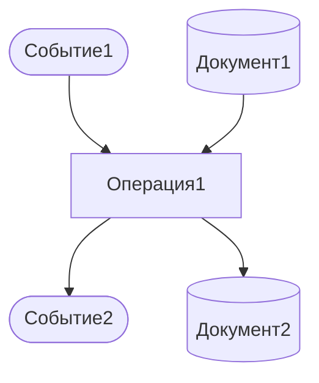
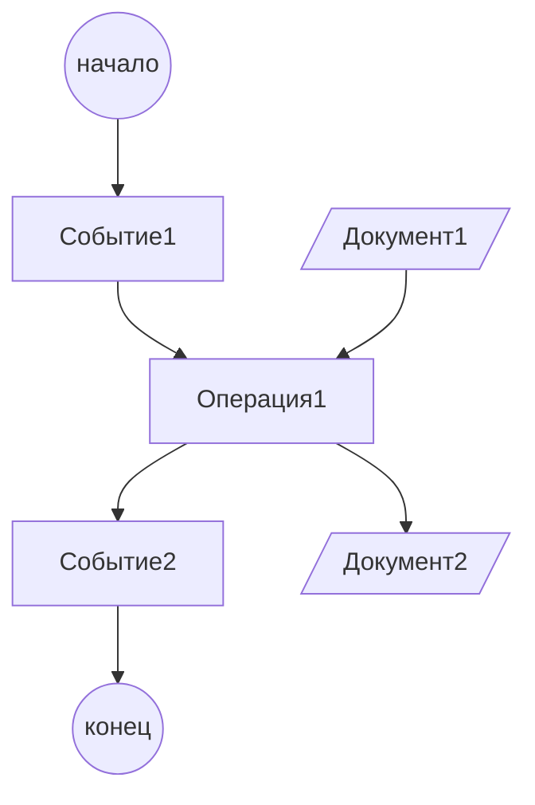
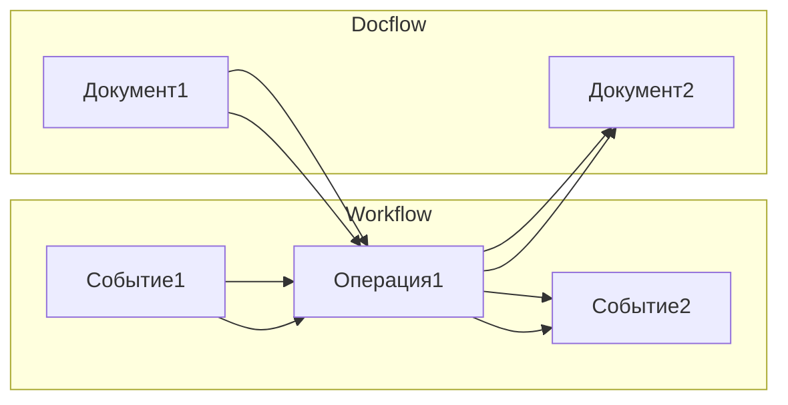
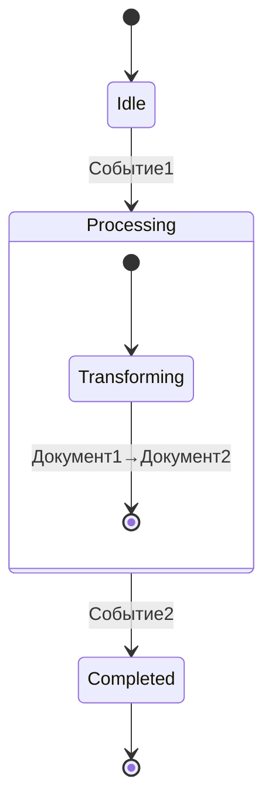

### epc_other

Исходное описание (словами и mermaid) см. https://github.com/bpmbpm/doc/blob/main/METAMODEL/PROCESS/EPC/epc_mermaid.md

## 1. **BPMN-подобный вариант (используем graph)**


## 2. **Petri Nets (текстовое описание)**
```
Места: P = {p1, p2, p3, p4, p5}
Переходы: T = {t1, t2}
Дуги: F = {(p1,t1), (p4,t1), (t1,p2), (p2,t2), (t2,p3), (t2,p5)}
Начальная маркировка: M0 = {p1, p4}

где:
p1 = Событие1
p2 = Операция1_активна  
p3 = Событие2
p4 = Документ1_доступен
p5 = Документ2_создан
t1 = Запуск_процесса
t2 = Завершение_операции
```

## 3. **Исправленный UML Activity Diagram**


## 4. **Формальные грамматики**
```
S → Event Function Event
Event → "Событие1" | "Событие2"
Function → "Операция1" Document Document
Document → "Документ1" | "Документ2"
```

## 5. **Алгебра процессов (π-исчисление)**
```
Process = Событие1(x).(Операция1⟨x⟩ | Документ1⟨x⟩).Событие2⟨x⟩.Документ2⟨x⟩
```

## 6. **Реляционная модель данных**
```sql
-- Таблица элементов процесса
CREATE TABLE ProcessElements (
    id INT PRIMARY KEY,
    name VARCHAR(50),
    type ENUM('Event', 'Function', 'Document'),
    process_id INT
);

-- Таблица связей
CREATE TABLE ProcessRelations (
    from_element INT,
    to_element INT,
    relation_type ENUM('triggers', 'produces', 'input', 'output'),
    FOREIGN KEY (from_element) REFERENCES ProcessElements(id),
    FOREIGN KEY (to_element) REFERENCES ProcessElements(id)
);
```

## 7. **Графовая модель (исправленная Mermaid)**


## 8. **State Machines (Mermaid stateDiagram)**


## 9. **Функциональное программирование (Haskell-подобный синтаксис)**
```haskell
data ProcessElement = Event String 
                    | Function String 
                    | Document String

data ProcessFlow = Flow ProcessElement ProcessElement

workflow :: [ProcessFlow]
workflow = [ Flow (Event "Событие1") (Function "Операция1")
           , Flow (Function "Операция1") (Event "Событие2") ]

docflow :: [ProcessFlow]  
docflow = [ Flow (Document "Документ1") (Function "Операция1")
          , Flow (Function "Операция1") (Document "Документ2") ]
```

## 10. **Логические формализмы (исчисление предикатов)**
```
∃f (Function(f) ∧ name(f, "Операция1") ∧
    ∃e1,e2 (Event(e1) ∧ Event(e2) ∧ name(e1, "Событие1") ∧ name(e2, "Событие2") ∧
            triggers(e1, f) ∧ produces(f, e2)) ∧
    ∃d1,d2 (Document(d1) ∧ Document(d2) ∧ name(d1, "Документ1") ∧ name(d2, "Документ2") ∧
            input(d1, f) ∧ output(f, d2)))
```

## 11. **XML-представление (BPMN-like)**
```xml
<process id="workflow">
    <startEvent id="event1" name="Событие1"/>
    <task id="operation1" name="Операция1">
        <dataInputAssociation>
            <sourceRef>document1</sourceRef>
        </dataInputAssociation>
        <dataOutputAssociation>
            <targetRef>document2</targetRef>
        </dataOutputAssociation>
    </task>
    <endEvent id="event2" name="Событие2"/>
    <sequenceFlow sourceRef="event1" targetRef="operation1"/>
    <sequenceFlow sourceRef="operation1" targetRef="event2"/>
</process>
```

## 12. **JSON-представление**
```json
{
  "processes": {
    "workflow": {
      "elements": [
        {"id": "event1", "type": "Event", "name": "Событие1"},
        {"id": "operation1", "type": "Function", "name": "Операция1"},
        {"id": "event2", "type": "Event", "name": "Событие2"}
      ],
      "flows": [
        {"from": "event1", "to": "operation1", "type": "sequence"},
        {"from": "operation1", "to": "event2", "type": "sequence"}
      ]
    },
    "docflow": {
      "elements": [
        {"id": "document1", "type": "Document", "name": "Документ1"},
        {"id": "operation1", "type": "Function", "name": "Операция1"},
        {"id": "document2", "type": "Document", "name": "Документ2"}
      ],
      "flows": [
        {"from": "document1", "to": "operation1", "type": "dataInput"},
        {"from": "operation1", "to": "document2", "type": "dataOutput"}
      ]
    }
  }
}
```

Все эти формализмы теперь должны корректно отображаться и предоставляют различные перспективы для моделирования и анализа бизнес-процесса.
