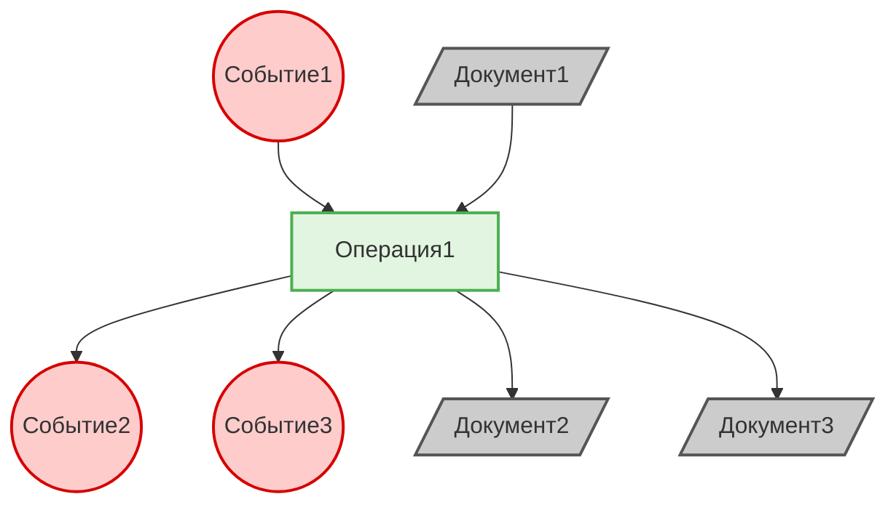
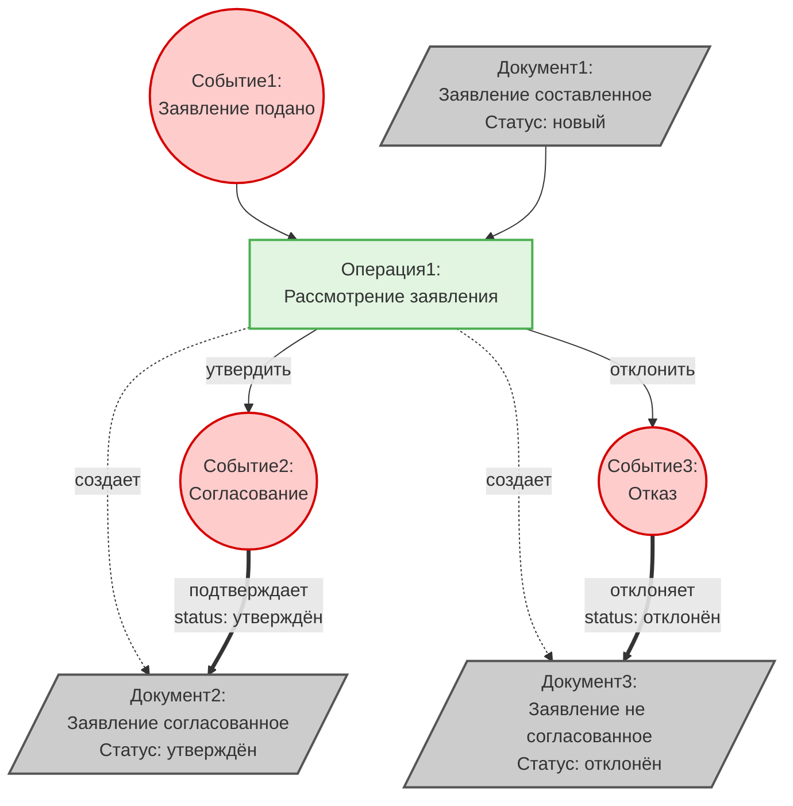

# epc_rdf-star
- см. https://github.com/bpmbpm/doc/blob/main/METAMODEL/PROCESS/EPC/epc_rdf.md
# I epc_rdf-star_v1.md 


## Компактное описание на RDF-star 

```turtle
@prefix epc: <http://example.org/epc#> .
@prefix rdf: <http://www.w3.org/1999/02/22-rdf-syntax-ns#> .
@prefix rdfs: <http://www.w3.org/2000/01/rdf-schema#> .

# Базовые типы
epc:Event rdf:type rdfs:Class .
epc:Function rdf:type rdfs:Class .
epc:Document rdf:type rdfs:Class .

# Экземпляры
epc:Event1 rdf:type epc:Event ; rdfs:label "Событие1" .
epc:Event2 rdf:type epc:Event ; rdfs:label "Событие2" .
epc:Operation1 rdf:type epc:Function ; rdfs:label "Операция1" .
epc:Document1 rdf:type epc:Document ; rdfs:label "Документ1" .
epc:Document2 rdf:type epc:Document ; rdfs:label "Документ2" .

# Триплы с аннотациями
<<epc:Operation1 epc:triggeredBy epc:Event1>> epc:priority "high" .
<<epc:Operation1 epc:resultsIn epc:Event2>> epc:probability 1.0 .
<<epc:Operation1 epc:hasInput epc:Document1>> epc:mandatory true .
<<epc:Operation1 epc:hasOutput epc:Document2>> epc:quality "high" .
```

## Текстовая диаграмма структуры

```
Структура процесса:

Workflow:
[Событие1] → [Операция1] → [Событие2]

Docflow:
[Документ1] → [Операция1] → [Документ2]

Аннотации RDF*:
- triggeredBy: priority = high
- resultsIn: probability = 1.0  
- hasInput: mandatory = true
- hasOutput: quality = high
```

## Альтернативная простая визуализация

```
┌───────────┐    ┌───────────┐    ┌───────────┐
│ Событие1  │───▶│ Операция1 │───▶│ Событие2  │
└───────────┘    └───────────┘    └───────────┘
                   │    ▲
                   │    │
           ┌───────┘    └───────┐
           ▼                    ▼
     ┌───────────┐        ┌───────────┐
     │ Документ1 │        │ Документ2 │
     └───────────┘        └───────────┘

Аннотации:
• Событие1 → Операция1: priority = high
• Операция1 → Событие2: probability = 1.0
• Документ1 → Операция1: mandatory = true  
• Операция1 → Документ2: quality = high
```

RDF-star в этой компактной форме позволяет выразить те же семантические отношения, что и обычный RDF, но с дополнительными метаданными непосредственно на уровнях связей, делая модель более выразительной при меньшем объеме кода.


# II epc_rdf-star_v1.md + временная метка
## Описание на RDF-star (RDF*)

```turtle
@prefix epc: <http://example.org/epc#> .
@prefix rdf: <http://www.w3.org/1999/02/22-rdf-syntax-ns#> .
@prefix rdfs: <http://www.w3.org/2000/01/rdf-schema#> .
@prefix xsd: <http://www.w3.org/2001/XMLSchema#> .
@prefix prov: <http://www.w3.org/ns/prov#> .

# Базовые классы
epc:Event rdf:type rdfs:Class ;
          rdfs:label "Event" .

epc:Function rdf:type rdfs:Class ;
             rdfs:label "Function" .

epc:Document rdf:type rdfs:Class ;
             rdfs:label "Document" .

epc:Process rdf:type rdfs:Class ;
            rdfs:label "Process" .

# Свойства с аннотациями в RDF*
<<epc:hasInput rdf:type rdf:Property>>
    prov:generatedAtTime "2024-01-15T10:00:00Z"^^xsd:dateTime ;
    rdfs:comment "Указывает входной документ для функции" .

<<epc:hasOutput rdf:type rdf:Property>>
    prov:generatedAtTime "2024-01-15T10:00:00Z"^^xsd:dateTime ;
    rdfs:comment "Указывает выходной документ функции" .

<<epc:triggeredBy rdf:type rdf:Property>>
    prov:generatedAtTime "2024-01-15T10:00:00Z"^^xsd:dateTime ;
    rdfs:comment "Указывает событие, инициирующее функцию" .

<<epc:resultsIn rdf:type rdf:Property>>
    prov:generatedAtTime "2024-01-15T10:00:00Z"^^xsd:dateTime ;
    rdfs:comment "Указывает событие, являющееся результатом функции" .

# Экземпляры с метаданными
<<epc:Event1 rdf:type epc:Event>>
    prov:generatedAtTime "2024-01-15T10:00:00Z"^^xsd:dateTime ;
    rdfs:label "Событие1" ;
    epc:confidence 0.95 .

<<epc:Event2 rdf:type epc:Event>>
    prov:generatedAtTime "2024-01-15T10:00:00Z"^^xsd:dateTime ;
    rdfs:label "Событие2" ;
    epc:confidence 0.95 .

<<epc:Operation1 rdf:type epc:Function>>
    prov:generatedAtTime "2024-01-15T10:00:00Z"^^xsd:dateTime ;
    rdfs:label "Операция1" ;
    epc:duration "PT30M"^^xsd:duration .

<<epc:Document1 rdf:type epc:Document>>
    prov:generatedAtTime "2024-01-15T09:30:00Z"^^xsd:dateTime ;
    rdfs:label "Документ1" ;
    epc:format "application/pdf" .

<<epc:Document2 rdf:type epc:Document>>
    prov:generatedAtTime "2024-01-15T10:30:00Z"^^xsd:dateTime ;
    rdfs:label "Документ2" ;
    epc:format "application/pdf" .

# Триплы с аннотациями (RDF* вложенные утверждения)
<<<<epc:Operation1 epc:triggeredBy epc:Event1>>
    prov:generatedAtTime "2024-01-15T10:00:00Z"^^xsd:dateTime>>
    epc:priority "high" ;
    epc:reliability 0.98 .

<<<<epc:Operation1 epc:resultsIn epc:Event2>>
    prov:generatedAtTime "2024-01-15T10:30:00Z"^^xsd:dateTime>>
    epc:probability 1.0 ;
    epc:reliability 0.99 .

<<<<epc:Operation1 epc:hasInput epc:Document1>>
    prov:generatedAtTime "2024-01-15T10:00:00Z"^^xsd:dateTime>>
    epc:mandatory true ;
    epc:validationStatus "validated" .

<<<<epc:Operation1 epc:hasOutput epc:Document2>>
    prov:generatedAtTime "2024-01-15T10:30:00Z"^^xsd:dateTime>>
    epc:quality "high" ;
    epc:approvalStatus "approved" .

# Процессы
<<epc:Workflow rdf:type epc:Process>>
    rdfs:label "Workflow" ;
    epc:processType "business" .

<<epc:Docflow rdf:type epc:Process>>
    rdfs:label "Docflow" ;
    epc:processType "document" .

# Принадлежность к процессам
<<epc:Workflow epc:contains epc:Event1>>
    epc:order 1 .

<<epc:Workflow epc:contains epc:Operation1>>
    epc:order 2 .

<<epc:Workflow epc:contains epc:Event2>>
    epc:order 3 .

<<epc:Docflow epc:contains epc:Document1>>
    epc:order 1 .

<<epc:Docflow epc:contains epc:Operation1>>
    epc:order 2 .

<<epc:Docflow epc:contains epc:Document2>>
    epc:order 3 .
```

## Визуализация RDF-star графа


## Альтернативная визуализация с временной шкалой


## Табличное представление метаданных RDF*

| Объект | Тип | Свойства | Значения |
|--------|-----|----------|----------|
| Событие1 | Event | confidence | 0.95 |
| Операция1 | Function | duration | PT30M |
| Документ1 | Document | format | application/pdf |
| triggeredBy связь | Property | priority, reliability | high, 0.98 |
| hasInput связь | Property | mandatory, validationStatus | true, validated |

## Ключевые особенности RDF-star представления:

1. **Вложенные утверждения** - возможность аннотировать сами триплы
2. **Временные метки** - отслеживание времени создания утверждений
3. **Метаданные качества** - confidence, reliability, probability
4. **Бизнес-атрибуты** - priority, quality, approvalStatus
5. **Процессные атрибуты** - order, duration, format

RDF-star позволяет создавать более богатые и выразительные метаданные, сохраняя при этом совместимость с обычным RDF.

# III Добавь Документ 3 и Событие 3. Они оба исходят из функции. 



## Компактное описание на RDF-star с новыми элементами

```turtle
@prefix epc: <http://example.org/epc#> .
@prefix rdf: <http://www.w3.org/1999/02/22-rdf-syntax-ns#> .
@prefix rdfs: <http://www.w3.org/2000/01/rdf-schema#> .

# Базовые типы
epc:Event rdf:type rdfs:Class .
epc:Function rdf:type rdfs:Class .
epc:Document rdf:type rdfs:Class .

# Экземпляры
epc:Event1 rdf:type epc:Event ; rdfs:label "Событие1" .
epc:Event2 rdf:type epc:Event ; rdfs:label "Событие2" .
epc:Event3 rdf:type epc:Event ; rdfs:label "Событие3" .
epc:Operation1 rdf:type epc:Function ; rdfs:label "Операция1" .
epc:Document1 rdf:type epc:Document ; rdfs:label "Документ1" .
epc:Document2 rdf:type epc:Document ; rdfs:label "Документ2" .
epc:Document3 rdf:type epc:Document ; rdfs:label "Документ3" .

# Триплы с аннотациями
<<epc:Operation1 epc:triggeredBy epc:Event1>> epc:priority "high" .
<<epc:Operation1 epc:resultsIn epc:Event2>> epc:probability 1.0 .
<<epc:Operation1 epc:resultsIn epc:Event3>> epc:probability 0.8 .
<<epc:Operation1 epc:hasInput epc:Document1>> epc:mandatory true .
<<epc:Operation1 epc:hasOutput epc:Document2>> epc:quality "high" .
<<epc:Operation1 epc:hasOutput epc:Document3>> epc:quality "medium" .
```

## Текстовая диаграмма структуры

```
Структура процесса:

Workflow:
[Событие1] → [Операция1] → [Событие2]
                       ↘→ [Событие3]

Docflow:
[Документ1] → [Операция1] → [Документ2]
                          ↘→ [Документ3]

Аннотации RDF*:
- triggeredBy: priority = high
- resultsIn (Event2): probability = 1.0
- resultsIn (Event3): probability = 0.8
- hasInput: mandatory = true
- hasOutput (Document2): quality = high
- hasOutput (Document3): quality = medium
```

На диаграмме показано, что из функции Операция1 исходят два документа (Документ2 и Документ3) и два события (Событие2 и Событие3). Все документы расположены слева от функции, как требовалось в исходном условии.

# IV Event3 & Doc3
Добавь логику и статусы документов.  
Документ 1 - это заявление составленное. Документ 2 - заявление согласованное (подписано).  Документ 3 - заявление не согласованное (отказ).   
Событие 2 - согласование заявления. Событие 3 - отказ по заявлению. Покажи взаимосвязь Документ 2 и Событие 2, а также  Документ 3 и Событие 3.  



## Альтернативный вариант с более явным разделением типов связей

```mermaid
graph TB
    Event1(("Событие1:<br/>Заявление подано"))
    Event2(("Событие2:<br/>Согласование"))
    Event3(("Событие3:<br/>Отказ"))
    
    Operation1["Операция1:<br/>Рассмотрение заявления"]
    
    Document1[/"Документ1:<br/>Заявление составленное"/]
    Document2[/"Документ2:<br/>Заявление согласованное"/]
    Document3[/"Документ3:<br/>Заявление не согласованное"/]
    
    %% Процессные связи (сплошные)
    Event1 --> Operation1
    Document1 --> Operation1
    Operation1 --> Event2
    Operation1 --> Event3
    
    %% Документные связи (пунктирные)
    Operation1 -.->|создает| Document2
    Operation1 -.->|создает| Document3
    
    %% Связи валидации (толстые с подписями)
    Event2 == VALIDATES ==>|"изменяет статус на:<br/>УТВЕРЖДЁН"| Document2
    Event3 == REJECTS ==>|"изменяет статус на:<br/>ОТКЛОНЁН"| Document3
    
    %% Статусы документов
    Document1 -.-|status: НОВЫЙ| S1[ ]
    Document2 -.-|status: УТВЕРЖДЁН| S2[ ]
    Document3 -.-|status: ОТКЛОНЁН| S3[ ]
    
    classDef event fill:#ffcccc,stroke:#d60000,stroke-width:2px
    classDef function fill:#e1f5e1,stroke:#4caf50,stroke-width:2px
    classDef document fill:#cccccc,stroke:#555,stroke-width:2px
    classDef validationLink stroke:#0066cc,stroke-width:3px
    classDef status fill:#f9f9f9,stroke:#999,stroke-dasharray: 3 3
    
    class Event1,Event2,Event3 event
    class Operation1 function
    class Document1,Document2,Document3 document
    class S1,S2,S3 status
```

## Компактное описание на RDF-star с разными типами связей

```turtle
@prefix epc: <http://example.org/epc#> .
@prefix rdf: <http://www.w3.org/1999/02/22-rdf-syntax-ns#> .
@prefix rdfs: <http://www.w3.org/2000/01/rdf-schema#> .
@prefix doc: <http://example.org/document#> .

# Экземпляры
epc:Event1 rdf:type epc:Event ; rdfs:label "Заявление подано" .
epc:Event2 rdf:type epc:Event ; rdfs:label "Согласование заявления" .
epc:Event3 rdf:type epc:Event ; rdfs:label "Отказ по заявлению" .
epc:Operation1 rdf:type epc:Function ; rdfs:label "Рассмотрение заявления" .
epc:Document1 rdf:type epc:Document ; rdfs:label "Заявление составленное" .
epc:Document2 rdf:type epc:Document ; rdfs:label "Заявление согласованное" .
epc:Document3 rdf:type epc:Document ; rdfs:label "Заявление не согласованное" .

# Процессные связи (сплошные линии)
<<epc:Event1 epc:triggers epc:Operation1>>
    epc:linkType "process" .

<<epc:Operation1 epc:produces epc:Event2>>
    epc:linkType "process" ;
    epc:condition "заявление соответствует требованиям" .

<<epc:Operation1 epc:produces epc:Event3>>
    epc:linkType "process" ;
    epc:condition "заявление не соответствует требованиям" .

# Документные связи (пунктирные линии)
<<epc:Document1 epc:inputs epc:Operation1>>
    epc:linkType "data" .

<<epc:Operation1 epc:creates epc:Document2>>
    epc:linkType "data" .

<<epc:Operation1 epc:creates epc:Document3>>
    epc:linkType "data" .

# Специальные связи валидации (толстые линии с подписями)
<<epc:Event2 epc:validates epc:Document2>>
    epc:linkType "validation" ;
    epc:action "подтверждает" ;
    doc:setsStatus "утверждён" .

<<epc:Event3 epc:invalidates epc:Document3>>
    epc:linkType "validation" ;
    epc:action "отклоняет" ;
    doc:setsStatus "отклонён" .
```

## Легенда связей

```
ТИПЫ СВЯЗЕЙ НА ДИАГРАММЕ:

→    (сплошная)     - процессный поток
-.→  (пунктирная)   - создание/использование документа
==⇒  (двойная)      - связь валидации/подтверждения

ПОДПИСИ СВЯЗЕЙ:
- "утвердить"/"отклонить"     - бизнес-решение
- "создает"                   - генерация документа  
- "подтверждает"/"отклоняет"  - изменение статуса документа
```

Такое визуальное разделение типов связей делает диаграмму более информативной и четко показывает разные аспекты взаимодействия между событиями и документами в бизнес-процессе.
