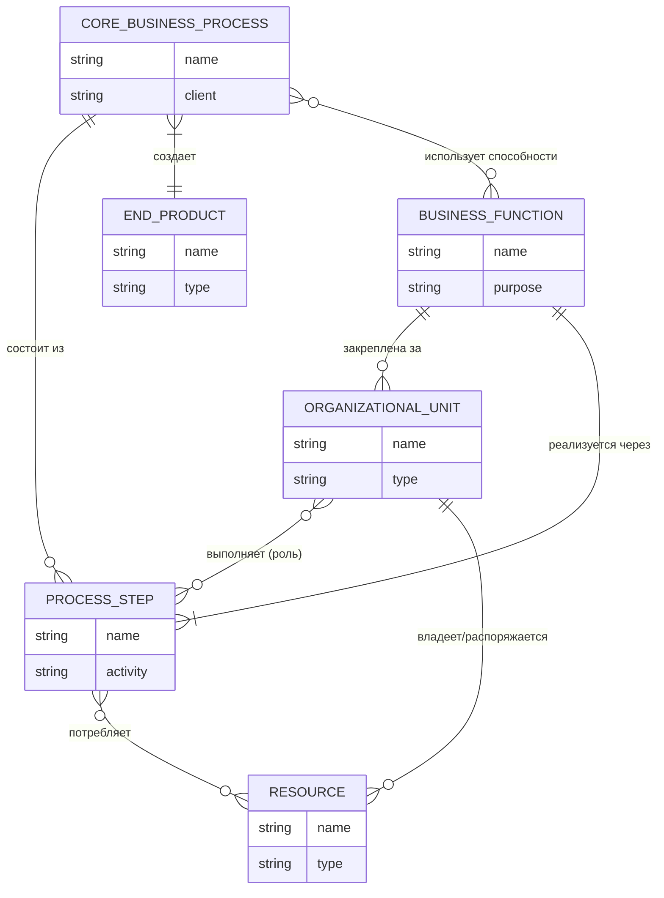
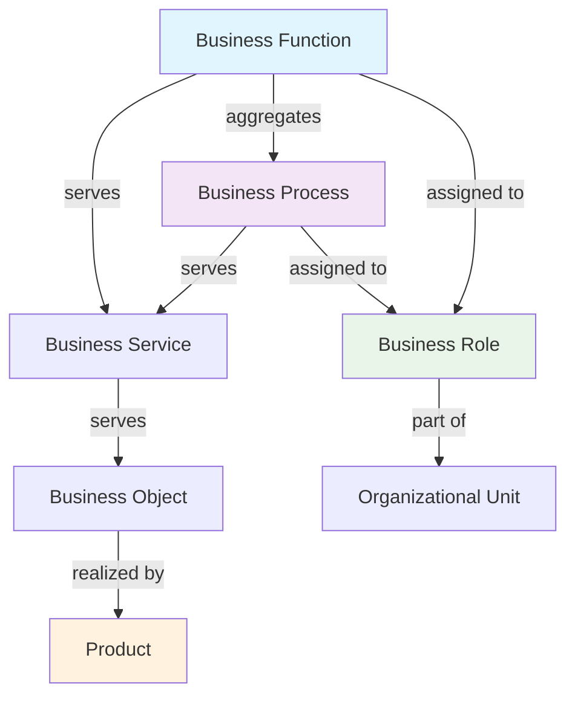
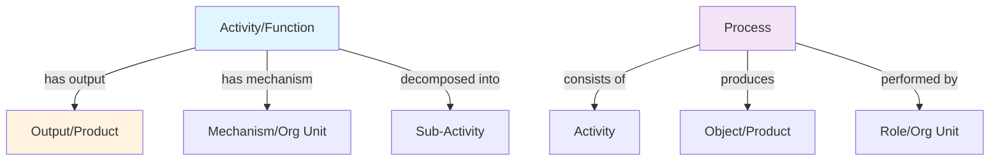
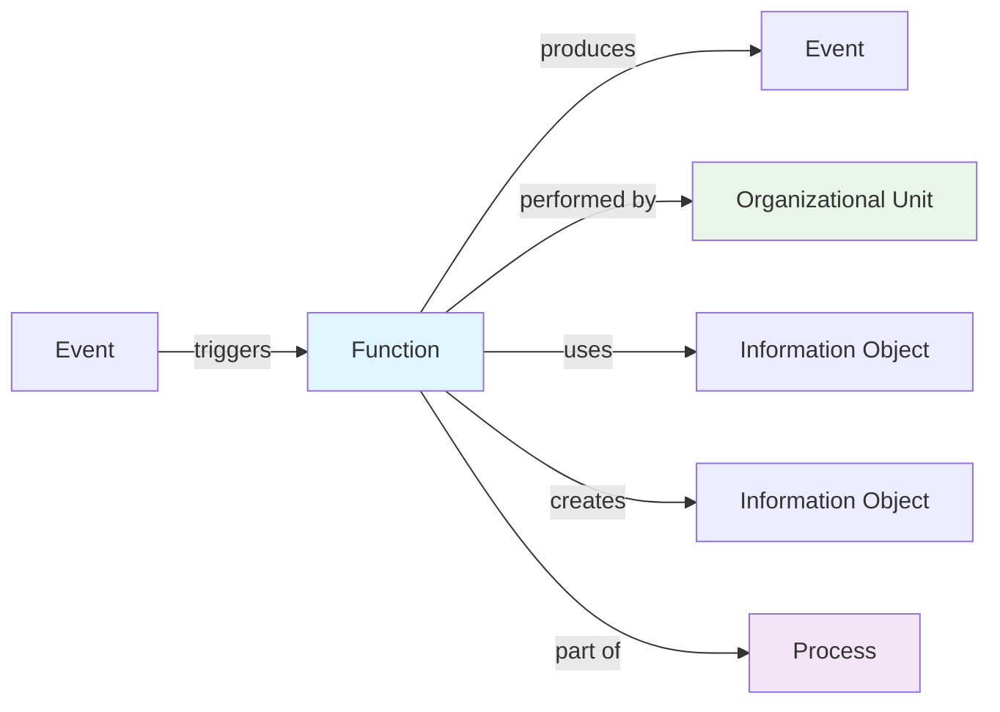
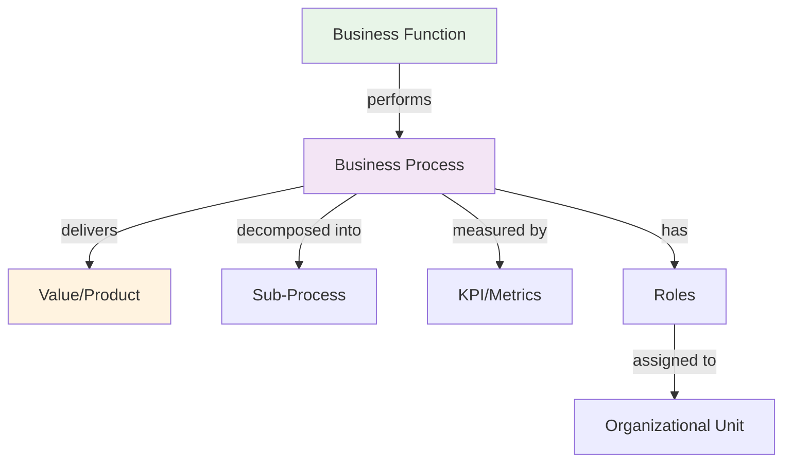

## 1 accounting
Бухгалтерский учет - это бизнес-функция или бизнес-процесс?

Содержательный вопрос, который затрагивает суть современных подходов к управлению бизнесом.

**Короткий ответ:** **Бухгалтерский учет — это бизнес-функция, которая реализуется через совокупность взаимосвязанных бизнес-процессов.**

Теперь давайте разберем подробно.

### 1. Бухгалтерский учет как **бизнес-функция**
С точки зрения организационной структуры и разделения труда, бухгалтерский учет — это **функция** (подразделение, служба), такая же, как отдел продаж, закупок или логистики.
*   **Цель функции:** Обеспечение сбора, регистрации, обработки и представления достоверной финансовой информации о деятельности компании для внутренних (менеджмент) и внешних (государство, инвесторы, кредиторы) пользователей.
*   **Кто выполняет:** Бухгалтерия, финансовый отдел.
*   **Что делает:** Общее руководство, методология, контроль, подготовка отчетности, взаимодействие с госорганами.

**Функция** — это "что" делается и "зачем". Это статичный взгляд на роль в организации.

### 2. Бухгалтерский учет как **совокупность бизнес-процессов**
С точки зрения деятельности и добавленной ценности, внутри функции бухгалтерского учета выполняется множество четких **бизнес-процессов**.
*   **Процесс** — это последовательность взаимосвязанных действий (операций), преобразующих "входы" (документы, данные) в "выходы" (результаты) с целью создания ценности для клиента процесса.
*   **Клиентами** процессов бухучета могут быть как внешние лица (налоговая инспекция получает декларацию), так и внутренние (менеджер получает отчет о затратах).

**Примеры ключевых бизнес-процессов в бухгалтерском учете:**
*   **Процесс "Учет расчетов с поставщиками":**
    *   **Вход:** Счет на оплату, договор, акт выполненных работ.
    *   **Действия:** Проверка документов, отражение в учете (проводки), формирование платежного поручения, оплата, сверка взаимных расчетов.
    *   **Выход:** Оплаченный счет, проводки в учетной системе, актуальная кредиторская задолженность.
*   **Процесс "Начисление и выплата заработной платы":**
    *   **Вход:** Табели учета рабочего времени, приказы о приеме/увольнении, больничные листы.
    *   **Действия:** Расчет зарплаты, налогов и взносов, формирование платежей, отражение в учете, передача данных в госорганы.
    *   **Выход:** Выплаченная зарплата, сданная отчетность (в ПФР, ФСС, НДФЛ-отчетность).
*   **Процесс "Закрытие месяца/периода":**
    *   **Вход:** Все хозяйственные операции за период.
    *   **Действия:** Начисление амортизации, расчет резервов, списание затрат, определение финансового результата, реформация баланса.
    *   **Выход:** Сформированные бухгалтерский баланс, отчет о финансовых результатах (ОФР) и другие формы отчетности.

**Процесс** — это "как" делается и в какой последовательности. Это динамичный взгляд на работу.

### Важная аналогия: Строительство дома
*   **"Архитектура"** (функция) — определяет, что будет построено, каким будет результат, отвечает за общий план и соответствие стандартам.
*   **"Кладка кирпича", "Прокладка электрики", "Монтаж крыши"** (процессы) — это конкретные, повторяющиеся, технологичные последовательности действий для достижения цели, заданной архитектурой.

### Почему современный взгляд смещается в сторону процессов?
Выделение именно **процессов** внутри функции бухгалтерского учета позволяет:
1.  **Стандартизировать** и **оптимизировать** рутинные операции.
2.  **Автоматизировать** их (внедрение ERP-систем, роботизация RPA).
3.  **Четко распределить зоны ответственности** между сотрудниками.
4.  **Контролировать** сроки и качество на каждом этапе.
5.  **Увидеть ценность** каждого действия для конечного "клиента" процесса.

### Вывод
Бухгалтерский учет в организационной структуре — это **функция**. Но по своей сути и содержанию работа бухгалтерии состоит из множества регулярных, регламентированных и измеримых **бизнес-процессов**.

**Таким образом, правильнее всего говорить, что бухгалтерский учет — это бизнес-функция, основное содержание работы которой составляют четко выстроенные бизнес-процессы.**
---
## 2 accounting
Почему Бухгалтерский учет нельзя рассматривать как бизнес-процесс: он ведь тоже имеет входы и выходы. И почему его отдельные подпроцессы нельзя считать бизнес-функциями?

Вы абсолютно правы, указывая на признаки процессов — входы и выходы. Именно это часто вызывает путаницу. Давайте разберем, почему же бухгалтерский учет в целом — не один процесс, а его подпроцессы — не самостоятельные функции.

### Почему весь бухгалтерский учет — это не **один** бизнес-процесс?

Ключевая причина — **масштаб, неоднородность и различная конечная цель**.

1.  **Нарушение критерия "единого результата для одного клиента"**:
    *   Классический бизнес-процесс имеет четкую цель и одного основного "клиента". Например, процесс "Обработка заказа" — клиент получает товар.
    *   У бухгалтерского учета **много разных "клиентов"** с разными потребностями: налоговая инспекция (нужны декларации), менеджмент (нужны управленческие отчеты), акционеры (нужна финансовая отчетность), банки (нужны справки), сотрудники (нужна зарплата).
    *   Создание баланса для акционеров и выплата зарплаты сотруднику — это принципиально разные конечные продукты, требующие разных последовательностей действий. Это не один процесс, а разные.

2.  **Отсутствие единой, сквозной, линейной последовательности**:
    *   Процесс "Отгрузка товара" — это цепочка: заказ → резерв → сборка → отгрузка → инвойс.
    *   Бухгалтерский учет — это **сетевая структура (паутина) множества параллельных и пересекающихся процессов**, которые часто запускаются независимо друг от друга. Начисление амортизации не зависит от расчета зарплаты, а расчет НДС — от учета кассовых операций. Они сходятся только на этапе "закрытия периода".

3.  **Слишком высокий уровень абстракции**:
    *   Если считать бухучет одним процессом, то его описание будет бессмысленно общим: *"Вход: первичные документы, Выход: отчетность"*. Это не дает возможности для анализа, оптимизации и автоматизации. Это как назвать "строительство дома" одним процессом — технически верно, но бесполезно для практического управления.

**Вывод:** Бухгалтерский учет — это **макропроцесс** или, вернее, **функциональная область**, состоящая из десятков процессов. Он слишком комплексный и неоднородный, чтобы быть единым операционным бизнес-процессом.

---

### Почему отдельные подпроцессы (напр., "Учет зарплаты") нельзя считать бизнес-функциями?

Здесь все наоборот — причина в **масштабе и стратегической важности**.

1.  **Критерий организационной самостоятельности и стратегической роли**:
    *   **Бизнес-функция (отдел)** — это структурное подразделение, которое несет ответственность за **целый блок стратегически важных задач** и обладает значительной автономией. Функция "Продажи" определяет стратегию продаж, ценообразование, управляет отделом.
    *   **Подпроцесс "Учет зарплаты"** — это операционная, регламентированная, повторяющаяся **технология** для достижения конкретной тактической цели. Он не определяет, *какую* кадровую политику вести или *какую* систему мотивации выбрать. Он *исполняет* решения, принятые в функциях **Бухгалтерия** и **HR**.

2.  **Отсутствие полноты цикла управления**:
    *   Функция (как отдел) обычно планирует, организует, контролирует и анализирует.
    *   Подпроцесс "Учет зарплаты" — это в первую очередь **исполнение** (контроль уже идет на уровне процесса). Стратегическое планирование фонда оплаты труда, анализ эффективности payroll — это задачи функций **Финансы** и **HR**, а не самого процесса расчета.

3.  **Организационный статус**:
    *   "Учет зарплаты" — это не отдел в организационной структуре компании. Это направление работы *внутри* бухгалтерии (и/или отдела HR). Руководитель процесса "Учета зарплаты" — это, как правило, не директор, а начальник отдела или просто ведущий бухгалтер, который подчиняется руководителю бухгалтерской *функции*.

### Ключевая мысль: **Иерархия и точка зрения**

Все зависит от уровня рассмотрения (уровня абстракции):

1.  **Уровень компании (стратегический):**
    *   **Бухгалтерский учет — это ФУНКЦИЯ** (одна из ключевых бизнес-функций наряду с продажами, производством, закупками).
    *   Ее цель — обеспечение финансовой и налоговой жизнеспособности компании.

2.  **Уровень отдела (тактический/операционный):**
    *   **Функция "Бухгалтерский учет" реализуется через множество БИЗНЕС-ПРОЦЕССОВ** (учет ОС, расчет зарплаты, закрытие периода и т.д.).
    *   Эти процессы — "кирпичики" функции.

3.  **Уровень конкретного исполнителя:**
    *   Для рядового бухгалтера по расчету зарплаты его работа — это **процесс (или даже подпроцесс)**, который состоит из более мелких **операций** (ввести табель, рассчитать больничный, сформировать платежку).

**Итог:** Вы правы, у бухгалтерского учета есть входы и выходы, но он слишком велик и разнороден, чтобы быть единым процессом. Его подпроцессы слишком узки и технологичны, чтобы быть самостоятельными бизнес-функциями. **Функция — это "что" и "зачем", а процесс — "как" и "в какой последовательности".** Бухгалтерский учет как целое — это "что", а "Учет зарплаты" — это конкретное "как" внутри этого "что".

---
## 3 APQC PCF
APQC's Process Classification Framework® (PCF) считается классификатором бизнес-процессов. Приведи аргументы чтобы его считать классификатором бизнес-функций.

Это отличный и очень тонкий вопрос, который затрагивает саму суть различий между функциональным и процессным взглядом на организацию. APQC PCF позиционируется как классификатор процессов, но убедительные аргументы можно привести и в пользу того, что он классифицирует, по сути, бизнес-функции.

Вот ключевые аргументы для такой точки зрения:

### Аргумент 1: Уровень абстракции и терминология PCF соответствует функциям
PCF оперирует категориями и группами процессов, которые по названиям и содержанию практически идентичны традиционным бизнес-функциям. Это не описание потоков работ, а перечень *областей ответственности*.
*   **Пример:** Категория **"5. Управление человеческим капиталом"**.
    *   **В PCF:** Группы процессов: 5.1. Разработка стратегии и планирование персонала, 5.2. Привлечение и найм персонала, 5.3. Развитие и обучение персонала.
    *   **В реальности компании:** Это классическое **функциональное деление отдела HR (Департамента по персоналу)**. "Разработка кадровой стратегии" — это функция/подфункция, а не процесс. Процессом будет "Оформление приема на работу нового сотрудника", который находится *внутри* этой функции.

### Аргумент 2: PCF отражает организационную структуру, а не сквозные потоки создания ценности
Классический бизнес-процесс (например, "Выполнение заказа") — сквозной, пересекает несколько функциональных подразделений (отдел продаж, склад, логистику, бухгалтерию).
*   PCF же структурирован по **вертикальным "колоннам" (категориям)**, которые идеально ложатся на организационную диаграмму: "Управление финансами", "Маркетинг и продажи", "Разработка продуктов и услуг". Это **функциональные "силосы"**.
*   PCF не показывает, как процессы из категории 8 (Продажи) и категории 9 (Выполнение заказов) связываются в единый сквозной поток для клиента. Он их перечисляет, как перечисляют отделы в компании.

### Аргумент 3: Язык описания в PCF — это язык ответственности и областей деятельности, а не алгоритмов
Описания в PCF часто отвечают на вопрос **"Что должно быть сделано?"** (функциональный подход), а не **"Как и в какой последовательности это делается для получения конкретного результата?"** (процессный подход).
*   **Пример (PCF 9.2.3.):** "Обработка входящих заказов". Это название *функции или зоны ответственности*. Сам *процесс* будет детально описывать шаги: "Получить заказ → верифицировать данные клиента → проверить наличие товара → подтвердить заказ...".

### Аргумент 4: PCF служит основой для функционального бенчмаркинга, а не только для процессного моделирования
Одно из главных применений PCF — сравнительный анализ и бенчмаркинг. Организации сравнивают, сколько ресурсов (FTE, бюджета) тратится на категорию **"12. Управление финансовыми ресурсами"**. Это типично **функциональный, затратный** взгляд ("во что обходится эта функция"), а не процессный ("какова эффективность и время прохождения сквозного процесса").

### Аргумент 5: PCF — это таксономия высшего уровня, которая требует декомпозиции до реальных процессов
PCF задает общую **функциональную архитектуру** предприятия. Это каркас, карта. Но чтобы увидеть настоящие бизнес-процессы, каждую группу (например, "8.3. Управление отношениями с клиентами") нужно декомпозировать на несколько уровней вниз до элементарных операций и описать связи между ними. Эта необходимость в глубокой декомпозиции косвенно подтверждает, что верхние уровни PCF — это скорее классификация функций.

### Синтез и вывод: Почему возникла эта двойственность?
APQC PCF — это блестящий **компромисс** и мост между функциональным и процессным мирами. Он использует *язык процессов* для описания *функциональной структуры* компании. Это сделано специально, чтобы помочь организациям, мыслящим "функционально" (а таких большинство), перейти к "процессному" мышлению, имея понятную и структурированную отправную точку.

**Итоговый аргумент:** PCF можно считать **классификатором бизнес-функций, описанных в процессных терминах**. Он представляет собой **функционально-процессную матрицу**, где на высшем уровне представлены именно функции (в виде категорий), а по мере углубления в детализацию — подфункции и, наконец, сами бизнес-процессы. Его главная ценность — в создании единого и универсального языка для описания деятельности компании, который может быть интерпретирован как с функциональной, так и с процессной точки зрения.

---
## 4 fun vs proc Comparison 
Сравни понимание терминов «бизнес-функция» и «бизнес-процесс» в различных методологиях. Укажи преимущества и недостатки подходов (неувязки). Приведи примеры обоих сущностей в разных методологиях. Покажи в каких методологиях «бизнес-функция» входит в «бизнес-процесс», а в каких наоборот.  
Напиши типы отношений (предикаты) между сущностями «бизнес-функция» и «бизнес-процесс» и связанными с ними сущностями, включая подразделение орг-штатной структуры и продукт. Эту связь покажи таблицей: субъект – предикат – (обратный предикат) – объект и графически в mermaid.
Покажи классификацию «бизнес-функция» и «бизнес-процесс» в разных методологиях. 

Хм, пользователь задает глубокий и структурированный вопрос о методологических различиях между бизнес-функциями и процессами. Нужно системно разложить всё по полочкам, но без излишней академичности.

Пользователь явно разбирается в теме — предыдущие вопросы про APQC PCF и бухучет показали его аналитический склад ума. Сейчас он хочет получить сравнительный анализ, причем с практической ориентацией: примеры, таблицы, классификации.

Начну с краткого сравнения трех основных подходов — функционального, процессного и гибридного. Важно подчеркнуть, что "функция внутри процесса" бывает только в процессных методологиях, а в остальных — наоборот.

Для таблицы связей возьму самые типовые отношения: выполнение, участие, потребление ресурсов. Визуализация в Mermaid нужна, но не перегруженная — достаточно показать ядро связей.

Классификации в разных методологиях сведу в компактный список с фокусом на суть, а не на перечисление всех деталей. Главное — чтобы пользователь увидел логику, а не голые факты.

Примеры возьму из классики: BPMN для процессов, APQC для функций, TOGAF для архитектуры. Это достаточно репрезентативно.

В конце стоит добавить практический вывод — почему эти различия важны для реальных проектов. Пользователь ценит не просто теорию, а прикладное значение.

### 4.1 

Отличный и комплексный вопрос. Давайте разложим его на составляющие.

### Сравнение понимания в различных методологиях

| Методология / Подход | Сущность «Бизнес-функция» | Сущность «Бизнес-процесс» | Ключевая связь и иерархия |
| :--- | :--- | :--- | :--- |
| **Функционально-структурный (классический)** | **Основная единица анализа.** Статическая область ответственности, закрепленная за подразделением (например, Отдел закупок, Бухгалтерия). | Часто отождествляется с функцией или рассматривается как **внутренняя процедура функции**. Последовательность операций *внутри* отдела. | **Функция ВКЛЮЧАЕТ процессы.** Процесс — способ реализации функции. **Вертикальное управление.** |
| **Процессный (BPM, BPMN, Value Chain)** | **Вторичная единица, компетенция или ролевой пул.** Набор навыков и ресурсов, необходимых для выполнения шага процесса. Часто привязывается к организационным единицам. | **Основная единица анализа.** Сквозная цепочка действий, создающая ценность для внешнего или внутреннего клиента. Пересекает организационные границы. | **Процесс ИСПОЛЬЗУЕТ/ВЫПОЛНЯЕТСЯ функциями.** Функция (роль) — исполнитель шага процесса. **Горизонтальное управление.** |
| **Архитектурный (TOGAF, ARIS)** | **Строительный блок архитектуры.** Устойчивая, независимая от организационной структуры способность предприятия (например, "Управление клиентскими отношениями"). | **Сценарий поведения архитектуры.** Динамическая последовательность функций, приводящая к конкретному результату. Поток управления и потоки данных между функциями. | **Процесс ОБЪЕДИНЯЕТ/ОРОРГАНИЗУЕТ функции.** Функции — узлы в сети процессов. Отношение «функция -> процесс» как «статика -> динамика». |
| **Гибридный (APQC PCF, ФСА)** | **Крупная категория деятельности (группа процессов).** Фактически синоним высокоуровневой бизнес-функции (например, "Разработка продуктов"). Используется для структурирования и бенчмаркинга. | **Детализированная активность.** Имеет входы-выходы, но классифицируется внутри функциональных категорий. Описывает "что делается", а не "как течет работа". | **Функция (категория) ВКЛЮЧАЕТ процессы.** Иерархический классификатор от общего (функция) к частному (процесс). |

### Преимущества и недостатки подходов (неувязки)

| Подход | Преимущества | Недостатки (Неувязки) |
| :--- | :--- | :--- |
| **Функциональный** | Четкость подчинения, простота управления, глубокая экспертиза. Легко внедрить в традиционные иерархии. | **"Силосный эффект"**: цели отделов противоречат целям компании. Нет ответственности за конечный результат для клиента. Слабые горизонтальные связи. |
| **Процессный** | Ориентация на клиента и результат. Прозрачность и возможность сквозной оптимизации. Гибкость. | Сложность внедрения в иерархичную структуру. Конфликт с линейным руководством. Может порождать избыточную сложность моделирования. |
| **Архитектурный** | Системный, целостный взгляд на предприятие. Независимость от текущей оргструктуры. Фокус на взаимодействии компонентов. | Высокий порог входа. Абстрактность, сложность донесения ценности до менеджмента. |
| **Гибридный (APQC)** | Универсальный язык, удобство для бенчмаркинга, хорошая отправная точка для анализа. | **Главная неувязка**: Смешение понятий. Фактически классифицирует функции, но называет их "процессами", что приводит к терминологической путанице. |

### Примеры сущностей в разных методологиях

*   **Пример 1: "Обработка заказа клиента"**
    *   **В процессном подходе (BPMN):** Это **сквозной бизнес-процесс**. Он включает шаги: "Получить заказ" (роль "Менеджер по продажам"), "Проверить наличие" ("Склад"), "Подтвердить оплату" ("Бухгалтерия"), "Отгрузить" ("Логистика").
    *   **В функциональном подходе:** Это **процедура взаимодействия отделов**. Каждый отдел выполняет свою функцию: продажи — работа с клиентом, склад — резервирование, бухгалтерия — оформление счета.
    *   **В APQC PCF:** Элементы этого процесса разбросаны по категориям: 8. Продажи (8.2. Обработка заказов) и 9. Выполнение заказов (9.2. Координация выполнения заказов).

*   **Пример 2: "Управление персоналом"**
    *   **В архитектурном подходе (TOGAF):** Это **бизнес-функция** высокого уровня "Управление человеческим капиталом". Она реализуется через **бизнес-процессы** "Найм", "Адаптация", "Оценка".
    *   **В функциональном подходе:** Это **департамент (HR)**. Внутри него — процессы "Проведение собеседования", "Оформление приказа".
    *   **В процессном подходе:** Процесс "Оформление на работу нового сотрудника" **задействует** функции (роли) из HR, IT (выдача учетной записи), бухгалтерии (оформление в расчет).

### Отношения между сущностями (Субъект – Предикат – Обратный предикат – Объект)

| Субъект | Предикат (связь) | Обратный предикат | Объект | Комментарий |
| :--- | :--- | :--- | :--- | :--- |
| **Бизнес-функция** | *закреплена за* | *является зоной ответственности* | **Подразделение (орг. единица)** | Классическое функциональное управление (бухгалтерия отвечает за учет). |
| **Бизнес-функция** | *реализуется через* | *является частью / способом реализации* | **Бизнес-процесс / Процедура** | Взгляд изнутри функции (функция "Логистика" реализуется через процесс "Доставка"). |
| **Бизнес-процесс (сквозной)** | *использует / включает* | *участвует в* | **Бизнес-функция** | Взгляд BPM: процесс "Закупки" использует функции "Планирования", "Юридического сопровождения". |
| **Бизнес-процесс** | *создает* | *является результатом* | **Продукт/Услуга (ценность)** | Ключевое отношение процессного подхода. Продукт — выход процесса. |
| **Подразделение** | *выполняет (роль в)* | *задействовано в* | **Бизнес-процесс** | Сотрудники отдела выполняют роль в сквозном процессе (бухгалтер -> шаг "Согласовать счет"). |
| **Подразделение** | *владеет / распоряжается* | *находится в ведении* | **Ресурсы** | Орг. единица управляет ресурсами (люди, оборудование, бюджеты). |
| **Бизнес-процесс** | *потребляет / использует* | *задействован в* | **Ресурсы** | Для выполнения процесса нужны ресурсы. |

### Классификация «бизнес-функция» и «бизнес-процесс» в разных методологиях

| Методология | Классификация **Бизнес-функций** | Классификация **Бизнес-процессов** |
| :--- | :--- | :--- |
| **APQC PCF** | **Фактически является классификатором функций**, названных "процессными группами". Уровни 1-2 (Категория, Группа процессов) — это функции. Пример: "5. Управление человеческим капиталом". | Классифицирует **операционные процессы на нижних уровнях** (Уровни 3-4). Пример: "5.1.2.3. Провести собеседование с кандидатом". |
| **TOGAF / ArchiMate** | Функции классифицируются по **доменам архитектуры** (Business, Application, Technology). Бизнес-функции группируются по сервисам, которые они предоставляют. Иерархическая декомпозиция. | Процессы классифицируются по **типу:** • **Сквозные (Core)** — создают ценность. • **Управляющие (Governance)** — контроль и стратегия. • **Вспомогательные (Supporting)** — обслуживают основные. |
| **Value Delivery Modeling (VDML)** | Функции рассматриваются как **способности (Capabilities)** — устойчивые комбинации ресурсов и знаний. Классифицируются по **уровню зрелости и стратегической значимости**. | Процессы — это **потоки создания ценности (Value Streams)**, которые оркестрируют способности. Классифицируются по **типу создаваемой ценности** (продукт, услуга, опыт). |
| **IDEF0** | **Функция — центральное понятие.** Классифицируется по **входу-выходу-управлению-механизму**. Иерархия функций (A0, A1, A2...). | **Процесс как таковой не выделяется.** Динамика отражена в потоке данных между функциями. |
| **BPMN / Процессное моделирование** | Функции явно **не классифицируются**. Они представлены как **роли (Pools, Lanes)** внутри моделей процессов (например, "Поставщик", "Бухгалтерия"). | Процессы классифицируются по **сценариям выполнения:** • Процессы без внешних участников (Private). • Процессы с взаимодействием (Collaboration, Choreography). • Декомпозиция через Sub-Processes. |

### Краткий итог

*   **Функциональный подход** управляет **ресурсами и компетенциями** (вертикаль).
*   **Процессный подход** управляет **потоками создания ценности** (горизонталь).
*   **Архитектурный подход** управляет **взаимодействием и эволюцией** статики (функций) и динамики (процессов).
*   **Ключевая неувязка** на практике: организационная структура (функции) и потоки работ (процессы) находятся в постоянном конфликте. Успешные компании строят матричное управление, где процессные владельцы отвечают за результат, а функциональные руководители — за развитие ресурсов и стандартов.
  
---
## 4.2

Покажи более конкретно на Метамодели TOGAF \ ArchiMate (если есть отличия, то укажи), IDEFx, ARIS EPC, BPM CBOK. Предикаты укажи на обоих языках (русский \ английский) и используй штатные (дословно) предикаты конкретной методологии.  
Таблицу "Субъект – Предикат – Обратный предикат – Объект" составить общую с группировкой по схожим отношениям, но из разных методологий. Схемы составить отдельные и связи укажи стрелкой.    
## Сравнение метамоделей: TOGAF/ArchiMate, IDEFx, ARIS EPC, BPM CBOK

### 1. Метамодели и их особенности

**TOGAF/ArchiMate** (рассматриваем вместе, но есть нюансы):
- **ArchiMate** - формальный язык описания архитектуры предприятия, часто используемый с TOGAF
- **TOGAF** - фреймворк с менее формальной метамоделью, но схожими концепциями
- В ArchiMate 3.1 Business Function и Business Process - оба подтипы Behavior Element
- Ключевые отношения: Assignment, Realization, Serving, Aggregation

**IDEFx** (IDEF0 и IDEF3):
- **IDEF0** - функциональное моделирование: Activity (Функция) с входами/выходами/управлением/механизмами
- **IDEF3** - процессное моделирование: Process (Процесс) как последовательность Activity
- Организационные единицы = Mechanisms в IDEF0, Roles в IDEF3

**ARIS EPC** (Event-driven Process Chain):
- Центральная сущность - Function (Функция), связываемая событиями
- Organizational Unit (организационная единица) назначается на Function
- Information Object представляет данные/продукты

**BPM CBOK** (Business Process Management Common Body of Knowledge):
- Практико-ориентированный свод знаний, менее формальная метамодель
- Business Function как организационная единица/область специализации
- Business Process как сквозная цепочка создания ценности

### 2. Схемы метамоделей (упрощенные)

#### ArchiMate 3.1

#### IDEFx (IDEF0 + IDEF3)

#### ARIS EPC

#### BPM CBOK

### 3. Таблица отношений между сущностями

| Группа отношений | Субъект | Предикат (русский/английский) | Обратный предикат | Объект | Методология |
|-----------------|---------|--------------------------------|-------------------|--------|-------------|
| **Часть-целое (декомпозиция)** | Бизнес-функция | агрегирует / aggregates | является частью / part of | Бизнес-процесс | ArchiMate |
| | Бизнес-функция | состоит из / consists of | входит в / included in | Подфункция | IDEF0 |
| | Бизнес-процесс | включает / includes | включен в / included in | Функция | ARIS EPC |
| | Бизнес-процесс | декомпозируется на / decomposes into | является частью / part of | Подпроцесс | IDEF3, BPM CBOK |
| **Исполнение/назначение** | Бизнес-процесс | назначен на / assigned to | выполняет / performs | Бизнес-роль | ArchiMate |
| | Бизнес-функция | назначен на / assigned to | владеет / owns | Бизнес-роль | ArchiMate |
| | Функция | выполняется / performed by | выполняет / performs | Организационная единица | ARIS EPC, IDEF0 |
| | Бизнес-процесс | выполняется / performed by | выполняет / performs | Организационная единица | IDEF3 |
| | Бизнес-функция | выполняет / performs | выполняется / performed by | Бизнес-процесс | BPM CBOK |
| **Создание/использование продукта** | Бизнес-процесс | обслуживает / serves | обслуживается / served by | Бизнес-сервис | ArchiMate |
| | Бизнес-функция | обслуживает / serves | обслуживается / served by | Бизнес-сервис | ArchiMate |
| | Бизнес-сервис | обслуживает / serves | обслуживается / served by | Продукт | ArchiMate |
| | Функция | производит / produces | производится / produced by | Выход (продукт) | IDEF0 |
| | Процесс | производит / produces | производится / produced by | Объект (продукт) | IDEF3 |
| | Функция | создает / creates | создается / created by | Информационный объект | ARIS EPC |
| | Бизнес-процесс | предоставляет / delivers | предоставляется / delivered by | Ценность (продукт) | BPM CBOK |
| **Управление/контроль** | Бизнес-процесс | контролируется / controlled by | контролирует / controls | Событие | ARIS EPC |
| | Функция | имеет управление / has control | управляет / controls | Вход управления | IDEF0 |
| | Бизнес-процесс | измеряется / measured by | измеряет / measures | KPI | BPM CBOK |
| **Поток/последовательность** | Функция | инициируется / triggered by | инициирует / triggers | Событие | ARIS EPC |
| | Процесс | следует за / follows | предшествует / precedes | Действие | IDEF3 |
| | Бизнес-процесс | вызывает / triggers | вызывается / triggered by | Бизнес-процесс | ArchiMate |

### 4. Ключевые различия в иерархии "функция-процесс"

**Функция входит в процесс:**
- **ARIS EPC**: Process → consists of → Function
- **IDEF3**: Process → consists of → Activity
- **BPMN** (не рассмотрен, но релевантен): Process Pool → содержит → Activities/Tasks

**Процесс входит в функцию:**
- **ArchiMate**: Business Function → aggregates → Business Process
- **TOGAF** (в некоторых интерпретациях): Business Function → realized by → Business Process

**Отношение исполнения (отдельная категория):**
- **BPM CBOK**: Business Function → performs → Business Process
- **IDEF0**: Organizational Unit (Mechanism) → performs → Activity

### 5. Анализ неувязок между методологиями

1. **Разное понимание иерархии**: В ARIS процесс состоит из функций, в ArchiMate функция агрегирует процессы.

2. **Разный статус организационной единицы**:
   - В IDEF0: механизм (ресурс)
   - В ARIS: исполнитель функции
   - В ArchiMate: бизнес-роль/актор
   - В BPM CBOK: владелец функции

3. **Продукт как сущность**:
   - В IDEF0: выход функции
   - В ArchiMate: объект, обслуживаемый через сервис
   - В ARIS: информационный объект
   - В BPM CBOK: ценность/результат

4. **События vs управление**:
   - В ARIS: события управляют функциями
   - В IDEF0: управление - отдельный тип связи
   - В ArchiMate: триггеры как специальные отношения

### 6. Практические рекомендации

1. **Для целостной архитектуры предприятия** - использовать ArchiMate с TOGAF, так как это обеспечивает наиболее полную метамодель.

2. **Для детального процессного моделирования** - ARIS EPC или BPMN 2.0 (не рассмотрен здесь, но широко используется).

3. **Для функционального анализа и декомпозиции** - IDEF0.

4. **Для внедрения процессного управления** - BPM CBOK как свод лучших практик.

5. **Ключевой принцип**: выбрать одну методологию как основную и придерживаться ее терминов и отношений, чтобы избежать путаницы. При необходимости интеграции с другими методами - создавать таблицы соответствия терминов.

**Вывод**: Различия в метамоделях отражают разные точки зрения на организацию. Функциональный взгляд (IDEF0, часть ArchiMate) акцентирует устойчивые способности, процессный (ARIS, BPM CBOK) - потоки создания ценности. Успешное моделирование требует понимания этих различий и сознательного выбора подхода, соответствующего целям моделирования.

---
## 4.3 
### IDEF0
IDEF0: "functions (activities, actions, processes, operations)"
- https://www.interface.ru/home.asp?artId=2510
- https://segoldmine.ppi-int.com/node/44669
- https://en.wikipedia.org/wiki/Function_model  
v2
- https://www.trinion.org/blog/idef0-znakomstvo-s-notaciey-i-primer-ispolzovaniya IDEF0 — методология функционального моделирования (англ. function modeling), предназначенная для формализации и описания бизнес-процессов. 
- https://www.cfin.ru/vernikov/idef/idef0.shtml

IDEF Meta Model
- https://re.public.polimi.it/retrieve/e0c31c0f-0b70-4599-e053-1705fe0aef77/PSAM12_Paper%20365_final.pdf
- https://www.researchgate.net/publication/4223387_Integrating_role_activity_diagrams_and_hybrid_IDEF_for_business_process_modeling_using_MDA
### ArchiMate 3.2 Metamodel
- https://www.archimetric.com/understanding-the-archimate-3-2-metamodel-a-guide-to-behavior-and-structure-elements/
- https://systems.education/archimate
- https://github.com/smileham/archimate-metamodel-patterns ; https://smileham.co.uk/2018/05/31/archimate-patterns-business-layer/ В этом примере бизнес-процесс «А) Архитектурное видение» разбит на этапы. Каждый из этих этапов смоделирован как функция,  
Хотя (вроде бы): Business Function is aggregates  Business Process / Бизнес-функция — это совокупность бизнес-процессов
