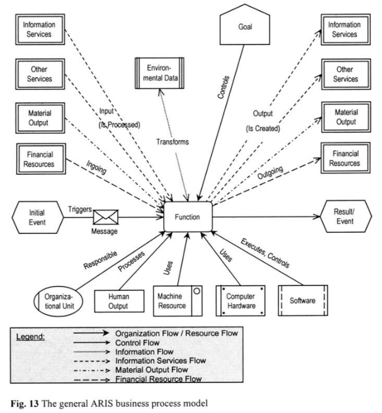

### Function
#### intro
Функция - действие, процесс (прежде всего вычисления) = операция (вычисления, производственная), процедура и т.п. Математическая функция - преобразование \ трансформация \ вычисление.   
Все изложенное справедливо к function = [process.md](process.md)  

Типы:
- вычислительная функция: выполнить дейсвтие по расчету и т.п. в пределе (предельная элементарная функция) - атомарная функция сложениме нулей и единиц
- функция передачи: передача \ прием. Атомарно: передача \ прием нуликов и единичек
- функция старта \ останова (start \ finish): добавить \ удалить маркер из функции \ события. 

#### Aris
Функция - как "черный квадрат": у нее задача / цель (только) "выполнить функцию" / получить результат функции \ процесса.  
- принять на вход (входной регистр)
- обработать (вычислить)
- выдать результат (выходной регистр)  
Не точная картинка из [ARIS](https://archive.org/details/springer_10.1007-978-3-642-97738-1/page/n47/mode/2up):

Тело функции - алгоритм (алгоритмическое обеспечение). Варианты формализации алгоритма функции "инструментальным" способом: анализ кода, анализ исполнения процесса (логов-журналов, Process Mining).     
Порты Функции:
- Север и юг - событийные входы \ выходы. Порты workflow: принимаю (север) и "выталкивают" (юг) маркеры (бегунки). Старт и завершение экземпляра функции. Внешнее событийное обеспечение. События по периметру функции. 
- Запад - docflow принимают и выдают документы \ информацию \ материалы. Движение информации в и из функции.
- Восток - resource (ресурсы): инсполнители (HR) и инструменты. Потока нет (нет и стрелок).

### function metamodel
#### 1 function properties
#### 1.1 basic properties
- содержание функции (x*x) - алгоритм вычисления функции.
- область определений \ значений
  - вещественная \ документарная (информационная) ось, запад функции, docflow (Material flow \ Information flow, см. рис.):
    - область опеределения- набор возможных входных документов \ информации и т.п. (из ничего нельзя создать что-то), т.е. заготовки для переработки - аргументы функции
    - область значений (документарных \ ощутимых результатов) - набор возможных вЫходных документов \ информации и т.п. Результат работы \ выполнения функции. Атомарная функция по вещественному (документарному) выходу - имеет не более одного результата. Точнее ровно один, как минимум заданный "по умолчанию" или по правилу: "отсутсвие результата - тоже результат"
  - событийная (мнимая) ось, север и юг функции, workflow
    - область опеределения- набор возможных входных событий
    - область значений (неощутимых результатов) - набор возможных вЫходных событий. Атомарная функция по событийному выходу имеет на выходе ровно одно событие 
  - примечание: docflow и workflow напрямую связаны между собой, есть функция мапинга "docflow - workflow". Каждое изменение статуса документа \ факт получения или передачи информации отражается соответсвующим событием 
- ресурсы функции (Resource flow на рис. - только нет там потока, просто привязка к ресурсам):
  - исполнительские (HR)
  - инструментальные (используемые инструменты для реализации функции), в первую очередь это ИТ-системы (для неатоматизированной обработки: молоток, счеты и т.п.) 
  - примечание: при нулевом участии HR (HR исполнитель = 0) функция считатеся автоматической (100 автоматизации) и исполнитель = auto (sys). При полностью ручной обработке функция считается ручной и ИТ-система не указывается (коэффициент автоматизации = 0)
- id (code) + label (name) код и название функции
- structural relationship размещение в иерархии (дереве) функций: родительский (материнская функция), вызывающие (другие функции, которые вызывают нашу функцию) и дочерние элементы (под-функции). Вложенность - мартешка (дерево) функций
#### 1.2 other properties
- различные классификаторы: по виду операции \ деятельности, по критичности и т.п.
- среднее (минимальное \ максимальное) время выполнения, реальное и регламентированное
- вероятность каждого значения функции (в т.ч. надежность функции)
- графическое обозначение (форма фигуры, цвет, координаты фигуры и т.п.)
#### 2 function environment
Окружение функции: докменты (Data Object), исполнители функции (role), инструменты (реализации функции) - в первую очередь ИТ-системы (sys) 
##### 2.1 document (doc)
Любой Data Object (информация). Свойства:
- суть (ссылка на толковый словарь), код и название
- носитель (бумажный, электронный файл \ сообщение \ запись в БД), протокол передачи "контейнера с информацией" (JDBC, email, file etc)
- статус
- structural relationship
- связь с функцией

##### 2.2 Role (actor)
- роль в процессе имеет привязку к должности и конкретному исполнителю (ФИО)
- требуемый уровень квалицикации

##### 2.3 System (tool)
- ИС, ППО, СПО, ПАК, "железо"  
- звено (клиент-сервер)
- инстанс

#### 3 dynamics vs statics
Операция - динамический обьект. Документ (предмет, запись, информационное сообщение, артефакт) - статический. ИТ-система статический или динамический?  
Когда сервер лежит на складе - статический. Как только ему подали питание - он становится динамическим объектом ("оживает") и внутри него возникают процессы (вычислительные процессы).
