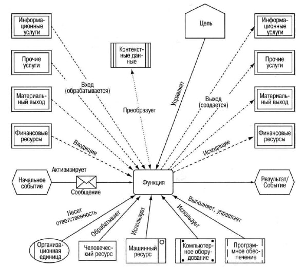

### Function
#### intro
Функция - действие, процесс (прежде всего вычисления) = операция (вычисления, производственная), процедура и т.п. Математическая функция - преобразование \ трансформация \ вычисление.   
Все изложенное справедливо к function = [process.md](process.md)  

Типы:
- вычислительная функция: выполнить дейсвтие по расчету и т.п. в пределе (предельная элементарная функция) - атомарная функция сложениме нулей и единиц
- функция передачи: передача \ прием. Атомарно: передача \ прием нуликов и единичек
- функция старта \ останова (start \ finish): добавить \ удалить маркер из функции \ события. 

#### Aris
Функция - как "черный квадрат": у нее задача / цель (только) "выполнить функцию" / получить результат функции \ процесса.  
- принять на вход (входной регистр)
- обработать (вычислить)
- выдать результат (выходной регистр)  
Не точная картинка:

Тело функции - алгоритм (алгоритмическое обеспечение)   
Порты Функции:
- Север и юг - событийные входы \ выходы. Порты workflow: принимаю (север) и "выталкивают" (юг) маркеры (бегунки). Старт и завершение экземпляра функции. Внешнее событийное обеспечение. События по периметру функции. 
- Запад - docflow принимают и выдают документы \ информацию \ материалы. Движение информации в и из функции.
- Восток - resource (ресурсы): инсполнители (HR) и инструменты. Потока нет (нет и стрелок).

### function metamodel
#### 1 function properties
#### 1.1 basic properties
- содержание функции (x*x) - алгоритм вычисления функции.
- область определений \ значений
  - вещественная \ документарная (информационная) ось, запад функции, docflow:
    - область опеределения- набор возможных входных документов \ информации и т.п. (из ничего нельзя создать что-то), т.е. заготовки для переработки - аргументы функции
    - область значений (документарных \ ощутимых результатов) - набор возможных вЫходных документов \ информации и т.п. Результат работы \ выполнения функции. Атомарная функция по вещественному (документарному) выходу - имеет не более одного результата. Точнее ровно один, как минимум заданный "по умолчанию" или по правилу: "отсутсвие результата - тоже результат"
  - событийная (мнимая) ось, север и юг функции, workflow
    - область опеределения- набор возможных входных событий
    - область значений (неощутимых результатов) - набор возможных вЫходных событий. Атомарная функция по событийному выходу имеет на выходе ровно одно событие 
  - примечание: docflow и workflow напрямую связаны между собой, есть функция мапинга "docflow - workflow". Каждое изменение статуса документа \ факт получения или передачи информации отражается соответсвующим событием 
- ресурсы функции:
  - исполнительские (HR)
  - инструментальные (используемые инструменты для реализации функции) 
