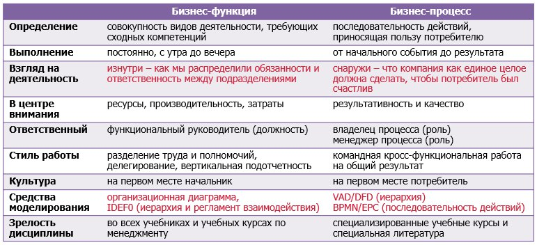

### function vs process
https://t.me/abpmp/50812

#### Есть мнение
- бизнес-функция - это потенциал. маркетинговая функция, бухгалтерская функция - это люди и инструменты, которые что-то умеют делать.  
на верхних уровнях функции материализуются в виде подразделений (отдел маркетинга), дальше в виде должностей (они же обобщенные трудовые функции) и трудовых функций.
- (кросс-процессный) поток действий в рамках подразделения/функции - это то, как руководитель подразделения расставляет своих людей по задачам, которые валятся на подразделение из разных процессов и разных экземпляров одного процесса.  
или то, как работник делит свое рабочее время, приоритизируя поток валящихся на него каждодневных задач.
бизнес-процесс следует представлять как единую последовательность, охватывающую различные подразделения и даже различные компании/организации. попытка представить сквозной процесс как несколько связанных "процессов подразделений" ни к чему хорошему не приводит, примеры перед глазами. используйте подпроцессы.

#### вопрос:
Не особо точное разделение выше было, какой четкий критерий "процесс vs функция"? В орг-штатной структуре названия подразделений может быть разным (абсолютно произвольным) и мы не можем к ним привязываться с определением "функции" в общем случае (кроме указанных маркетинга и бухгалтерии и т п.). Как мы распределили обязанности, чтобы клиент бы счастлив.  
У бизнес- функции все равно же есть клиент. Например, потребитель бух отчетов - регулятор.  
https://t.me/abpmp/50986

##### Определения
- https://abpmp.org.ru/resource/bpm-glossary/#process
- Scheer https://github.com/bpmbpm/doc/blob/main/METAMODEL/PROCESS/function.md

"Набор функций" vs "состоит из функций". Полагаю, что нужно возвратиться к математике, к уравнению:  
x^3 + x^2 + x = Y   
все в левой части - это [функции](https://mathus.ru/math/function.pdf) (три разных), а Y - это "значение процесса \ функции" процесс.  
В левой части - [выражение](https://ru.wikipedia.org/wiki/%D0%92%D1%8B%D1%80%D0%B0%D0%B6%D0%B5%D0%BD%D0%B8%D0%B5_(%D0%BC%D0%B0%D1%82%D0%B5%D0%BC%D0%B0%D1%82%D0%B8%D0%BA%D0%B0))   
Подробнее:  
x^3 и x^2 – это функции куба и квадрата. Например, у одного подразделения выполняющего операцию «x^3» в функциональных обязанностях записано «возводить в куб», а у другого (с названием «Подразделение Кубов»)  – возводить в квадрат.  
Тогда, кросс-функциональный процесс будет:   
x^3 + x^2,  
а, например, сквозной:   
x^3 + x^2 + x   
Если результат процесса (выход) будет продукт Y, то можно записать:   
x^3 + x^2 + x - Y  

