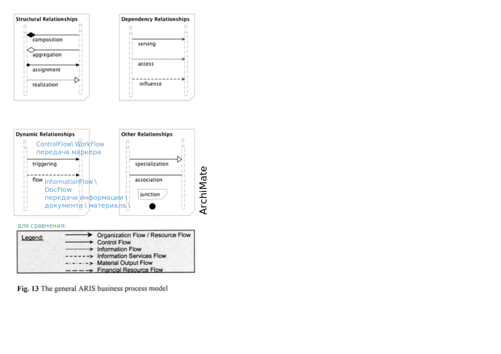
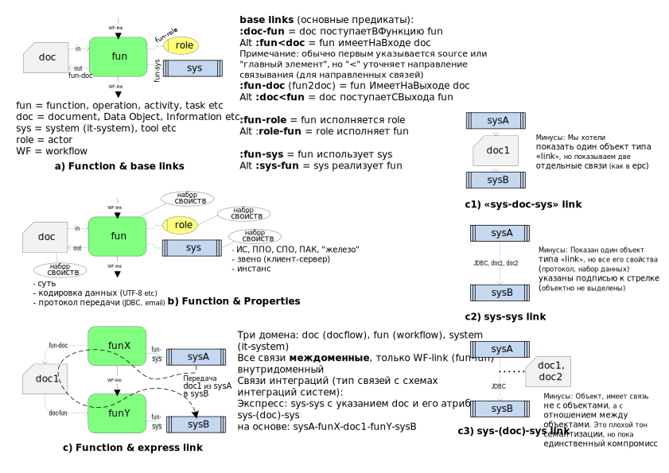

### integration scheme
Какая онтология схем интеграции? Как правильно показывать интеграцию систем? Интеграцию ИТ-систем.

### Как показывают в EPC и ArchiMate
- [Understanding Dynamic Relationships in ArchiMate: Triggering and Flow](https://www.archimetric.com/understanding-dynamic-relationships-in-archimate-triggering-and-flow/)
- EPC-fun: [function.md](https://github.com/bpmbpm/doc/edit/main/METAMODEL/PROCESS/function.md)

### Онтологическая картинка

#### Природа соединения sys-sys
Это не первичное (исходное, изначальное) соединение, а производное соединение.  

