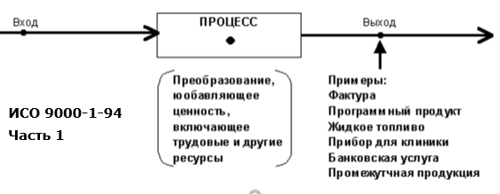
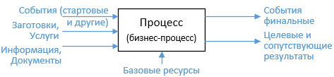
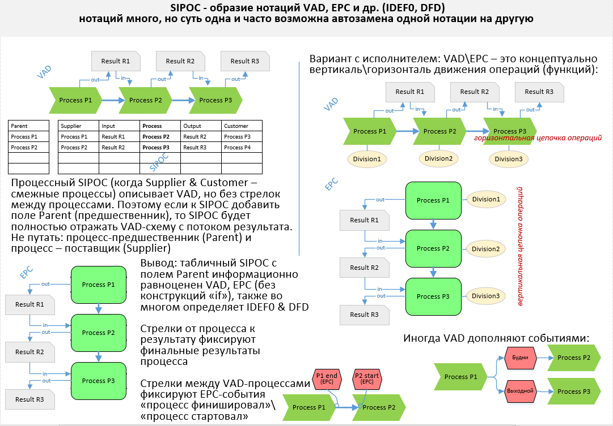

## Что такое процесс?
### см. также:
- [Этот файл process.md](https://github.com/bpmbpm/doc/blob/main/METAMODEL/PROCESS/process.md)
- 1 Process, function, capability: https://github.com/bpmbpm/doc/blob/main/BPM/TERM/README.md#1-process-function-capability 
- Обсуждение тероминов [1.2 upd1 bpmbpm для smev44](https://github.com/bpmbpm/SemanticBPM/wiki/%D0%9E%D0%B1%D1%81%D1%83%D0%B6%D0%B4%D0%B5%D0%BD%D0%B8%D1%8F-%D1%82%D0%B5%D1%80%D0%BC%D0%B8%D0%BD%D0%BE%D0%B2#12-upd1-bpmbpm)
- [Repo MetaModel (TriG) из wiki SemanticBPM](https://github.com/bpmbpm/SemanticBPM/wiki/%D0%9C%D0%B5%D1%82%D0%B0%D0%BC%D0%BE%D0%B4%D0%B5%D0%BB%D1%8C-%D0%BF%D1%80%D0%BE%D1%86%D0%B5%D1%81%D1%81%D0%BE%D0%B2)
### 1 Процесс – функция – операция
Действие - сининимы: процесс, функция, операция, задача и т.п. Activity (BPMN), function (EPC) и т.п.     
Читаем Шеера:  
**п. 4.1.1.1 Дерево функций (Function tree):**
Функции могут быть описаны на разных уровнях агрегации. Объединение (прим: Accumulations - аккумуляция, агрегация) функций в виде бизнес-процессов или цепочек процессов образуют верхний уровень агрегации. Примером может служить обработка заказа клиента, от запроса клиента до доставки. Бизнес-процесс таким образом, представляет собой сложную функцию, которую можно разбить на подфункции, чтобы уменьшить ее сложность. Термин «функция» может использоваться на всех уровнях иерархии. Однако другие термины, такие как процедура, процесс, подфункция или элементарная функция также используются для обозначения уровня иерархии.
Разбивка функций может осуществляться на нескольких уровнях иерархии. Элементарные функции представляют самый нижний уровень в семантических деревьях функций (прим: онтологической иерархии, таксономии).
Элементарные функции — это функции, которые с точки зрения управления бизнесом не могут быть далее детализированы.
Иерархические структуры лучше всего представляются с помощью деревьев функций или моделей иерархии. ... Конец цитаты  

Шеер придумал [ARIS](https://github.com/bpmbpm/doc/blob/main/BPM/ARIS/history.md)  
Также см. [В толковый словарь Business Process Management: Бизнес-функция vs Бизнес-процесс](https://habr.com/ru/articles/763910/):  
**1 Вредный термин «бизнес»**  
В BPM концепции приставка «бизнес» означает исключительно то, что в BPM рассматривают процессы (преобразования), осуществляемые «искусственно» машинами и человеками, но не природные процессы (химические, физические, другие).

«Слово-паразит» - «бизнес» не только не несет смысловой нагрузки в терминах BPM (контекста BPM вполне достаточно чтобы понять, что мы не хим / физ-процессы рассматриваем), но и вводит двоякость (путаницу): ... Конец цитаты  

Декомпозиция «процесс / подпроцесс» аналогична «система и подсистема». 
Все «вариации»: группы процессов \ системы процессов (процессы процессов), задачи и функции – лишь определяют процессы разных уровней.
Группа процессов, процедура, действие, операция, функция, процедура - всё это процессы.

### 2 Простые определения процесса = операции = функции
Некоторые определения:
- Процесс – это преобразователь входа в выход
- Wiki: Процесс — совокупность действий по преобразованию сырья, материалов, полуфабрикатов и комплектующих изделий в готовую продукцию или услугу. Судебный процесс — процедура рассмотрения и разрешения дела судом 
- Процесс – это Система, преобразующая Входы в Выходы с помощью Ресурсов.
  
  
**Рис. 1 Процесс**

Источник [ИСО 9000-1-94](https://de.ifmo.ru/bk_netra/page.php?dir=3&tutindex=18&index=8&layer=4)  

Некоторые следствия:
- Каждый процесс имеет как минимум один вход и один выход. Из «ничего» нельзя сделать «что-то» (кроме ничего), а если на выходе процесса «ничего», то смысла в процессе - нет. Однако «ничего» в бизнес-процессах не бывает.
- Процесс требует хотя бы один «силовой» ресурс – «рабочую силу»: ручную или автоматическую. Преобразования без исполнительного механизма не бывает. В системе с уровнем автоматизации ниже 100% обязателен человеческий ресурс.  
- Процесс – это нечто динамическое (динамическая сущность), поэтому процесс всегда потребляет ресурс под названием «время». Это особый вид ресурса процесса.  
### 3 Математическая интерпретация процесса
Математически: f(x,y) = Res
Функция (набор входов, набор ресурсов) = Результат, где
результат – это выход, значение функции 
 
В математике каждому значению аргумента соответствует единственное значение функции, например, круг в декартовой прямоугольной системе – не функция, т.к. не проходит правило вертикальной линии. 
Выходов у процесса, как правило, несколько, только часть из них «целевые» (нужные), а часть – «сопутствующие» (не особо нужные, чаще даже вредные, брак, потери/ muda/ waste). 
Поэтому «более строго» процесс с несколькими выходами назвать не функцией, а процедурой - так принято в программировании, когда возвращается несколько значений. 
Математически «процедура» может быть задана через векторно-матричные операции (массивы, наборы):
Входной набор (массив), Набор ресурсов, Выходной набор.   

#### Процесс: f(МВОС) = МИО 
где: 
- МВОС - Множество входящих объектов и событий
- МИО - Множество исходящих (выходных) объектов-результатов и событий 

  
**Рис 2 Окружение процесса**  

Процесс — это отображение (множество действий) входного множества (набора входов) в выходное (набор выходов)

На входе процесса: События (начало смены и т.п.), Заготовки (любые изменяемые в процессе объекты), Информация – не изменяемые объекты, включая информационные. Случайные воздействующие факторы (например, помехи) обычно в модели не учитываются.

Особый «ресурсный» вход - Базовые ресурсы, включая:
- трудовые ресурсы (роли в процессе, замещенные конкретным исполнителем);
- инструменты (ИТ, включая роботов и не ИТ, включая расходные материалы), т.е. инструментальное (материально-техническое) обеспечение;
- алгоритмы, т.е. алгоритмическое обеспечение процесса, включая регламенты и бизнес-правила (условия, требования) 

По завершению процесса важно:
А) установить факт наступления события «Процесс завершен»;
Б) провести оценку качества продуктов (результатов) процесса (не ценности для клиента), т.е. сравнить параметры выхода экземпляра процесса с шаблоном (ожиданием) выхода
#### Скобки процесса
Процесс – как workflow всегда начинается со стартового события и заканчивается финальным. Может быть несколько стартовых, тогда, они как правило объединяются (стрелками) в одно условное стартовое. В стартовое событие нет входящих стрелок.
Аналогично финальные события могут быть объединены в одно условное (обобщённое) финальное. Из финального события нет исходящих стрелок. 
Математизация workflow (не процесса, а только его workflow) на примере EPC показана: 
- [WF2M сеть. Формализм и математика workflow(](https://habr.com/ru/articles/781124/) 
- [Формализация WF2M сети на примере алгоритма Кофе-машина и два ученых](https://habr.com/ru/articles/789570/)

### 4 Ценность в процессе
Процесс – это преобразователь входов в выходы
Всяческие уточнения, типа «… входа в выход с целью получения ценности для клиента» не имеют смысла, т.к.:  

1. Ценность может быть положительная и отрицательная (анти ценность). Для одних результат одного и того же процесса положительный, для других – отрицательный. Например, война.
Только в рамках популистского маркетинга \ менеджмента подразумевается, что ценность процесса для клиента всегда положительная. В реальности целеполагание процессного подхода (итоговый результат) обычно основано в достижении положительной ценности акционера, а не клиента. Если акционеру будет выгодно производство продуктов с отрицательной ценностью для клиентов, то это будет нормой при оценке эффективности.  
2. Не путать отрицательную ценность с отрицательным результатом процесса. Например, результат процесса положительный (не было отказов), но на выходе - отрицательная ценность для клиента (положительная для акционера).   
3. Пример классификации процессов с отрицательной ценностью
- услуга погашения штрафа;
- навязанные услуги (см. ст.26 Закона о защите прав потребителей);
- процессы со случайным исходом (лотереи).
Т.е. «ценность» процесса – субъективное понятие и для разных стейкхолдеров (заинтересованная сторона) для одного процесса она не только разная, но и противоположная. 
Особо можно выделить процессы ожидания. Они как правило потребляют время (ресурс «время») и накладной расход, например, амортизацию оборудования (износ), электричество и т.п. Сервер работает, но запросов на обслуживание нет, и он «молотит вхолостую». Сервер потребляет электричество только для получения результата «быть готовым» при появлении нагрузки (запроса на обработку). 

### 5 Формализация процесса
Формализовать процесс можно тестом (регламент), схемой, кодом и т.п. Один и тот же процесс можно разрисовать разными картинками, включая:

**Рис. 3 Синтаксические обертки (BPM - нотации) смысла**  

Однако за разными синтаксическими обмётками как текстовыми (на русском или китайском языке и др.), графическими (схемы VAD, EPC, BPMN и еще 100 подобных), табличными (SIPOC) скрывается один и тот же смысл, который представлен семантикой (смыслами). Подробнее см.:
- [ВРМ. Смарт-инструменты «Таблица -> Схема» для формализации бизнес-процессов. Рестайлинг ARIS SmartDesign](https://habr.com/ru/articles/810851/)
- [Semantic BPM. Семантика и синтаксис бизнес-процессов](https://habr.com/ru/articles/795883/)
- [Semantic BPM. Онтологическое моделирование верхнеуровневых процессов. VAD](https://habr.com/ru/articles/828266/)

### 6 Что хотелось бы найти \ построить
- Метамодель \ онтологию бизнес-процесса, в т.ч. см. уточнение [low-level process ontology]( https://github.com/bpmbpm/doc/blob/main/Project/SemanticBPM/method/onto_concept.md)
- Математическую модель процесса, как математическую функцию
- Машину Тьюринга «Процесс» или для начала «Workflow» (где-то был черновик)

### Отдельные обсуждения
- [Готовим HLD или «Каша из топора»](https://habr.com/ru/companies/megafon/articles/946942/)

