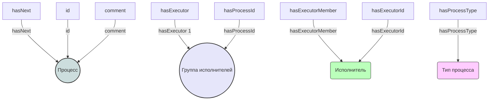
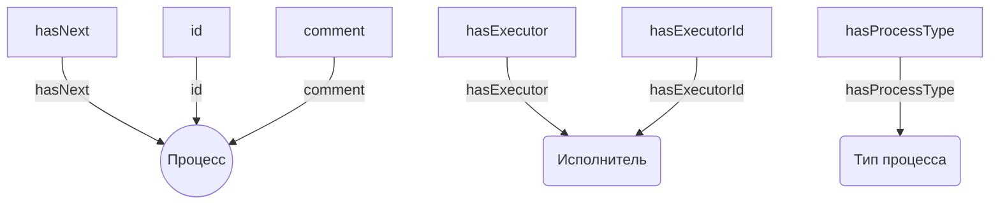

### Vad2
см. также https://github.com/bpmbpm/jsDOTsmartDesign/blob/main/ver3VAD/notation/all3.md

Сформируй минимальную онтологию VAD, включающую минимум prefix и типы объектов:
Процесс (Process), ГруппаИсполнителей (ExecutorGroup). 

Процесс имеет свойства: id, публикуемое имя (rdfs:label), тип (rdf:type ProcessType), комментарий (rdfs:comment)
Процесс имеет предикаты:
- hasNext (далее следующий Процесс)
- hasExecutor (далее ExecutorGroup)

ExecutorGroup имеет id, составной частью которого является id Процесса (к которому он  hasExecutor), публикуемое имя и включает список Исполнителей.
Исполнители имеют id и публикуемое имя.
Только Процесс имеет комментарий. 
Отображаемые фигуры: 
Процесс (cds-шеврон)
ExecutorGroup (эллипс)

Имя ExecutorGroup формируется автоматически – как сложенная строка из соответствующих Исполнителей.
Также задай правило, что у одного Процесса ровно одна ExecutorGroup.
Кроме ttl покажи онтологию таблично. 

2 Отобрази через mermaid полученную метамодель аналогично, как было бы в окне OntoGraf Protégé.
 
3 На базе полученной онтологии создай схему процесса, включающую операции: Отрезать отрезок проволоки, Согнуть проволоку по форме скрепки, Нанести покрытие. 
Исполнителей придумай сам по два на каждую операцию.  

4 Выполни шаги 1-3 с учетом отказа от ExecutorGroup, т.е. Исполнители имеют прямой предикат к Процесс. При этом в примере (без ExecutorGroup) покажи, что операция «Согнуть проволоку по форме скрепки» имеет пять исполнителей (включая схему). Объект ExecutorGroup задуман (в предыдущем варианте) для варианта более компактного размещения объектов на схеме (холсте).

## 2

## Часть 1. Минимальная онтология VAD с `ExecutorGroup` 

### Файл `vad_with_group.ttl`

```turtle
@prefix :      <http://example.org/vad-with-group#> .
@prefix rdf:   <http://www.w3.org/1999/02/22-rdf-syntax-ns#> .
@prefix rdfs:  <http://www.w3.org/2000/01/rdf-schema#> .
@prefix owl:   <http://www.w3.org/2002/07/owl#> .
@prefix xsd:   <http://www.w3.org/2001/XMLSchema#> .

# Объявление онтологии
: rdf:type owl:Ontology ;
    rdfs:comment "Минимальная онтология VAD с группировкой исполнителей" .

#######################################################################
#  КЛАССЫ (типы объектов)
#######################################################################

# Процесс – основная единица цепочки добавления ценности.
# Визуальная форма: CDS-шеврон.
:Process rdf:type owl:Class ;
    rdfs:label "Процесс" ;
    rdfs:comment "Бизнес-операция или работа, добавляющая ценность." .

# Группа исполнителей – контейнер для нескольких исполнителей одного процесса.
# Позволяет сократить число связей на диаграмме. Визуальная форма: эллипс.
:ExecutorGroup rdf:type owl:Class ;
    rdfs:label "Группа исполнителей" ;
    rdfs:comment "Узел-контейнер, объединяющий всех исполнителей процесса." .

# Исполнитель – отдельный субъект (человек, станок, роль).
:Executor rdf:type owl:Class ;
    rdfs:label "Исполнитель" ;
    rdfs:comment "Физическое лицо, механизм или программная сущность." .

# Тип процесса – классификатор (например, резка, гибка, покраска).
:ProcessType rdf:type owl:Class ;
    rdfs:label "Тип процесса" ;
    rdfs:comment "Категория процесса для группировки и анализа." .

#######################################################################
#  АТРИБУТЫ (datatype properties)
#######################################################################

# Уникальный идентификатор процесса (строка).
:id rdf:type owl:DatatypeProperty ;
    rdfs:domain :Process ;
    rdfs:range xsd:string ;
    rdfs:label "идентификатор" ;
    rdfs:comment "Технический код процесса." .

# Идентификатор процесса, к которому относится группа.
:hasProcessId rdf:type owl:DatatypeProperty ;
    rdfs:domain :ExecutorGroup ;
    rdfs:range xsd:string ;
    rdfs:label "принадлежит процессу (id)" ;
    rdfs:comment "Ссылка на процесс через его id. Используется для формирования имени группы." .

# Идентификатор исполнителя (строка).
:hasExecutorId rdf:type owl:DatatypeProperty ;
    rdfs:domain :Executor ;
    rdfs:range xsd:string ;
    rdfs:label "идентификатор исполнителя" .

# Комментарий – только для процесса (человекочитаемое пояснение).
:comment rdf:type owl:DatatypeProperty ;
    rdfs:domain :Process ;
    rdfs:range xsd:string ;
    rdfs:subPropertyOf rdfs:comment ;
    rdfs:label "комментарий" ;
    rdfs:comment "Пояснение к процессу (что делает, зачем)." .

#######################################################################
#  СВЯЗИ (object properties)
#######################################################################

# Указатель на следующий процесс (упорядочивает цепочку).
:hasNext rdf:type owl:ObjectProperty ;
    rdfs:domain :Process ;
    rdfs:range :Process ;
    rdfs:label "следует за" ;
    rdfs:comment "Определяет последовательность выполнения процессов." .

# Связь процесса с его группой исполнителей.
:hasExecutor rdf:type owl:ObjectProperty ;
    rdfs:domain :Process ;
    rdfs:range :ExecutorGroup ;
    rdfs:label "выполняется группой" .

# Связь группы с входящими в неё исполнителями.
:hasExecutorMember rdf:type owl:ObjectProperty ;
    rdfs:domain :ExecutorGroup ;
    rdfs:range :Executor ;
    rdfs:label "включает исполнителя" .

# Тип процесса (классификация).
:hasProcessType rdf:type owl:ObjectProperty ;
    rdfs:domain :Process ;
    rdfs:range :ProcessType ;
    rdfs:label "имеет тип" .

#######################################################################
#  ОГРАНИЧЕНИЯ (аксиомы)
#######################################################################

# У одного процесса – ровно одна группа исполнителей.
:Process rdfs:subClassOf [
        rdf:type owl:Restriction ;
        owl:onProperty :hasExecutor ;
        owl:cardinality 1
    ] .
```

### Табличное представление онтологии (с группой)

| Элемент | Тип | Домен | Диапазон | Кардинальность / особое |
|---------|-----|-------|----------|------------------------|
| **Классы** |
| `:Process` | Class | – | – | шеврон |
| `:ExecutorGroup` | Class | – | – | эллипс |
| `:Executor` | Class | – | – | – |
| `:ProcessType` | Class | – | – | – |
| **Datatype-свойства** |
| `:id` | DatatypeProperty | `:Process` | `xsd:string` | – |
| `:hasProcessId` | DatatypeProperty | `:ExecutorGroup` | `xsd:string` | – |
| `:hasExecutorId` | DatatypeProperty | `:Executor` | `xsd:string` | – |
| `:comment` | DatatypeProperty | `:Process` | `xsd:string` | подкласс `rdfs:comment` |
| **Object-свойства** |
| `:hasNext` | ObjectProperty | `:Process` | `:Process` | – |
| `:hasExecutor` | ObjectProperty | `:Process` | `:ExecutorGroup` | **cardinality = 1** |
| `:hasExecutorMember` | ObjectProperty | `:ExecutorGroup` | `:Executor` | – |
| `:hasProcessType` | ObjectProperty | `:Process` | `:ProcessType` | – |

**Правило формирования имени группы:**  
Имя группы вычисляется как конкатенация имён всех входящих исполнителей через запятую (например, «Иван, Станок_отрезной»). Это не записывается в RDF, а является соглашением для визуализатора.

---

## Часть 2. Мета-модель в формате Mermaid (как в Protege OntoGraf)

Ошибки: 

```
graph TD
    classDef process fill:#cds,stroke:#333,stroke-width:2px,shape:chevron
    classDef group fill:#e6e6fa,stroke:#333,stroke-width:2px,shape:ellipse
    classDef executor fill:#bbffbb,stroke:#333
    classDef ptype fill:#ffccff,stroke:#333

    Process((Процесс)) :::process
    ExecutorGroup(("Группа исполнителей")) :::group
    Executor(Исполнитель) :::executor
    ProcessType(Тип процесса) :::ptype

    hasNext -->|hasNext| Process
    hasExecutor -->|hasExecutor 1| ExecutorGroup
    hasExecutorMember -->|hasExecutorMember| Executor
    hasProcessType -->|hasProcessType| ProcessType

    id -->|id| Process
    hasProcessId -->|hasProcessId| ExecutorGroup
    hasExecutorId -->|hasExecutorId| Executor
    comment -->|comment| Process
```

Ошибка в синтаксисе Mermaid: GitHub не поддерживает **inline-стилизацию с `:::`** внутри блока graph. Также `shape:` внутри `classDef` не работает.
**Что было исправлено:**
- Убраны `shape=chevron` и `shape=ellipse` из `classDef` (Mermaid не поддерживает их внутри `classDef`).
- Вместо `:::` используется явное присвоение класса после объявления узлов: `class Process process`.
- Символ `(("текст"))` рисует эллипс (для группы исполнителей). Шеврон можно имитировать, используя `[/"Процесс"/]` (ромб) или обычный прямоугольник. При желании замените `(("Процесс"))` на `[Процесс]` (прямоугольник).

Исправлено.


**Пояснение к диаграмме:**  
- Шеврон «Процесс» связан ровно с одним эллипсом «Группа исполнителей».  
- Группа содержит ноль или более исполнителей.  
- У процесса есть идентификатор, комментарий, тип и указатель на следующий процесс.

---

## Часть 3. Пример схемы процесса изготовления скрепки (с использованием `ExecutorGroup`)

**Операции (процессы):**
1. Отрезать отрезок проволоки  
2. Согнуть проволоку по форме скрепки  
3. Нанести покрытие  

**Исполнители по операциям (по два на операцию):**

| Процесс | Группа | Исполнители (2) |
|---------|--------|----------------|
| Отрезать отрезок проволоки | Group1 | Иван, Станок_отрезной |
| Согнуть проволоку по форме скрепки | Group2 | Пётр, Гибка_автомат |
| Нанести покрытие | Group3 | Мария, Покрасочная_камера |

### Фрагмент Turtle с индивидами (читаемый)

```turtle
#######################################################################
#  ТИПЫ ПРОЦЕССОВ
#######################################################################
:Cutting rdf:type :ProcessType ;
    rdfs:label "Резка" .
:Bending rdf:type :ProcessType ;
    rdfs:label "Гибка" .
:Coating rdf:type :ProcessType ;
    rdfs:label "Покрытие" .

#######################################################################
#  ПРОЦЕССЫ
#######################################################################
:CutWire rdf:type :Process ;
    :id "P001" ;
    rdfs:label "Отрезать отрезок проволоки" ;
    :comment "Резка проволоки на заданную длину 8 см" ;
    :hasProcessType :Cutting ;
    :hasNext :BendWire .

:BendWire rdf:type :Process ;
    :id "P002" ;
    rdfs:label "Согнуть проволоку по форме скрепки" ;
    :comment "Формовка классической канцелярской скрепки" ;
    :hasProcessType :Bending ;
    :hasNext :CoatWire .

:CoatWire rdf:type :Process ;
    :id "P003" ;
    rdfs:label "Нанести покрытие" ;
    :comment "Нанесение полимерного покрытия (цвет: синий)" ;
    :hasProcessType :Coating .

#######################################################################
#  ИСПОЛНИТЕЛИ
#######################################################################
:Executor1 rdf:type :Executor ;
    :hasExecutorId "E001" ;
    rdfs:label "Иван" .
:Executor2 rdf:type :Executor ;
    :hasExecutorId "E002" ;
    rdfs:label "Станок_отрезной" .
:Executor3 rdf:type :Executor ;
    :hasExecutorId "E003" ;
    rdfs:label "Пётр" .
:Executor4 rdf:type :Executor ;
    :hasExecutorId "E004" ;
    rdfs:label "Гибка_автомат" .
:Executor5 rdf:type :Executor ;
    :hasExecutorId "E005" ;
    rdfs:label "Мария" .
:Executor6 rdf:type :Executor ;
    :hasExecutorId "E006" ;
    rdfs:label "Покрасочная_камера" .

#######################################################################
#  ГРУППЫ ИСПОЛНИТЕЛЕЙ (id группы = id процесса)
#######################################################################
:Group1 rdf:type :ExecutorGroup ;
    :hasProcessId "P001" ;
    :hasExecutorMember :Executor1, :Executor2 .
:Group2 rdf:type :ExecutorGroup ;
    :hasProcessId "P002" ;
    :hasExecutorMember :Executor3, :Executor4 .
:Group3 rdf:type :ExecutorGroup ;
    :hasProcessId "P003" ;
    :hasExecutorMember :Executor5, :Executor6 .

#######################################################################
#  ПРИВЯЗКА ГРУПП К ПРОЦЕССАМ
#######################################################################
:CutWire :hasExecutor :Group1 .
:BendWire :hasExecutor :Group2 .
:CoatWire :hasExecutor :Group3 .
```

**Автоматическое имя группы (соглашение для визуализатора):**  
- `Group1` → «Иван, Станок_отрезной»  
- `Group2` → «Пётр, Гибка_автомат»  
- `Group3` → «Мария, Покрасочная камера»

---

## Часть 4. Отказ от `ExecutorGroup` – прямая связь Процесс → Исполнитель

### Минимальная онтология без группы (`vad_without_group.ttl`)

```turtle
@prefix :      <http://example.org/vad-without-group#> .
@prefix rdf:   <http://www.w3.org/1999/02/22-rdf-syntax-ns#> .
@prefix rdfs:  <http://www.w3.org/2000/01/rdf-schema#> .
@prefix owl:   <http://www.w3.org/2002/07/owl#> .
@prefix xsd:   <http://www.w3.org/2001/XMLSchema#> .

: rdf:type owl:Ontology .

# Классы
:Process rdf:type owl:Class ;
    rdfs:label "Процесс" .
:Executor rdf:type owl:Class ;
    rdfs:label "Исполнитель" .
:ProcessType rdf:type owl:Class ;
    rdfs:label "Тип процесса" .

# Атрибуты
:id rdf:type owl:DatatypeProperty ;
    rdfs:domain :Process ;
    rdfs:range xsd:string .
:hasExecutorId rdf:type owl:DatatypeProperty ;
    rdfs:domain :Executor ;
    rdfs:range xsd:string .
:comment rdf:type owl:DatatypeProperty ;
    rdfs:domain :Process ;
    rdfs:range xsd:string ;
    rdfs:subPropertyOf rdfs:comment .

# Связи
:hasNext rdf:type owl:ObjectProperty ;
    rdfs:domain :Process ;
    rdfs:range :Process .
:hasExecutor rdf:type owl:ObjectProperty ;
    rdfs:domain :Process ;
    rdfs:range :Executor .   # прямая связь, без группы
:hasProcessType rdf:type owl:ObjectProperty ;
    rdfs:domain :Process ;
    rdfs:range :ProcessType .
```

### Mermaid-диаграмма метамодели (без группы)



### Пример схемы с пятью исполнителями для операции «Согнуть»

**Процессы:**
1. Отрезать отрезок проволоки (2 исполнителя)  
2. **Согнуть проволоку по форме скрепки (5 исполнителей)**  
3. Нанести покрытие (2 исполнителя)

**Исполнители для операции «Согнуть»:**  
Пётр, Гибка_автомат, Контроллер, **Схема** (электронный модуль управления), Смазчик.

### Turtle-индивиды (фрагмент)

```turtle
# Типы процессов
:Cutting rdf:type :ProcessType ; rdfs:label "Резка" .
:Bending rdf:type :ProcessType ; rdfs:label "Гибка" .
:Coating rdf:type :ProcessType ; rdfs:label "Покрытие" .

# Процессы
:CutWire rdf:type :Process ;
    :id "P001" ;
    rdfs:label "Отрезать отрезок проволоки" ;
    :comment "Отрезать проволоку длиной 8 см" ;
    :hasProcessType :Cutting ;
    :hasNext :BendWire ;
    :hasExecutor :Executor1, :Executor2 .   # 2 исполнителя

:BendWire rdf:type :Process ;
    :id "P002" ;
    rdfs:label "Согнуть проволоку по форме скрепки" ;
    :comment "Сформировать скрепку из проволоки" ;
    :hasProcessType :Bending ;
    :hasNext :CoatWire ;
    :hasExecutor :Executor3, :Executor4, :Executor5, :Executor6, :Executor7 .   # 5 исполнителей

:CoatWire rdf:type :Process ;
    :id "P003" ;
    rdfs:label "Нанести покрытие" ;
    :comment "Нанести цветное полимерное покрытие" ;
    :hasProcessType :Coating ;
    :hasExecutor :Executor8, :Executor9 .

# Исполнители (id и имя)
:Executor1 rdf:type :Executor ; :hasExecutorId "E001" ; rdfs:label "Иван" .
:Executor2 rdf:type :Executor ; :hasExecutorId "E002" ; rdfs:label "Станок_отрезной" .
:Executor3 rdf:type :Executor ; :hasExecutorId "E003" ; rdfs:label "Пётр" .
:Executor4 rdf:type :Executor ; :hasExecutorId "E004" ; rdfs:label "Гибка_автомат" .
:Executor5 rdf:type :Executor ; :hasExecutorId "E005" ; rdfs:label "Контроллер" .
:Executor6 rdf:type :Executor ; :hasExecutorId "E006" ; rdfs:label "Схема" .
:Executor7 rdf:type :Executor ; :hasExecutorId "E007" ; rdfs:label "Смазчик" .
:Executor8 rdf:type :Executor ; :hasExecutorId "E008" ; rdfs:label "Мария" .
:Executor9 rdf:type :Executor ; :hasExecutorId "E009" ; rdfs:label "Покрасочная_камера" .
```

### Зачем нужна `ExecutorGroup`? (обоснование)

- **Компактность диаграммы.** При прямых связях каждый исполнитель соединяется с процессом отдельной стрелкой. При 5 исполнителях процесс обрастает 5 линиями, что визуально шумно.  
- **Группа** сворачивает всех исполнителей в один узел-эллипс. Остаётся **одна стрелка** от процесса к группе.  
- Внутреннее устройство группы (список исполнителей) можно показать по требованию (например, всплывающей подсказкой).  
- Это особенно ценно для **крупных моделей**, где у каждого процесса может быть десятки исполнителей (цеха, роли, оборудование).  

Таким образом, `ExecutorGroup` – это **визуальный компромисс** между полнотой информации и читаемостью схемы.

### Info
#### cardinality
Правило «у одного Процесса ровно одна ExecutorGroup» зафиксировано в онтологии с помощью **аксиомы ограничения кардинальности** (owl:cardinality) в сочетании с `rdfs:subClassOf`. 

Вот соответствующий фрагмент из файла `vad_with_group.ttl`:

```turtle
# Ограничение: у процесса ровно одна группа исполнителей
:Process rdfs:subClassOf [
        rdf:type owl:Restriction ;
        owl:onProperty :hasExecutor ;
        owl:cardinality 1
    ] .
```

## Как это работает

1. **`rdfs:subClassOf`** – утверждает, что класс `:Process` является подклассом некоторого анонимного класса (квадратные скобки `[ ... ]` – это описание безымянного класса).

2. **`owl:Restriction`** – создаёт ограничение на свойства экземпляров класса.

3. **`owl:onProperty :hasExecutor`** – указывает, к какому свойству применяется ограничение (связь «процесс → группа исполнителей»).

4. **`owl:cardinality 1`** – задаёт **точную кардинальность**: каждый экземпляр `:Process` должен иметь **ровно одно** значение свойства `:hasExecutor`.

Другими словами, любой процесс (например, `:CutWire`) **обязан** быть связан с одной и только одной группой исполнителей через свойство `:hasExecutor`. Если создать процесс без группы или с двумя группами – логический вывод (reasoner) пометит онтологию как несовместимую (inconsistent).

## Альтернативные варианты (не использованы в вашей онтологии, но для справки)

- **`owl:minCardinality 1` и `owl:maxCardinality 1`** – можно задать по отдельности, но `owl:cardinality` – это короткая форма для «хотя бы один и не более одного».
- Если бы нужна была не точная кардинальность, а «хотя бы одна» – использовали бы `owl:minCardinality 1` или экзистенциальное ограничение `owl:someValuesFrom` (но в вашем задании требовалось «ровно одна», поэтому `cardinality` правильнее).

Таким образом, в вашей Turtle-онтологии правило зафиксировано аксиомой `owl:cardinality`. При загрузке в Protege и запуске Reasoner (например, HermiT) нарушение этого ограничения будет обнаружено.


## ru problem
## Проблема: иероглифы вместо русских букв в Protege

Причина: файл сохранён в кодировке, несовместимой с UTF-8 без BOM. Protege ожидает **UTF-8 без BOM**, а ваш файл, вероятно, сохранён в ANSI (Windows-1251) или UTF-8 с BOM. В результате кириллические символы отображаются кракозябрами.

## Решение (3 способа)

### Способ 1. Пересохранить файл в правильной кодировке (рекомендуется)

1. Откройте `vad2_nogroup.ttl` в **Notepad++**.
2. В меню: **Кодировки → Преобразовать в UTF-8 без BOM**.
3. Сохраните файл (`Ctrl+S`).
4. Перезагрузите онтологию в Protege (`File → Reload`).

Если у вас нет Notepad++, подойдёт **VS Code**: откройте файл, в правом нижнем углу нажмите на кодировку (например, `UTF-8 with BOM`), выберите `Save with encoding` → `UTF-8 without BOM`.

### Способ 2. Заменить русские буквы на Unicode-escape (для Protege)

Protege иногда лучше понимает Unicode-коды, чем прямые символы. Замените все русские строки на `\u...` последовательности. Например:
- `"Процесс"` → `"\u041F\u0440\u043E\u0446\u0435\u0441\u0441"`
- `"Исполнитель"` → `"\u0418\u0441\u043F\u043E\u043B\u043D\u0438\u0442\u0435\u043B\u044C"`

**Готовый исправленный файл с Unicode-escape** (скопируйте и сохраните как `vad2_nogroup.ttl`):

```turtle
@prefix :      <http://example.org/vad-without-group#> .
@prefix rdf:   <http://www.w3.org/1999/02/22-rdf-syntax-ns#> .
@prefix rdfs:  <http://www.w3.org/2000/01/rdf-schema#> .
@prefix owl:   <http://www.w3.org/2002/07/owl#> .
@prefix xsd:   <http://www.w3.org/2001/XMLSchema#> .

: rdf:type owl:Ontology .

# Classes
:Process rdf:type owl:Class ;
    rdfs:label "\u041F\u0440\u043E\u0446\u0435\u0441\u0441" .
:Executor rdf:type owl:Class ;
    rdfs:label "\u0418\u0441\u043F\u043E\u043B\u043D\u0438\u0442\u0435\u043B\u044C" .
:ProcessType rdf:type owl:Class ;
    rdfs:label "\u0422\u0438\u043F \u043F\u0440\u043E\u0446\u0435\u0441\u0441\u0430" .

# Datatype properties
:id rdf:type owl:DatatypeProperty ;
    rdfs:domain :Process ;
    rdfs:range xsd:string .
:hasExecutorId rdf:type owl:DatatypeProperty ;
    rdfs:domain :Executor ;
    rdfs:range xsd:string .
:comment rdf:type owl:DatatypeProperty ;
    rdfs:domain :Process ;
    rdfs:range xsd:string ;
    rdfs:subPropertyOf rdfs:comment .

# Object properties
:hasNext rdf:type owl:ObjectProperty ;
    rdfs:domain :Process ;
    rdfs:range :Process .
:hasExecutor rdf:type owl:ObjectProperty ;
    rdfs:domain :Process ;
    rdfs:range :Executor .
:hasProcessType rdf:type owl:ObjectProperty ;
    rdfs:domain :Process ;
    rdfs:range :ProcessType .
```

### Способ 3. Временно перейти на английские метки

Если срочно нужно работать, замените все русские названия на английские (например, "Process", "Executor", "Process type"). Это гарантирует отсутствие проблем с кодировкой. Позже, когда разберётесь, вернётесь к кириллице.

## Дополнительная рекомендация: шрифт в Protege

Даже при правильной кодировке Protege может отображать иероглифы, если выбранный шрифт не поддерживает кириллицу. Чтобы сменить шрифт:

1. В Protege: **File → Preferences...**
2. Вкладка **"Appearance"** (или «Внешний вид»).
3. Найдите **"Font for entity rendering"** – выберите шрифт, поддерживающий Unicode (например, **Segoe UI**, **Arial Unicode MS**, **Consolas** для моноширинных).
4. Нажмите **Apply** и **OK**.
5. Перезапустите Protege.

## Проверка кодировки файла

Чтобы убедиться, что файл сохранён правильно, откройте его в **Блокноте** Windows и нажмите **Файл → Сохранить как…** – в поле «Кодировка» должно быть **UTF-8**. Если там ANSI – проблема в этом.

После выполнения любого из способов иероглифы исчезнут, и вы увидите русский текст в Protege.  - нет не увидел

Продолжение:

Да, вы всё правильно заметили. В Protege действительно два независимых типа настроек шрифта, и найти нужную бывает непонятно. Проблема с иероглифами обычно связана с системным шрифтом, который Java (а Protege написан на Java) использует по умолчанию для интерфейса, а не с самим шрифтом для элементов онтологии.

Управлять шрифтами в Protege можно двумя способами.

### ⚙️ Способ 1: Настройка шрифта через конфигурацию Java (предпочтительный)
Часто этот метод оказывается самым надёжным, так как он напрямую решает проблему с отображением иероглифов на уровне системы.

1.  Закройте Protege, если он открыт.
2.  Найдите на рабочем столе или в меню «Пуск» ярлык, которым вы обычно запускаете программу.
3.  Кликните по ярлыку правой кнопкой мыши и выберите **«Свойства»**.
4.  Перейдите на вкладку **«Ярлык»**.
5.  В поле **«Объект»** вы увидите путь к исполняемому файлу `Protege.exe` (или `.bat`). Добавьте в самый конец этой строки следующие параметры, чтобы указать системе использовать нужный шрифт:

    ```
    -Dawt.swing.defaultfont="Arial"
    ```

    *   В итоге строка может выглядеть, например, так: `"C:\Program Files\Protege\Protege.exe" -Dawt.swing.defaultfont="Arial"`.
    *   Вместо `Arial` можете указать любой другой шрифт, в котором вы уверены (например, `Segoe UI`).

6.  Нажмите **«Применить»** → **«ОК»**. Теперь при запуске Protege будет использовать заданный шрифт для всего интерфейса, и иероглифы должны исчезнуть.

---

### 🎨 Способ 2: Смена шрифта отображения (Renderer) и самого интерфейса (Appearance)
Вы уже нашли часть этих настроек. Они расположены в `File` → `Preferences`. Разберём их по порядку:

*   **Настройка шрифта для отображения элементов онтологии (Renderer)**:
    Во вкладке **`Renderer`** нажмите кнопку **`Configure...`**. В открывшемся окне на вкладке **`General`** вы сможете выбрать не только размер (который вы уже нашли), но и непосредственно сам **шрифт**.

*   **Настройка шрифта для интерфейса Protege (Appearance)**:
    Эта настройка находится на вкладке **`Appearance`**.
    1.  Выберите файл, в котором хранятся настройки стиля интерфейса: **`Open`** → укажите путь к файлу `metal.properties`.
    2.  Файл `metal.properties` обычно находится в папке с программой (например, `C:\Program Files\Protege\resources\metal.properties`).
    3.  После того как файл будет загружен, появятся строки с настройками шрифта:
        *   `system.font` — для основного интерфейса.
        *   `user.font` — для пользовательских элементов.
        *   **Измените значения в кавычках после `bold.0=` на имя нужного вам шрифта, например, `bold.0=Arial`**.

    Если вам сложно изменять `metal.properties` вручную, вместо этого вкладки `Appearance` можно просто заменить системную тему отображения, сняв или установив галочку **`Enable system look and feel`**. Попробуйте оба варианта, иногда смена темы помогает.

---

### 💡 Альтернативные решения
Если описанные выше способы не помогли, возможно, потребуется более глубокое вмешательство.

*   **Обновление Java**: Иногда проблема кроется в старой версии Java. Установка последней версии с официального сайта может её решить.
*   **Замена файла `felix.jar`**: В редких случаях помогает замена системного файла `felix.jar` в папке `bin` Protege. Этот способ требует осторожности, и перед его применением лучше поискать инструкции, актуальные именно для вашей версии программы.

## En

## Способ 3. Переход на английские метки – готовый код

Ниже представлен файл `vad2_nogroup_en.ttl` – полный аналог вашего `vad2_nogroup.ttl`, но с английскими названиями классов, свойств и меток. Это гарантирует отсутствие проблем с кодировкой в Protege. Для удобства я добавил русские комментарии (они в Turtle оформлены как `#` и не влияют на отображение).

```turtle
@prefix :      <http://example.org/vad-without-group#> .
@prefix rdf:   <http://www.w3.org/1999/02/22-rdf-syntax-ns#> .
@prefix rdfs:  <http://www.w3.org/2000/01/rdf-schema#> .
@prefix owl:   <http://www.w3.org/2002/07/owl#> .
@prefix xsd:   <http://www.w3.org/2001/XMLSchema#> .

: rdf:type owl:Ontology ;
    rdfs:comment "Минимальная онтология VAD без группы исполнителей (английские метки)" .

#######################################################################
#  КЛАССЫ (типы объектов)
#######################################################################
:Process rdf:type owl:Class ;
    rdfs:label "Process" ;
    rdfs:comment "Бизнес-операция или работа, добавляющая ценность." .

:Executor rdf:type owl:Class ;
    rdfs:label "Executor" ;
    rdfs:comment "Исполнитель (человек, станок, роль)." .

:ProcessType rdf:type owl:Class ;
    rdfs:label "Process type" ;
    rdfs:comment "Категория процесса (резка, гибка, покрытие)." .

#######################################################################
#  АТРИБУТЫ (datatype properties)
#######################################################################
:id rdf:type owl:DatatypeProperty ;
    rdfs:domain :Process ;
    rdfs:range xsd:string ;
    rdfs:label "id" ;
    rdfs:comment "Уникальный идентификатор процесса." .

:hasExecutorId rdf:type owl:DatatypeProperty ;
    rdfs:domain :Executor ;
    rdfs:range xsd:string ;
    rdfs:label "executor id" ;
    rdfs:comment "Идентификатор исполнителя." .

:comment rdf:type owl:DatatypeProperty ;
    rdfs:domain :Process ;
    rdfs:range xsd:string ;
    rdfs:subPropertyOf rdfs:comment ;
    rdfs:label "comment" ;
    rdfs:comment "Пояснение к процессу." .

#######################################################################
#  СВЯЗИ (object properties)
#######################################################################
:hasNext rdf:type owl:ObjectProperty ;
    rdfs:domain :Process ;
    rdfs:range :Process ;
    rdfs:label "has next" ;
    rdfs:comment "Ссылка на следующий процесс в цепочке." .

:hasExecutor rdf:type owl:ObjectProperty ;
    rdfs:domain :Process ;
    rdfs:range :Executor ;
    rdfs:label "has executor" ;
    rdfs:comment "Прямая связь процесса с исполнителем (без группы)." .

:hasProcessType rdf:type owl:ObjectProperty ;
    rdfs:domain :Process ;
    rdfs:range :ProcessType ;
    rdfs:label "has process type" ;
    rdfs:comment "Тип процесса." .
```

## Как использовать

1. Скопируйте приведённый код в новый текстовый файл.
2. Сохраните файл с именем `vad2_nogroup_en.ttl` (важно: расширение `.ttl`).
3. Убедитесь, что кодировка файла – **UTF-8 без BOM** (в Notepad++: «Кодировки → Преобразовать в UTF-8 без BOM»).
4. Откройте файл в Protege (`File → Open`, выберите тип «All files» или «Turtle»).

В Protege вы увидите классы `Process`, `Executor`, `ProcessType` и свойства с английскими именами. Проблем с иероглифами не будет.

## Примечание

- **Комментарии на русском** остались только в коде (после `#`) – они не видны в интерфейсе Protege. Если вы хотите, чтобы в Protege подсказки были на русском, замените текст в `rdfs:comment` (но тогда вернётся проблема с кодировкой – лучше оставить английский).
- При желании вы можете позже изменить отображаемые названия через Protege (вкладка `Annotations`) – программа сама подставит русские буквы корректно, если шрифт поддерживает кириллицу.

Этот файл полностью работоспособен и не содержит символов, вызывающих ошибки парсера.

## Easy

## Подробный комментарий к коду (английская версия)

Разберём каждую часть приведённого файла `vad2_nogroup_en.ttl` построчно и по смыслу.

### Префиксы (объявления пространств имён)

```turtle
@prefix :      <http://example.org/vad-without-group#> .
@prefix rdf:   <http://www.w3.org/1999/02/22-rdf-syntax-ns#> .
@prefix rdfs:  <http://www.w3.org/2000/01/rdf-schema#> .
@prefix owl:   <http://www.w3.org/2002/07/owl#> .
@prefix xsd:   <http://www.w3.org/2001/XMLSchema#> .
```

- `:` – сокращение для базового URI нашей онтологии (http://example.org/vad-without-group#). Все определённые нами сущности будут иметь этот префикс.
- `rdf:`, `rdfs:`, `owl:`, `xsd:` – стандартные схемы для RDF, RDF Schema, OWL и XML Schema типов данных.

### Объявление онтологии

```turtle
: rdf:type owl:Ontology ;
    rdfs:comment "Минимальная онтология VAD без группы исполнителей (английские метки)" .
```

- Указывает, что сам документ является онтологией (экземпляр класса `owl:Ontology`).
- Добавляет комментарий (`rdfs:comment`) на английском (в данном случае тоже английский). Это не влияет на логику, только на документацию.

### Классы

```turtle
:Process rdf:type owl:Class ;
    rdfs:label "Process" ;
    rdfs:comment "Бизнес-операция или работа, добавляющая ценность." .
```

- Создаёт класс `:Process`. 
- `rdf:type owl:Class` – объявляет его как класс OWL.
- `rdfs:label` – человеко-читаемое имя (отображается в Protege).
- `rdfs:comment` – описание (также отображается).

Аналогично для `:Executor` и `:ProcessType`.

### Datatype-свойства (атрибуты)

```turtle
:id rdf:type owl:DatatypeProperty ;
    rdfs:domain :Process ;
    rdfs:range xsd:string ;
    rdfs:label "id" ;
    rdfs:comment "Уникальный идентификатор процесса." .
```

- `owl:DatatypeProperty` – свойство, связывающее экземпляр класса с литералом (строкой, числом, датой).
- `rdfs:domain :Process` – **заявляет**, что субъект этого свойства **должен** быть экземпляром класса `:Process` (логическое ограничение). В Protege это будет проверяться, но онтология может оставаться логически непротиворечивой, даже если вы используете свойство с другим классом – это лишь подсказка для вывода.
- `rdfs:range xsd:string` – **заявляет**, что объект (значение) этого свойства **должен** быть строкой (`xsd:string`).
- `rdfs:label` и `rdfs:comment` – как у классов.

Аналогично для `:hasExecutorId` (домен `:Executor`, диапазон строка).

```turtle
:comment rdf:type owl:DatatypeProperty ;
    rdfs:domain :Process ;
    rdfs:range xsd:string ;
    rdfs:subPropertyOf rdfs:comment ;
    rdfs:label "comment" ;
    rdfs:comment "Пояснение к процессу." .
```

- `rdfs:subPropertyOf rdfs:comment` – объявляет, что наше свойство `:comment` является **подсвойством** встроенного `rdfs:comment`. Это означает, что всё, что мы записываем через `:comment`, автоматически считается и `rdfs:comment`. На практике это удобно для совместимости со стандартными инструментами (например, Protege показывает комментарии в специальном поле).

### Object-свойства (связи между экземплярами классов)

```turtle
:hasNext rdf:type owl:ObjectProperty ;
    rdfs:domain :Process ;
    rdfs:range :Process ;
    rdfs:label "has next" ;
    rdfs:comment "Ссылка на следующий процесс в цепочке." .
```

- **`rdf:type owl:ObjectProperty`** – это свойство соединяет два **объекта** (экземпляры классов), а не объект с литералом.
- **`rdfs:domain :Process`** – указывает, что субъект (источник) этой связи **должен быть** экземпляром класса `:Process`. Формально: если есть тройка `X :hasNext Y`, то из этого следует, что `X rdf:type :Process`.
- **`rdfs:range :Process`** – указывает, что объект (цель) этой связи **должен быть** экземпляром класса `:Process`. Если есть `X :hasNext Y`, то выводится `Y rdf:type :Process`.
- **Зачем это нужно?**  
  - Для **логических выводов**: reasoner может автоматически определить тип неизвестного ресурса, если он участвует в таком свойстве.  
  - Для **валидации**: в Protege можно проверить, что модель не содержит ошибочных связей (например, `:CutWire :hasNext 123` – выдаст предупреждение, так как 123 не является `:Process`).  
  - Для **удобства пользователя**: при создании связей в редакторе Protege предлагает только подходящие по диапазону экземпляры.

```turtle
:hasExecutor rdf:type owl:ObjectProperty ;
    rdfs:domain :Process ;
    rdfs:range :Executor ;
    rdfs:label "has executor" ;
    rdfs:comment "Прямая связь процесса с исполнителем (без группы)." .
```

- Аналогично: процесс может иметь несколько исполнителей (ниже будет показано, что кардинальность не задана, значит, может быть от 0 до многих).

```turtle
:hasProcessType rdf:type owl:ObjectProperty ;
    rdfs:domain :Process ;
    rdfs:range :ProcessType ;
    rdfs:label "has process type" ;
    rdfs:comment "Тип процесса." .
```

- Связывает процесс с экземпляром `:ProcessType` (классификатором).

---

### Важное замечание о `rdfs:domain` и `rdfs:range`

- В **чистом RDF** (без OWL-вывода) эти утверждения всего лишь **метаданные** – они не запрещают использовать свойство с другими классами. Но при включённом reasoner'e (например, HermiT в Protege) эти ограничения становятся активными и могут влиять на непротиворечивость онтологии.
- Если вы не планируете запускать reasoner или хотите максимально лёгкую онтологию, можно **опустить `rdfs:domain` и `rdfs:range`**, оставив только `rdf:type owl:ObjectProperty`. Связи всё равно будут работать, но без автоматической типизации.

---

## Ещё более простая версия (без `rdfs:domain` и `rdfs:range`)

Ниже представлена минимальная онтология, где:
- Убраны все `rdfs:domain` и `rdfs:range`.
- Убрано `rdfs:subPropertyOf rdfs:comment` (можно просто использовать прямое `:comment` как datatype property).
- Оставлены только классы и свойства с `rdfs:label` (для отображения).

Эта онтология **не требует reasoner'а**, но сохраняет всю семантику связей. Protege будет показывать связи, но не будет проверять типы субъектов/объектов.

**Файл `vad_simplest.ttl`:**

```turtle
@prefix :      <http://example.org/vad-simplest#> .
@prefix rdf:   <http://www.w3.org/1999/02/22-rdf-syntax-ns#> .
@prefix rdfs:  <http://www.w3.org/2000/01/rdf-schema#> .
@prefix owl:   <http://www.w3.org/2002/07/owl#> .
@prefix xsd:   <http://www.w3.org/2001/XMLSchema#> .

# Онтология
: rdf:type owl:Ontology ;
    rdfs:comment "Упрощённая онтология VAD без domain/range" .

# Классы
:Process rdf:type owl:Class ; rdfs:label "Process" .
:Executor rdf:type owl:Class ; rdfs:label "Executor" .
:ProcessType rdf:type owl:Class ; rdfs:label "Process type" .

# Datatype свойства (без domain/range)
:id rdf:type owl:DatatypeProperty ; rdfs:label "id" .
:hasExecutorId rdf:type owl:DatatypeProperty ; rdfs:label "executor id" .
:comment rdf:type owl:DatatypeProperty ; rdfs:label "comment" .

# Object свойства (без domain/range)
:hasNext rdf:type owl:ObjectProperty ; rdfs:label "has next" .
:hasExecutor rdf:type owl:ObjectProperty ; rdfs:label "has executor" .
:hasProcessType rdf:type owl:ObjectProperty ; rdfs:label "has process type" .
```

**Что потеряно?**  
- Reasoner не сможет автоматически определить, что если `x :hasNext y`, то `x` и `y` – процессы.  
- В интерфейсе Protege при создании связи не будет фильтрации по классам (можно будет привязать к любому экземпляру любого класса).  
- Нет проверки ошибок (например, случайно привязать исполнителя как `hasNext`).  

**Что приобретено?**  
- Максимальная простота и лёгкость.  
- Подходит для быстрого прототипирования, когда важна только структура связей, а не строгая типизация.  
- Меньше шансов на конфликты при работе с разными reasoner'ами.

---

### Итоговый совет

- Если вы разрабатываете онтологию для дальнейшего логического вывода или интеграции с другими OWL-инструментами – **оставляйте `rdfs:domain` и `rdfs:range`**, это хорошая практика.
- Если вам нужно просто нарисовать схему в Protege и показать связи – **можно убрать** их, как в упрощённой версии.
- Промежуточный вариант: оставить `domain` и `range` только для ключевых свойств (например, `hasNext`), а для менее важных – опустить.

## example 

## Пример схемы процесса изготовления скрепки (упрощённая онтология)

Ниже приведён файл `vad_simplest_example.ttl`, который использует классы и свойства из предыдущей максимально простой онтологии (без `rdfs:domain` и `rdfs:range`). В нём описаны три процесса, типы процессов, исполнители и все связи.

### Файл `vad2_easy_example.ttl` (полный код)

```turtle
@prefix :      <http://example.org/vad-simplest#> .
@prefix rdf:   <http://www.w3.org/1999/02/22-rdf-syntax-ns#> .
@prefix rdfs:  <http://www.w3.org/2000/01/rdf-schema#> .
@prefix owl:   <http://www.w3.org/2002/07/owl#> .
@prefix xsd:   <http://www.w3.org/2001/XMLSchema#> .

#######################################################################
#  ИНДИВИДЫ (экземпляры) для процесса изготовления скрепки
#######################################################################

# ---- Типы процессов (экземпляры ProcessType) ----
:CuttingType rdf:type :ProcessType ;
    rdfs:label "Cutting" .
:BendingType rdf:type :ProcessType ;
    rdfs:label "Bending" .
:CoatingType rdf:type :ProcessType ;
    rdfs:label "Coating" .

# ---- Процессы (экземпляры Process) ----
:CutWire rdf:type :Process ;
    rdfs:label "Cut the wire" ;
    :id "P001" ;
    :comment "Cut a piece of wire 8 cm long" ;
    :hasProcessType :CuttingType ;
    :hasNext :BendWire ;
    :hasExecutor :Executor1, :Executor2 .

:BendWire rdf:type :Process ;
    rdfs:label "Bend the wire into a paperclip shape" ;
    :id "P002" ;
    :comment "Form a classic paperclip" ;
    :hasProcessType :BendingType ;
    :hasNext :CoatWire ;
    :hasExecutor :Executor3, :Executor4, :Executor5, :Executor6, :Executor7 .

:CoatWire rdf:type :Process ;
    rdfs:label "Apply coating" ;
    :id "P003" ;
    :comment "Apply blue polymer coating" ;
    :hasProcessType :CoatingType ;
    :hasExecutor :Executor8, :Executor9 .

# ---- Исполнители (экземпляры Executor) ----
:Executor1 rdf:type :Executor ;
    :hasExecutorId "E001" ;
    rdfs:label "Ivan" .
:Executor2 rdf:type :Executor ;
    :hasExecutorId "E002" ;
    rdfs:label "Cutting machine" .
:Executor3 rdf:type :Executor ;
    :hasExecutorId "E003" ;
    rdfs:label "Peter" .
:Executor4 rdf:type :Executor ;
    :hasExecutorId "E004" ;
    rdfs:label "Bending robot" .
:Executor5 rdf:type :Executor ;
    :hasExecutorId "E005" ;
    rdfs:label "Controller" .
:Executor6 rdf:type :Executor ;
    :hasExecutorId "E006" ;
    rdfs:label "Electronic scheme" .
:Executor7 rdf:type :Executor ;
    :hasExecutorId "E007" ;
    rdfs:label "Lubricator" .
:Executor8 rdf:type :Executor ;
    :hasExecutorId "E008" ;
    rdfs:label "Maria" .
:Executor9 rdf:type :Executor ;
    :hasExecutorId "E009" ;
    rdfs:label "Coating chamber" .
```

### Пояснение к примеру

| Процесс (ID) | Название (rdfs:label) | Тип процесса | Исполнители (количество) | Следующий процесс |
|--------------|------------------------|--------------|--------------------------|-------------------|
| `:CutWire` (P001) | Cut the wire | Cutting | Иван, Станок_отрезной (2) | `:BendWire` |
| `:BendWire` (P002) | Bend the wire into a paperclip shape | Bending | Пётр, Гибка_автомат, Контроллер, Электронная_схема, Смазчик (5) | `:CoatWire` |
| `:CoatWire` (P003) | Apply coating | Coating | Мария, Покрасочная_камера (2) | – |

**Важно:** В этой простой онтологии нет ограничения на количество исполнителей. Поэтому процесс `:BendWire` имеет пять связей `:hasExecutor` (что полностью соответствует заданию: «операция "Согнуть проволоку по форме скрепки" имеет пять исполнителей (включая схему)»).

### Как загрузить в Protege

1. Сохраните код в файл `vad2_easy_example.ttl`.
2. Убедитесь, что кодировка **UTF-8 без BOM** (Notepad++: «Кодировки → Преобразовать в UTF-8 без BOM»).
3. Откройте Protege → **File → Open** → выберите файл.
4. После загрузки вы увидите:
   - **Classes**: `Process`, `Executor`, `ProcessType`
   - **Individuals**: все перечисленные индивиды
   - **Object properties**: `hasNext`, `hasExecutor`, `hasProcessType`
5. Чтобы увидеть граф, перейдите на вкладку **OntoGraf**, выберите класс `Process` и нажмите **Refresh**. Появятся три процесса с их исполнителями и связями.

### Что демонстрирует этот пример

- **Прямая связь** `:hasExecutor` между процессом и исполнителем (без промежуточной группы).
- **Множественные исполнители** (особенно пять для процесса сгибания).
- **Последовательность процессов** через `:hasNext`.
- **Классификацию** через `:hasProcessType`.
- Все идентификаторы и комментарии заполнены.

Теперь у вас есть полностью рабочий, максимально простой пример, который не вызывает проблем с кодировкой и не требует включения reasoner'а.

