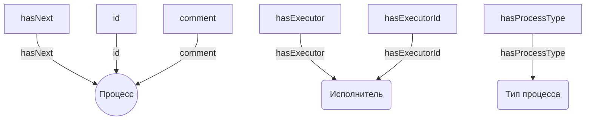

### Vad2
см. также https://github.com/bpmbpm/jsDOTsmartDesign/blob/main/ver3VAD/notation/all3.md

Сформируй минимальную онтологию VAD, включающую минимум prefix и типы объектов:
Процесс (Process), ГруппаИсполнителей (ExecutorGroup). 

Процесс имеет свойства: id, публикуемое имя (rdfs:label), тип (rdf:type ProcessType), комментарий (rdfs:comment)
Процесс имеет предикаты:
- hasNext (далее следующий Процесс)
- hasExecutor (далее ExecutorGroup)

ExecutorGroup имеет id, составной частью которого является id Процесса (к которому он  hasExecutor), публикуемое имя и включает список Исполнителей.
Исполнители имеют id и публикуемое имя.
Только Процесс имеет комментарий. 
Отображаемые фигуры: 
Процесс (cds-шеврон)
ExecutorGroup (эллипс)

Имя ExecutorGroup формируется автоматически – как сложенная строка из соответствующих Исполнителей.
Также задай правило, что у одного Процесса ровно одна ExecutorGroup.
Кроме ttl покажи онтологию таблично. 

2 Отобрази через mermaid полученную метамодель аналогично, как было бы в окне OntoGraf Protégé.
 
3 На базе полученной онтологии создай схему процесса, включающую операции: Отрезать отрезок проволоки, Согнуть проволоку по форме скрепки, Нанести покрытие. 
Исполнителей придумай сам по два на каждую операцию.  

4 Выполни шаги 1-3 с учетом отказа от ExecutorGroup, т.е. Исполнители имеют прямой предикат к Процесс. При этом в примере (без ExecutorGroup) покажи, что операция «Согнуть проволоку по форме скрепки» имеет пять исполнителей (включая схему). Объект ExecutorGroup задуман (в предыдущем варианте) для варианта более компактного размещения объектов на схеме (холсте).

## 2

## Часть 1. Минимальная онтология VAD с `ExecutorGroup` 

### Файл `vad_with_group.ttl`

```turtle
@prefix :      <http://example.org/vad-with-group#> .
@prefix rdf:   <http://www.w3.org/1999/02/22-rdf-syntax-ns#> .
@prefix rdfs:  <http://www.w3.org/2000/01/rdf-schema#> .
@prefix owl:   <http://www.w3.org/2002/07/owl#> .
@prefix xsd:   <http://www.w3.org/2001/XMLSchema#> .

# Объявление онтологии
: rdf:type owl:Ontology ;
    rdfs:comment "Минимальная онтология VAD с группировкой исполнителей" .

#######################################################################
#  КЛАССЫ (типы объектов)
#######################################################################

# Процесс – основная единица цепочки добавления ценности.
# Визуальная форма: CDS-шеврон.
:Process rdf:type owl:Class ;
    rdfs:label "Процесс" ;
    rdfs:comment "Бизнес-операция или работа, добавляющая ценность." .

# Группа исполнителей – контейнер для нескольких исполнителей одного процесса.
# Позволяет сократить число связей на диаграмме. Визуальная форма: эллипс.
:ExecutorGroup rdf:type owl:Class ;
    rdfs:label "Группа исполнителей" ;
    rdfs:comment "Узел-контейнер, объединяющий всех исполнителей процесса." .

# Исполнитель – отдельный субъект (человек, станок, роль).
:Executor rdf:type owl:Class ;
    rdfs:label "Исполнитель" ;
    rdfs:comment "Физическое лицо, механизм или программная сущность." .

# Тип процесса – классификатор (например, резка, гибка, покраска).
:ProcessType rdf:type owl:Class ;
    rdfs:label "Тип процесса" ;
    rdfs:comment "Категория процесса для группировки и анализа." .

#######################################################################
#  АТРИБУТЫ (datatype properties)
#######################################################################

# Уникальный идентификатор процесса (строка).
:id rdf:type owl:DatatypeProperty ;
    rdfs:domain :Process ;
    rdfs:range xsd:string ;
    rdfs:label "идентификатор" ;
    rdfs:comment "Технический код процесса." .

# Идентификатор процесса, к которому относится группа.
:hasProcessId rdf:type owl:DatatypeProperty ;
    rdfs:domain :ExecutorGroup ;
    rdfs:range xsd:string ;
    rdfs:label "принадлежит процессу (id)" ;
    rdfs:comment "Ссылка на процесс через его id. Используется для формирования имени группы." .

# Идентификатор исполнителя (строка).
:hasExecutorId rdf:type owl:DatatypeProperty ;
    rdfs:domain :Executor ;
    rdfs:range xsd:string ;
    rdfs:label "идентификатор исполнителя" .

# Комментарий – только для процесса (человекочитаемое пояснение).
:comment rdf:type owl:DatatypeProperty ;
    rdfs:domain :Process ;
    rdfs:range xsd:string ;
    rdfs:subPropertyOf rdfs:comment ;
    rdfs:label "комментарий" ;
    rdfs:comment "Пояснение к процессу (что делает, зачем)." .

#######################################################################
#  СВЯЗИ (object properties)
#######################################################################

# Указатель на следующий процесс (упорядочивает цепочку).
:hasNext rdf:type owl:ObjectProperty ;
    rdfs:domain :Process ;
    rdfs:range :Process ;
    rdfs:label "следует за" ;
    rdfs:comment "Определяет последовательность выполнения процессов." .

# Связь процесса с его группой исполнителей.
:hasExecutor rdf:type owl:ObjectProperty ;
    rdfs:domain :Process ;
    rdfs:range :ExecutorGroup ;
    rdfs:label "выполняется группой" .

# Связь группы с входящими в неё исполнителями.
:hasExecutorMember rdf:type owl:ObjectProperty ;
    rdfs:domain :ExecutorGroup ;
    rdfs:range :Executor ;
    rdfs:label "включает исполнителя" .

# Тип процесса (классификация).
:hasProcessType rdf:type owl:ObjectProperty ;
    rdfs:domain :Process ;
    rdfs:range :ProcessType ;
    rdfs:label "имеет тип" .

#######################################################################
#  ОГРАНИЧЕНИЯ (аксиомы)
#######################################################################

# У одного процесса – ровно одна группа исполнителей.
:Process rdfs:subClassOf [
        rdf:type owl:Restriction ;
        owl:onProperty :hasExecutor ;
        owl:cardinality 1
    ] .
```

### Табличное представление онтологии (с группой)

| Элемент | Тип | Домен | Диапазон | Кардинальность / особое |
|---------|-----|-------|----------|------------------------|
| **Классы** |
| `:Process` | Class | – | – | шеврон |
| `:ExecutorGroup` | Class | – | – | эллипс |
| `:Executor` | Class | – | – | – |
| `:ProcessType` | Class | – | – | – |
| **Datatype-свойства** |
| `:id` | DatatypeProperty | `:Process` | `xsd:string` | – |
| `:hasProcessId` | DatatypeProperty | `:ExecutorGroup` | `xsd:string` | – |
| `:hasExecutorId` | DatatypeProperty | `:Executor` | `xsd:string` | – |
| `:comment` | DatatypeProperty | `:Process` | `xsd:string` | подкласс `rdfs:comment` |
| **Object-свойства** |
| `:hasNext` | ObjectProperty | `:Process` | `:Process` | – |
| `:hasExecutor` | ObjectProperty | `:Process` | `:ExecutorGroup` | **cardinality = 1** |
| `:hasExecutorMember` | ObjectProperty | `:ExecutorGroup` | `:Executor` | – |
| `:hasProcessType` | ObjectProperty | `:Process` | `:ProcessType` | – |

**Правило формирования имени группы:**  
Имя группы вычисляется как конкатенация имён всех входящих исполнителей через запятую (например, «Иван, Станок_отрезной»). Это не записывается в RDF, а является соглашением для визуализатора.

---

## Часть 2. Мета-модель в формате Mermaid (как в Protege OntoGraf)

```mermaid
graph TD
    classDef process fill:#cds,stroke:#333,stroke-width:2px,shape:chevron
    classDef group fill:#e6e6fa,stroke:#333,stroke-width:2px,shape=ellipse
    classDef executor fill:#bbffbb,stroke:#333
    classDef ptype fill:#ffccff,stroke:#333

    Process(("Процесс")) :::process
    ExecutorGroup(("Группа исполнителей")) :::group
    Executor(Исполнитель) :::executor
    ProcessType(Тип процесса) :::ptype

    hasNext -->|hasNext| Process
    hasExecutor -->|hasExecutor 1| ExecutorGroup
    hasExecutorMember -->|hasExecutorMember| Executor
    hasProcessType -->|hasProcessType| ProcessType

    id -->|id| Process
    hasProcessId -->|hasProcessId| ExecutorGroup
    hasExecutorId -->|hasExecutorId| Executor
    comment -->|comment| Process
```

**Пояснение к диаграмме:**  
- Шеврон «Процесс» связан ровно с одним эллипсом «Группа исполнителей».  
- Группа содержит ноль или более исполнителей.  
- У процесса есть идентификатор, комментарий, тип и указатель на следующий процесс.

---

## Часть 3. Пример схемы процесса изготовления скрепки (с использованием `ExecutorGroup`)

**Операции (процессы):**
1. Отрезать отрезок проволоки  
2. Согнуть проволоку по форме скрепки  
3. Нанести покрытие  

**Исполнители по операциям (по два на операцию):**

| Процесс | Группа | Исполнители (2) |
|---------|--------|----------------|
| Отрезать отрезок проволоки | Group1 | Иван, Станок_отрезной |
| Согнуть проволоку по форме скрепки | Group2 | Пётр, Гибка_автомат |
| Нанести покрытие | Group3 | Мария, Покрасочная_камера |

### Фрагмент Turtle с индивидами (читаемый)

```turtle
#######################################################################
#  ТИПЫ ПРОЦЕССОВ
#######################################################################
:Cutting rdf:type :ProcessType ;
    rdfs:label "Резка" .
:Bending rdf:type :ProcessType ;
    rdfs:label "Гибка" .
:Coating rdf:type :ProcessType ;
    rdfs:label "Покрытие" .

#######################################################################
#  ПРОЦЕССЫ
#######################################################################
:CutWire rdf:type :Process ;
    :id "P001" ;
    rdfs:label "Отрезать отрезок проволоки" ;
    :comment "Резка проволоки на заданную длину 8 см" ;
    :hasProcessType :Cutting ;
    :hasNext :BendWire .

:BendWire rdf:type :Process ;
    :id "P002" ;
    rdfs:label "Согнуть проволоку по форме скрепки" ;
    :comment "Формовка классической канцелярской скрепки" ;
    :hasProcessType :Bending ;
    :hasNext :CoatWire .

:CoatWire rdf:type :Process ;
    :id "P003" ;
    rdfs:label "Нанести покрытие" ;
    :comment "Нанесение полимерного покрытия (цвет: синий)" ;
    :hasProcessType :Coating .

#######################################################################
#  ИСПОЛНИТЕЛИ
#######################################################################
:Executor1 rdf:type :Executor ;
    :hasExecutorId "E001" ;
    rdfs:label "Иван" .
:Executor2 rdf:type :Executor ;
    :hasExecutorId "E002" ;
    rdfs:label "Станок_отрезной" .
:Executor3 rdf:type :Executor ;
    :hasExecutorId "E003" ;
    rdfs:label "Пётр" .
:Executor4 rdf:type :Executor ;
    :hasExecutorId "E004" ;
    rdfs:label "Гибка_автомат" .
:Executor5 rdf:type :Executor ;
    :hasExecutorId "E005" ;
    rdfs:label "Мария" .
:Executor6 rdf:type :Executor ;
    :hasExecutorId "E006" ;
    rdfs:label "Покрасочная_камера" .

#######################################################################
#  ГРУППЫ ИСПОЛНИТЕЛЕЙ (id группы = id процесса)
#######################################################################
:Group1 rdf:type :ExecutorGroup ;
    :hasProcessId "P001" ;
    :hasExecutorMember :Executor1, :Executor2 .
:Group2 rdf:type :ExecutorGroup ;
    :hasProcessId "P002" ;
    :hasExecutorMember :Executor3, :Executor4 .
:Group3 rdf:type :ExecutorGroup ;
    :hasProcessId "P003" ;
    :hasExecutorMember :Executor5, :Executor6 .

#######################################################################
#  ПРИВЯЗКА ГРУПП К ПРОЦЕССАМ
#######################################################################
:CutWire :hasExecutor :Group1 .
:BendWire :hasExecutor :Group2 .
:CoatWire :hasExecutor :Group3 .
```

**Автоматическое имя группы (соглашение для визуализатора):**  
- `Group1` → «Иван, Станок_отрезной»  
- `Group2` → «Пётр, Гибка_автомат»  
- `Group3` → «Мария, Покрасочная камера»

---

## Часть 4. Отказ от `ExecutorGroup` – прямая связь Процесс → Исполнитель

### Минимальная онтология без группы (`vad_without_group.ttl`)

```turtle
@prefix :      <http://example.org/vad-without-group#> .
@prefix rdf:   <http://www.w3.org/1999/02/22-rdf-syntax-ns#> .
@prefix rdfs:  <http://www.w3.org/2000/01/rdf-schema#> .
@prefix owl:   <http://www.w3.org/2002/07/owl#> .
@prefix xsd:   <http://www.w3.org/2001/XMLSchema#> .

: rdf:type owl:Ontology .

# Классы
:Process rdf:type owl:Class ;
    rdfs:label "Процесс" .
:Executor rdf:type owl:Class ;
    rdfs:label "Исполнитель" .
:ProcessType rdf:type owl:Class ;
    rdfs:label "Тип процесса" .

# Атрибуты
:id rdf:type owl:DatatypeProperty ;
    rdfs:domain :Process ;
    rdfs:range xsd:string .
:hasExecutorId rdf:type owl:DatatypeProperty ;
    rdfs:domain :Executor ;
    rdfs:range xsd:string .
:comment rdf:type owl:DatatypeProperty ;
    rdfs:domain :Process ;
    rdfs:range xsd:string ;
    rdfs:subPropertyOf rdfs:comment .

# Связи
:hasNext rdf:type owl:ObjectProperty ;
    rdfs:domain :Process ;
    rdfs:range :Process .
:hasExecutor rdf:type owl:ObjectProperty ;
    rdfs:domain :Process ;
    rdfs:range :Executor .   # прямая связь, без группы
:hasProcessType rdf:type owl:ObjectProperty ;
    rdfs:domain :Process ;
    rdfs:range :ProcessType .
```

### Mermaid-диаграмма метамодели (без группы)



### Пример схемы с пятью исполнителями для операции «Согнуть»

**Процессы:**
1. Отрезать отрезок проволоки (2 исполнителя)  
2. **Согнуть проволоку по форме скрепки (5 исполнителей)**  
3. Нанести покрытие (2 исполнителя)

**Исполнители для операции «Согнуть»:**  
Пётр, Гибка_автомат, Контроллер, **Схема** (электронный модуль управления), Смазчик.

### Turtle-индивиды (фрагмент)

```turtle
# Типы процессов
:Cutting rdf:type :ProcessType ; rdfs:label "Резка" .
:Bending rdf:type :ProcessType ; rdfs:label "Гибка" .
:Coating rdf:type :ProcessType ; rdfs:label "Покрытие" .

# Процессы
:CutWire rdf:type :Process ;
    :id "P001" ;
    rdfs:label "Отрезать отрезок проволоки" ;
    :comment "Отрезать проволоку длиной 8 см" ;
    :hasProcessType :Cutting ;
    :hasNext :BendWire ;
    :hasExecutor :Executor1, :Executor2 .   # 2 исполнителя

:BendWire rdf:type :Process ;
    :id "P002" ;
    rdfs:label "Согнуть проволоку по форме скрепки" ;
    :comment "Сформировать скрепку из проволоки" ;
    :hasProcessType :Bending ;
    :hasNext :CoatWire ;
    :hasExecutor :Executor3, :Executor4, :Executor5, :Executor6, :Executor7 .   # 5 исполнителей

:CoatWire rdf:type :Process ;
    :id "P003" ;
    rdfs:label "Нанести покрытие" ;
    :comment "Нанести цветное полимерное покрытие" ;
    :hasProcessType :Coating ;
    :hasExecutor :Executor8, :Executor9 .

# Исполнители (id и имя)
:Executor1 rdf:type :Executor ; :hasExecutorId "E001" ; rdfs:label "Иван" .
:Executor2 rdf:type :Executor ; :hasExecutorId "E002" ; rdfs:label "Станок_отрезной" .
:Executor3 rdf:type :Executor ; :hasExecutorId "E003" ; rdfs:label "Пётр" .
:Executor4 rdf:type :Executor ; :hasExecutorId "E004" ; rdfs:label "Гибка_автомат" .
:Executor5 rdf:type :Executor ; :hasExecutorId "E005" ; rdfs:label "Контроллер" .
:Executor6 rdf:type :Executor ; :hasExecutorId "E006" ; rdfs:label "Схема" .
:Executor7 rdf:type :Executor ; :hasExecutorId "E007" ; rdfs:label "Смазчик" .
:Executor8 rdf:type :Executor ; :hasExecutorId "E008" ; rdfs:label "Мария" .
:Executor9 rdf:type :Executor ; :hasExecutorId "E009" ; rdfs:label "Покрасочная_камера" .
```

### Зачем нужна `ExecutorGroup`? (обоснование)

- **Компактность диаграммы.** При прямых связях каждый исполнитель соединяется с процессом отдельной стрелкой. При 5 исполнителях процесс обрастает 5 линиями, что визуально шумно.  
- **Группа** сворачивает всех исполнителей в один узел-эллипс. Остаётся **одна стрелка** от процесса к группе.  
- Внутреннее устройство группы (список исполнителей) можно показать по требованию (например, всплывающей подсказкой).  
- Это особенно ценно для **крупных моделей**, где у каждого процесса может быть десятки исполнителей (цеха, роли, оборудование).  

Таким образом, `ExecutorGroup` – это **визуальный компромисс** между полнотой информации и читаемостью схемы.
