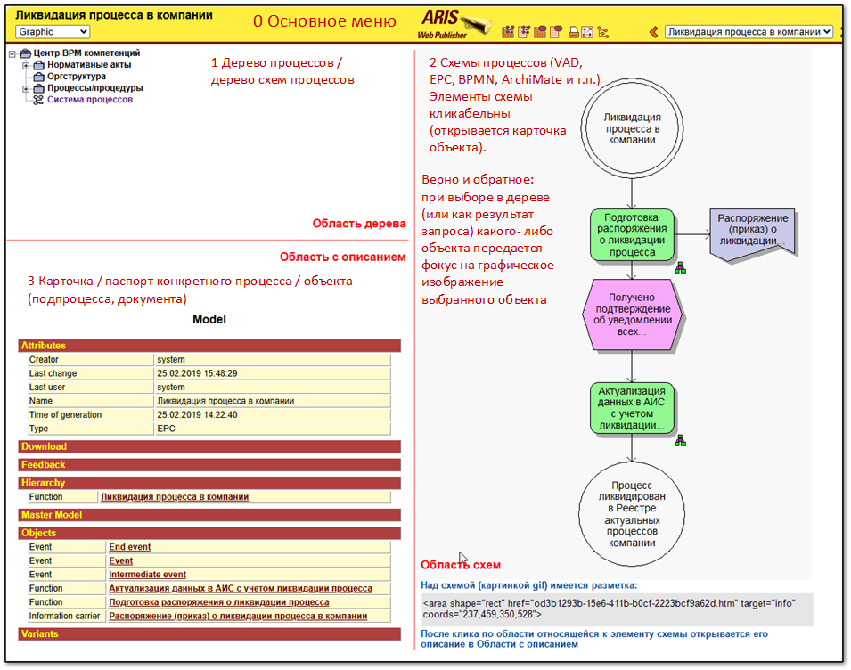

# Описание внешнего вида графического интерфейса
Предполагается главный экран приложения разделить на пять областей. 

1. Для вывода кадра со схемой (для начала .drawio). 
2. Для отобращения Treeview с деревом схем (дерево моделей). 
3. Окно для ввода / вывода sparql. 
4. Свойства модели / объекта (карточнка \ паспорт модели \ объекта). 
5. Дерево объектов (можно совместить с деревом схем). 

Плюс классическое меню.

За прототип берется: publisher, например, простой статический сайт типа первого [ARIS Web Publisher](http://www.bpm.processoffice.ru/):  

Для вывода кадра со схемой процесса потребуетмя viewer. В идеале поддержка одновременно нескольких графических форматов. Для начала считается, что 1 файл = 1 схема процесса на одном листе (схема на одном листе, т.е. без вкладок).

Некоторые ссылки к GUI:
- [цель на стартовой](https://github.com/bpmbpm/SemanticBPM?tab=readme-ov-file#mvp)
- [MVP 0.1](https://github.com/bpmbpm/SemanticBPM/wiki/MVP-0.1)

На будущее: Варианты реализации двухстороннего обмена (real-time) наподобие [ARIS Smart Design](https://habr.com/ru/articles/810851/)
