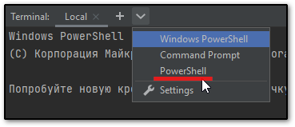
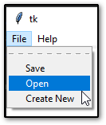

# Установка и запуск gse
В моем случае процесс установки несколько отличался от [описания в GitHub графового семантического движка](https://github.com/smer44/graph-semantical-engine?tab=readme-ov-file#%D0%B3%D1%80%D0%B0%D1%84%D0%BE%D0%B2%D1%8B%D0%B9-%D1%81%D0%B5%D0%BC%D0%B0%D0%BD%D1%82%D0%B8%D1%87%D0%B5%D1%81%D0%BA%D0%B8%D0%B9-%D0%B4%D0%B2%D0%B8%D0%B6%D0%BE%D0%BA).
1. Скачайте архив [Download ZIP](https://github.com/smer44/graph-semantical-engine/archive/refs/heads/main.zip) в произвольную папку `<путь>` на вашем компьютере
2. Распакуйте в архив в данной папке
3. Запустите среду разработки (**IDE**), например [pyCharm](https://www.jetbrains.com/pycharm/)
4. Откройте терминал щелкнув по кнопке в низу окна **IDE**, или используйте комбинацию клавиш `Alt`+`F12`
> [!note]  
>    На моем компьютере административно заблокирована командная строка **cmd.exe**, а также установлено две версии **PowerShell**.    
>    По умолчанию, терминал пытается запуститься в устаревшей версии, процесс длится 10-15 минут и завершается неудачно.    
>    Для того, чтобы запустить новую версию **PowerShell**, нажмите на кнопку `˅` (крайнюю справа).
>        
>    Выберите пункт меню **PowerShell**
5. Далее перейдите в папку с репозиторием, введя команду `cd <путь>\graph-semantical-engine-main\graph-semantical-engine-main`
6. Далее введите команду `python -m gse.gui`
# Работа с графическим семантическим движком
После выполнения пунктов 3-6, открывается окно **tk**.    
    
a. В появившемся окне **tk**, выберите меню **File** -> **Open**    
b. В окне проводника выберите образцы схем в папке `<путь>\graph-semantical-engine-main\graph-semantical-engine-main\gse\examples`    
c. Горячие клавиши для основных манипуляций с элементами схемы можно найти в меню **Help** -> **Keymap**    
       
