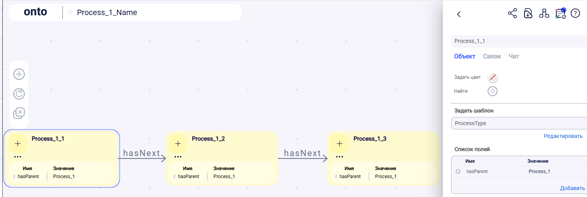

## info
- https://habr.com/ru/users/ArtemVarkulevich/articles/

## 1 ontonet.ru
Осмотр семантических возможностей "Семантической доски" ontonet.ru
### Проверка выгрузки схемы в owl
Операции:
1. Зайти на ontonet.ru: адрес почты + пароль
2. Справа кнопка «+» «Создать пространство»
3. В пространстве создал схему с названием «Process_1_Name» по RDF – файлу «Process_1.ttl»: 
- Создать стикер. Создал три узла: Process_1_1, Process_1_2, Process_1_3. Соединил их линиями (2 шт.). Линиям задал Тип связи (не имя, а Тип) "hasNext".
- Создал шаблон ProcessType и задал его для всех трех узлов.
- Каждому узлу задал свойство hasParent и значение Process_1 (типа он для них родительский).
- Получил схему:
  
4. Выгрузка и обработка: 
- Ткнул в жирный «ONTO», далее в шестеренку: «Конфигурация пространства» \ Экспорт пространства.
- Выгруженный файл с непонятным названием сохранил с именем onto1.owl.
- Открыл файлик, скопировал содержание и вставил в окно easyrdf.org/converter и далее выгрузил turtle в Process_1_onto.ttl (см. папку)

Process_1_onto.ttl: значимых – только три последних блока. Пытаемся осмыслить из них информацию на примере блока:
- ns0:Process_1_2
  - a owl:NamedIndividual, ns0:ProcessType ;
  - ns0:hasNext_NS9b9F ns0:Process_1_3 ;
  - ns0:hasParent_zvHrQZ "Process_1" ;

Что понятно: Шаблонизация задается как отношение: ns0:Process_1_2 a ns0:ProcessType .

Что непонятно:
- Почему три последних блока отличаются префиксом? Зачем все предыдущие блоки?
- Почему такое имя отношения (зчем добавлять уникальность к имени?): ns0:hasNext_NS9b9F  и ns0:hasParent_zvHrQZ

Другие вопросы:
- Как выгрузить не все пространство, а только одну схему (выбранную)? Ответ: "пока никак".
- Как максимально приблизить Process_1_onto.ttl к исходному Process_1.ttl?

Ссылки:
- [Схема в onto](https://app.ontonet.ru/ru/home/operation/E?uuid=e3b69106-4d20-4e9d-9cd6-9027378164c0&realm=d4a500e1-133b-4062-8e92-6c498d431db6)
- [RDF Grapher](https://www.ldf.fi/service/rdf-grapher?rdf=%40prefix+owl%3A+%3Chttp%3A%2F%2Fwww.w3.org%2F2002%2F07%2Fowl%23%3E+.%0D%0A%40prefix+rdfs%3A+%3Chttp%3A%2F%2Fwww.w3.org%2F2000%2F01%2Frdf-schema%23%3E+.%0D%0A%40prefix+ns0%3A+%3Chttp%3A%2F%2Fwww.ontonet.ru%2Fontology%2Frealm%2Fd4a500e1-133b-4062-8e92-6c498d431db6%23%3E+.%0D%0A%0D%0A%3Chttp%3A%2F%2Fwww.ontonet.ru%2Fontology%2Frealm%2Fd4a500e1-133b-4062-8e92-6c498d431db6%23%3E+a+owl%3AOntology+.%0D%0A%3Chttp%3A%2F%2Fwww.ontonet.ru%2Fontology%2Frealm%2Fd4a500e1-133b-4062-8e92-6c498d431db6%23incomingRole%3E%0D%0A++a+owl%3AAnnotationProperty+%3B%0D%0A++rdfs%3Acomment+%22Incoming+role%22+.%0D%0A%0D%0A%3Chttp%3A%2F%2Fwww.ontonet.ru%2Fontology%2Frealm%2Fd4a500e1-133b-4062-8e92-6c498d431db6%23outgoingRole%3E%0D%0A++a+owl%3AAnnotationProperty+%3B%0D%0A++rdfs%3Acomment+%22Outgoing+role%22+.%0D%0A%0D%0A%3Chttp%3A%2F%2Fwww.ontonet.ru%2Fontology%2Frealm%2Fd4a500e1-133b-4062-8e92-6c498d431db6%23hasNext%3E%0D%0A++a+owl%3AObjectProperty+%3B%0D%0A++rdfs%3Alabel+%22hasNext%22+.%0D%0A%0D%0A%3Chttp%3A%2F%2Fwww.ontonet.ru%2Fontology%2Frealm%2Fd4a500e1-133b-4062-8e92-6c498d431db6%23hasNext_NS9b9F%3E%0D%0A++a+owl%3AObjectProperty+%3B%0D%0A++rdfs%3Alabel+%22hasNext%22+.%0D%0A%0D%0A%3Chttp%3A%2F%2Fwww.ontonet.ru%2Fontology%2Frealm%2Fd4a500e1-133b-4062-8e92-6c498d431db6%23hasParent%3E%0D%0A++a+owl%3ADatatypeProperty+%3B%0D%0A++rdfs%3Acomment+%22%22+%3B%0D%0A++rdfs%3Alabel+%22hasParent%22+.%0D%0A%0D%0A%3Chttp%3A%2F%2Fwww.ontonet.ru%2Fontology%2Frealm%2Fd4a500e1-133b-4062-8e92-6c498d431db6%23hasParent_IrIH2B%3E%0D%0A++a+owl%3ADatatypeProperty+%3B%0D%0A++rdfs%3Acomment+%22%22+%3B%0D%0A++rdfs%3Alabel+%22hasParent%22+.%0D%0A%0D%0A%3Chttp%3A%2F%2Fwww.ontonet.ru%2Fontology%2Frealm%2Fd4a500e1-133b-4062-8e92-6c498d431db6%23hasParent_zvHrQZ%3E%0D%0A++a+owl%3ADatatypeProperty+%3B%0D%0A++rdfs%3Acomment+%22%22+%3B%0D%0A++rdfs%3Alabel+%22hasParent%22+.%0D%0A%0D%0A%3Chttp%3A%2F%2Fwww.ontonet.ru%2Fontology%2Frealm%2Fd4a500e1-133b-4062-8e92-6c498d431db6%23ProcessType%3E%0D%0A++a+owl%3AClass+%3B%0D%0A++rdfs%3Acomment+%22%22+%3B%0D%0A++rdfs%3Alabel+%22ProcessType%22+.%0D%0A%0D%0A%3Chttp%3A%2F%2Fwww.ontonet.ru%2Fontology%2Frealm%2Fd4a500e1-133b-4062-8e92-6c498d431db6%23Process_1_1%3E%0D%0A++a+owl%3ANamedIndividual%2C+%3Chttp%3A%2F%2Fwww.ontonet.ru%2Fontology%2Frealm%2Fd4a500e1-133b-4062-8e92-6c498d431db6%23ProcessType%3E+%3B%0D%0A++ns0%3AhasNext+ns0%3AProcess_1_2+%3B%0D%0A++ns0%3AhasParent+%22Process_1%22+%3B%0D%0A++rdfs%3Acomment+%22%22%22%0D%0A%22%22%22+%3B%0D%0A++rdfs%3Alabel+%22Process_1_1%22+.%0D%0A%0D%0Ans0%3AProcess_1_2%0D%0A++a+owl%3ANamedIndividual%2C+ns0%3AProcessType+%3B%0D%0A++ns0%3AhasNext_NS9b9F+ns0%3AProcess_1_3+%3B%0D%0A++ns0%3AhasParent_zvHrQZ+%22Process_1%22+%3B%0D%0A++rdfs%3Alabel+%22Process_1_2%22+.%0D%0A%0D%0Ans0%3AProcess_1_3%0D%0A++a+owl%3ANamedIndividual%2C+ns0%3AProcessType+%3B%0D%0A++ns0%3AhasParent_IrIH2B+%22Process_1%22+%3B%0D%0A++rdfs%3Alabel+%22Process_1_3%22+.%0D%0A%0D%0A&from=ttl&to=png)

В ONTO можно загрузить Пространство (комплект схем) из файла owl: Справа "+" (типа создвать новое пространство) и появится кнопка Загрузить из owl. Но к этому приступить видимо следует тогда, когда выгрузка в owl нормально заработает.

### Dop
- [onto & EA](https://dzen.ru/a/Za56Jh_8MQZBejTf)
