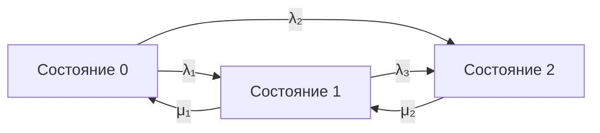

## 1

GitHub **не поддерживает** `$$ ... $$` и `\[ ... \]` для рендера LaTeX‑формул в `.md`‑файлах. Поэтому твоя формула не отображается.

## Что реально работает на GitHub

На GitHub в README.md работает только синтаксис **одиночных долларов** `$...$` (inline) или **двойных долларов** `$$...$$` **без дополнительных символов** вроде `\[` / `\]` и без `\boxed`. При этом `\boxed` не поддерживается вовсе.

---

## Вариант 1: максимально простая формула (гарантированно отобразится)

Скопируй это в свой README.md:

```markdown
Коэффициент готовности:

$$
K_{\mathrm{г,ст}} = \frac{\mu_{01}(\lambda_{21}+\mu_{12})}{\lambda_{10}\lambda_{21} + \mu_{01}\lambda_{21} + \mu_{01}\mu_{12}}
$$
```

Это будет отображено как отдельная строка с формулой.

---

## Вариант 2: если хочешь, чтобы формула была в тексте (inline)

```markdown
Коэффициент готовности $K_{\mathrm{г,ст}} = \frac{\mu_{01}(\lambda_{21}+\mu_{12})}{\lambda_{10}\lambda_{21} + \mu_{01}\lambda_{21} + \mu_{01}\mu_{12}}$ показывает стационарную вероятность работоспособного состояния.
```

---

## Почему твой вариант не работает

- `\[` и `\]` — это синтаксис LaTeX для «display math», GitHub его не парсит.
- `$$` уже означает display-режим, поэтому `$$ \[ ... \] $$` — это «двойное вложение», которое ломает парсер.
- `\boxed` — команда из пакета `amsmath`, GitHub её не поддерживает.

---

## Как сделать «рамку» (аналог \boxed) на GitHub

GitHub не умеет рисовать рамки вокруг формул. Есть два рабочих варианта:

### Вариант А: просто выделить формулу отдельной строкой (как в Варианте 1)
Это самый чистый и надёжный способ.

### Вариант Б: рамка через Markdown (не математическая, но визуально заметная)

```markdown
> **Коэффициент готовности:**
> $$
> K_{\mathrm{г,ст}} = \frac{\mu_{01}(\lambda_{21}+\mu_{12})}{\lambda_{10}\lambda_{21} + \mu_{01}\lambda_{21} + \mu_{01}\mu_{12}}
> $$
```

Блок `> ` даёт серую полосу слева — это и будет «рамкой» в интерфейсе GitHub.

---

## Если очень нужна именно рамка (и ты делаешь страницу на GitHub Pages)

Учитывая твой опыт с GitHub Pages и JS, можно сделать так:

1. В HTML-файле подключи MathJax:
   ```html
   <script type="text/javascript" id="MathJax-script" async
     src="https://cdn.jsdelivr.net/npm/mathjax@3/es5/tex-mml-chtml.js">
   </script>
   ```
2. Тогда можно использовать `\boxed`:
   ```html
   $$
   \boxed{K_{\mathrm{г,ст}} = \frac{\mu_{01}(\lambda_{21}+\mu_{12})}{\lambda_{10}\lambda_{21} + \mu_{01}\lambda_{21} + \mu_{01}\mu_{12}}}
   $$
   ```
   Но это **только для GitHub Pages (HTML)**, а не для `.md` в репозитории.

---

## Важное напоминание про кэш

После правки README на GitHub иногда нужно подождать 2–5 минут, пока обновится рендер. Или обновить страницу с очисткой кэша (Ctrl+Shift+R).

Если скажешь, где именно ты хочешь эту формулу (README.md или HTML‑страница на GitHub Pages), я дам готовый фрагмент именно под этот случай.


## 2

Вот полностью очищенный от неподдерживаемых команд вариант — только чистый Markdown, который гарантированно рендерится на GitHub. Никаких `\boxed`, `\[` и прочего. Формулу можно оставить как есть (GitHub корректно обрабатывает `$$...$$` без лишних символов).

---

# Проект: Марковская модель и расчёт коэффициента готовности

Проект реализует модель системы на базе непрерывной марковской цепи (CTMC) и расчёт стационарного коэффициента готовности.

## Что реализовано

- Граф состояний и переходов (марковская цепь)
- Матрица интенсивностей переходов $Q$
- Расчёт стационарного распределения вероятностей $\pi$
- Вычисление коэффициента готовности как суммы вероятностей работоспособных состояний

## Ключевая формула

Коэффициент готовности системы ($K_{\mathrm{г,ст}}$) определяется как сумма стационарных вероятностей всех работоспособных состояний. Для рассматриваемой модели:

$$
K_{\mathrm{г,ст}} = \frac{\mu_{01}(\lambda_{21}+\mu_{12})}{\lambda_{10}\lambda_{21} + \mu_{01}\lambda_{21} + \mu_{01}\mu_{12}}
$$

> **Пояснение обозначений:**  
> - $\lambda_{ij}$ — интенсивность перехода из состояния $i$ в состояние $j$  
> - $\mu_{ij}$ — интенсивность обратного перехода (восстановления) из состояния $j$ в $i$  
> - Знаменатель отражает баланс интенсивностей, определяющий стационарное поведение системы.

---

## Как это считать программно

Учитывая твой опыт работы с браузерным JS и GitHub Pages, расчёт удобно реализовать на JavaScript или в Python. Ниже — минимальный пример на Python (можно положить в отдельный файл и использовать как референс):

```python
import numpy as np

# Матрица интенсивностей Q (генератор марковского процесса)
# Строки соответствуют состояниям 0, 1, 2
Q = np.array([
    [-2.0,  2.0,  0.0],   # из состояния 0
    [ 0.5, -1.5,  1.0],   # из состояния 1
    [ 0.0,  0.2, -0.2]    # из состояния 2
])

# Решение системы: pi @ Q = 0, sum(pi) = 1
A = np.vstack([Q.T, np.ones(Q.shape[0])])
b = np.zeros(Q.shape[0] + 1)
b[-1] = 1.0
pi, _, _, _ = np.linalg.lstsq(A, b, rcond=None)

# Допустим, состояния 0 и 1 — работоспособные, 2 — отказ
K_ready = pi[0] + pi[1]

print("Стационарные вероятности:", pi)
print("Коэффициент готовности:", K_ready)
```

---

## Визуализация

Для визуализации графа марковской цепи используется Mermaid. Пример диаграммы (без конструкций, которые могут не отрисоваться на GitHub):



> Если ты хочешь интерактивную визуализацию (подсветка текущего состояния, анимация переходов) — можно использовать тот же подход, что и в твоём SVG Viewer: подключить Mermaid через CDN на GitHub Pages и добавить JS‑логику поверх отрендеренного SVG.

---

## Важные замечания по отображению формул на GitHub

- GitHub поддерживает только `$...$` (inline) и `$$...$$` (отдельная строка).
- Не используй `\[` / `\]` внутри `$$` — это ломает рендер.
- Команда `\boxed` не поддерживается в README.md. Вместо рамки используется блок `> ` (цитата) — он даёт серую полосу слева и хорошо выделяет формулу в интерфейсе GitHub.
- После правки README иногда нужно подождать 2–5 минут либо обновить страницу с очисткой кэша (Ctrl+Shift+R).

---

## Структура проекта

- `index.html` — точка входа, интерфейс
- `app.js` — логика симуляции марковской цепи, расчёт вероятностей
- `config.js` — параметры модели (интенсивности переходов, работоспособные состояния)
- `diagrams/` — исходники диаграмм (Mermaid, SVG)
- `assets/` — статические ресурсы

## Установка и запуск

1. Клонируй репозиторий:
   ```bash
   git clone <URL-репозитория>
   ```
2. Открой `index.html` в браузере (локально) или используй GitHub Pages для публикации.
3. Параметры модели можно менять в `config.js`.

## Лицензия

Проект распространяется под лицензией MIT.


## 4

Такой режим можно назвать:

**«Формат GitHub Markdown с внешними формулами»**

Или короче:

**«GitHub-совместимый технический Markdown»**

Под этим режимом следует понимать:

- использовать обычный Markdown, поддерживаемый GitHub;
- использовать Mermaid-блоки в формате ` ```mermaid `;
- использовать таблицы Markdown;
- использовать блоки кода с указанием языка, например ` ```csv `;
- формулы записывать обычным текстом, без обрамления математическими delimiters;
- не использовать `\boxed{...}`;
- не использовать `\begin{...}`, `\end{...}` и другие LaTeX-конструкции;
- не использовать `\[` и `\]`;
- не использовать `$$`;
- не использовать `\(...\)`;
- не использовать LaTeX-команды форматирования, такие как `\text{}`, `\mathrm{}`, `\left`, `\right`, `\frac`, `\sum` и аналогичные;
- математические выражения оставлять в линейной текстовой форме;
- окончательное оформление формул в `$$ ... $$` пользователь добавляет самостоятельно.

Например, вместо:

```text
\[
K_{\mathrm{г,ст}} =
\frac{\mu_{01}(\lambda_{21}+\mu_{12})}
{\lambda_{10}\lambda_{21}+\mu_{01}\lambda_{21}+\mu_{01}\mu_{12}}
\]
```

использовать:

```text
Кг,ст = μ₀₁(λ₂₁ + μ₁₂) / (λ₁₀λ₂₁ + μ₀₁λ₂₁ + μ₀₁μ₁₂)
```

Когда понадобится такой формат, можно написать:

> **Используй режим «GitHub-совместимый технический Markdown с внешними формулами».**

Или кратко:

> **Оформи в режиме GitHub Markdown, формулы без LaTeX-обертки.**

Я буду понимать это как требование не добавлять `\boxed`, `\[...\]`, `$$...$$`, `\(...\)` и другие LaTeX-конструкции, а формулы выводить обычным линейным текстом.


## 5

Да, уточняем режим следующим образом.

## GitHub-совместимый Markdown с поддерживаемым LaTeX

В этом режиме разрешается использовать математические конструкции, которые поддерживаются GitHub:

- `$ ... $` — встроенная формула;
- `$$ ... $$` — отдельная формула;
- `\( ... \)` — встроенная формула;
- `\[ ... \]` — отдельная формула;
- стандартные LaTeX-команды внутри этих конструкций, если они корректно отображаются в GitHub, например:
  - `\frac`;
  - `\sum`;
  - `\prod`;
  - `\lambda`;
  - `\mu`;
  - нижние и верхние индексы;
  - `\mathrm`;
  - `\text`;
  - `\begin{aligned}`;
  - `\begin{cases}`.

Не следует использовать команды и конструкции, которые GitHub обычно не отображает или отображает некорректно, например:

- `\boxed`;
- `\fbox`;
- `\framebox`;
- `\color`;
- `\require`;
- `\newcommand`;
- пользовательские LaTeX-макросы;
- специализированные пакеты LaTeX;
- команды, зависящие от внешних расширений или подключаемых библиотек.

Главное правило:

> Использовать GitHub-supported LaTeX, но не использовать `\boxed` и другие неподдерживаемые GitHub-конструкции, даже если они заключены в `$...$`, `$$...$$`, `\(...\)` или `\[...\]`.

Например, допустимая формула:

```markdown
$$
K_{\mathrm{г,ст}} =
\frac{\mu_{01}(\lambda_{21}+\mu_{12})}
{\lambda_{10}\lambda_{21}+\mu_{01}\lambda_{21}+\mu_{01}\mu_{12}}
$$
```

Недопустимая формула:

```markdown
$$
\boxed{
K_{\mathrm{г,ст}} =
\frac{\mu_{01}(\lambda_{21}+\mu_{12})}
{\lambda_{10}\lambda_{21}+\mu_{01}\lambda_{21}+\mu_{01}\mu_{12}}
}
$$
```

Также допустимы матричные и выровненные выражения:

```markdown
$$
Q =
\begin{bmatrix}
-\mu_{01} & \mu_{01} & 0 \\
\lambda_{10} & -(\lambda_{10}+\mu_{12}) & \mu_{12} \\
0 & \lambda_{21} & -\lambda_{21}
\end{bmatrix}
$$
```

```markdown
$$
\begin{aligned}
\frac{dP_0(t)}{dt} &=
-\mu_{01}P_0(t) + \lambda_{10}P_1(t), \\
\frac{dP_1(t)}{dt} &=
\mu_{01}P_0(t)
-(\lambda_{10}+\mu_{12})P_1(t)
+\lambda_{21}P_2(t), \\
\frac{dP_2(t)}{dt} &=
\mu_{12}P_1(t)-\lambda_{21}P_2(t).
\end{aligned}
$$
```

Поэтому наиболее точное название режима:

> **GitHub-совместимый технический Markdown с поддерживаемыми LaTeX-формулами без `\boxed` и других неподдерживаемых конструкций.**

Краткая команда для будущих запросов:

> **Оформи в GitHub Markdown с поддерживаемым LaTeX. Не используй `\boxed` и другие команды, которые GitHub не поддерживает, даже внутри математических delimiters.**
