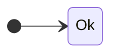
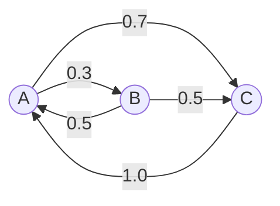
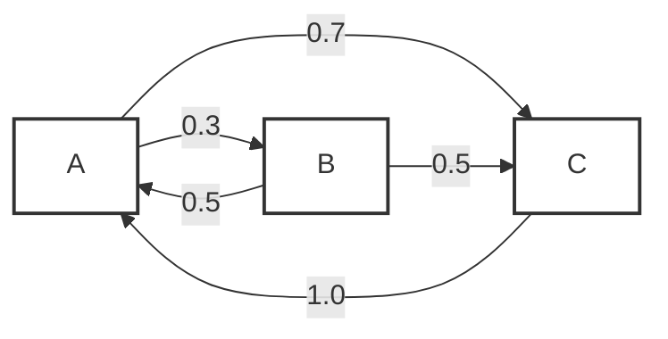
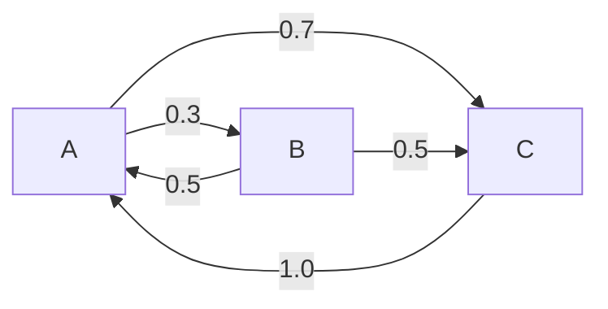
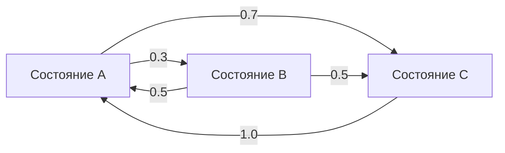
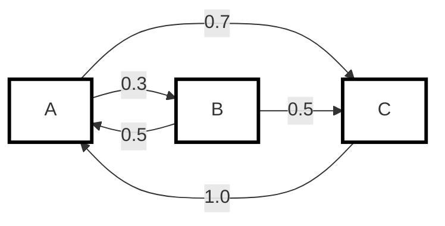
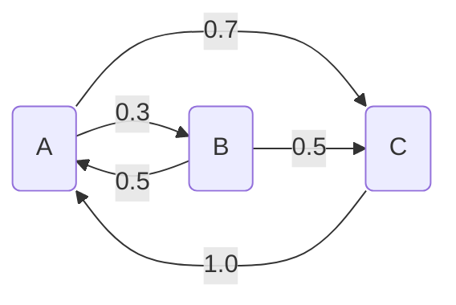

## (```mermaid)  
все заработало, просто что-то было на github (нужно подождать)
## 1 
test


Исходный:




Вот несколько аналогов твоей диаграммы — без двойных скобок `((...))`, но с разными способами показать, что это состояния марковской цепи. Учитывая твой опыт с GitHub Pages и SVG, варианты подобраны так, чтобы их было легко вставить в README или отрендерить через Mermaid.js.

---

## Вариант 1: круглые узлы через стиль (выглядит почти как `((A))`, но без спецсинтаксиса)



**Что тут происходит:** вместо `((A))` мы задаём CSS-стиль `classDef` и помечаем узлы классом `:::state`. Узлы становятся кругами с жирной обводкой — визуально очень похоже на «круг в круге», но синтаксис проще и понятнее.

---

## Вариант 2: прямоугольники со скруглёнными углами (самый нейтральный и читаемый)



Или чуть лучше для марковских цепей (подписи с пояснениями):



**Плюс:** такой стиль отлично читается в статичных картинках (SVG/PNG) и не зависит от тонкостей рендерера. Это хороший выбор, если цель — вставить диаграмму в README как картинку.

---

## Вариант 3: узлы в виде «двойного круга» через кастомный shape (если хочется именно тот вид, но без `(( ))`)

Mermaid не даёт «двойной круг» как отдельный примитив, но можно имитировать его через цвет/обводку и оставить узлы обычными кругами:



Это компромисс: визуально близко к `((A))`, синтаксис чище и легче поддерживается в JS-скриптах.

---

## Вариант 4: для браузерного JS-проекта (в духе твоего SVG Viewer)

Если ты рендеришь Mermaid через CDN на GitHub Pages и хочешь добавить интерактив (подсветка текущего состояния, анимация переходов), лучше использовать **Вариант 1** или **Вариант 3** — они проще стилизуются через `classDef`, а классы потом можно перехватывать в JS.

Пример минимального HTML (можно положить рядом с твоим SVG Viewer):

```html
<div class="mermaid">
graph LR
    classDef state fill:#fff,stroke:#333,stroke-width:2px,shape:circle;
    A:::state
    B:::state
    C:::state

    A -->|0.3| B
    A -->|0.7| C
    B -->|0.5| A
    B -->|0.5| C
    C -->|1.0| A
</div>

<script type="module">
  import mermaid from 'https://cdn.jsdelivr.net/npm/mermaid@10/dist/mermaid.esm.min.mjs';
  mermaid.initialize({ startOnLoad: true, theme: 'base', themeVariables: { primaryColor: '#fff', secondaryColor: '#f0f0f0', tertiaryColor: '#ddd', stroke: '#333', strokeWidth: 2 } });
</script>
```

---

## Как это использовать с учётом твоих прошлых задач

- **Для README на GitHub:** экспортируй любой из этих вариантов как SVG на `mermaid.live` и вставь через `` — так ты гарантированно избежишь «Unable to render rich display».
- **Для браузерного проекта:** используй Вариант 1 и подключай Mermaid через CDN, как в примере выше. Дальше можно навешивать JS-события на узлы (например, подсвечивать текущее состояние при симуляции траектории).
- **Если нужно группировать состояния:** в Mermaid это делается через `subgraph`, и стили `classDef` продолжают работать внутри подграфов — удобно для более сложных цепей.

Если скажешь, какой именно эффект тебе важнее (максимально похоже на `((A))`, максимальная читаемость в картинке, или интерактив с подсветкой в браузере), я дам один готовый фрагмент под конкретную задачу.

## 2

[```4```](https://mermaideditor.lol/blog/mermaid-in-github-readme)[```7```](https://www.freecodecamp.org/news/how-to-add-diagrams-to-github-readme/)

---

## Возможные причины, почему не отрисовалось

### 1. GitHub Pages, а не GitHub.com
Mermaid рендерится **только при просмотре `.md`-файлов напрямую на GitHub.com** (README, issues, PR, wiki). Если ты смотришь через **GitHub Pages** — там Mermaid **не работает по умолчанию**, нужен подключённый JS. [```1```](https://www.xjavascript.com/blog/how-to-make-github-pages-markdown-support-mermaid-diagram/)

**Проверь:** ты смотришь `README.md` прямо в репозитории на `github.com` или на сайте, опубликованном через GitHub Pages?

### 2. Регистр тега `mermaid`
Язык в code fence должен быть **строчно lowercase**: `mermaid`. Варианты `Mermaid`, `MERMAID` или `Mermaid` **не сработают**. [```4```](https://mermaideditor.lol/blog/mermaid-in-github-readme)

### 3. Слишком сложный синтаксис для версии GitHub
GitHub может отставать от последней версии Mermaid. Синтаксис `classDef` с `shape:circle` и применение классов через `:::state` — это продвинутые фичи, которые GitHub может не поддерживать. [```4```](https://mermaideditor.lol/blog/mermaid-in-github-readme)

### 4. Кэш GitHub
GitHub кэширует отрендеренный Markdown. Иногда после изменения файла нужно **обновить страницу** (Ctrl+Shift+R) или подождать пару минут. [```2```](https://github.com/orgs/community/discussions/204537)

### 5. Браузерное расширение или VPN
Некоторые расширения блокируют iframe, через который GitHub рендерит Mermaid. Рендеринг происходит через внутренний сервис **Viewscreen** в sandboxed iframe — если что-то его блокирует, диаграмма не появится. [```7```](https://www.freecodecamp.org/news/how-to-add-diagrams-to-github-readme/)

---

## Самые простые варианты, которые точно работают на GitHub

Вот три варианта от простого к сложному — все используют только базовый синтаксис, который GitHub гарантированно поддерживает.

### Вариант A: обычные прямоугольники (самый простой)

````markdown

````

Если узлы без подписей рендерятся — значит проблема была в синтаксисе. Дальше можно добавлять подписи.

### Вариант B: узлы в квадратных скобках

````markdown

````

### Вариант C: круглые узлы (одинарные скобки)

````markdown

````

Одинарные круглые скобки `("A")` делают узел в виде **стадион-формы** (скруглённый прямоугольник). Двойные `(("A"))` делают **двойной круг** — они тоже должны работать, но если хочешь минимизировать риски, начни с одинарных.

---

## Как проверить, в чём именно проблема

1. **Сначала вставь Вариант A** (вообще без подписей и стилей) в README и запуши.
2. Открой файл **прямо на github.com** (не через GitHub Pages).
3. Если отрисовался — проблема была в `classDef`, `shape:circle` или `:::`-синтаксисе.
4. Если **не отрисовался** — проверь:
   - тег именно `mermaid` (нижний регистр);
   - нет лишних пробелов перед тройными обратными кавычками;
   - нет VPN или расширений, блокирующих iframe;
   - попробуй открыть в режиме инкогнито.

Если Вариант A заработает, а с подписями — нет, пиши, разберём дальше.
