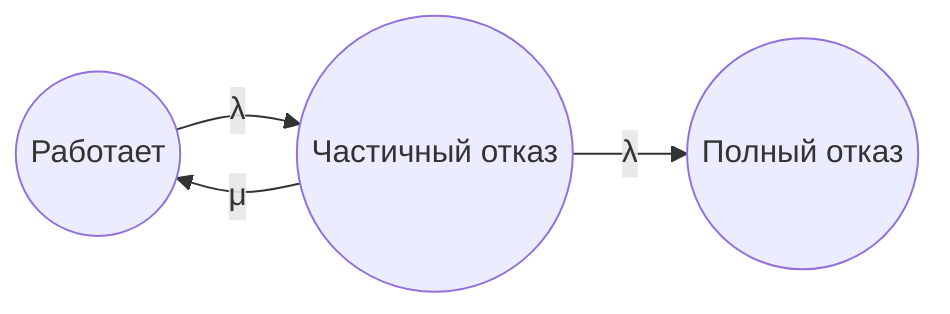
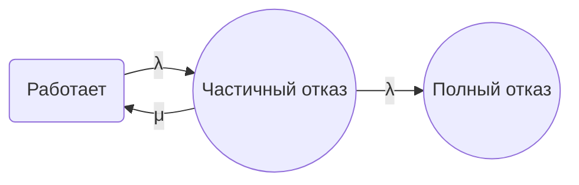
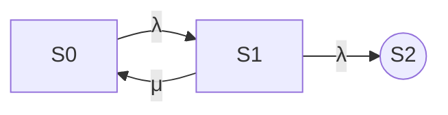

## 1

или

или

## link
- https://habr.com/ru/articles/652867/ Рисуем диаграммы Mermaid.js в README-файлах GitHub
- https://toolact.com/ru/mermaid

## 2
- node3([Форма 3]) - отказ  
- node6((Форма 6)) - работа

