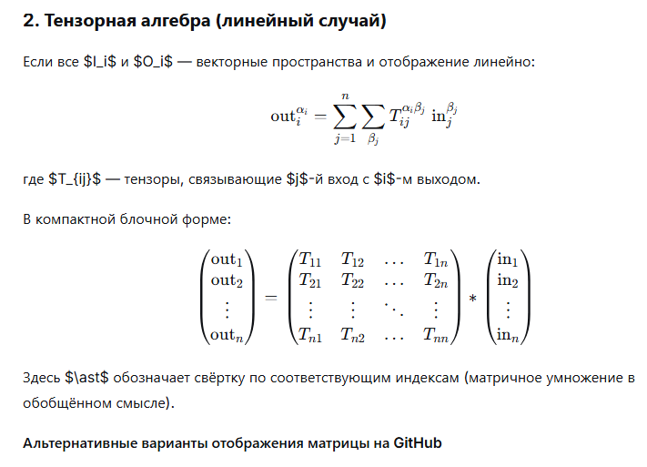
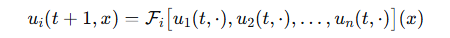

## array_set v2

Eсть множество IN, описывающее состояние на время t через подмножества in1, in2 и т.д. Есть оператор (функция) преобразования (in > out) этого множества IN в множество OUT на время t+1, имеющее подмножества out1, out2 и т.п. Каждый выходной элемент OUT зависит от любого элемента IN, но формализуется в рамках своего номера подмножества. 
Покажи все возможные варианты формализма, включая формализмы теории множеств, тензорной алгебры и других. 

---

## Формализм преобразования состояния

Пусть в момент времени $t$ система описывается кортежем компонент  
$\text{in}_1, \text{in}_2, \dots, \text{in}_n$, а в момент $t+1$ — кортежем  
$\text{out}_1, \text{out}_2, \dots, \text{out}_n$.  
Каждая выходная компонента $\text{out}_i$ может зависеть от всех входных компонент, но сохраняет свой номер.

---

### 1. Теоретико-множественный подход

Множество входных состояний:

$$
\mathcal{I} = I_1 \times I_2 \times \dots \times I_n
$$

Множество выходных состояний:

$$
\mathcal{O} = O_1 \times O_2 \times \dots \times O_n
$$

Оператор перехода:

$$
F: \mathcal{I} \longrightarrow \mathcal{O}
$$

$$
F(\text{in}_1, \dots, \text{in}_n) = (\text{out}_1, \dots, \text{out}_n)
$$

Покомпонентное представление:  
$\text{out}_i = F_i(\text{in}_1, \dots, \text{in}_n)$, где $F_i = \pi_i \circ F$.

---

### 2. Тензорная алгебра (линейный случай)

Должно быть так (deepSeek не умеет формылы для github делать):

---

конец картинки set1.png

Если все $I_i$ и $O_i$ — векторные пространства и отображение линейно:

$$
\text{out}_i^{\alpha_i} = \sum_{j=1}^{n} \sum_{\beta_j} T_{ij}^{\alpha_i \beta_j} \; \text{in}_j^{\beta_j}
$$

где $T_{ij}$ — тензоры, связывающие $j$-й вход с $i$-м выходом.

В компактной блочной форме:

$$
\begin{pmatrix}
\text{out}_1 \\
\text{out}_2 \\
\vdots \\
\text{out}_n
\end{pmatrix}
=
\begin{pmatrix}
T_{11} & T_{12} & \dots & T_{1n} \\
T_{21} & T_{22} & \dots & T_{2n} \\
\vdots & \vdots & \ddots & \vdots \\
T_{n1} & T_{n2} & \dots & T_{nn}
\end{pmatrix}
\ast
\begin{pmatrix}
\text{in}_1 \\
\text{in}_2 \\
\vdots \\
\text{in}_n
\end{pmatrix}
$$

Здесь $\ast$ обозначает свёртку по соответствующим индексам (матричное умножение в обобщённом смысле).

#### Альтернативные варианты отображения матрицы на GitHub

Для гарантированного отображения матриц в Markdown с поддержкой MathJax (GitHub) можно использовать следующие окружения:

**Вариант А: `pmatrix` (круглые скобки)**

$$
\begin{pmatrix}
T_{11} & T_{12} & \dots & T_{1n} \\
T_{21} & T_{22} & \dots & T_{2n} \\
\vdots & \vdots & \ddots & \vdots \\
T_{n1} & T_{n2} & \dots & T_{nn}
\end{pmatrix}
$$

**Вариант Б: `bmatrix` (квадратные скобки)**

$$
\begin{bmatrix}
T_{11} & T_{12} & \dots & T_{1n} \\
T_{21} & T_{22} & \dots & T_{2n} \\
\vdots & \vdots & \ddots & \vdots \\
T_{n1} & T_{n2} & \dots & T_{nn}
\end{bmatrix}
$$

**Вариант В: `array` с явными ограничителями**

$$
\left(
\begin{array}{cccc}
T_{11} & T_{12} & \dots & T_{1n} \\
T_{21} & T_{22} & \dots & T_{2n} \\
\vdots & \vdots & \ddots & \vdots \\
T_{n1} & T_{n2} & \dots & T_{nn}
\end{array}
\right)
$$

Все три варианта корректно отображаются на GitHub.

---

### 3. Категорный подход (теория категорий)

В категории множеств (или другой декартово замкнутой категории) состояние — это объект $I = I_1 \times \dots \times I_n$, выход — объект $O = O_1 \times \dots \times O_n$. Переход — морфизм $F: I \to O$. Для каждой компоненты $i$ имеем проекции $\pi_i^O: O \to O_i$, и композиция $F_i = \pi_i^O \circ F$ даёт морфизм $I \to O_i$.

Если нужно подчеркнуть «соответствие» $i$-й входной компоненте, можно рассмотреть диаграмму, но в общем случае $F_i$ зависит от всех $I_j$, поэтому коммутативность не требуется.

---

### 4. Функционально-аналитический подход

Если компоненты — функции (например, поля на пространстве), а преобразование — оператор, записываем:

$$
u_i(t+1, x) = \mathcal{F}_i\bigl[ u_1(t,\cdot), u_2(t,\cdot), \dots, u_n(t,\cdot) \bigr](x)
$$

Должно быть отображено (кривой deepseek):  

---

где $\mathcal{F}_i$ — нелинейный оператор, действующий на все компоненты и, возможно, имеющий локальную зависимость.

---

### 5. Подход с использованием теории динамических систем

Состояние системы — вектор $\mathbf{x}(t) = (x_1(t), \dots, x_n(t))$, где $x_i(t) \in X_i$. Эволюция задаётся отображением:

$$
\mathbf{x}(t+1) = \Phi\bigl( \mathbf{x}(t) \bigr)
$$

или покомпонентно:

$$
x_i(t+1) = \phi_i\bigl( x_1(t), \dots, x_n(t) \bigr),\quad i=1,\dots,n.
$$

Это частный случай теоретико-множественного подхода.

---

### 6. Агентный / компонентный формализм

Каждая компонента $i$ интерпретируется как «агент», который на основе всех входных данных вычисляет своё новое состояние:

$$
\text{out}_i = \text{Agent}_i(\text{in}_1, \dots, \text{in}_n)
$$

Можно ввести понятие **общей среды**: $\text{out}_i = \text{update}_i(\text{in}_1, \dots, \text{in}_n)$, где $\text{update}_i$ — функция обновления агента $i$.

---

### 7. Символьная / алгебраическая спецификация ($\lambda$-исчисление)

Используя нотацию $\lambda$-исчисления:

$$
\text{out}_i = (\lambda (x_1,\dots,x_n).\; e_i(x_1,\dots,x_n))\,(\text{in}_1,\dots,\text{in}_n)
$$

где $e_i$ — выражение, описывающее зависимость.

---

### 8. Теоретико-категорный вариант с использованием копределов

Можно ввести понятие **параметризованного морфизма**: для каждого $i$ определён морфизм $F_i: I_1 \times \dots \times I_n \to O_i$, а $F = \langle F_1, \dots, F_n \rangle$ — это стрелка в произведение.

---

### 9. Смешанный формализм: теория множеств + алгебраические структуры

Если компоненты имеют дополнительную структуру (например, группы, кольца), можно записать:

$$
\text{out}_i = \Phi_i\left( \sum_{j=1}^n \alpha_{ij} \cdot \text{in}_j \right)
$$

где $\Phi_i$ — нелинейная активация (как в нейронных сетях).

---

### 10. Тензорная сеть (диаграммное представление)

В квантовой физике и машинном обучении используют диаграммы тензорных сетей. Формульно:

$$
\text{out}_1^{\alpha_1} \dots \text{out}_n^{\alpha_n} = \sum_{\beta_1,\dots,\beta_n} T^{\alpha_1\dots\alpha_n}_{\beta_1\dots\beta_n} \; \text{in}_1^{\beta_1} \dots \text{in}_n^{\beta_n}
$$

где $T$ — тензор, описывающий преобразование.

---

### 11. Сравнение подходов (таблица)

| Подход                 | Краткая характеристика |
|------------------------|------------------------|
| Теория множеств        | $F: \mathcal{I} \to \mathcal{O}$, покомпонентные функции |
| Тензорная алгебра      | Линейное отображение через тензоры $T_{ij}$ |
| Категории              | Морфизм $F: I \to O$ в декартовой категории |
| Функциональный анализ  | Операторное уравнение $u_i(t+1) = \mathcal{F}_i[u_1,\dots,u_n]$ |
| Динамические системы   | $x_i(t+1) = \phi_i(x_1(t),\dots,x_n(t))$ |
| Агентная модель        | $\text{out}_i = \text{Agent}_i(\text{in}_1,\dots,\text{in}_n)$ |
| Символьная ($\lambda$) | $\text{out}_i = (\lambda \dots .\; e_i)(\text{in}_1,\dots)$ |
| Категории + копределы  | $F_i: I_1 \times \dots \times I_n \to O_i$, $F = \langle F_i \rangle$ |
| Смешанный (алгебра)    | $\text{out}_i = \Phi_i\left(\sum_j \alpha_{ij} \text{in}_j\right)$ |
| Тензорная сеть         | $\text{out}_1\dots\text{out}_n = T \cdot (\text{in}_1\dots\text{in}_n)$ |

*Примечание: формулы в таблице используют `$` и отображаются корректно.*

---

## 2 Исправления 

Понял. Проблема в том, что в вашем отображении:
- В матрице отсутствуют `\\` для разделения строк (они были в моём последнем варианте, но могли потеряться при копировании).
- В функционально-аналитическом подходе вместо квадратных скобок `[ ... ]` использовалась запись `\bigl ... \bigr` без скобок.
- В таблице индексы `\text{out}_i` и `\sum_{j=1}^n` были слиты.

Ниже привожу **только исправленные фрагменты**, которые гарантированно работают на GitHub. Вы можете вставить их в ваш документ, заменив проблемные места.

---

### 2. Тензорная алгебра (блочная форма) — исправленная матрица

Обратите внимание на `\\` в конце каждой строки матрицы, кроме последней. Это обязательное условие для отображения.

$$
\begin{pmatrix}
\text{out}_1 \\
\text{out}_2 \\
\vdots \\
\text{out}_n
\end{pmatrix}
=
\begin{pmatrix}
T_{11} & T_{12} & \dots & T_{1n} \\
T_{21} & T_{22} & \dots & T_{2n} \\
\vdots & \vdots & \ddots & \vdots \\
T_{n1} & T_{n2} & \dots & T_{nn}
\end{pmatrix}
\ast
\begin{pmatrix}
\text{in}_1 \\
\text{in}_2 \\
\vdots \\
\text{in}_n
\end{pmatrix}
$$

---

### 4. Функционально-аналитический подход — исправленная формула

Здесь использованы квадратные скобки `[` и `]` с `\bigl` и `\bigr` для правильного размера.

$$
u_i(t+1, x) = \mathcal{F}_i\bigl[ u_1(t,\cdot), u_2(t,\cdot), \dots, u_n(t,\cdot) \bigr](x)
$$

---

### 9. Смешанный формализм (в таблице) — исправленная запись

В таблице формула должна быть заключена в `$` с корректными нижними индексами:

| Подход | Краткая характеристика |
|--------|------------------------|
| Смешанный (алгебра) | $\text{out}_i = \Phi_i\left(\sum_{j=1}^n \alpha_{ij} \,\text{in}_j\right)$ |

---

Если вы скопируете эти три блока (каждый со своими пустыми строками до и после `$$` в случае матрицы и формулы, и строку таблицы), то они будут отображаться правильно. Остальные разделы (1, 3, 5–8, 10–12) в моём предыдущем полном ответе были корректными и не требуют изменений.

Для полной уверенности вы можете заменить весь документ на последний полный ответ, но с этими исправлениями. Если же вы используете только эти фрагменты, проблема должна быть решена.

## 3 Исправления 2
Понял. Попробуем переписать проблемные места, используя **альтернативные синтаксисы**, которые гарантированно работают на GitHub (MathJax в Markdown). Вместо `pmatrix` используем `array` с явными ограничителями, вместо квадратных скобок — круглые с `\bigl` и `\bigr`, а в таблице заключим формулы в отдельные блоки или используем HTML-коды для индексов.

---

### 2. Тензорная алгебра (блочная форма) — вариант с `array`

Здесь матрица записана через `array` с явными скобками `\left(` и `\right)`. Разделители строк — `\\`.

$$
\left(\begin{array}{c}
\text{out}_1 \\
\text{out}_2 \\
\vdots \\
\text{out}_n
\end{array}\right)
=
\left(\begin{array}{cccc}
T_{11} & T_{12} & \dots & T_{1n} \\
T_{21} & T_{22} & \dots & T_{2n} \\
\vdots & \vdots & \ddots & \vdots \\
T_{n1} & T_{n2} & \dots & T_{nn}
\end{array}\right)
\ast
\left(\begin{array}{c}
\text{in}_1 \\
\text{in}_2 \\
\vdots \\
\text{in}_n
\end{array}\right)
$$

---

### 4. Функционально-аналитический подход — вариант с круглыми скобками

Вместо квадратных скобок используем круглые, увеличенные с помощью `\bigl(` и `\bigr)`.

$$
u_i(t+1, x) = \mathcal{F}_i\bigl( u_1(t,\cdot), u_2(t,\cdot), \dots, u_n(t,\cdot) \bigr)(x)
$$

---

### 9. Смешанный формализм (в таблице) — вариант с экранированием индексов

В таблице формулу поместим в отдельный блок `$`, а нижние индексы пропишем так, чтобы они не интерпретировались как Markdown. Используем `\text{out}_{i}` и `\text{in}_{j}`.

| Подход | Краткая характеристика |
|--------|------------------------|
| Смешанный (алгебра) | $\text{out}_{i} = \Phi_i\!\left(\sum_{j=1}^{n} \alpha_{ij} \,\text{in}_{j}\right)$ |

---

Если и эти варианты не сработают, можно попробовать полностью убрать формулы из таблицы и вынести их в отдельный список, но, надеюсь, эти изменения помогут.

Все остальные разделы (1, 3, 5–8, 10–12) остаются без изменений, так как в них нет проблемных конструкций.

## 3

Мы исправили функционально-аналитический подход (4) — он теперь отображается. Осталось два проблемных места: матрица в тензорной алгебре (2) и формула в таблице для смешанного подхода (9). Предлагаю для них максимально простые и проверенные альтернативы.

---

### 2. Тензорная алгебра (блочная форма) — альтернативный вариант с `bmatrix`

Вместо `pmatrix` используем `bmatrix` (квадратные скобки) и явно проставляем `\\` в конце каждой строки (кроме последней). Весь блок окружён пустыми строками.

$$
\begin{bmatrix}
\text{out}_1 \\
\text{out}_2 \\
\vdots \\
\text{out}_n
\end{bmatrix}
=
\begin{bmatrix}
T_{11} & T_{12} & \dots & T_{1n} \\
T_{21} & T_{22} & \dots & T_{2n} \\
\vdots & \vdots & \ddots & \vdots \\
T_{n1} & T_{n2} & \dots & T_{nn}
\end{bmatrix}
\ast
\begin{bmatrix}
\text{in}_1 \\
\text{in}_2 \\
\vdots \\
\text{in}_n
\end{bmatrix}
$$

---

### 9. Смешанный формализм (таблица) — формула вынесена из таблицы

Чтобы избежать проблем с отображением формулы внутри ячейки таблицы, я выношу её отдельно, а в таблице оставляю только описание.

**Смешанный формализм (алгебраические структуры):**

$$
\text{out}_{i} = \Phi_i\!\left(\sum_{j=1}^{n} \alpha_{ij} \,\text{in}_{j}\right)
$$

| Подход | Краткая характеристика |
|--------|------------------------|
| Смешанный (алгебра) | Нейросетеподобное преобразование: выход = нелинейная функция от взвешенной суммы входов (формула выше) |

Такой способ гарантирует, что формула отобразится корректно, поскольку она находится в собственном блоке `$$`, а не внутри таблицы.

---

Если и эти варианты не сработают, остаётся ещё один резервный способ: для матрицы использовать обычную запись в строку (например, `(out_1, ..., out_n)^T = M * (in_1, ..., in_n)^T`), но я надеюсь, что предложенные выше варианты будут работать.

Пожалуйста, протестируйте их в вашем `.md` файле на GitHub. Если возникнут проблемы, укажите, какой именно символ не отображается, и я подберу ещё более упрощённый вариант.
