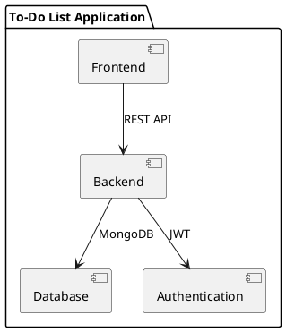
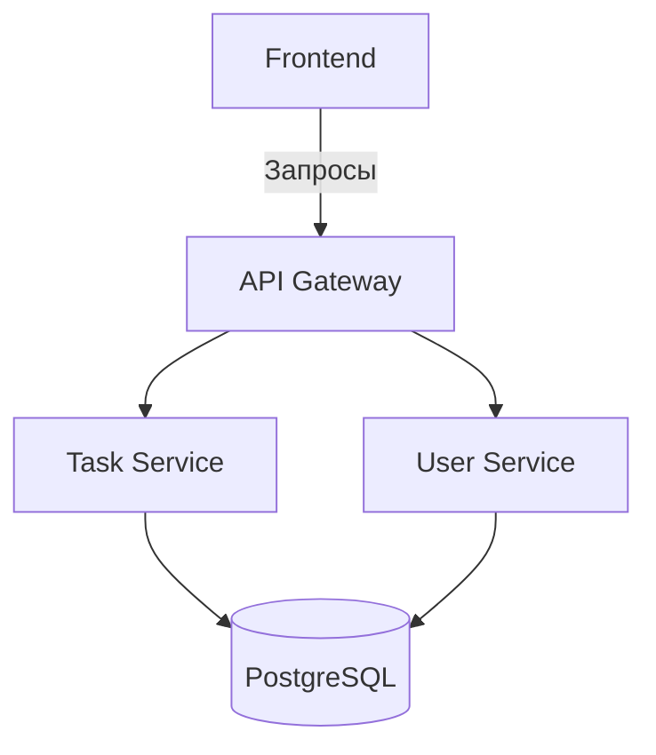

### xx-as-code
### 1 Сравнение
Чем отличаются между собой следующие направления (указаны ниже). Что они принимают на вход и имеют на выходе? Как они соотносятся между собой? Приведи примеры инструментов для реализации каждого из направлений. 
Software architecture as code, Architecture as code (arch as code), Infrastructure as code, Network diagram as code, Documentation as code (Docs as Code), Diagram as code

## Сравнение направлений "as code": определения, входы/выходы, взаимосвязи и инструменты

В современном ИТ существует целый ряд подходов, основанных на принципе "as code" — то есть управления различными аспектами разработки, инфраструктуры и документации с помощью кода. Рассмотрим подробно каждое из указанных направлений, их отличия, входные и выходные данные, взаимосвязи и примеры инструментов.

---

### 1. Software Architecture as Code

**Определение:**  
Software Architecture as Code (SAaC) — это подход, при котором архитектура программного обеспечения описывается, управляется и эволюционирует с помощью кода. Архитектурные решения, компоненты, связи и ограничения фиксируются в виде кода, что позволяет версионировать, тестировать и интегрировать архитектуру в CI/CD процессы .

**Вход:**  
- Текстовые файлы (чаще всего YAML, JSON, DSL, иногда — специализированные языки), описывающие архитектурные компоненты, их связи, ограничения и правила.

**Выход:**  
- Машиночитаемые архитектурные модели, которые могут быть использованы для генерации документации, визуализации, автоматической проверки соответствия архитектурным требованиям, а иногда и для генерации кода или инфраструктуры.

**Примеры инструментов:**  
- Structurizr DSL, C4-PlantUML, ArchiMate, Modelio, Structurizr for Java, архитектурные плагины для PlantUML.

---

### 2. Architecture as Code (Arch as Code)

**Определение:**  
Architecture as Code — более широкий термин, чем SAaC. Он подразумевает применение принципов "as code" к архитектуре в целом: не только к программной, но и к инфраструктурной, бизнес-архитектуре и т.д. Это может включать как Software Architecture as Code, так и Infrastructure as Code, а также другие архитектурные аспекты .

**Вход:**  
- Текстовые файлы (YAML, JSON, DSL), описывающие архитектурные решения, паттерны, ограничения, зависимости между системами и компонентами.

**Выход:**  
- Формализованные архитектурные артефакты, которые могут быть использованы для автоматизации, проверки, визуализации и документирования архитектуры.

**Примеры инструментов:**  
- Structurizr, ArchiMate, C4-PlantUML, архитектурные плагины для CI/CD, специализированные DSL.

---

### 3. Infrastructure as Code (IaC)

**Определение:**  
Infrastructure as Code — это подход к управлению и автоматизации инфраструктуры (серверы, сети, хранилища, облачные ресурсы) с помощью кода. Вся инфраструктура описывается декларативно или императивно в виде конфигурационных файлов, которые затем интерпретируются инструментами для создания/изменения инфраструктуры .

**Вход:**  
- Конфигурационные файлы (HCL для Terraform, YAML/JSON для CloudFormation, YAML для Ansible и др.), описывающие ресурсы, их параметры и зависимости.

**Выход:**  
- Развернутая и настроенная инфраструктура (виртуальные машины, сети, базы данных и т.д.), соответствующая описанию в коде.

**Примеры инструментов:**  
- Terraform, AWS CloudFormation, Azure Resource Manager, Google Cloud Deployment Manager, Ansible, Pulumi  .

---

### 4. Network Diagram as Code

**Определение:**  
Network Diagram as Code — это подход к созданию и поддержке сетевых диаграмм с помощью кода. Сетевая топология, устройства, соединения и параметры описываются в текстовом виде, что позволяет автоматически генерировать актуальные схемы и поддерживать их в актуальном состоянии .

**Вход:**  
- Текстовые файлы (например, DOT для Graphviz, YAML/JSON для специализированных инструментов), описывающие сетевые устройства, соединения, параметры.

**Выход:**  
- Визуальные сетевые диаграммы (PNG, SVG, PDF и др.), которые можно автоматически обновлять при изменении кода.

**Примеры инструментов:**  
- Graphviz, Diagrams (Python), PlantUML (network diagrams), awsdac (AWS Diagram as Code) .

---

### 5. Documentation as Code (Docs as Code)

**Определение:**  
Documentation as Code — это методология, при которой документация разрабатывается, хранится и поддерживается с помощью тех же инструментов и процессов, что и программный код. Документация пишется в текстовых форматах, хранится в системах контроля версий, проходит ревью и автоматическую сборку .

**Вход:**  
- Текстовые файлы в разметке Markdown, AsciiDoc, reStructuredText и др.

**Выход:**  
- Сгенерированная документация в различных форматах (HTML, PDF, DOCX), доступная для пользователей и разработчиков.

**Примеры инструментов:**  
- Markdown, AsciiDoc, reStructuredText, Sphinx, MkDocs, Jekyll, Hugo, GitHub Pages .

---

### 6. Diagram as Code

**Определение:**  
Diagram as Code — это общий подход к созданию любых диаграмм (архитектурных, UML, flowchart, ER-диаграмм и др.) с помощью кода. Диаграммы описываются в текстовом виде, что позволяет их версионировать, автоматически обновлять и интегрировать в CI/CD .

**Вход:**  
- Текстовые файлы на специальных языках (PlantUML, Mermaid, DOT, YAML/JSON для Diagrams и др.), описывающие элементы и связи диаграммы.

**Выход:**  
- Визуальные диаграммы (SVG, PNG, PDF и др.), которые можно автоматически генерировать и обновлять.

**Примеры инструментов:**  
- PlantUML, Mermaid, Graphviz, Diagrams (Python), Structurizr DSL .

---

## Взаимосвязи между подходами

- **Software Architecture as Code** и **Architecture as Code** — тесно связаны, но первый фокусируется только на программной архитектуре, а второй — на архитектуре в более широком смысле (включая инфраструктуру, бизнес-процессы и т.д.) .
- **Infrastructure as Code** — частный случай Architecture as Code, применяемый к инфраструктуре.
- **Network Diagram as Code** — может быть частью Infrastructure as Code (визуализация инфраструктуры) или Diagram as Code (создание сетевых схем).
- **Diagram as Code** — универсальный подход, который может использоваться для визуализации архитектуры, инфраструктуры, сетей и других аспектов.
- **Documentation as Code** — поддерживает все остальные подходы, позволяя документировать архитектуру, инфраструктуру, процессы и диаграммы в едином workflow .

---

## Сравнительная таблица

| Направление                  | Вход (форматы)         | Выход (результат)                | Примеры инструментов                |
|------------------------------|------------------------|-----------------------------------|-------------------------------------|
| Software Architecture as Code| YAML, JSON, DSL        | Архитектурные модели, диаграммы   | Structurizr, C4-PlantUML, ArchiMate |
| Architecture as Code         | YAML, JSON, DSL        | Архитектурные артефакты           | Structurizr, ArchiMate              |
| Infrastructure as Code       | HCL, YAML, JSON        | Развернутая инфраструктура        | Terraform, CloudFormation, Ansible  |
| Network Diagram as Code      | DOT, YAML, JSON        | Сетевые диаграммы                 | Graphviz, Diagrams, awsdac          |
| Documentation as Code        | Markdown, AsciiDoc     | Документация (HTML, PDF и др.)    | Sphinx, MkDocs, Jekyll, Hugo        |
| Diagram as Code              | PlantUML, Mermaid, DOT | Диаграммы (UML, flowchart и др.)  | PlantUML, Mermaid, Graphviz         |

---

## Визуализация взаимосвязей


*Пример архитектурных активностей, которые могут быть формализованы через подходы "as code"*

---

## Краткие выводы

- Все подходы "as code" используют текстовые файлы как вход, что обеспечивает версионирование, автоматизацию и интеграцию в CI/CD.
- Выходом являются либо артефакты (инфраструктура, документация, диаграммы), либо визуализации, либо автоматизированные процессы.
- Подходы взаимодополняют друг друга: например, архитектура и инфраструктура могут быть описаны как код, визуализированы через Diagram as Code и задокументированы через Docs as Code.
- Выбор инструментов зависит от задачи: для инфраструктуры — Terraform, для архитектуры — Structurizr, для диаграмм — PlantUML, для документации — Sphinx/MkDocs.

Эти подходы позволяют повысить прозрачность, управляемость и воспроизводимость процессов в ИТ и разработке ПО.

## 2 Придумай небольшой, но полный пример Architecture as Code, включая выдуманные тобой исходные данные. Приведи все исходные данные.

## Пример Architecture as Code

### Исходные данные

Предположим, мы разрабатываем небольшое веб-приложение для управления задачами (To-Do List). Архитектура приложения будет включать следующие компоненты:

1. **Frontend**: Веб-интерфейс, написанный на React.
2. **Backend**: RESTful API, реализованный на Node.js с использованием Express.
3. **База данных**: MongoDB для хранения задач.
4. **Аутентификация**: JWT (JSON Web Tokens) для управления сессиями пользователей.

### Описание архитектуры

Мы будем использовать YAML для описания архитектуры приложения. Вот пример файла `architecture.yaml`, который описывает компоненты и их взаимодействия:

```yaml
architecture:
  name: To-Do List Application
  description: A simple web application for managing tasks.
  components:
    - name: Frontend
      type: Web Application
      technology: React
      description: User interface for managing tasks.
      interactions:
        - type: REST API
          target: Backend
          description: Fetches and submits tasks.

    - name: Backend
      type: REST API
      technology: Node.js, Express
      description: Handles business logic and data processing.
      interactions:
        - type: Database
          target: MongoDB
          description: Stores task data.
        - type: Authentication
          target: JWT
          description: Manages user sessions.

    - name: Database
      type: NoSQL Database
      technology: MongoDB
      description: Stores user tasks and metadata.

    - name: Authentication
      type: Service
      technology: JWT
      description: Provides user authentication and session management.
```

### Взаимодействия между компонентами

В этом примере мы описали, как компоненты взаимодействуют друг с другом. Например, Frontend взаимодействует с Backend через REST API, а Backend взаимодействует с MongoDB для хранения данных.

### Генерация документации

На основе этого YAML-файла можно автоматически генерировать документацию и визуализации архитектуры. Например, с помощью инструмента, такого как PlantUML, можно создать диаграмму компонентов:



### Тестирование архитектуры

Для проверки соответствия архитектуры можно использовать тесты, которые будут проверять, что все компоненты правильно взаимодействуют друг с другом. Например, можно написать тесты на наличие необходимых API-эндпоинтов и их корректность.

### Заключение

Этот пример демонстрирует, как можно использовать подход Architecture as Code для описания архитектуры веб-приложения. Используя текстовые форматы, такие как YAML и PlantUML, мы можем легко управлять архитектурой, генерировать документацию и тестировать взаимодействия между компонентами.

### 3 Для указанного примера автоматически сгенерируй максимальное число документов (Documentation as Code). Визуализацию архитектуры (Diagram as Code) выполни в mermaid, точнее кодом github markdown  с использованием тега ``` mermaid.

#### Документация как код (Documentation as Code)

Для создания документации в формате "Документация как код" можно использовать различные инструменты и подходы. Вот пример структуры документации для проекта, который включает в себя описание архитектуры, API и тестов.

```markdown
# Документация проекта

## Введение
Этот проект представляет собой веб-приложение, которое позволяет пользователям управлять задачами. Архитектура приложения построена с использованием микросервисного подхода.

## Архитектура
Архитектура приложения описана с использованием подхода "Архитектура как код". Основные компоненты включают:

- **Frontend**: React-приложение, взаимодействующее с API.
- **Backend**: Набор микросервисов, реализующих бизнес-логику.
- **База данных**: PostgreSQL для хранения данных.

## API
### Эндпоинты
- `GET /tasks`: Получить список задач.
- `POST /tasks`: Создать новую задачу.
- `PUT /tasks/{id}`: Обновить задачу по ID.
- `DELETE /tasks/{id}`: Удалить задачу по ID.

### Пример запроса
```http
POST /tasks HTTP/1.1
Content-Type: application/json

{
  "title": "Новая задача",
  "description": "Описание задачи"
}
```

## Тестирование
Тесты архитектуры включают в себя проверку взаимодействия между микросервисами и их функциональности. Используются инструменты, такие как Postman и JUnit для тестирования API.

```

#### Визуализация архитектуры (Diagram as Code)

Для визуализации архитектуры приложения можно использовать язык разметки Mermaid. Вот пример кода для создания диаграммы:



Этот код создает диаграмму, показывающую взаимодействие между компонентами приложения, включая фронтенд, API Gateway и микросервисы:


### 4 Дополнения
- Diagram as Code =  text-to-diagram, например, https://text-to-diagram.com
- [D2](https://www.reddit.com/r/golang/comments/zq8f9h/d2_a_texttodiagram_tool_and_library_written_in_go/?tl=ru)
- [Structurizr, описание, перевод (часть 1/3)](https://habr.com/ru/articles/786250/)
